# Photographs

Every photograph and graphic placed on a Record page, 97 in all, grouped by the page it illustrates. Click any image to enlarge it; the caption under each says what it shows, where it came from and how we know the date. Where the source is a capture of a college website, the citation opens that capture in the Wayback Machine. Where a caption says *source not recorded*, the image reached the Historian's collection without a note of where it was first published, and its date comes from its file name or its content; treat those dates as provisional.

**Preservation.** These are web-size copies (at most 1,600 pixels on the long side) with thumbnails. The originals, at full size, are kept by the Historian, and an Internet Archive collection of them is planned so that every photograph here has a permanent public home that does not depend on this site. The list of files, with sizes, checksums and these captions, is `docs/assets/photos/manifest.tsv`. Photographs are chosen to show places and customs; students are not named in captions unless the [Core Team](../people/core-team.md) table or a public record names them as office-holders, and nothing revealing from Night of Decadence is shown. See [Rights](../contributing/rights.md).

## Old Wiess

On [Old Wiess](../places/old-wiess.md#photographs).

<figure markdown="span">
  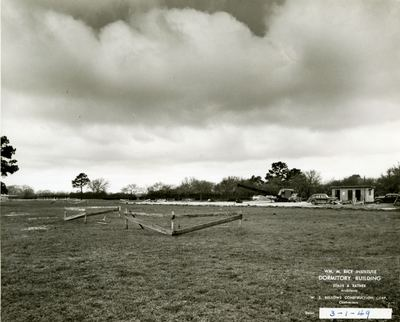{ loading=lazy data-title="1 March 1949: the site staked out with batter boards on open grass, a crane and site hut beyond. The label reads &#x27;Wm. M. Rice Institute Dormitory Building, Staub &amp; Rather, Architects, W. S. Bellows Construction Corp., Contractors&#x27;." data-description="Rice University, Woodson Research Center, via Rice History Corner · 1949-03-01" data-gallery="index-oldwiess" }
  <figcaption>1 March 1949: the site staked out with batter boards on open grass, a crane and site hut beyond. The label reads 'Wm. M. Rice Institute Dormitory Building, Staub & Rather, Architects, W. S. Bellows Construction Corp., Contractors'. <small>Rice University, Woodson Research Center, via Rice History Corner [@rhc 2012-12-04 wiess-hall-construction-1949]</small></figcaption>
</figure>

<figure markdown="span">
  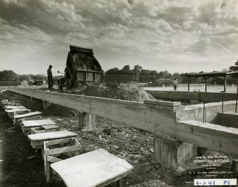{ loading=lazy data-title="1 April 1949: footings and forms, with a baseball game against A&amp;M in the background." data-description="Rice University, Woodson Research Center, via Rice History Corner · 1949-04-01" data-gallery="index-oldwiess" }
  <figcaption>1 April 1949: footings and forms, with a baseball game against A&M in the background. <small>Rice University, Woodson Research Center, via Rice History Corner [@rhc 2012-12-04 wiess-hall-construction-1949] [@rhc 2012-12-04 wiess-hall-construction-1949 comment by almadenmike, 5 Dec 2012]</small></figcaption>
</figure>

<figure markdown="span">
  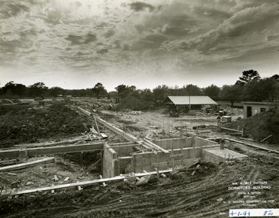{ loading=lazy data-title="1 April 1949 (no. 2): the foundation forms across the site." data-description="Rice University, Woodson Research Center, via Rice History Corner · 1949-04-01" data-gallery="index-oldwiess" }
  <figcaption>1 April 1949 (no. 2): the foundation forms across the site. <small>Rice University, Woodson Research Center, via Rice History Corner [@rhc 2012-12-04 wiess-hall-construction-1949]</small></figcaption>
</figure>

<figure markdown="span">
  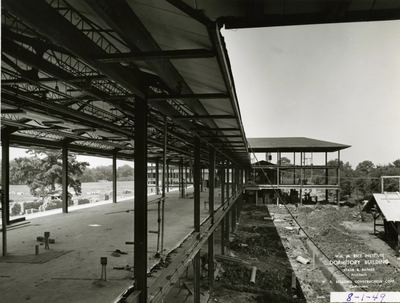{ loading=lazy data-title="1 August 1949: the steel frame of the walkway roofs." data-description="Rice University, Woodson Research Center, via Rice History Corner · 1949-08-01" data-gallery="index-oldwiess" }
  <figcaption>1 August 1949: the steel frame of the walkway roofs. <small>Rice University, Woodson Research Center, via Rice History Corner [@rhc 2012-12-04 wiess-hall-construction-1949]</small></figcaption>
</figure>

<figure markdown="span">
  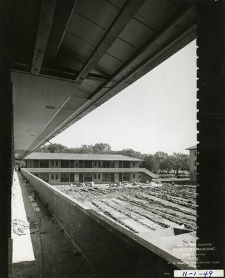{ loading=lazy data-title="1 November 1949: along a finished walkway." data-description="Rice University, Woodson Research Center, via Rice History Corner · 1949-11-01" data-gallery="index-oldwiess" }
  <figcaption>1 November 1949: along a finished walkway. <small>Rice University, Woodson Research Center, via Rice History Corner [@rhc 2012-12-04 wiess-hall-construction-1949]</small></figcaption>
</figure>

<figure markdown="span">
  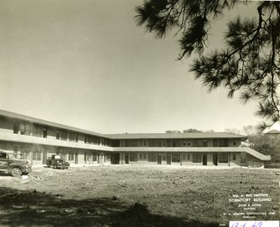{ loading=lazy data-title="1 December 1949: a two-storey wing complete, its balconies open to the yard; the ground still bare." data-description="Rice University, Woodson Research Center, via Rice History Corner · 1949-12-01" data-gallery="index-oldwiess" }
  <figcaption>1 December 1949: a two-storey wing complete, its balconies open to the yard; the ground still bare. <small>Rice University, Woodson Research Center, via Rice History Corner [@rhc 2012-12-04 wiess-hall-construction-1949]</small></figcaption>
</figure>

<figure markdown="span">
  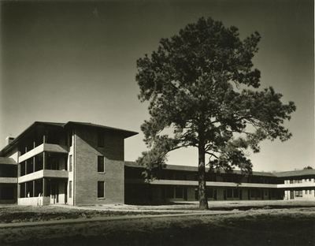{ loading=lazy data-title="&#x27;Wiess Hall completion&#x27;, 10 March 1950 (date from the file&#x27;s title): the finished building behind a lone pine." data-description="Rice University, Woodson Research Center, via Rice History Corner · 1950-03-10" data-gallery="index-oldwiess" }
  <figcaption>'Wiess Hall completion', 10 March 1950 (date from the file's title): the finished building behind a lone pine. <small>Rice University, Woodson Research Center, via Rice History Corner [@rhc 2012-12-04 wiess-hall-construction-1949]</small></figcaption>
</figure>

<figure markdown="span">
  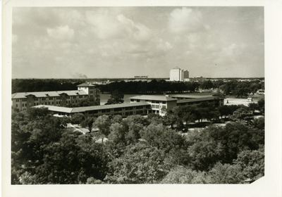{ loading=lazy data-title="Wiess and West Halls from above, 2 November 1950 (date and &#x27;gift of Pender Turnbull&#x27; from the file name)." data-description="Historian&#x27;s photo collection; source not recorded · 1950-11-02" data-gallery="index-oldwiess" }
  <figcaption>Wiess and West Halls from above, 2 November 1950 (date and 'gift of Pender Turnbull' from the file name). <small>Historian&#x27;s photo collection; source not recorded</small></figcaption>
</figure>

<figure markdown="span">
  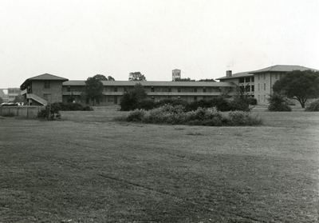{ loading=lazy data-title="Old Wiess College across an open field, September 1969 (date from the file name)." data-description="Historian&#x27;s photo collection; source not recorded · 1969-09" data-gallery="index-oldwiess" }
  <figcaption>Old Wiess College across an open field, September 1969 (date from the file name). <small>Historian&#x27;s photo collection; source not recorded</small></figcaption>
</figure>

<figure markdown="span">
  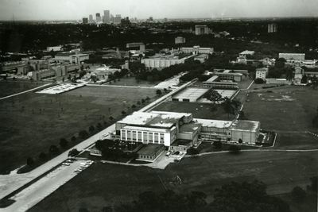{ loading=lazy data-title="Aerial view of the campus around the gymnasium, 1969 (date and subject from the file name); Old Wiess&#x27;s west wing stood next to the gym." data-description="Historian&#x27;s photo collection; source not recorded · 1969" data-gallery="index-oldwiess" }
  <figcaption>Aerial view of the campus around the gymnasium, 1969 (date and subject from the file name); Old Wiess's west wing stood next to the gym. <small>Historian&#x27;s photo collection; source not recorded [@riceinfo-history]</small></figcaption>
</figure>

<figure markdown="span">
  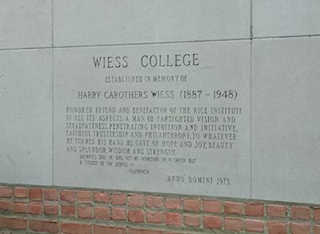{ loading=lazy data-title="The 1975 plaque: &#x27;Wiess College, established in memory of Harry Carothers Wiess (1887–1948)&#x27;, with the Plutarch line on Socrates. Transcribed under Open questions." data-description="Colin Delany &#x27;91, &#x27;wiess college | abandoned&#x27;, August 2002 · 2002-08" data-gallery="index-oldwiess" }
  <figcaption>The 1975 plaque: 'Wiess College, established in memory of Harry Carothers Wiess (1887–1948)', with the Plutarch line on Socrates. Transcribed under Open questions. <small>Colin Delany &#x27;91, &#x27;wiess college | abandoned&#x27;, August 2002 [@edesigns-old-wiess-2002]</small></figcaption>
</figure>

<figure markdown="span">
  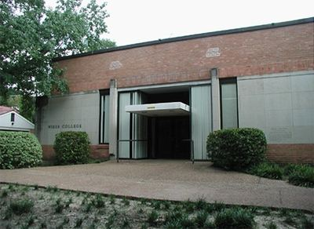{ loading=lazy data-title="The entrance under the WIESS COLLEGE lettering, abandoned, August 2002." data-description="Colin Delany &#x27;91, &#x27;wiess college | abandoned&#x27;, August 2002 · 2002-08" data-gallery="index-oldwiess" }
  <figcaption>The entrance under the WIESS COLLEGE lettering, abandoned, August 2002. <small>Colin Delany &#x27;91, &#x27;wiess college | abandoned&#x27;, August 2002 [@edesigns-old-wiess-2002]</small></figcaption>
</figure>

<figure markdown="span">
  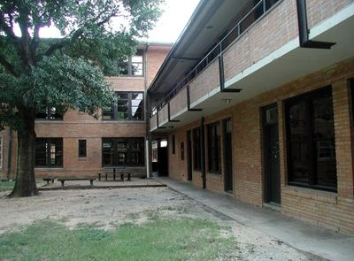{ loading=lazy data-title="Two storeys of rooms opening onto balconies over a courtyard, August 2002." data-description="Colin Delany &#x27;91, &#x27;wiess college | abandoned&#x27;, August 2002 · 2002-08" data-gallery="index-oldwiess" }
  <figcaption>Two storeys of rooms opening onto balconies over a courtyard, August 2002. <small>Colin Delany &#x27;91, &#x27;wiess college | abandoned&#x27;, August 2002 [@edesigns-old-wiess-2002]</small></figcaption>
</figure>

<figure markdown="span">
  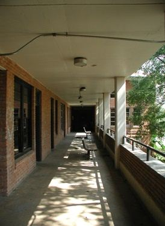{ loading=lazy data-title="An outdoor balcony walkway, August 2002: every Old Wiess room opened onto one." data-description="Colin Delany &#x27;91, &#x27;wiess college | abandoned&#x27;, August 2002 · 2002-08" data-gallery="index-oldwiess" }
  <figcaption>An outdoor balcony walkway, August 2002: every Old Wiess room opened onto one. <small>Colin Delany &#x27;91, &#x27;wiess college | abandoned&#x27;, August 2002 [@edesigns-old-wiess-2002]</small></figcaption>
</figure>

<figure markdown="span">
  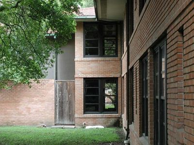{ loading=lazy data-title="&#x27;Between commons and backabowl&#x27; (Delany&#x27;s caption), August 2002." data-description="Colin Delany &#x27;91, &#x27;wiess college | abandoned&#x27;, August 2002 · 2002-08" data-gallery="index-oldwiess" }
  <figcaption>'Between commons and backabowl' (Delany's caption), August 2002. <small>Colin Delany &#x27;91, &#x27;wiess college | abandoned&#x27;, August 2002 [@edesigns-old-wiess-2002]</small></figcaption>
</figure>

<figure markdown="span">
  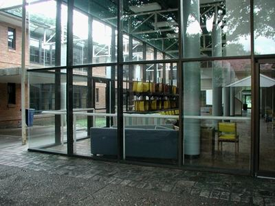{ loading=lazy data-title="A glass-walled common room with yellow chairs, seen from outside, August 2002." data-description="Colin Delany &#x27;91, &#x27;wiess college | abandoned&#x27;, August 2002 · 2002-08" data-gallery="index-oldwiess" }
  <figcaption>A glass-walled common room with yellow chairs, seen from outside, August 2002. <small>Colin Delany &#x27;91, &#x27;wiess college | abandoned&#x27;, August 2002 [@edesigns-old-wiess-2002]</small></figcaption>
</figure>

<figure markdown="span">
  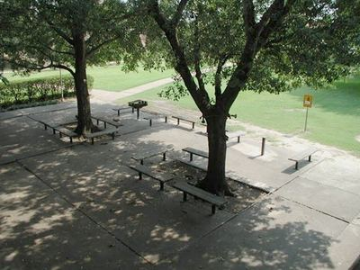{ loading=lazy data-title="A paved patio with benches under the trees, August 2002." data-description="Colin Delany &#x27;91, &#x27;wiess college | abandoned&#x27;, August 2002 · 2002-08" data-gallery="index-oldwiess" }
  <figcaption>A paved patio with benches under the trees, August 2002. <small>Colin Delany &#x27;91, &#x27;wiess college | abandoned&#x27;, August 2002 [@edesigns-old-wiess-2002]</small></figcaption>
</figure>

<figure markdown="span">
  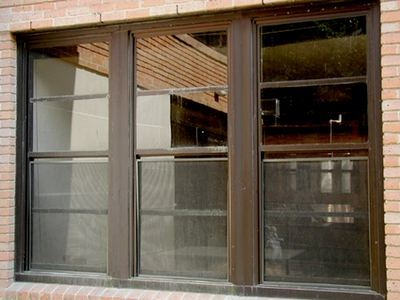{ loading=lazy data-title="Steel-framed windows in the brick, August 2002." data-description="Colin Delany &#x27;91, &#x27;wiess college | abandoned&#x27;, August 2002 · 2002-08" data-gallery="index-oldwiess" }
  <figcaption>Steel-framed windows in the brick, August 2002. <small>Colin Delany &#x27;91, &#x27;wiess college | abandoned&#x27;, August 2002 [@edesigns-old-wiess-2002]</small></figcaption>
</figure>

## Old Wiess, wing by wing (1999)

On [Old Wiess, wing by wing (1999)](../places/old-wiess.md#photographs).

<figure markdown="span">
  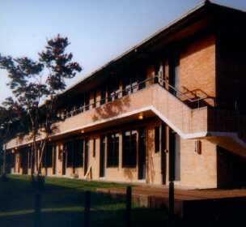{ loading=lazy data-title="The Tennis Court Wing, rooms 101–110 and 201–210; rooms 209–210 were the apartment of the Resident Associate, Dr. Stan Dodds." data-description="First Wiess website, &#x27;Pictures of Wiess Rooms&#x27; (set up by Head Fellow Chris Ruehl, 1998; text Ray Wagner, 1999) · 1998–1999" data-gallery="index-oldwiess1999" }
  <figcaption>The Tennis Court Wing, rooms 101–110 and 201–210; rooms 209–210 were the apartment of the Resident Associate, Dr. Stan Dodds. <small>First Wiess website, &#x27;Pictures of Wiess Rooms&#x27; (set up by Head Fellow Chris Ruehl, 1998; text Ray Wagner, 1999) [@wb 20011112112601 http://riceinfo.rice.edu/projects/colleges/wiess/college/photos/tennis.html]</small></figcaption>
</figure>

<figure markdown="span">
  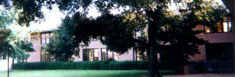{ loading=lazy data-title="The Tennis Court Wing from the Acabowl, with the bike rack on the right." data-description="First Wiess website, &#x27;Pictures of Wiess Rooms&#x27; (set up by Head Fellow Chris Ruehl, 1998; text Ray Wagner, 1999) · 1998–1999" data-gallery="index-oldwiess1999" }
  <figcaption>The Tennis Court Wing from the Acabowl, with the bike rack on the right. <small>First Wiess website, &#x27;Pictures of Wiess Rooms&#x27; (set up by Head Fellow Chris Ruehl, 1998; text Ray Wagner, 1999) [@wb 20011112112601 http://riceinfo.rice.edu/projects/colleges/wiess/college/photos/tennis.html]</small></figcaption>
</figure>

<figure markdown="span">
  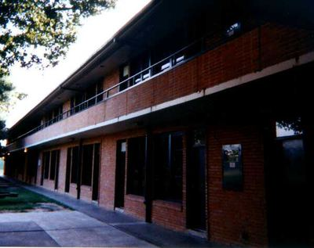{ loading=lazy data-title="The Acabowl Ledge, rooms 111–124: &quot;especially if it&#x27;s sunny, this ledge is one of the more active areas at Wiess.&quot;" data-description="First Wiess website, &#x27;Pictures of Wiess Rooms&#x27; (set up by Head Fellow Chris Ruehl, 1998; text Ray Wagner, 1999) · 1998–1999" data-gallery="index-oldwiess1999" }
  <figcaption>The Acabowl Ledge, rooms 111–124: "especially if it's sunny, this ledge is one of the more active areas at Wiess." <small>First Wiess website, &#x27;Pictures of Wiess Rooms&#x27; (set up by Head Fellow Chris Ruehl, 1998; text Ray Wagner, 1999) [@wb 20020116233355 http://riceinfo.rice.edu/projects/colleges/wiess/college/photos/acabowl.html]</small></figcaption>
</figure>

<figure markdown="span">
  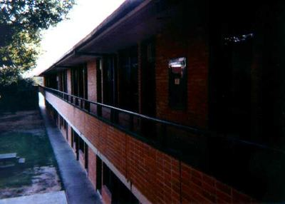{ loading=lazy data-title="The second-floor Acabowl hallway, rooms 211–224 (&quot;even the fire hose is in the same place&quot;)." data-description="First Wiess website, &#x27;Pictures of Wiess Rooms&#x27; (set up by Head Fellow Chris Ruehl, 1998; text Ray Wagner, 1999) · 1998–1999" data-gallery="index-oldwiess1999" }
  <figcaption>The second-floor Acabowl hallway, rooms 211–224 ("even the fire hose is in the same place"). <small>First Wiess website, &#x27;Pictures of Wiess Rooms&#x27; (set up by Head Fellow Chris Ruehl, 1998; text Ray Wagner, 1999) [@wb 20020116233355 http://riceinfo.rice.edu/projects/colleges/wiess/college/photos/acabowl.html]</small></figcaption>
</figure>

<figure markdown="span">
  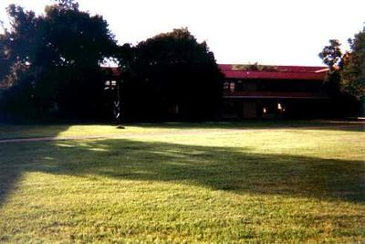{ loading=lazy data-title="The Acabowl ledges from the intramural fields; the Acabowl was &quot;home to a volleyball court, a few barbeque pits, some benches&quot;." data-description="First Wiess website, &#x27;Pictures of Wiess Rooms&#x27; (set up by Head Fellow Chris Ruehl, 1998; text Ray Wagner, 1999) · 1998–1999" data-gallery="index-oldwiess1999" }
  <figcaption>The Acabowl ledges from the intramural fields; the Acabowl was "home to a volleyball court, a few barbeque pits, some benches". <small>First Wiess website, &#x27;Pictures of Wiess Rooms&#x27; (set up by Head Fellow Chris Ruehl, 1998; text Ray Wagner, 1999) [@wb 20020116233355 http://riceinfo.rice.edu/projects/colleges/wiess/college/photos/acabowl.html]</small></figcaption>
</figure>

<figure markdown="span">
  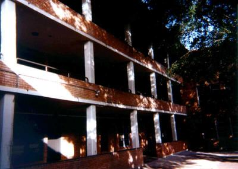{ loading=lazy data-title="The Middle Section, the only part of Old Wiess with a third floor: &quot;the tower&quot; (rooms 135–136, 235–236, 335 the computer room and 336 the presidential suite), with the five-man suites beside it." data-description="First Wiess website, &#x27;Pictures of Wiess Rooms&#x27; (set up by Head Fellow Chris Ruehl, 1998; text Ray Wagner, 1999) · 1998–1999" data-gallery="index-oldwiess1999" }
  <figcaption>The Middle Section, the only part of Old Wiess with a third floor: "the tower" (rooms 135–136, 235–236, 335 the computer room and 336 the presidential suite), with the five-man suites beside it. <small>First Wiess website, &#x27;Pictures of Wiess Rooms&#x27; (set up by Head Fellow Chris Ruehl, 1998; text Ray Wagner, 1999) [@wb 19991011025731 http://riceinfo.rice.edu/projects/colleges/wiess/college/photos/tower.html]</small></figcaption>
</figure>

<figure markdown="span">
  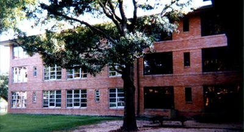{ loading=lazy data-title="The Middle Section from the Bacabowl side, rooms 134 (left) to 129 (right)." data-description="First Wiess website, &#x27;Pictures of Wiess Rooms&#x27; (set up by Head Fellow Chris Ruehl, 1998; text Ray Wagner, 1999) · 1998–1999" data-gallery="index-oldwiess1999" }
  <figcaption>The Middle Section from the Bacabowl side, rooms 134 (left) to 129 (right). <small>First Wiess website, &#x27;Pictures of Wiess Rooms&#x27; (set up by Head Fellow Chris Ruehl, 1998; text Ray Wagner, 1999) [@wb 19991011025731 http://riceinfo.rice.edu/projects/colleges/wiess/college/photos/tower.html]</small></figcaption>
</figure>

<figure markdown="span">
  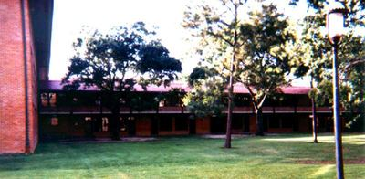{ loading=lazy data-title="The Bacabowl Ledge, rooms 137/237–148/248, &quot;generally a little bit quieter than the acabowl&quot;. Room 137 was a restroom, the &quot;O/C Bathroom&quot;." data-description="First Wiess website, &#x27;Pictures of Wiess Rooms&#x27; (set up by Head Fellow Chris Ruehl, 1998; text Ray Wagner, 1999) · 1998–1999" data-gallery="index-oldwiess1999" }
  <figcaption>The Bacabowl Ledge, rooms 137/237–148/248, "generally a little bit quieter than the acabowl". Room 137 was a restroom, the "O/C Bathroom". <small>First Wiess website, &#x27;Pictures of Wiess Rooms&#x27; (set up by Head Fellow Chris Ruehl, 1998; text Ray Wagner, 1999) [@wb 20020615221715 http://riceinfo.rice.edu/projects/colleges/wiess/college/photos/backabowl.html]</small></figcaption>
</figure>

<figure markdown="span">
  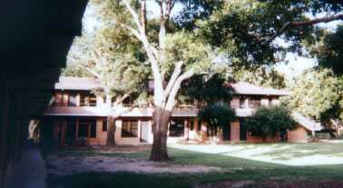{ loading=lazy data-title="The Singles Wing from the Bacabowl: &quot;filled mostly with seniors&quot;; Dr. Bill lived on the second floor, last room on the right." data-description="First Wiess website, &#x27;Pictures of Wiess Rooms&#x27; (set up by Head Fellow Chris Ruehl, 1998; text Ray Wagner, 1999) · 1998–1999" data-gallery="index-oldwiess1999" }
  <figcaption>The Singles Wing from the Bacabowl: "filled mostly with seniors"; Dr. Bill lived on the second floor, last room on the right. <small>First Wiess website, &#x27;Pictures of Wiess Rooms&#x27; (set up by Head Fellow Chris Ruehl, 1998; text Ray Wagner, 1999) [@wb 19991011005025 http://riceinfo.rice.edu/projects/colleges/wiess/college/photos/singles.html]</small></figcaption>
</figure>

<figure markdown="span">
  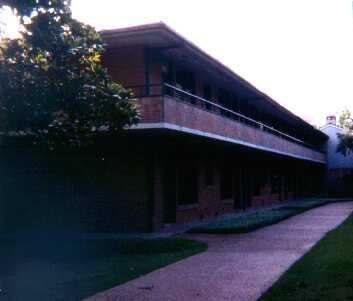{ loading=lazy data-title="The other side of the Singles Wing, facing Baker." data-description="First Wiess website, &#x27;Pictures of Wiess Rooms&#x27; (set up by Head Fellow Chris Ruehl, 1998; text Ray Wagner, 1999) · 1998–1999" data-gallery="index-oldwiess1999" }
  <figcaption>The other side of the Singles Wing, facing Baker. <small>First Wiess website, &#x27;Pictures of Wiess Rooms&#x27; (set up by Head Fellow Chris Ruehl, 1998; text Ray Wagner, 1999) [@wb 19991011005025 http://riceinfo.rice.edu/projects/colleges/wiess/college/photos/singles.html]</small></figcaption>
</figure>

<figure markdown="span">
  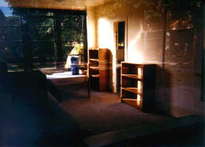{ loading=lazy data-title="&quot;A typical Wiess freshman room&quot;, shot through a window with the last exposure on the roll; about 20 by 15 feet." data-description="First Wiess website, &#x27;Pictures of Wiess Rooms&#x27; (set up by Head Fellow Chris Ruehl, 1998; text Ray Wagner, 1999) · 1998–1999" data-gallery="index-oldwiess1999" }
  <figcaption>"A typical Wiess freshman room", shot through a window with the last exposure on the roll; about 20 by 15 feet. <small>First Wiess website, &#x27;Pictures of Wiess Rooms&#x27; (set up by Head Fellow Chris Ruehl, 1998; text Ray Wagner, 1999) [@wb 19991011000933 http://riceinfo.rice.edu/projects/colleges/wiess/college/photos/frosh.html]</small></figcaption>
</figure>

## The Commons and UpCo

On [The Commons and UpCo](../places/commons.md#photographs).

<figure markdown="span">
  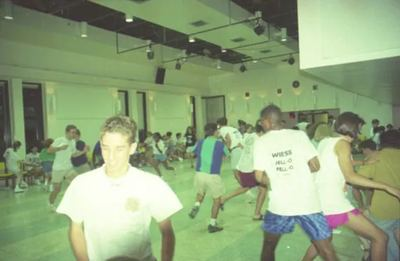{ loading=lazy data-title="Jello Night in the Old Wiess Commons, c.1996 (date and event from the file name)." data-description="Historian&#x27;s photo collection; source not recorded · c.1996" data-gallery="index-commons" }
  <figcaption>Jello Night in the Old Wiess Commons, c.1996 (date and event from the file name). <small>Historian&#x27;s photo collection; source not recorded</small></figcaption>
</figure>

<figure markdown="span">
  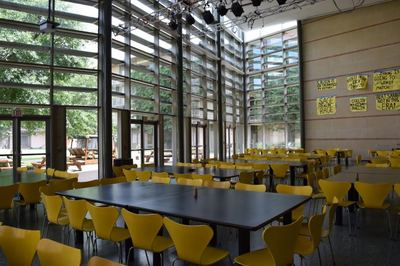{ loading=lazy data-title="The New Wiess Commons: long tables, yellow chairs, the glass wall onto the Acabowl." data-description="teamwiess.com, &#x27;New students: rooms&#x27;, 2017 · by 2017" data-gallery="index-commons" }
  <figcaption>The New Wiess Commons: long tables, yellow chairs, the glass wall onto the Acabowl. <small>teamwiess.com, &#x27;New students: rooms&#x27;, 2017 [@wb 20170714224839 http://teamwiess.com/newstudents/rooms/commons.jpg]</small></figcaption>
</figure>

<figure markdown="span">
  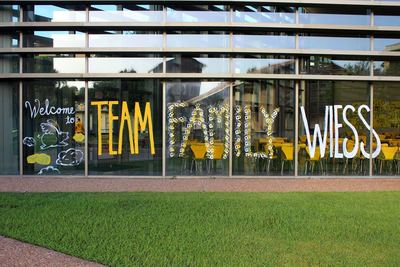{ loading=lazy data-title="TEAM FAMILY WIESS painted across the Commons windows, with &#x27;Welcome&#x27; beside it." data-description="teamwiess.com, &#x27;acapics&#x27;, by 2019 · by 2019" data-gallery="index-commons" }
  <figcaption>TEAM FAMILY WIESS painted across the Commons windows, with 'Welcome' beside it. <small>teamwiess.com, &#x27;acapics&#x27;, by 2019 [@wb 20190928044413 http://teamwiess.com/acapics/family.jpg]</small></figcaption>
</figure>

<figure markdown="span">
  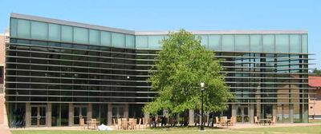{ loading=lazy data-title="The New Wiess Commons from the Acabowl lawn: two storeys of glass behind a sunscreen, a tree in front." data-description="Historian&#x27;s photo collection; source not recorded · undated (after 2002)" data-gallery="index-commons" }
  <figcaption>The New Wiess Commons from the Acabowl lawn: two storeys of glass behind a sunscreen, a tree in front. <small>Historian&#x27;s photo collection; source not recorded</small></figcaption>
</figure>

## New Wiess

On [New Wiess](../places/new-wiess.md#photographs).

<figure markdown="span">
  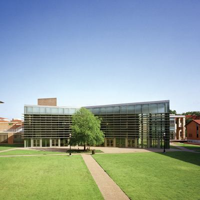{ loading=lazy data-title="The Commons across the Acabowl lawn and path." data-description="teamwiess.com, 2016 · by 2016" data-gallery="index-newwiess" }
  <figcaption>The Commons across the Acabowl lawn and path. <small>teamwiess.com, 2016 [@wb 20160506224855 http://teamwiess.com/res/rescolleges.jpg]</small></figcaption>
</figure>

<figure markdown="span">
  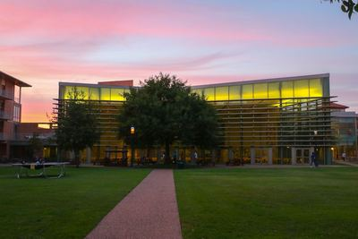{ loading=lazy data-title="The Commons lit up at dusk, seen from the Acabowl." data-description="teamwiess.com, &#x27;acapics&#x27;, 2017 · by 2017" data-gallery="index-newwiess" }
  <figcaption>The Commons lit up at dusk, seen from the Acabowl. <small>teamwiess.com, &#x27;acapics&#x27;, 2017 [@wb 20170602224647 http://teamwiess.com/acapics/pink.jpg]</small></figcaption>
</figure>

<figure markdown="span">
  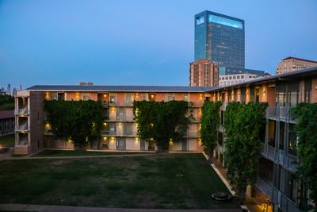{ loading=lazy data-title="A residential wing over the Acabowl at dusk, ivy on its screens, a tower beyond." data-description="Historian&#x27;s photo collection; source not recorded · undated" data-gallery="index-newwiess" }
  <figcaption>A residential wing over the Acabowl at dusk, ivy on its screens, a tower beyond. <small>Historian&#x27;s photo collection; source not recorded</small></figcaption>
</figure>

<figure markdown="span">
  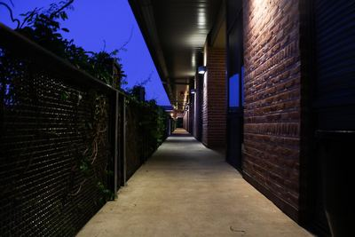{ loading=lazy data-title="An open-air corridor behind the ivy-covered metal screens, at dusk." data-description="teamwiess.com, &#x27;acapics&#x27;, 2017 · by 2017" data-gallery="index-newwiess" }
  <figcaption>An open-air corridor behind the ivy-covered metal screens, at dusk. <small>teamwiess.com, &#x27;acapics&#x27;, 2017 [@wb 20170602224650 http://teamwiess.com/acapics/darkhall.jpg]</small></figcaption>
</figure>

<figure markdown="span">
  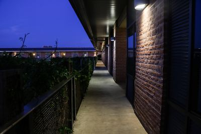{ loading=lazy data-title="Another corridor at dusk: brick on one side, screen and ivy on the other." data-description="teamwiess.com, &#x27;acapics&#x27;, 2017 · by 2017" data-gallery="index-newwiess" }
  <figcaption>Another corridor at dusk: brick on one side, screen and ivy on the other. <small>teamwiess.com, &#x27;acapics&#x27;, 2017 [@wb 20170602225337 http://teamwiess.com/acapics/dark-aisle.jpg]</small></figcaption>
</figure>

<figure markdown="span">
  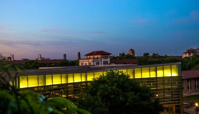{ loading=lazy data-title="The glazed upper storey of the Commons at dusk, seen from an upper floor." data-description="Historian&#x27;s photo collection; source not recorded · undated" data-gallery="index-newwiess" }
  <figcaption>The glazed upper storey of the Commons at dusk, seen from an upper floor. <small>Historian&#x27;s photo collection; source not recorded</small></figcaption>
</figure>

<figure markdown="span">
  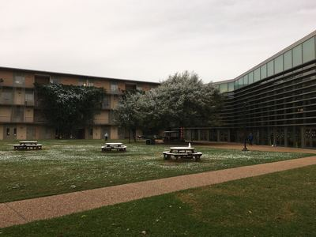{ loading=lazy data-title="Snow on the Acabowl lawn and picnic tables." data-description="teamwiess.com, &#x27;acapics&#x27;, by February 2018 · by 2018-02" data-gallery="index-newwiess" }
  <figcaption>Snow on the Acabowl lawn and picnic tables. <small>teamwiess.com, &#x27;acapics&#x27;, by February 2018 [@wb 20180223224559 http://teamwiess.com/acapics/snow.jpg]</small></figcaption>
</figure>

## The Acabowl

On [The Acabowl](../places/acabowl.md#photographs).

<figure markdown="span">
  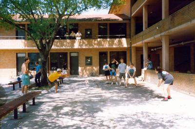{ loading=lazy data-title="Four-square on the paved court of the Old Wiess Acabowl, 1991 (date from the file name), balconies behind." data-description="Historian&#x27;s photo collection; source not recorded · 1991" data-gallery="index-acabowl" }
  <figcaption>Four-square on the paved court of the Old Wiess Acabowl, 1991 (date from the file name), balconies behind. <small>Historian&#x27;s photo collection; source not recorded [@handbook-1994]</small></figcaption>
</figure>

<figure markdown="span">
  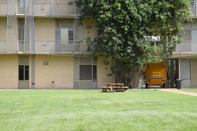{ loading=lazy data-title="The New Wiess Acabowl: lawn, a picnic table and the ivy-hung wing." data-description="teamwiess.com, &#x27;New students: rooms&#x27;, 2017 · by 2017" data-gallery="index-acabowl" }
  <figcaption>The New Wiess Acabowl: lawn, a picnic table and the ivy-hung wing. <small>teamwiess.com, &#x27;New students: rooms&#x27;, 2017 [@wb 20170714224834 http://teamwiess.com/newstudents/rooms/acabowl.jpg]</small></figcaption>
</figure>

<figure markdown="span">
  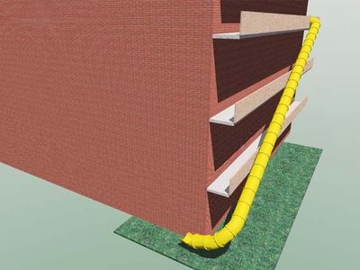{ loading=lazy data-title="A rendering of a spiral slide from an upper balcony down to the lawn. Compare the 2002 &#x27;Proposed Wiess Acaslide&#x27;." data-description="Historian&#x27;s photo collection; source not recorded · undated" data-gallery="index-acabowl" }
  <figcaption>A rendering of a spiral slide from an upper balcony down to the lawn. Compare the 2002 'Proposed Wiess Acaslide'. <small>Historian&#x27;s photo collection; source not recorded [@wb 20021013235815 http://www.teamwiess.com:80/pow.html]</small></figcaption>
</figure>

## The terraces and Toke

On [The terraces and Toke](../places/terraces.md#photographs).

<figure markdown="span">
  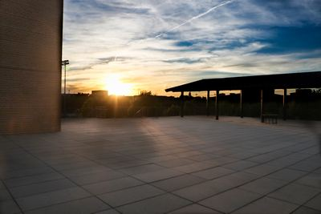{ loading=lazy data-title="The large paved terrace on the South Servery roof, with its shade structure, at sunset. The file is named &#x27;bacaterrace&#x27;, Hanszen&#x27;s name for it in 2026." data-description="Historian&#x27;s photo collection; source not recorded · undated" data-gallery="index-terraces" }
  <figcaption>The large paved terrace on the South Servery roof, with its shade structure, at sunset. The file is named 'bacaterrace', Hanszen's name for it in 2026. <small>Historian&#x27;s photo collection; source not recorded [@testimony-mullen-2026-10-05b terraces]</small></figcaption>
</figure>

<figure markdown="span">
  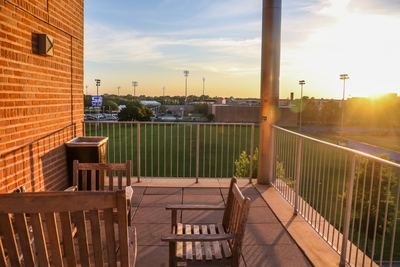{ loading=lazy data-title="The fourth-floor balcony, Toke (the Bacaterrace of the 2014–17 books): benches and rail, the playing fields beyond." data-description="Historian&#x27;s photo collection; source not recorded · undated" data-gallery="index-terraces" }
  <figcaption>The fourth-floor balcony, Toke (the Bacaterrace of the 2014–17 books): benches and rail, the playing fields beyond. <small>Historian&#x27;s photo collection; source not recorded [@testimony-mullen-2026-10-05b Toke]</small></figcaption>
</figure>

<figure markdown="span">
  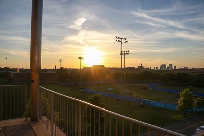{ loading=lazy data-title="Sunset over the playing fields from an upper-floor balcony rail, probably the same fourth-floor balcony." data-description="Historian&#x27;s photo collection; source not recorded · undated" data-gallery="index-terraces" }
  <figcaption>Sunset over the playing fields from an upper-floor balcony rail, probably the same fourth-floor balcony. <small>Historian&#x27;s photo collection; source not recorded</small></figcaption>
</figure>

<figure markdown="span">
  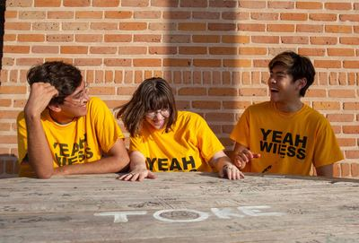{ loading=lazy data-title="TOKE painted on a graffiti-covered table: an O-Week photograph of 2022, the earliest written trace of the name." data-description="teamwiess.com, O-Week 2022 · 2022" data-gallery="index-terraces" }
  <figcaption>TOKE painted on a graffiti-covered table: an O-Week photograph of 2022, the earliest written trace of the name. <small>teamwiess.com, O-Week 2022 [@wb 20220709040142 http://teamwiess.com/images/oweek2022/wiessicles.jpg]</small></figcaption>
</figure>

## Rooms and spaces of New Wiess

On [Rooms and spaces of New Wiess](../places/rooms-and-spaces.md#photographs).

<figure markdown="span">
  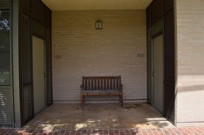{ loading=lazy data-title="A suite alcove off the corridor, with a bench." data-description="teamwiess.com, &#x27;New students: rooms&#x27;, 2017 · by 2017" data-gallery="index-rooms" }
  <figcaption>A suite alcove off the corridor, with a bench. <small>teamwiess.com, &#x27;New students: rooms&#x27;, 2017 [@wb 20170714224838 http://teamwiess.com/newstudents/rooms/alcove.jpg]</small></figcaption>
</figure>

<figure markdown="span">
  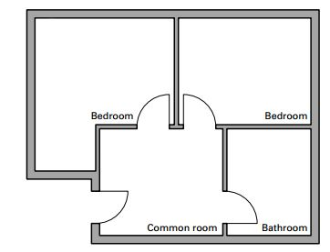{ loading=lazy data-title="Plan of a double: two bedrooms, a common room and a bathroom." data-description="teamwiess.com, 2016 · by 2016" data-gallery="index-rooms" }
  <figcaption>Plan of a double: two bedrooms, a common room and a bathroom. <small>teamwiess.com, 2016 [@wb 20160506224916 http://teamwiess.com/res/freshmanroomnew.png]</small></figcaption>
</figure>

<figure markdown="span">
  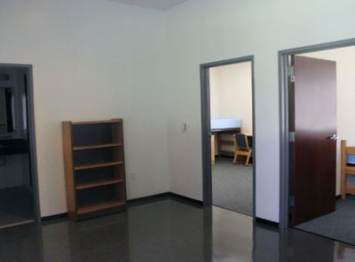{ loading=lazy data-title="An empty suite common room, doors to the two bedrooms." data-description="teamwiess.com, 2016 · by 2016" data-gallery="index-rooms" }
  <figcaption>An empty suite common room, doors to the two bedrooms. <small>teamwiess.com, 2016 [@wb 20160506224917 http://teamwiess.com/res/commonroom.png]</small></figcaption>
</figure>

<figure markdown="span">
  { loading=lazy data-title="A double bedroom, two beds and two desks." data-description="teamwiess.com, &#x27;New students: rooms&#x27;, 2017 · by 2017" data-gallery="index-rooms" }
  <figcaption>A double bedroom, two beds and two desks. <small>teamwiess.com, &#x27;New students: rooms&#x27;, 2017 [@wb 20170714224845 http://teamwiess.com/newstudents/rooms/beds.jpg]</small></figcaption>
</figure>

<figure markdown="span">
  { loading=lazy data-title="Wardrobes and dresser in a bedroom." data-description="teamwiess.com, &#x27;New students: rooms&#x27;, 2017 · by 2017" data-gallery="index-rooms" }
  <figcaption>Wardrobes and dresser in a bedroom. <small>teamwiess.com, &#x27;New students: rooms&#x27;, 2017 [@wb 20170714224844 http://teamwiess.com/newstudents/rooms/desks.jpg]</small></figcaption>
</figure>

<figure markdown="span">
  { loading=lazy data-title="Desks under the window." data-description="teamwiess.com, &#x27;New students: rooms&#x27;, 2017 · by 2017" data-gallery="index-rooms" }
  <figcaption>Desks under the window. <small>teamwiess.com, &#x27;New students: rooms&#x27;, 2017 [@wb 20170714224846 http://teamwiess.com/newstudents/rooms/onedesk.jpg]</small></figcaption>
</figure>

<figure markdown="span">
  { loading=lazy data-title="A suite bathroom: two sinks, a large mirror, the shower." data-description="teamwiess.com, &#x27;New students: rooms&#x27;, 2017 · by 2017" data-gallery="index-rooms" }
  <figcaption>A suite bathroom: two sinks, a large mirror, the shower. <small>teamwiess.com, &#x27;New students: rooms&#x27;, 2017 [@wb 20170714224848 http://teamwiess.com/newstudents/rooms/bathroom.jpg]</small></figcaption>
</figure>

<figure markdown="span">
  { loading=lazy data-title="The corridor outside the suites: doors and windows on one side, the Acabowl on the other." data-description="teamwiess.com, &#x27;New students: rooms&#x27;, 2017 · by 2017" data-gallery="index-rooms" }
  <figcaption>The corridor outside the suites: doors and windows on one side, the Acabowl on the other. <small>teamwiess.com, &#x27;New students: rooms&#x27;, 2017 [@wb 20170714224842 http://teamwiess.com/newstudents/rooms/hall.jpg]</small></figcaption>
</figure>

## Team Wiess and TFW

On [Team Wiess and TFW](../traditions/team-wiess.md#photographs).

<figure markdown="span">
  { loading=lazy data-title="The TEAM / FAMILY / WIESS paper banners in the Commons, hung in a descending diagonal, behind an O-Week skit (video still, 2017)." data-description="teamwiess.com, O-Week videos, 2017 · 2017" data-gallery="index-teamwiess" }
  <figcaption>The TEAM / FAMILY / WIESS paper banners in the Commons, hung in a descending diagonal, behind an O-Week skit (video still, 2017). <small>teamwiess.com, O-Week videos, 2017 [@wb 20170908225508 http://teamwiess.com/newstudents/videos/teammerh.png]</small></figcaption>
</figure>

<figure markdown="span">
  { loading=lazy data-title="TEAM FAMILY WIESS on the Commons windows." data-description="teamwiess.com, &#x27;acapics&#x27;, by 2019 · by 2019" data-gallery="index-teamwiess" }
  <figcaption>TEAM FAMILY WIESS on the Commons windows. <small>teamwiess.com, &#x27;acapics&#x27;, by 2019 [@wb 20190928044413 http://teamwiess.com/acapics/family.jpg]</small></figcaption>
</figure>

<figure markdown="span">
  { loading=lazy data-title="Jumping over the letters T F W, for the new students&#x27; pages." data-description="teamwiess.com, new students, 2019 · by 2019" data-gallery="index-teamwiess" }
  <figcaption>Jumping over the letters T F W, for the new students' pages. <small>teamwiess.com, new students, 2019 [@wb 20190802225456 http://teamwiess.com/newstudents/thumbnails/daa.jpg]</small></figcaption>
</figure>

## Crest, colours and symbols

On [Crest, colours and symbols](../traditions/symbols.md#photographs).

<figure markdown="span">
  { loading=lazy data-title="The Wiess arms in colour: a griffin counterchanged on a shield divided black over gold, a helmet with mantling, an owl on top." data-description="teamwiess.com, 2014 · by 2014" data-gallery="index-symbols" }
  <figcaption>The Wiess arms in colour: a griffin counterchanged on a shield divided black over gold, a helmet with mantling, an owl on top. <small>teamwiess.com, 2014 [@wb 20140627224637 http://teamwiess.com/images/wiessshield1wtrans-u213-fr.png]</small></figcaption>
</figure>

<figure markdown="span">
  { loading=lazy data-title="The crest in black and white." data-description="teamwiess.com, 2015 · by 2015" data-gallery="index-symbols" }
  <figcaption>The crest in black and white. <small>teamwiess.com, 2015 [@wb 20150612230209 http://teamwiess.com/assets/crestbw.gif]</small></figcaption>
</figure>

<figure markdown="span">
  { loading=lazy data-title="The 60th-anniversary crest, &#x27;Wiess College 60th Anniversary 1957–2017&#x27;." data-description="teamwiess.com/60, 2017 · 2017" data-gallery="index-symbols" }
  <figcaption>The 60th-anniversary crest, 'Wiess College 60th Anniversary 1957–2017'. <small>teamwiess.com/60, 2017 [@wb 20170602224644 http://teamwiess.com/60/Wiess60-crest-with-date-small.png]</small></figcaption>
</figure>

<figure markdown="span">
  { loading=lazy data-title="The 60th-anniversary banner." data-description="teamwiess.com/60, 2017 · 2017" data-gallery="index-symbols" }
  <figcaption>The 60th-anniversary banner. <small>teamwiess.com/60, 2017 [@wb 20170602224639 http://teamwiess.com/60/Wiess60-banner.png]</small></figcaption>
</figure>

## Night of Decadence

On [Night of Decadence](../traditions/night-of-decadence.md#photographs).

<figure markdown="span">
  { loading=lazy data-title="&#x27;Themes through the decades&#x27;, 1973–75 to 2011: a graphic of unknown origin, transcribed in the table above." data-description="Image of unknown origin, in the Historian&#x27;s NOD images · c.2011–12" data-gallery="index-nod" }
  <figcaption>'Themes through the decades', 1973–75 to 2011: a graphic of unknown origin, transcribed in the table above. <small>Image of unknown origin, in the Historian&#x27;s NOD images</small></figcaption>
</figure>

<figure markdown="span">
  { loading=lazy data-title="NOD &#x27;Animal Farm&#x27;, 26 October 1984: paper pigs and animals hung over the crowd, the 12-foot pig at top left." data-description="The Campanile 1985, p.283 · 1984-10-26" data-gallery="index-nod" }
  <figcaption>NOD 'Animal Farm', 26 October 1984: paper pigs and animals hung over the crowd, the 12-foot pig at top left. <small>The Campanile 1985, p.283 [@campanile-1985]</small></figcaption>
</figure>

<figure markdown="span">
  { loading=lazy data-title="Dancing at NOD, c.1983 (date from the file name)." data-description="Historian&#x27;s photo collection; source not recorded · c.1983" data-gallery="index-nod" }
  <figcaption>Dancing at NOD, c.1983 (date from the file name). <small>Historian&#x27;s photo collection; source not recorded</small></figcaption>
</figure>

<figure markdown="span">
  { loading=lazy data-title="Three costumes at NOD 1998, &#x27;Silver Anniversary: NOD&#x27;s Greatest Hits&#x27; (date from the file name)." data-description="Historian&#x27;s photo collection; source not recorded · 1998" data-gallery="index-nod" }
  <figcaption>Three costumes at NOD 1998, 'Silver Anniversary: NOD's Greatest Hits' (date from the file name). <small>Historian&#x27;s photo collection; source not recorded</small></figcaption>
</figure>

## Gazilchers

On [Gazilchers](../traditions/retired/gazilchers.md#photographs).

<figure markdown="span">
  { loading=lazy data-title="Water balloons launched from the west wing of Old Wiess. The file is dated 1970; an alumnus who was there dates it c.1961–62." data-description="Rice History Corner, 6 May 2011 · c.1961–70" data-gallery="index-gazilchers" }
  <figcaption>Water balloons launched from the west wing of Old Wiess. The file is dated 1970; an alumnus who was there dates it c.1961–62. <small>Rice History Corner, 6 May 2011 [@rhc 2011-05-06 friday-afternoon-follies-plus-a-campus-quiz] [@rhc 2011-05-06 friday-afternoon-follies-plus-a-campus-quiz comment by Dagobert Brito (Wiess '63), 7 May 2011]</small></figcaption>
</figure>

<figure markdown="span">
  { loading=lazy data-title="The same battery from the side: a stretched launcher on the Old Wiess stair landing." data-description="Rice History Corner, 6 May 2011 · c.1961–70" data-gallery="index-gazilchers" }
  <figcaption>The same battery from the side: a stretched launcher on the Old Wiess stair landing. <small>Rice History Corner, 6 May 2011 [@rhc 2011-05-06 friday-afternoon-follies-plus-a-campus-quiz]</small></figcaption>
</figure>

## The War Pig

On [The War Pig](../traditions/warpig.md#photographs).

<figure markdown="span">
  { loading=lazy data-title="A black pig lettered TEAM WIESS: the picture beside &#x27;The mighty War Pig&#x27; on the first website&#x27;s traditions page." data-description="riceinfo Wiess site, 2000 · by 2000" data-gallery="index-warpig" }
  <figcaption>A black pig lettered TEAM WIESS: the picture beside 'The mighty War Pig' on the first website's traditions page. <small>riceinfo Wiess site, 2000 [@wb 20000526190203 http://riceinfo.rice.edu:80/projects/colleges/wiess/traditions/index.html]</small></figcaption>
</figure>

<figure markdown="span">
  { loading=lazy data-title="The orange commercial pig, TEAM WIESS, tethered in the New Wiess Acabowl over the Acatramp; the ivy screens of New Wiess behind." data-description="Historian&#x27;s photo collection; source not recorded · 2002–04" data-gallery="index-warpig" }
  <figcaption>The orange commercial pig, TEAM WIESS, tethered in the New Wiess Acabowl over the Acatramp; the ivy screens of New Wiess behind. <small>Historian&#x27;s photo collection; source not recorded [@warpig-core-deck slide 32]</small></figcaption>
</figure>

## Jock Row

On [Jock Row](../traditions/retired/jock-row.md#photographs).

<figure markdown="span">
  { loading=lazy data-title="A banner in the Old Wiess Commons supporting the Wiess jocks. Undated; commenters guess the 1960s or early 1970s." data-description="Rice History Corner, 20 May 2016 · undated (1960s–70s?)" data-gallery="index-jockrow" }
  <figcaption>A banner in the Old Wiess Commons supporting the Wiess jocks. Undated; commenters guess the 1960s or early 1970s. <small>Rice History Corner, 20 May 2016 [@rhc 2016-05-20 friday-follies-go-wiess-jocks]</small></figcaption>
</figure>

## Norse Night

On [Norse Night](../traditions/retired/norse-night.md#photographs).

<figure markdown="span">
  { loading=lazy data-title="The Campanile photograph on the 1999 Norse Night page: a Viking-table diner, napkin on head." data-description="riceinfo Wiess site, 1999 (a Campanile photograph) · before 1999" data-gallery="index-norse" }
  <figcaption>The Campanile photograph on the 1999 Norse Night page: a Viking-table diner, napkin on head. <small>riceinfo Wiess site, 1999 (a Campanile photograph) [@riceinfo-norse]</small></figcaption>
</figure>

## Baker 13 Defense Force

On [Baker 13 Defense Force](../traditions/baker-13-defense-force.md#photographs).

<figure markdown="span">
  { loading=lazy data-title="The Baker 13 Defense Force representatives&#x27; photograph: suits, sunglasses and a water gun." data-description="teamwiess.com, representatives, 2017 · 2017" data-gallery="index-b13" }
  <figcaption>The Baker 13 Defense Force representatives' photograph: suits, sunglasses and a water gun. <small>teamwiess.com, representatives, 2017 [@wb 20170421224913 http://teamwiess.com/profiles/reps/baker13defense.jpg]</small></figcaption>
</figure>

## Battle Sows & Powderpuff

On [Battle Sows & Powderpuff](../traditions/battle-sows-powderpuff.md#photographs).

<figure markdown="span">
  { loading=lazy data-title="The Wiess powderpuff team at night, in black jerseys." data-description="teamwiess.com, by January 2023 · by 2023" data-gallery="index-powderpuff" }
  <figcaption>The Wiess powderpuff team at night, in black jerseys. <small>teamwiess.com, by January 2023 [@wb 20230114010452 http://teamwiess.com/images/powderpuff-low.jpg]</small></figcaption>
</figure>

<figure markdown="span">
  { loading=lazy data-title="The Battle Sows, 1999 Powder Puff champions." data-description="First Wiess website, Battle Sows page, 1999 · 1999" data-gallery="index-powderpuff" }
  <figcaption>The Battle Sows, 1999 Powder Puff champions. <small>First Wiess website, Battle Sows page, 1999 [@riceinfo-battlesows]</small></figcaption>
</figure>

<figure markdown="span">
  { loading=lazy data-title="The Sows&#x27; huddle, 1999." data-description="First Wiess website, Battle Sows page, 1999 · 1999" data-gallery="index-powderpuff" }
  <figcaption>The Sows' huddle, 1999. <small>First Wiess website, Battle Sows page, 1999 [@riceinfo-battlesows]</small></figcaption>
</figure>

<figure markdown="span">
  { loading=lazy data-title="Battle Sows, 1999: &quot;What time is it?&quot;" data-description="First Wiess website, Battle Sows page, 1999 · 1999" data-gallery="index-powderpuff" }
  <figcaption>Battle Sows, 1999: "What time is it?" <small>First Wiess website, Battle Sows page, 1999 [@riceinfo-battlesows]</small></figcaption>
</figure>

## Beer Bike

On [Beer Bike](../traditions/beer-bike.md#photographs).

<figure markdown="span">
  { loading=lazy data-title="Wiess at Beer Bike in that year&#x27;s maroon team shirts, faces painted, under the live oaks." data-description="teamwiess.com, by January 2023 · by 2023" data-gallery="index-beerbike" }
  <figcaption>Wiess at Beer Bike in that year's maroon team shirts, faces painted, under the live oaks. <small>teamwiess.com, by January 2023 [@wb 20230114010426 http://teamwiess.com/images/beer-bike-low.jpg]</small></figcaption>
</figure>

## Summit

On [Summit](../traditions/summit.md#photographs).

<figure markdown="span">
  { loading=lazy data-title="Summit 2024: the college on the beach (date from the file name)." data-description="Historian&#x27;s photo collection; source not recorded · 2024" data-gallery="index-summit" }
  <figcaption>Summit 2024: the college on the beach (date from the file name). <small>Historian&#x27;s photo collection; source not recorded</small></figcaption>
</figure>

## O-Week

On [O-Week](../traditions/o-week.md#photographs).

<figure markdown="span">
  { loading=lazy data-title="O-Week, late 2000s: skateboarding in a goldenrod shirt." data-description="Flickr; photographer not recorded · c.2008" data-gallery="index-oweek" }
  <figcaption>O-Week, late 2000s: skateboarding in a goldenrod shirt. <small>Flickr; photographer not recorded</small></figcaption>
</figure>

<figure markdown="span">
  { loading=lazy data-title="O-Week, late 2000s: goldenrod shirts at a run." data-description="Flickr; photographer not recorded · c.2008" data-gallery="index-oweek" }
  <figcaption>O-Week, late 2000s: goldenrod shirts at a run. <small>Flickr; photographer not recorded</small></figcaption>
</figure>

<figure markdown="span">
  { loading=lazy data-title="O-Week, late 2000s: on the slip-and-slide." data-description="Flickr; photographer not recorded · c.2008" data-gallery="index-oweek" }
  <figcaption>O-Week, late 2000s: on the slip-and-slide. <small>Flickr; photographer not recorded</small></figcaption>
</figure>

<figure markdown="span">
  { loading=lazy data-title="The 2021 O-Week coordinators (&#x27;coords&#x27; in the file name) in front of Lovett Hall, in YEAH WIESS shirts." data-description="teamwiess.com, O-Week 2021 · 2021" data-gallery="index-oweek" }
  <figcaption>The 2021 O-Week coordinators ('coords' in the file name) in front of Lovett Hall, in YEAH WIESS shirts. <small>teamwiess.com, O-Week 2021 [@wb 20210619003837 http://teamwiess.com/images/oweek2021/coords.jpg]</small></figcaption>
</figure>

## The Core Team

On [The Core Team](../people/core-team.md#photographs).

<figure markdown="span">
  { loading=lazy data-title="John and Paula Hutchinson (Magisters c.1990–2001), in academic dress, from the Associates page." data-description="teamwiess.com, Associates, 2021 · by 2021" data-gallery="index-coreteam" }
  <figcaption>John and Paula Hutchinson (Magisters c.1990–2001), in academic dress, from the Associates page. <small>teamwiess.com, Associates, 2021 [@wb 20210806235829 http://teamwiess.com/images/associates/hutchinson.png]</small></figcaption>
</figure>

<figure markdown="span">
  { loading=lazy data-title="Doward and Christie Hudlow (RAs 2002–2008), from the Associates page." data-description="teamwiess.com, Associates, 2021 · by 2021" data-gallery="index-coreteam" }
  <figcaption>Doward and Christie Hudlow (RAs 2002–2008), from the Associates page. <small>teamwiess.com, Associates, 2021 [@wb 20210806235826 http://teamwiess.com/images/associates/hudlow.png]</small></figcaption>
</figure>

<figure markdown="span">
  { loading=lazy data-title="Mike Gustin and Denise Klein (Magisters 2006–2011), on the 2008 website." data-description="teamwiess.com, 2008 · by 2008" data-gallery="index-coreteam" }
  <figcaption>Mike Gustin and Denise Klein (Magisters 2006–2011), on the 2008 website. <small>teamwiess.com, 2008 [@wb 20080709214750 http://teamwiess.com/images/people/masters2.jpg]</small></figcaption>
</figure>

<figure markdown="span">
  { loading=lazy data-title="Alexander and Jeanette Byrd (Magisters 2011–2016) with their family." data-description="teamwiess.com, 2016 · by 2016" data-gallery="index-coreteam" }
  <figcaption>Alexander and Jeanette Byrd (Magisters 2011–2016) with their family. <small>teamwiess.com, 2016 [@wb 20160506224920 http://teamwiess.com/res/byrd.png]</small></figcaption>
</figure>

<figure markdown="span">
  { loading=lazy data-title="Renata Ramos and Lenin Terrazas (RAs 2011–2018) with their son." data-description="teamwiess.com; capture not identified · 2011–18" data-gallery="index-coreteam" }
  <figcaption>Renata Ramos and Lenin Terrazas (RAs 2011–2018) with their son. <small>teamwiess.com; capture not identified</small></figcaption>
</figure>

<figure markdown="span">
  { loading=lazy data-title="Dr. Emilie Ringe (RA 2014–2017)." data-description="teamwiess.com, 2016 · by 2016" data-gallery="index-coreteam" }
  <figcaption>Dr. Emilie Ringe (RA 2014–2017). <small>teamwiess.com, 2016 [@wb 20160506224923 http://teamwiess.com/res/emilie.png]</small></figcaption>
</figure>

<figure markdown="span">
  { loading=lazy data-title="Ewart G. Jones, Jr. (College Coordinator 2013–2023)." data-description="teamwiess.com, 2016 · by 2016" data-gallery="index-coreteam" }
  <figcaption>Ewart G. Jones, Jr. (College Coordinator 2013–2023). <small>teamwiess.com, 2016 [@wb 20160506224925 http://teamwiess.com/res/ewart.png]</small></figcaption>
</figure>

<figure markdown="span">
  { loading=lazy data-title="Drs. Andrew and Laura Schaefer (Magisters 2016–2021) with their family." data-description="teamwiess.com, 2016 · by 2016" data-gallery="index-coreteam" }
  <figcaption>Drs. Andrew and Laura Schaefer (Magisters 2016–2021) with their family. <small>teamwiess.com, 2016 [@wb 20160527224834 http://teamwiess.com/res/schaefers.jpg]</small></figcaption>
</figure>

<figure markdown="span">
  { loading=lazy data-title="Carissa Zimmerman and Nick Espinosa (RAs from 2018)." data-description="teamwiess.com, 2020 · by 2020" data-gallery="index-coreteam" }
  <figcaption>Carissa Zimmerman and Nick Espinosa (RAs from 2018). <small>teamwiess.com, 2020 [@wb 20200529230221 http://teamwiess.com/images/carissa-nick.jpg]</small></figcaption>
</figure>

<figure markdown="span">
  { loading=lazy data-title="Flavio Cunha and Fabiana Santos (Magisters from 2021)." data-description="teamwiess.com, 2021 · by 2021" data-gallery="index-coreteam" }
  <figcaption>Flavio Cunha and Fabiana Santos (Magisters from 2021). <small>teamwiess.com, 2021 [@wb 20210813231053 http://teamwiess.com/images/ateam/flavio-fabiana.jpeg]</small></figcaption>
</figure>

<figure markdown="span">
  { loading=lazy data-title="Dr. Bill Wilson, Resident Associate, as pictured on the first website&#x27;s Associates page." data-description="First Wiess website, People pages, 1998–2000 · 1998–2000" data-gallery="index-coreteam" }
  <figcaption>Dr. Bill Wilson, Resident Associate, as pictured on the first website's Associates page. <small>First Wiess website, People pages, 1998–2000 [@riceinfo-masters]</small></figcaption>
</figure>

<figure markdown="span">
  { loading=lazy data-title="Dr. Stan Dodds, Resident Associate." data-description="First Wiess website, People pages, 1998–2000 · 1998–2000" data-gallery="index-coreteam" }
  <figcaption>Dr. Stan Dodds, Resident Associate. <small>First Wiess website, People pages, 1998–2000 [@riceinfo-masters]</small></figcaption>
</figure>

<figure markdown="span">
  { loading=lazy data-title="John Hutchinson, Magister (then Master)." data-description="First Wiess website, People pages, 1998–2000 · 1998–2000" data-gallery="index-coreteam" }
  <figcaption>John Hutchinson, Magister (then Master). <small>First Wiess website, People pages, 1998–2000 [@riceinfo-masters]</small></figcaption>
</figure>

<figure markdown="span">
  { loading=lazy data-title="Paula Hutchinson, Magister (then Master)." data-description="First Wiess website, People pages, 1998–2000 · 1998–2000" data-gallery="index-coreteam" }
  <figcaption>Paula Hutchinson, Magister (then Master). <small>First Wiess website, People pages, 1998–2000 [@riceinfo-masters]</small></figcaption>
</figure>

Last reviewed 2026-10-05 by unreviewed · [Edit this page](#)

