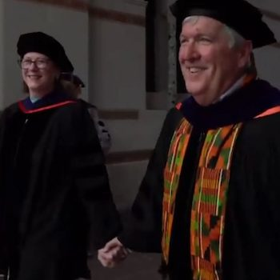
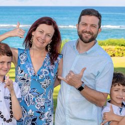
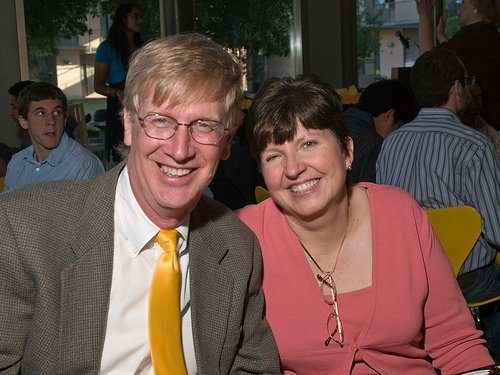
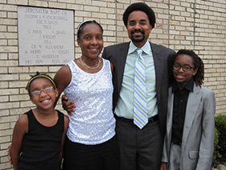
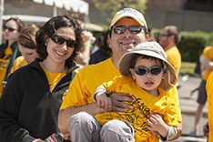
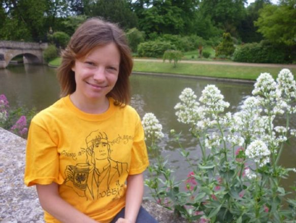
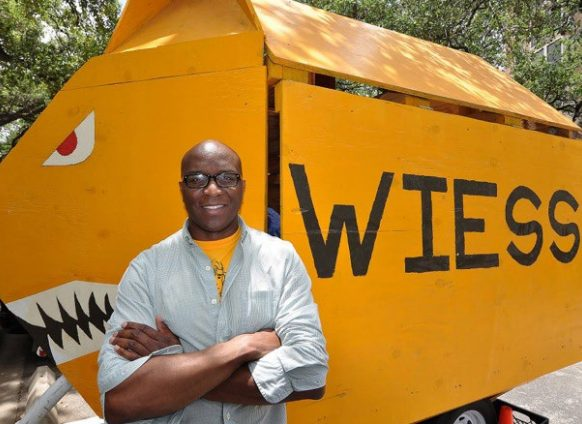
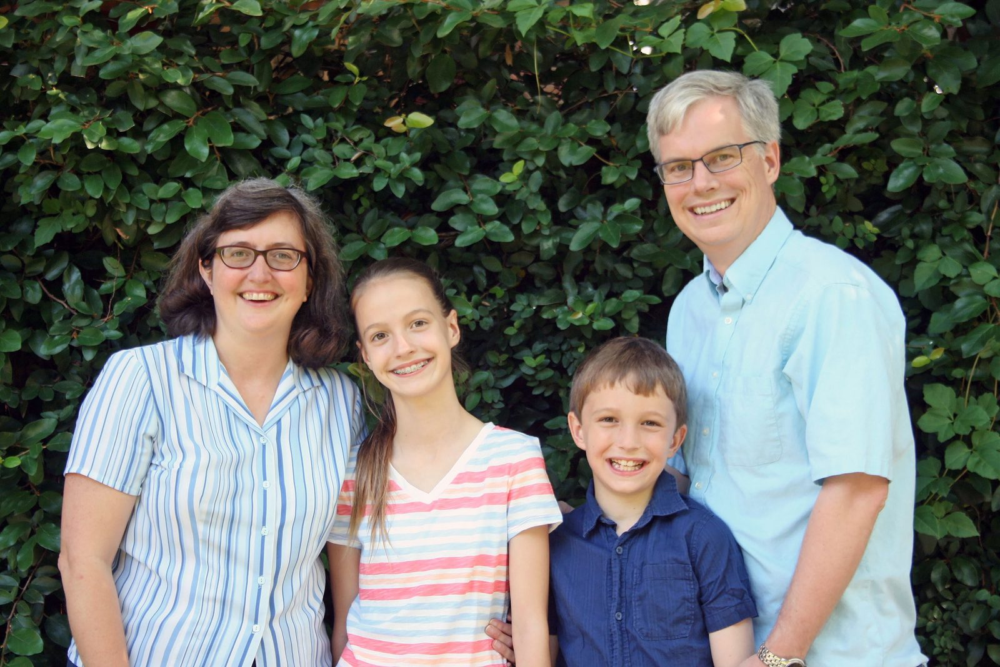
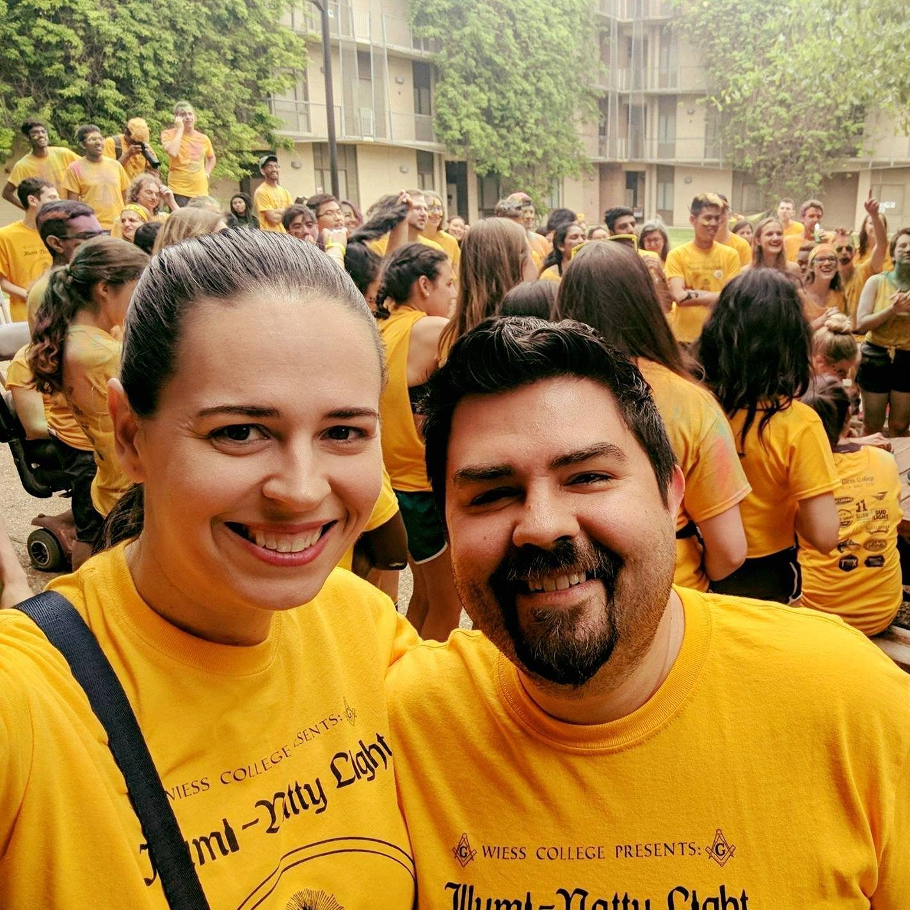
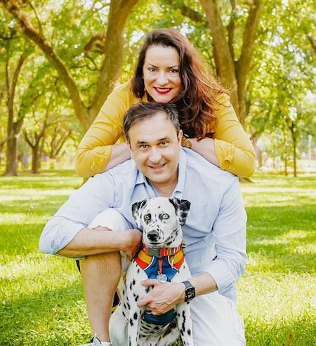

# The Core Team: Magisters, Resident Associates and Coordinators

The Core Team is the college's name for the adults who run Wiess with the students: the **Magisters**[^magister], a faculty couple who live in the Magisters' house beside the college; the **Resident Associates** (RAs), faculty or staff who live in the college itself; and the **College Coordinator**, the staff member who keeps the college office [@wiess-rice-edu-coreteam]. The O-Week books called the same people "The Adults (The A-team)" from at least 2003 [@oweek-2003 p.8] and "the Wiess A-Team" as late as 2019 [@oweek-2019 p.8]; "Core Team" first appears in the 2021 book, which still uses "A-Team" on other pages [@oweek-2021 p.6] [@oweek-2021 p.17] [@oweek-2021 p.31], and by 2024 the book has a "Core Team" section [@oweek-2024 p.28]. The college's websites called them the A-Team until 2023 [@teamwiess-ateam-2016-2023]. The record of who held these posts is good from 2003, when the O-Week books begin introducing each of them by name, patchy for the 1990s, and thin before that: the first Magister, Dr. Roy Talmage, and the first senior RA, Dr. John E. Parish, are known from one handbook sentence each, and most of the 1960s–1980s from alumni memory [@oweek-2006 p.36] [@riceinfo-history]. The two longest associations in the record are Parish's twenty-three years and Dr. Bill Wilson's thirty, both as RAs. The current Magisters, Flavio Cunha and Fabiana Santos, appear on the college's roster from August 2021 [@wb 20210813231021 http://teamwiess.com/government/ateam], and the 2021 book calls it "the first year that F&F will serve as Magisters" [@oweek-2021 p.24]; the current College Coordinator, named on the college's site in August 2025 and in the O-Week books of 2024 and 2025, is Jenny Toups [@wiess-rice-edu-associates-2025] [@oweek-2024 p.32] [@oweek-2025 p.33]. The 2025 book's roster is the latest full one in the record: Magisters Cunha and Santos; RAs Carissa Zimmerman and Nick Espinosa, and Lach and Kari Mullen; coordinator Jenny Toups [@oweek-2025 p.60].

For the Magisters in more detail see [Magisters](masters-and-magisters.md); for the RAs, [Resident Associates](resident-associates.md); for the house, [Wiess House / Wilson House](../places/wilson-house.md).

## The three roles and how they changed

**Magisters.** "At Rice, masters are professors and their families who have volunteered to be helpful, loving and supportive people at each of the residential colleges… At the same time, they advocate on behalf of Wiess to the rest of the university" [@oweek-2003 intro p.7]. The Constitution makes the Magister "the highest-ranking faculty associate", seats the Magister on Cabinet without a vote but with a veto, and makes the Magister the court of appeal from the College Court [@constitution-1993] [@constitution-2026 p.3] [@constitution-2026 p.9] [@constitution-2026 p.12]. How the Magister is chosen has changed three times on paper: appointed by the administration (1993); "recommended by Cabinet and appointed by the administration" (2007); recommended by a search committee of at least six Wiess members under two chairmen chosen by the President, then appointed (2016); the same committee for "the Magister" in 2020; and by early 2025 (and in 2026) the same committee, now asked to "reflect the diversity of interests and identities present across Wiess" [@constitution-1993] [@constitution-2007 p.1] [@constitution-2016 p.1] [@constitution-2020 Art. II §3] [@constitution-hate-speech Art. II §1] [@constitution-2026 p.3]. Practice ran ahead of the text: in July 2007 the college's list of appointed representatives included a "Master's Search Committee Chair" [@wb 20070709183121 http://teamwiess.com/index.php?module=page&page=representatives]. The 2016 Owlmanac says Magisters "generally serve terms for five years, but extenuating circumstances have allowed some Masters to stay for more or less amounts of time" [@owlmanac-2016 p.9]; at Wiess the Byrds served exactly five, the Schaefers five, the Hutchinsons about eleven. The 2024 and 2025 books describe Magisters as "tenured faculty members who oversee student life at each college… the middlemen between students and Rice administration" [@oweek-2024 p.28], and the Magisters' own letter in both books sets out "four main roles": advising the student government, guiding students through academic advising, support in emergencies, and "Oversight of Physical Spaces", working with Housing & Dining [@oweek-2024 p.29] [@oweek-2025 p.30].

**Resident Associates.** "RAs are adults who live in the college (on the 3rd and 4th floor central wing at Wiess). They offer advice, guide college activities, volunteer their time and are always up for conversations and silliness" [@oweek-2006 p.9]. In Old Wiess they were professors—Parish (English), Wilson (Electrical Engineering), Dodds (Physics) [@riceinfo-associates]. From 2002 the college also chose young alumni couples and staff: the Hudlows (both Wiess '01), a director in the Community Involvement Center, a pediatric psychologist, a Schlumberger engineer [@oweek-2003 intro p.8] [@oweek-2008 part 1 p.8] [@oweek-2010 p.8] [@oweek-2011 p.8]. The usual pattern since 2006 is one RA household on each of the two floors. The Constitution has always seated RAs on Cabinet without a vote [@constitution-1993]; it said nothing about choosing them until 2016, when a committee "lead by two undergraduate chairmen selected by the President" was written in, and since 2016 the RAs also sit on the Court ex officio [@constitution-2016 p.1] [@constitution-2016 p.8]. Again practice came first: a 2009 Fellow "helped select our awesome RA, Christa" [@oweek-2009 part 2 p.11]. The 2017 search page set the expectation: "A Resident Associate typically serves three to seven years… The RA therefore must be a visible participant in college life, accessible to students, and willing to stand in for the masters, when appropriate" [@teamwiess-ra-search-2017]. In 2026 the RAs share Article II, "Residential Associates", with the Magister, the former President stays on a search committee that outlasts their term, and the RAs sit on the Court with the President [@constitution-2026 p.3] [@constitution-2026 p.12]. The 2014–15 college budget carried an "RA" line of $4,000 [@budget-2014-15 p.2]. The 2024 book defines RAs as "full-time faculty and staff at Rice who live among the students" [@oweek-2024 p.28]; the RAs of that year put it their own way: "At Rice, RAs are not primarily rule enforcers like they are at other universities (that's what your justices are for). Our purpose is to be reliable old(er) people who are always available for you" [@oweek-2024 p.30].

**College Coordinator.** The office began, in the record, as the college secretary: "Sue—Secretary of Wiess College. She handles the mail, and will take messages through the College Office" (1994) [@handbook-1994]. By 1999 the same Sue is "our College Coordinator" [@wb 19991010205138 http://riceinfo.rice.edu/projects/colleges/wiess/college/photos], and from 2003 every O-Week book gives the coordinator a page: mail, packages, stamps, copies, spare keys, candy [@oweek-2003 intro p.9]. By 2015 the job description adds that "Officially, he assists Dr. Byrd with the administration at Wiess", with an office assistant from 2016 [@oweek-2015 p.14] [@oweek-2016 p.21]. The coordinator is university staff, not chosen by the students, and the Constitution never mentions the post until 2016, when the Court is told to send its abstracts "to the College Coordinator" [@constitution-2016 Bylaws Art. V §8] [@constitution-2026 p.13]. Ewart Jones's pages in 2019 and 2021 keep the 2015 text, assisting "the Drs. Schaefers" and then "Flavio and Fabiana" with the administration, and still offer to "Send a fax" [@oweek-2019 p.22] [@oweek-2021 p.26]; the 2021 Head Fellows thanked him as "the fourth Head Fellow" [@oweek-2021 p.73]. By 2024 the book describes coordinators as "the administrative leads, assisting the college magisters in the day-to-day operations of the residential colleges" [@oweek-2024 p.28], and in 2025 Jenny Toups describes the job as "all administrative duties at Wiess, handling daily operations for the college, events, budgeting, funds, and I am the liaison between Rice University and Wiess students", from an office "adjacent to the mailroom" [@oweek-2025 p.33].

## The Core Team, as the sources name them

Every Magister, RA and coordinator the corpus names, in order of first appearance. Kitchen staff are left out: the 1999 glossary has "Joanne—Head of the Wiess kitchen, and the friendliest of all the kitchen ladies at Rice University" [@wb 19990501125157 http://riceinfo.rice.edu/projects/colleges/wiess/college/gloss.html], but no source counts her among the college's adults. Ordinary (non-resident) Associates are also left out.

| Years | Role | Name | Notes | Evidence |
|---|---|---|---|---|
| 1957–c.1970? | Magister | Dr. Roy Talmage | First Magister; "conservative and strict", instituted blazers for Sunday dinner; photographed with the other first Magisters at the March 1957 move-in; alumni place him in office c.1961–62 and in the late 1960s | [@oweek-2006 p.36] [@rhc 2016-08-16 moving-in-the-rain-1957] [@rhc 2011-05-06 friday-afternoon-follies-plus-a-campus-quiz comment by Dagobert Brito (Wiess '63), 7 May 2011] [R] [T] |
| 1957–c.1980 | RA (senior RA) | Dr. John E. Parish (English) | One of the two RAs the college system brought in 1957; "senior resident associate for 23 years"; died in office, '79 or '80 | [@riceinfo-history] [@rhc 2011-03-04 friday-afternoon-follies-2] [@rhc 2014-11-19 wiess-college-luminaries comment by Gloria Tarpley '81, 19 Nov 2014] [R] [T] |
| 1971–72 (acting) | Magister | Stephen Baker (Physics) | "subbing for Lea Rudee"; later Magister of Hanszen | [@rhc 2013-02-19 dr-baker-rocks comment by Stephen Baker, 19 Feb 2013] [T] |
| c.1971–74 | Magister | Lea Rudee | "the master in 1973 when I arrived" | [@rhc 2016-08-16 moving-in-the-rain-1957 comment by Kermit Lancaster, 23 Aug 2016] [T] |
| early–mid 1970s | RA | Don Clayton and his wife | "probably a Wiess RA at that time"; RAs in the 1976 Campanile photograph | [@rhc 2014-11-19 wiess-college-luminaries comment by Stan Dodds, 20 Nov 2014] [@rhc 2014-11-19 wiess-college-luminaries comment by rcspitzer, 21 Nov 2014] [T] |
| c.1974–77 | Magister | Stewart Baker (English) | Chose the commons furniture c.1974 | [@rhc 2016-03-07 barbara-jordan-1977 comment by Krammit, 7 Mar 2016] [@rhc 2013-02-19 dr-baker-rocks comment by Kelty Baker, 15 Jul 2020] [T] |
| c.1975–2006 | RA (senior RA) | Dr. William "Dr. Bill" Wilson (Electrical Engineering) | An Associate on the 1974–75 Pub committee "before he became resident associate"; an RA in the 1976 Campanile; on the fourth floor "through the end of the 2005-2006 school year" | [@rhc 2017-05-08 name-that-pub-1975 comment by Kermit Lancaster, 12 May 2017] [@rhc 2014-11-19 wiess-college-luminaries comment by rcspitzer, 21 Nov 2014] [@handbook-1994] [@wb 20070709183122 http://teamwiess.com/index.php?module=page&page=resident_associates] [T] [P] |
| spring 1983 (interim) | Magister | Dr. William Wilson | "Senior Resident Associate and interim master in Spring '83" | [@handbook-1994] [P] |
| before 1991 | RA | John Bennett | Wiess alumnus, "Former Faculty Associate… and previous Resident Associate"; dates unknown | [@handbook-1994] [P] |
| early 1990s? (claimed) | Magister | George Pharr '75 | "who became master of Wiess in the early 1990s"—contradicted by the contemporary record; see Variants | [@rice-magazine-2016-wiess-traditions] [R] |
| c.1990–2001 | Magisters | John and Paula Hutchinson | "in their fifth year as Masters" in 1994; at the 1999 groundbreaking; on the December 2001 dedication plan with their successors | [@riceinfo-masters] [@rhc 2017-11-17 friday-follies-cheers] [@wb 20011212095214 http://teamwiess.com:80/wiess_dedication.html] [P] |
| 1992–c.2001 | RA | Dr. Stan Dodds (Physics) | "starting his third year as a Resident Associate" (1994); "his sixth year living at Motel Wiess" (c.1997); not among the RAs by 2003 | [@handbook-1994] [@riceinfo-associates] [@oweek-2003 intro p.8] [P] |
| c.1994–2007 | Secretary, then College Coordinator | Sue (Sue Gauthier) | "Secretary of Wiess College… Sue just started at the beginning of summer" (1994); "Sue (our College Coordinator)" (1999); "Sue Gauthier (pronounced go-SHAY)" (2003, 2006); "Ex-College Coordinator" by the 2007 glossary | [@handbook-1994] [@wb 19991010205138 http://riceinfo.rice.edu/projects/colleges/wiess/college/photos] [@oweek-2003 intro p.9] [@oweek-2006 p.10] [@oweek-2007 p.84] [P] |
| 2001/02–2006 | Magisters | Katharine Donato and Dan Kalb | Sociology professor and family physician; "Dan and Katharine" on the 2001 dedication plan | [@wb 20011212095214 http://teamwiess.com:80/wiess_dedication.html] [@oweek-2003 intro p.7] [@oweek-2003 p.8] [P] |
| 2002–2008 | RAs (3rd floor) | Doward and Christie Hudlow | Both Wiess '01; RAs in the 2003, 2006 and 2007 books, "Former Wiess RA" in 2008; "RAs at Wiess from 2002 to 2008" in their own words | [@oweek-2003 intro p.8] [@oweek-2007 p.88] [@oweek-2008 part 7 p.3] [@wiess-rice-edu-associates-2025] [P] [R] |
| 2006–2011 | Magisters | Mike Gustin and Denise Klein | Biochemistry and Cell Biology professor and a director of clinical drug research; "Mike & Denise Gustin" in the contact lists | [@oweek-2006 p.8] [@oweek-2006 p.88] [@oweek-2010 p.7] [@oweek-2011 p.92] [P] |
| 2006–2013 | RA (4th floor) | Brent C. "BC" Houchens (Mechanical Engineering) | "a first year resident associate" (2006); "BC's 5th (!!!) year" (2011); still listed September 2012; replaced by August 2013 | [@oweek-2006 p.9] [@oweek-2011 p.8] [@wb 20120914230519 http://teamwiess.com/people.php] [@wb 20130802224531 http://teamwiess.com/people.php] [P] |
| 2007 | College Coordinator | Lorie Zepeda | "our new College Coordinator. Your class will be the first one she has seen matriculate"; gone by November 2007 | [@oweek-2007 p.10] [@wb 20070801184950 http://teamwiess.com/college_coordinator.html] [P] |
| Nov 2007–2012/13 | College Coordinator | Nancy Letness | "came to Wiess last November after being in the Dean of Engineering Office for twelve years" (July 2008); in every book to 2011 and on the site in September 2012 | [@wb 20080709214940 http://teamwiess.com/index.php?r=coordinator] [@oweek-2008 part 1 p.9] [@oweek-2010 p.9] [@oweek-2011 p.97] [@teamwiess-people-2009-2013] [P] |
| 2008–2011 | RA (3rd floor) | Christa Leimbach | Assistant Director of the Community Involvement Center; "the new Wiess resident associate" (2008), "in her third year" (2010), "former RA" (2011) | [@oweek-2008 part 1 p.8] [@oweek-2010 p.8] [@oweek-2011 p.92] [P] |
| 2010–2013 | RA (4th floor) | Lindsay Houchens (née Carr) | Pediatric psychologist; "BC's fiance… joining us this year as a fourth floor RA" (2010); "Lindsay Houchens" (2011) | [@oweek-2010 p.91] [@oweek-2010 p.95] [@oweek-2011 p.97] [P] |
| 2011–2016 | Magisters | Alexander (Alex) and Jeanette Byrd | History professor, Rice '90, at Rice since 1998; Mrs. Byrd an elementary-school principal; "brand new to Wiess" (2011), "fourth year" (2014); "A Celebration of the Byrds 4/25" (2016) | [@oweek-2011 p.7] [@oweek-2011 p.97] [@oweek-2014 p.102] [@oweek-2015 p.115] [@wiessassociates-site] [P] |
| 2011–2018 | RAs (3rd floor) | Renata Ramos and Lenin Terrazas | Bioengineering lecturer and a Schlumberger engineer; "the new resident associates" (2011), "their seventh year as RAs" (2017); "Old 3rd Floor RAs" by July 2018; "Wiess RAs from 2011 to 2018" in their own words | [@oweek-2011 p.8] [@oweek-2017 p.21] [@wb 20180725085131 http://teamwiess.com:80/people/index.html] [@wiess-rice-edu-associates-2025] [P] [R] |
| 2013–2021/23 | College Coordinator | Ewart G. Jones, Jr. | On the site by August 2013; "the only male college coordinator at Rice" (2014); in every book to 2017 and in the 2019 and 2021 books ("the fourth Head Fellow", 2021); on the A-Team page to January 2023; the 2024 book has Jenny Toups | [@wb 20130802224531 http://teamwiess.com/people.php] [@wb 20140627224550 http://teamwiess.com/coordinator.html] [@oweek-2017 p.22] [@oweek-2019 p.22] [@oweek-2021 p.26] [@oweek-2021 p.73] [@wb 20230114014600 http://teamwiess.com/government/ateam] [@oweek-2024 p.32] [P] |
| 2013 | RA (4th floor) | Nico Orlandi | Named once: "Nico Orlandi along with Renata, Lenin and Gavin" (August 2013) | [@wb 20130802224531 http://teamwiess.com/people.php] [P] |
| 2014–2017 | RA (4th floor) | Dr. Emilie Ringe (Materials Science & Nanoengineering) | "Our new fourth floor RA" (2014); still the current RA on the spring 2017 search page | [@oweek-2014 p.102] [@oweek-2014 p.107] [@oweek-2016 p.20] [@teamwiess-ra-search-2017] [P] |
| 2016–2021 | Magisters | Drs. Andrew and Laura Schaefer (Wiess '94 and '95) | "first year as Masters" (2016), "second year as Magisters" (2017), "fourth year as Magisters" (2019); on the A-Team page to 6 August 2021 | [@oweek-2016 p.19] [@oweek-2017 p.20] [@oweek-2019 p.20] [@wb 20210806225935 http://teamwiess.com/government/ateam] [P] |
| 2017–2023 | RA (4th floor) | Dr. Esther Fernández (Spanish, Portuguese and Latin American Studies) | Announced by the RA Search Committee, May 2017; "my fifth year at Rice and my third at Wiess" (2019–20), "my seventh year at Rice and my fifth at Wiess" (2021–22), now an Associate Professor; listed to January 2023; not in the 2024 book | [@wb 20170602224632 http://teamwiess.com/home.html] [@oweek-2017 p.69] [@oweek-2019 p.21] [@oweek-2021 p.25] [@wb 20230114014600 http://teamwiess.com/government/ateam] [@oweek-2024 p.59] [P] |
| 2018–2025+ | RAs (3rd floor) | Carissa Zimmerman and Nick Espinosa | Psychology lecturer and an engineer at Oceaneering; "Our New RAs!" first captured 30 March 2018; "their second year at Wiess" (2019), "fourth year" (2021), "our seventh (and final *cry*) year" (2024), "our eighth (!!) year" (2025); by 2024 Carissa directs the Center for Teaching Excellence and Nick is at Axiom Space; their photograph on the new site, December 2023 | [@wb 20180330224555 http://teamwiess.com/home.html] [@wb 20180725085131 http://teamwiess.com:80/people/index.html] [@oweek-2019 p.21] [@oweek-2019 p.28] [@oweek-2021 p.25] [@wb 20230114014600 http://teamwiess.com/government/ateam] [@wb 20231208232736 https://wiess.rice.edu/images/ateam/carissa-nick.jpg] [@oweek-2024 p.31] [@oweek-2025 p.32] [P] |
| 2021–2025+ | Magisters | Flavio Cunha and Fabiana Santos | Professor of Economics and an architect and urban planner; "the first year that F&F will serve as Magisters" (2021); "Magisters: Flavio Cunha & Fabiana Santos" from 13 August 2021 to the last teamwiess.com capture (January 2023); their photograph on the new site, December 2023; Magisters in the 2024 and 2025 books | [@oweek-2021 p.24] [@wb 20210813231021 http://teamwiess.com/government/ateam] [@wb 20230114014600 http://teamwiess.com/government/ateam] [@wb 20231208232723 https://wiess.rice.edu/images/ateam/flavio-fabiana.jpeg] [@oweek-2024 p.29] [@oweek-2025 p.30] [P] |
| 2023–2025+ | RAs (4th floor) | Lach and Kari Mullen | Rice staff (Emergency Management; Jones School Executive Education); "This is our second year as Wiess RAs" (2024), "our third year" (2025), in the ", a fourth-floor apartment"; their photograph in the college website's A-Team image folder, October 2023; RAs since 2023 by their own account (Lach Mullen, 5 Oct 2026) | [@oweek-2024 p.30] [@oweek-2025 p.31] [@wb 20231007012943 https://wiess.rice.edu/images/ateam/lach-kari-mullen.jpg] [P] [T] |
| by 2023/24–2025+ | College Coordinator | Jenny Toups | "I'm Jenny, your College Coordinator" (2024 and 2025 books); "our college coordinator, Jenny Toups" (August 2025); an image `jenny.jpg` among the A-Team photographs in October 2023 | [@oweek-2024 p.5] [@oweek-2024 p.32] [@oweek-2025 p.33] [@wiess-rice-edu-associates-2025] [@wb 20231007011331 https://wiess.rice.edu/images/ateam/jenny.jpg] [P] |

## The people

**Dr. Roy Talmage (Magister 1957–c.1970).** The first Magister of Wiess, one of the five Magisters photographed moving in with the college system in March 1957 [@rhc 2016-08-16 moving-in-the-rain-1957]. The college remembers him as "a conservative and strict gentleman" who "instituted mandatory Wiess blazers (complete with crests) for formal Sunday dinners" [@oweek-2006 p.36], and an alumnus of the early 1960s as a man who "did not really have a sense of humor" [@rhc 2011-05-06 friday-afternoon-follies-plus-a-campus-quiz comment by Dagobert Brito (Wiess '63), 7 May 2011]. By one account the 1970s award for "unusual grossness or depravity", the Tallyboo, was named for him [@rhc 2016-08-16 moving-in-the-rain-1957 comment by Kermit Lancaster, 23 Aug 2016]. His end date is not established.

**Dr. John E. Parish (RA 1957–c.1980).** A long-time English professor, one of the two Resident Associates the college system brought to Wiess in 1957, "senior resident associate for 23 years" [@riceinfo-history] [@rhc 2011-03-04 friday-afternoon-follies-2]. An alumna of 1981 remembers him as "truly a scholar and a gentleman", an RA until his death in office "in either '79 or '80" [@rhc 2014-11-19 wiess-college-luminaries comment by Gloria Tarpley '81, 19 Nov 2014]. The handbook spells the name Parish; alumni write Parrish.

**Dr. William "Dr. Bill" Wilson (RA c.1975–2006; interim Magister spring 1983).** Professor of Electrical Engineering, an Associate before he moved in [@rhc 2017-05-08 name-that-pub-1975 comment by Kermit Lancaster, 12 May 2017], and the college's longest-serving adult: "around at Wiess as an RA for almost thirty years so he knows everything. Literally." (2003) [@oweek-2003 intro p.8]. He was Senior RA and interim Magister in spring 1983, ran the summer "Happy Hour", screened the college's shirts, photographed nearly every event and recorded its theatre [@handbook-1994] [@riceinfo-associates] [@oweek-2014 p.102]. He left the fourth floor after 2005–06, started the "Dr. Bill Grant" program, and was memorialised in 2011 when the Magisters' house was named Wilson House—"the only building anywhere at Rice named after a former master or RA" [@wb 20070709183122 http://teamwiess.com/index.php?module=page&page=resident_associates] [@oweek-2010 p.90] [@wiess-60th-faq-2017 p.4]. His photographs are the backbone of the Wiess collection at the Woodson, and in 2021 the Woodson received "a whole bunch of Dr. Bill Wilson's things… hundreds of recordings of Rice events" [@rhc 2014-01-24 friday-afternoon-follies-dr-bill-in-a-skirt] [@rhc 2021-11-15 secession-1992].

**Dr. Stan Dodds (RA 1992–c.2001).** Physics professor, "longtime Wiess Associate", "the most reliable of stage builders for Tabletop Theater", known for "his wry sense of humor" [@handbook-1994] [@riceinfo-associates]. Photographed with Dr. Bill at the 2002 dedication of New Wiess, and in 2014 the identifier of the 1970s associates in the college's old photographs [@rhc 2014-11-19 wiess-college-luminaries] [@rhc 2014-11-19 wiess-college-luminaries comment by Stan Dodds, 20 Nov 2014].

**John and Paula Hutchinson (Magisters c.1990–2001).** A chemistry professor who taught Chemistry 101 "which about half of all entering freshmen take" and an attorney, with daughters Ashlyn and Emma; they "function as advocates for the college to the rest of the university" and hosted the Sunday *Simpsons* gathering at Wiess House [@riceinfo-masters]. They were Magisters through the move to New Wiess—at the 1999 groundbreaking and on the 2001 plan for the dedication stage—and John Hutchinson later became Dean of Undergraduates [@rhc 2017-11-17 friday-follies-cheers] [@wb 20011212095214 http://teamwiess.com:80/wiess_dedication.html] [@oweek-2014 p.57]. Both are Wiess Associates in 2025 [@wiess-rice-edu-associates-2025].

**Sue Gauthier (Secretary, then College Coordinator, c.1994–2007).** The first coordinator the record names, for some thirteen years: "Be nice to her--we want her to stay for a long time" (1994) [@handbook-1994]. Her O-Week-book page set the template every later coordinator inherited—candy, stamps, "an excellent system to alert you when you have a care package to pick up from your mom" [@oweek-2003 intro p.9]. Listed among the Wiess Associates in 1999 [@riceinfo-associates]; "Ex-College Coordinator who is still really awesome and loves chocolate" in 2007 [@oweek-2007 p.84].

**Doward and Christie Hudlow (RAs 2002–2008).** Both Wiess '01 and the first of the young alumni couples to serve as RAs, living on the third floor with Dr. Bill on the fourth: "full of stories about Wiess during their college years" [@oweek-2003 intro p.8]. Still Associates, hosting an O-Week group every year, in 2025 [@wiess-rice-edu-associates-2025].

**Alexander and Jeanette Byrd (Magisters 2011–2016).** Dr. Alex Byrd, a Rice graduate of 1990 who had taught in the History department since 1998, "a student of eighteenth-century Afro America and modern African American life", and Mrs. Byrd, an educator from western Kentucky who became principal first of Southwest Schools–Mangum Elementary and then of Cummings Elementary, with their children Benjamin and Jenna [@oweek-2011 p.7] [@oweek-2014 p.7]. The books call her Mrs. Byrd; the contact lists give "Alex & Jeanette Byrd" [@oweek-2011 p.97] [@oweek-2015 p.115]. They were the first Magisters in the house named Wilson House, ran "Solos and Duets", the "Twenty Minute Jazz Festival" and a "Brunch Book Club" there, and Dr. Byrd taught evening college courses in the house ("Black Men Writing", "Black in School") and ran the @ricewilsonhouse account [@oweek-2014 p.7] [@oweek-2015 p.12]. The PDR in the Commons holds a photograph of him as a student [@wb 20140719005702 http://teamwiess.com/amenities.html]. The Associates marked their departure with "A Celebration of the Byrds" on 25 April 2016 [@wiessassociates-site].

**Renata Ramos and Lenin Terrazas (RAs 2011–2018).** A Bioengineering lecturer—by 2025 Associate Dean for Academic Affairs in Engineering—and an engineer, who raised two sons on the third floor: "Wiess was our first family home" [@oweek-2015 p.13] [@wiess-rice-edu-associates-2025]. Seven years, the longest RA tenure since Dr. Bill.

**Ewart G. Jones, Jr. (College Coordinator 2013–2023).** "When he is not making history as the only male college coordinator at Rice…" [@wb 20140627224550 http://teamwiess.com/coordinator.html]. His books' pages describe the job's widening: "mail guru… fax master… daytime RA… holder of the keys… assistant to the Wiess treasurers (reluctantly), career counselor… and human almanac", officially assisting the Magisters "with the administration at Wiess" [@oweek-2015 p.14] [@oweek-2017 p.22]. He appears on the college's roster for nearly ten years, the longest coordinator tenure after Sue Gauthier's.

**Andrew and Laura Schaefer (Magisters 2016–2021).** Wiess '94 and '95, who "met as undergrads at (Old) Wiess in 1991", came back from the University of Pittsburgh as professors of Computational and Applied Math and of Mechanical Engineering; the college system, they wrote, is "in their DNA" [@oweek-2016 p.19]. Theirs was the term in which the college adopted "Magister" [@oweek-2017 p.20], the first RA searches under the 2016 Constitution were run (the committee thanked "the Schaefers" for their part) [@wb 20180223224550 http://teamwiess.com/home.html], and the 60th anniversary was held, with the Schaefers on its committee [@wb 20171108201719 http://teamwiess.com:80/60/]. The Associates' blog of their years carries "Wiess 101 for Associates", the Schaefers' list of what they expected of an Associate [@wiessassociates-site].

**Dr. Esther Fernández (RA 2017–2023).** The fourth-floor RA chosen by the first RA Search Committee, a professor of Spanish, Portuguese and Latin American Studies "originally from Spain": "That geeky individual you are looking at is your fourth floor RA, but don't let my nerdiness fool you, I am also a goofball!" Her page offered "a cup of tea or coffee, practice some Spanish or French, or… any kind of advice you need" [@oweek-2019 p.21] [@oweek-2021 p.25]. The 2019 map marks the fourth-floor RA apartment "Esther's" [@oweek-2019 p.28].

**Carissa Zimmerman and Nick Espinosa (RAs from 2018).** Houston natives who met "while Carissa was a senior at Trinity University and Nick was a tank commander in the Army"; Carissa a lecturer in Psychological Sciences who by 2024 was Director of the Center for Teaching Excellence, Nick an aerospace engineer who has worked on space-suit design at Jacobs and, by 2024, Axiom Space [@oweek-2019 p.21] [@oweek-2024 p.31]. Their daughter Amelia grew up in the books, from "four years old" asking new students to the dance room or "Backaterrace" (2019) to "floor is lava" in the Upper Commons (2021, 2024) [@oweek-2019 p.21] [@oweek-2021 p.25] [@oweek-2024 p.31]. In 2024 they announced their "seventh (and final *cry*) year"; in 2025 they were back for an "eighth (!!)", with monthly "Team Flapjacks Wiess" pancake breakfasts [@oweek-2024 p.31] [@oweek-2025 p.32].

**Flavio Cunha and Fabiana Santos (Magisters from 2021).** An economist—"His research centers on how human capital formation and human capital policy influence long-run economic growth and inequality", co-founder of the Texas Policy Lab—and an architect and urban planner specialising in universal design, both from Brazil, with a Dalmatian, Lolla Blue [@oweek-2021 p.24]. By 2025 Fabiana works at Rice's Office of International Scholars and Students [@oweek-2025 p.30]. Their letters of 2024 and 2025 are the first in the books to set out what a Magister does, in "four main roles" [@oweek-2024 p.29] [@oweek-2025 p.30].

**Lach and Kari Mullen (RAs from 2023).** Rice staff rather than faculty—"Kari works for the Jones Graduate School of Business in Executive Education and Lach works for Emergency Management"—who moved to Houston from Washington state in 2008, live in the, a fourth-floor apartment, host something "about twice a month like s'mores night, a movie watch party, a homemade cookie baking session, a zoo field trip", and keep a cat, "Professor" Izzy, who holds "office hours" [@oweek-2024 p.30] [@oweek-2025 p.31]. The four books that name them come from their own collection as the maintainer; the dates above are the books', not their own account's.

**Jenny Toups (College Coordinator by 2023/24).** In the books from 2024: "During the day, you can find me in the Wiess college office… I'm always happy to offer a different perspective on a difficult situation or would love for you to simply swing by to share your 'smoj' of the day (small moment of joy)!" Her office list keeps the coordinator's old stock—mail, keys, stamps, scissors, first aid—and adds "Sit in my comfy goldenrod chairs and chat, laugh, cry, or vent" [@oweek-2024 p.32] [@oweek-2025 p.33].

## As the college described it

!!! quote "1994 Freshman Handbook (glossary)"
    "**Sue**—Secretary of Wiess College. She handles the mail, and will take messages through the College Office. Sue just started at the beginning of summer, but she's doing a fantastic job. Be nice to her--we want her to stay for a long time. Make a point of getting to know her early in the year." [@handbook-1994]

!!! quote "O-Week Book 2003"
    "Three things the Three Wiess RAs have in common: 1. A willingness to help out however you need them 2. An impressive collection of old (goldenrod!!!) Wiess shirts 3. A love of Team Wiess" [@oweek-2003 intro p.8]

!!! quote "O-Week Book 2011"
    "The Byrds—there are four of them, two larger and two smaller—are brand new to Wiess and are anxious to meet you!" [@oweek-2011 p.7]

!!! quote "teamwiess.com, Resident Associate Search, spring 2017"
    "A Resident Associate typically serves three to seven years. Living among the students, he or she is in the unique position to be a positive community facilitator, role model, and to provide guidance and leadership to college members." [@teamwiess-ra-search-2017]

!!! quote "teamwiess.com, A-Team page, 2020"
    "The A-Team is the adult team at Wiess and has been an integral part of keeping Wiess traditions and culture alive throughout the years. They are there for you, no matter what you need; you can go to them for advice or just for a listening ear." [@wb 20201002232553 http://teamwiess.com/government/ateam.html]

!!! quote "O-Week Book 2021"
    "The Core Team at Wiess has been an integral part of keeping Wiess traditions and culture alive throughout the years. The team consists of the Magisters, RAs, and College Coordinator." [@oweek-2021 p.17]—the 2019 book's "The A-Team is the adult team of Wiess and has been an integral part of keeping Wiess traditions and culture alive throughout the years", renamed [@oweek-2019 p.13].

!!! quote "O-Week Book 2024—Core Team"
    "Our Core Team does not act like guardians and patrol your life at college, rather, they are engaged members of your college community as sources of experience and advce." [@oweek-2024 p.28]

!!! quote "O-Week Book 2024—the RAs"
    "At Rice, RAs are not primarily rule enforcers like they are at other universities (that's what your justices are for). Our purpose is to be reliable old(er) people who are always available for you. … We can be a sounding board, conflict mediators, or informal coaches. Ask us for practical advice, share your unpopular opinions, or ask us why we're so cringe." [@oweek-2024 p.30]

!!! quote "O-Week Book 2025—the Magisters"
    "At Rice, the residential college system isn't just a feature of campus life. It is campus life." [@oweek-2025 p.30]

## Photographs

<!-- GALLERY:coreteam -->

<figure markdown="span">
  { loading=lazy data-title="John and Paula Hutchinson (Magisters c.1990–2001), in academic dress, from the Associates page." data-description="teamwiess.com, Associates, 2021 · by 2021" data-gallery="coreteam" }
  <figcaption>John and Paula Hutchinson (Magisters c.1990–2001), in academic dress, from the Associates page. <small>teamwiess.com, Associates, 2021 [@wb 20210806235829 http://teamwiess.com/images/associates/hutchinson.png]</small></figcaption>
</figure>

<figure markdown="span">
  { loading=lazy data-title="Doward and Christie Hudlow (RAs 2002–2008), from the Associates page." data-description="teamwiess.com, Associates, 2021 · by 2021" data-gallery="coreteam" }
  <figcaption>Doward and Christie Hudlow (RAs 2002–2008), from the Associates page. <small>teamwiess.com, Associates, 2021 [@wb 20210806235826 http://teamwiess.com/images/associates/hudlow.png]</small></figcaption>
</figure>

<figure markdown="span">
  { loading=lazy data-title="Mike Gustin and Denise Klein (Magisters 2006–2011), on the 2008 website." data-description="teamwiess.com, 2008 · by 2008" data-gallery="coreteam" }
  <figcaption>Mike Gustin and Denise Klein (Magisters 2006–2011), on the 2008 website. <small>teamwiess.com, 2008 [@wb 20080709214750 http://teamwiess.com/images/people/masters2.jpg]</small></figcaption>
</figure>

<figure markdown="span">
  { loading=lazy data-title="Alexander and Jeanette Byrd (Magisters 2011–2016) with their family." data-description="teamwiess.com, 2016 · by 2016" data-gallery="coreteam" }
  <figcaption>Alexander and Jeanette Byrd (Magisters 2011–2016) with their family. <small>teamwiess.com, 2016 [@wb 20160506224920 http://teamwiess.com/res/byrd.png]</small></figcaption>
</figure>

<figure markdown="span">
  { loading=lazy data-title="Renata Ramos and Lenin Terrazas (RAs 2011–2018) with their son." data-description="teamwiess.com; capture not identified · 2011–18" data-gallery="coreteam" }
  <figcaption>Renata Ramos and Lenin Terrazas (RAs 2011–2018) with their son. <small>teamwiess.com; capture not identified</small></figcaption>
</figure>

<figure markdown="span">
  { loading=lazy data-title="Dr. Emilie Ringe (RA 2014–2017)." data-description="teamwiess.com, 2016 · by 2016" data-gallery="coreteam" }
  <figcaption>Dr. Emilie Ringe (RA 2014–2017). <small>teamwiess.com, 2016 [@wb 20160506224923 http://teamwiess.com/res/emilie.png]</small></figcaption>
</figure>

<figure markdown="span">
  { loading=lazy data-title="Ewart G. Jones, Jr. (College Coordinator 2013–2023)." data-description="teamwiess.com, 2016 · by 2016" data-gallery="coreteam" }
  <figcaption>Ewart G. Jones, Jr. (College Coordinator 2013–2023). <small>teamwiess.com, 2016 [@wb 20160506224925 http://teamwiess.com/res/ewart.png]</small></figcaption>
</figure>

<figure markdown="span">
  { loading=lazy data-title="Drs. Andrew and Laura Schaefer (Magisters 2016–2021) with their family." data-description="teamwiess.com, 2016 · by 2016" data-gallery="coreteam" }
  <figcaption>Drs. Andrew and Laura Schaefer (Magisters 2016–2021) with their family. <small>teamwiess.com, 2016 [@wb 20160527224834 http://teamwiess.com/res/schaefers.jpg]</small></figcaption>
</figure>

<figure markdown="span">
  { loading=lazy data-title="Carissa Zimmerman and Nick Espinosa (RAs from 2018)." data-description="teamwiess.com, 2020 · by 2020" data-gallery="coreteam" }
  <figcaption>Carissa Zimmerman and Nick Espinosa (RAs from 2018). <small>teamwiess.com, 2020 [@wb 20200529230221 http://teamwiess.com/images/carissa-nick.jpg]</small></figcaption>
</figure>

<figure markdown="span">
  { loading=lazy data-title="Flavio Cunha and Fabiana Santos (Magisters from 2021)." data-description="teamwiess.com, 2021 · by 2021" data-gallery="coreteam" }
  <figcaption>Flavio Cunha and Fabiana Santos (Magisters from 2021). <small>teamwiess.com, 2021 [@wb 20210813231053 http://teamwiess.com/images/ateam/flavio-fabiana.jpeg]</small></figcaption>
</figure>

<figure markdown="span">
  { loading=lazy data-title="Dr. Bill Wilson, Resident Associate, as pictured on the first website&#x27;s Associates page." data-description="First Wiess website, People pages, 1998–2000 · 1998–2000" data-gallery="coreteam" }
  <figcaption>Dr. Bill Wilson, Resident Associate, as pictured on the first website's Associates page. <small>First Wiess website, People pages, 1998–2000 [@riceinfo-masters]</small></figcaption>
</figure>

<figure markdown="span">
  { loading=lazy data-title="Dr. Stan Dodds, Resident Associate." data-description="First Wiess website, People pages, 1998–2000 · 1998–2000" data-gallery="coreteam" }
  <figcaption>Dr. Stan Dodds, Resident Associate. <small>First Wiess website, People pages, 1998–2000 [@riceinfo-masters]</small></figcaption>
</figure>

<figure markdown="span">
  { loading=lazy data-title="John Hutchinson, Magister (then Master)." data-description="First Wiess website, People pages, 1998–2000 · 1998–2000" data-gallery="coreteam" }
  <figcaption>John Hutchinson, Magister (then Master). <small>First Wiess website, People pages, 1998–2000 [@riceinfo-masters]</small></figcaption>
</figure>

<figure markdown="span">
  { loading=lazy data-title="Paula Hutchinson, Magister (then Master)." data-description="First Wiess website, People pages, 1998–2000 · 1998–2000" data-gallery="coreteam" }
  <figcaption>Paula Hutchinson, Magister (then Master). <small>First Wiess website, People pages, 1998–2000 [@riceinfo-masters]</small></figcaption>
</figure>

<!-- /GALLERY:coreteam -->

## Variants & disputes

- **Magister dates and names.** The disputes over the Hutchinsons' start and length of service (c.1990–2001 in the contemporary sources, "1994" and "seven years" in later ones), Stephen versus Stewart Baker, and Talmage's span are set out on [Magisters](masters-and-magisters.md#variants-disputes); this page follows that page's readings.
- **George Pharr.** Rice Magazine (2016) calls George Pharr '75 a man "who became master of Wiess in the early 1990s" [@rice-magazine-2016-wiess-traditions]. The 1994 handbook, written in office, has the Hutchinsons "in their fifth year as Masters" [@riceinfo-masters], and the 2017 anniversary site lists Pharr on its committee as an alumnus, not as a former Master [@wb 20171108201719 http://teamwiess.com:80/60/]. The row is kept, marked as a claim; a late-1980s or acting term is possible, an early-1990s one is not.
- **Dr. Bill's span.** "Almost thirty years" (2003), "countless years" (2007), "almost as long" as his thirty-plus years of teaching (2014) [@oweek-2003 intro p.8] [@wb 20070709183122 http://teamwiess.com/index.php?module=page&page=resident_associates] [@rhc 2014-01-24 friday-afternoon-follies-dr-bill-in-a-skirt]. The new evidence narrows the start: he was an Associate on the Pub committee in 1974–75 "before he became resident associate", and an RA in the 1976 Campanile [@rhc 2017-05-08 name-that-pub-1975 comment by Kermit Lancaster, 12 May 2017] [@rhc 2014-11-19 wiess-college-luminaries comment by rcspitzer, 21 Nov 2014]—so c.1975–2006, about thirty-one years. Detail on [Resident Associates](resident-associates.md#variants-disputes).
- **Is the 1994 "Sue" Sue Gauthier?** The 1994 glossary gives only "Sue", the college secretary who "just started at the beginning of summer" [@handbook-1994]; the 1999 photo page has "Sue (our College Coordinator)" and the 1999 Associates list "Sue Gauthier" [@wb 19991010205138 http://riceinfo.rice.edu/projects/colleges/wiess/college/photos] [@riceinfo-associates]; the 2003 book has "Sue Gauthier… our Wiess College Coordinator" [@oweek-2003 intro p.9]. The same first name in the same office across nine years makes one person likely, but no source joins them. The glossary is "From the 1994 Freshman Handbook (and undoubtedly those of many years preceding)" and was edited on the website to 1999, so "just started" may date from 1994 or from a later edit.
- **The Houchenses' dates.** The year-counts do not add up: Brent Houchens is "a first year resident associate" in 2006, "a second year resident associate" in 2008, "a third year" on the 2009 site, "a resident associate living on the fourth floor of Wiess since 2006" in 2010, and in "BC's 5th (!!!) year" in 2011 [@oweek-2006 p.9] [@oweek-2008 part 1 p.8] [@wb 20090827020003 http://teamwiess.com/wiesspeople.php] [@oweek-2010 p.8] [@oweek-2011 p.8]. The 2006 book and the 2010 "since 2006" agree on a 2006 start; the counts in between were carried forward from year to year. His end date (2013) rests on one capture of a page that also misspells him "Brett" [@wb 20120914230519 http://teamwiess.com/people.php] [@wb 20130802224531 http://teamwiess.com/people.php].
- **Zimmerman or Espinosa.** The new RAs of 2018 are "Carissa, Nick, and Amelia Espinosa" in July 2018, "Carissa & Nick Zimmerman" on 2 October 2020, and "Carissa Zimmerman & Nick Espinosa" from 9 October 2020 [@wb 20180725085131 http://teamwiess.com:80/people/index.html] [@wb 20201002232553 http://teamwiess.com/government/ateam.html] [@wb 20201009230137 http://teamwiess.com/government/ateam.html]. The last, corrected a week after the first, is followed here.
- **When the 2018 RAs were announced.** The announcement first appears in a capture of 30 March 2018 under the date "May 16, 2017" copied from the previous year's announcement, and by June 2018 under "May 16, 2018" [@wb 20180330224555 http://teamwiess.com/home.html] [@wb 20180615224619 http://teamwiess.com/home.html]. Neither date is reliable; the search finished by late March 2018.
- **Lorie Zepeda's term.** The 2007 book and site introduce her as new in summer 2007 [@oweek-2007 p.10]; by July 2008 Nancy Letness had come "last November" [@wb 20080709214940 http://teamwiess.com/index.php?r=coordinator]. A term of a few months is what the sources show; why is not recorded.
- **A-Team or Core Team.** The college's current Core Team page dates the name to the new site [@wiess-rice-edu-coreteam], and teamwiess.com said "A-Team" to its last capture in January 2023 [@teamwiess-ateam-2016-2023]. The O-Week books changed first: "the Wiess A-Team" in 2019, "the Wiess Core Team" in 2021 [@oweek-2019 p.8] [@oweek-2021 p.6]. The 2021 book is mid-change—its Court page, PDR description and President's letter still say "A-Team" [@oweek-2021 p.31] [@oweek-2021 p.35] [@oweek-2021 p.30]—and by 2024 "Core Team" is the only name in the book [@oweek-2024 p.28].
- **Carissa and Nick's "final" year.** The 2024 book has them in "our seventh (and final *cry*) year at Wiess" [@oweek-2024 p.31]; the 2025 book has "our eighth (!!) year" [@oweek-2025 p.32]. The later book wins: they stayed. Their year-counts are otherwise consistent with a 2018 start ("second year" in 2019, "fourth" in 2021) [@oweek-2019 p.21] [@oweek-2021 p.25].
- **The 2014 book's "Meagan".** Meagan in the 2014 book's acknowledgements is a student photographer (later Cabinet Secretary and a Head Fellow), not the coordinator; the 2014 coordinator is Ewart [@oweek-2014 p.9] [@oweek-2015 p.115].
- **Dodds and Wilson at the dedication.** Kean's 2014 post dates the photograph of Dr. Bill and Dr. Dodds to "the dedication of the new Wiess building in 2002"; the image file is named `pj-abrams-b-wilson-s-dodds-2006.jpg` [@rhc 2014-11-19 wiess-college-luminaries]. The text is followed.
- **Stale rosters.** College pages often outlived the people on them: "brand new to Wiess" still said of the Byrds in 2014 [@wb 20140627224545 http://teamwiess.com/master.html]; "This will be their 5th year as RAs" on a 2017 page when it was their seventh [@teamwiess-ra-search-2017] [@oweek-2017 p.21]; "Ewart Jones" as coordinator on a page last captured in January 2023 [@wb 20230114014600 http://teamwiess.com/government/ateam]. End dates taken from a page's last capture are upper bounds on what we know, not dates of departure.

## Open questions

- **Magisters 1957–1990 are incomplete.** Talmage's end, Rudee's start, everyone between Stewart Baker (c.1977) and the Hutchinsons (c.1990), and the truth of the Pharr claim. The PDR's "pictures of all our former Masters" [@wb 20140719005702 http://teamwiess.com/amenities.html], the Campaniles and the Wiess College Records at the Woodson [@woodson-ua0079] would settle it.
- **RAs 1957–1992.** The second RA of 1957; who followed Parish in 1980; the RAs of the 1980s other than Dr. Bill; John Bennett's dates. The Campanile Wiess sections are the obvious source.
- **Coordinators before 1994 are unknown.** No source names a Wiess secretary or coordinator before "Sue" in 1994, or says when the title changed from Secretary to College Coordinator (between 1994 and 1999).
- **Nancy Letness's end and Ewart Jones's start** (between September 2012 and August 2013), and **Ewart Jones's end.** The 2021 book is the last to name him [@oweek-2021 p.26] [@oweek-2021 p.74]; the January 2023 capture of the A-Team page still lists him, but that page was stale in other ways [@wb 20230114014600 http://teamwiess.com/government/ateam]; the 2024 book has Jenny Toups [@oweek-2024 p.32]. No book for 2022 or 2023 is held, so the change falls between summer 2021 and summer 2024—before October 2023 if the `jenny.jpg` among the A-Team photographs means she was then in post.
- **College Coordinator (2026): to be confirmed.** Jenny Toups is coordinator in the O-Week books of 2024 and 2025 and on the site in August 2025 [@oweek-2024 p.32] [@oweek-2025 p.33] [@wiess-rice-edu-associates-2025]; nothing later. Her start date is open (see above): an image `jenny.jpg` was among the A-Team photographs in October 2023 [@wb 20231007011331 https://wiess.rice.edu/images/ateam/jenny.jpg].
- **The current Core Team.** The Core Team page is rendered in the browser and every capture is empty [@wiess-rice-edu-coreteam]. The O-Week books now carry the roster to August 2025: Cunha and Santos as Magisters, Zimmerman and Espinosa and the Mullens as RAs, Toups as coordinator [@oweek-2025 p.60]. Whether all are still in office in 2026 waits on the 2026 book or someone reading the live page.
- **When Esther Fernández left.** Listed in January 2023 [@wb 20230114014600 http://teamwiess.com/government/ateam], absent from the 2024 book [@oweek-2024 p.59]; the Mullens' "second year" in 2024 suggests they took the fourth floor in 2023 [@oweek-2024 p.30].
- **The 2013 RA.** Nico Orlandi appears in one capture (August 2013) [@wb 20130802224531 http://teamwiess.com/people.php]; floor and term are inferred.
- **Searches.** The records of the Magister searches that chose the Schaefers (2015–16) and Cunha and Santos (2020–21), and of the 2007 "Master's Search Committee" [@wb 20070709183121 http://teamwiess.com/index.php?module=page&page=representatives], are not in the corpus.

[^magister]: Called "Master" until 2017; this site uses "Magister" for every period. Quotations keep their original wording.

Last reviewed 2026-10-05 by unreviewed · [Edit this page](#)

