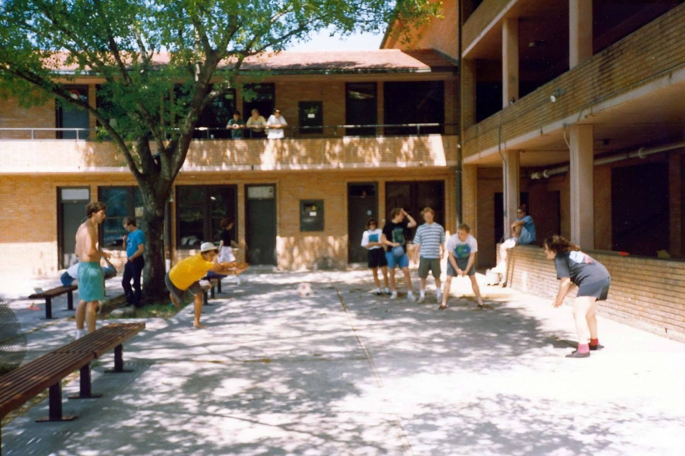
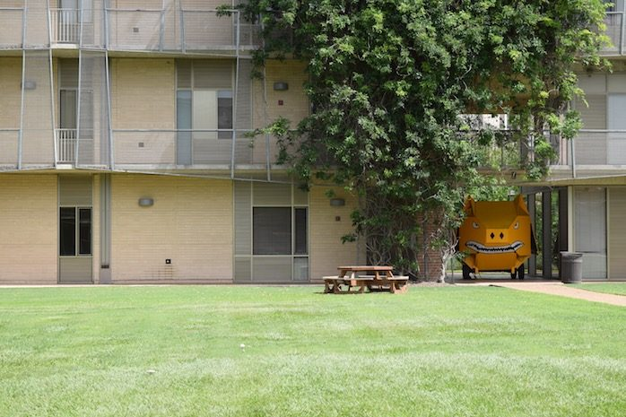
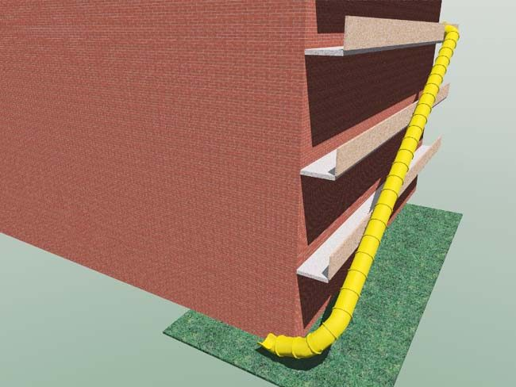

# The Acabowl

The Acabowl is the Wiess courtyard—"Equivalent areas are termed 'quads' in other colleges, but that's just 'cause they suck" [@handbook-1994]. In Old Wiess it was the western of two courtyards, the patio where four-square was played and TGs held, with the quieter Backabowl behind the central wing [@handbook-1994]. The 1994 Freshman Handbook derives the name from an "Academic Bowl" football game played there annually in the 1960s, "in which reportedly only 'academs' had time to take part" [@handbook-1994]; the 1972 handbook already used the word in the plural, "large grassy acabowls" [@handbook-1972]. When the college moved in 2002 the new building's single courtyard inherited the name—"an enormous courtyard, still called the Acabowl after the old main courtyard" [@oweek-2006 p.37]—and the prefix kept breeding: Acatramp (1994), Acahammock (2003), Acaglider and Acagrill (2008), Acababy and Acatoddler (2014–17). The inflatable [War Pigs](../traditions/warpig.md) of the 1990s were built in the Old Wiess Acabowl, and the 2002 commercial pig flew in the new one [@warpig-core-deck slide 31] [@warpig-core-deck slide 32].

## Timeline

| When | What | Evidence |
|---|---|---|
| 1960s | "Academic Bowl," a football game played annually at the site, "in which reportedly only 'academs' had time to take part"—the handbook's etymology [@handbook-1994] | [R] |
| c.1960–65 | Photograph of students on the Acabowl benches and balcony rails, undated, "circa 1965" by consensus of the comments [@rhc 2016-05-24 hanging-out-at-wiess] | [R] |
| 1972 | Handbook: "the parking lots have been replaced by large grassy acabowls (courtyards suitable for touch football and other games). All rooms open directly onto these grassy areas or onto balconies overlooking them" [@handbook-1972] | [P] |
| 1994 | Glossary entries for Acabowl, Acatramp ("the purple and black trampoline majestically situated in the middle of the Acabowl") and Backabowl ("Where most of the amateur and shy sun-bathers can be found") [@handbook-1994] | [P] |
| 1994 | Foursquare: "Wiess' traditional game, played on the Acabowl court for hours on end. An exceptionally skillful volley series is described as 'Good Fourplay.' I don't recall ever seeing anyone play this during my three years…" [@handbook-1994] | [P] |
| mid-1990s | Photographs of War Pig construction in the Old Wiess Acabowl, including the black pig lettered "I'M PISSED" [@warpig-core-deck slide 30] [@warpig-core-deck slide 31] | [P] |
| 1997 | "Four-square in the Acabowl" listed among Traditions We'd Sure Like To See Continue [@riceinfo-traditions-1997]; still there in the 1999 revision [@riceinfo-traditions-1999] | [P] |
| 1999 | Photo pages: the Acabowl is "home to a volleyball court, a few barbeque pits, some benches, and in general all of the outdoor social events of Wiess College"; a wooden swing added to the Acabowl "just about a year ago" [@wb 20020116233355 http://riceinfo.rice.edu:80/projects/colleges/wiess/college/photos/acabowl.html] [@wb 20020615221715 http://riceinfo.rice.edu:80/projects/colleges/wiess/college/photos/backabowl.html] | [P] |
| 2001-12 | New Wiess dedication plan: "Giant Yellow Slip and Slide in acabowl around 4:00" [@wb 20011212095214 http://teamwiess.com:80/wiess_dedication.html] | [P] |
| 2002 | The orange commercial War Pig flying tethered in the New Wiess Acabowl [@warpig-core-deck slide 32] | [P] |
| 2002-09-29 | Photo of the Week: "Proposed Wiess Acaslide" [@wb 20021013235815 http://www.teamwiess.com:80/pow.html] | [P] |
| 2003 | "Instead of two courtyards to split the college, Wiess now has an enormous Acabowl" [@wb 20040416083807 http://www.teamwiess.com/oweek/35-44%20wiess.pdf p.3]; glossary adds Acahammock and shortens Acatramp to "A trampoline, in the Acabowl" [@oweek-2003 p.3] | [P] |
| 2008 | Acaglider ("Giant swinging covered picnic table of glory") and Acagrill enter the glossary [@oweek-2008 part 7 p.3]; both arrived in 2008 through alumni donations and the Capital Improvements Rep [@oweek-2010 p.39] | [P] |
| 2014 | Glossary: "The Wiess courtyard/quad"; Acababy ("Gavin! … often found playing in the acabowl") [@oweek-2014 p.102] | [P] |
| 2015 | "The exterior hallways that were (and are) the pulse of the college still remain, but since moving to New Wiess, we've also added the Acaglider, the Acagrills and, most recently, the Acahammock" [@oweek-2015 p.10] | [R] |
| 2016-05-25 | An alumnus of the 1970s on the new building: "there is a large quad in the center for outdoor activities. I believe they even call it the Acabowl" [@rhc 2016-05-24 hanging-out-at-wiess comment by Krammit, 25 May 2016] | [T] |
| 2017-11 | 60th anniversary events "in the Wiess Commons and Wiess Acabowl" [@wiess-60th-faq-2017 p.4] | [P] |
| 2019 | Glossary: "**Acabowl** The Wiess courtyard/quad. People commonly hang out, play frisbee or football, and study here, especially on nice days"; "**Acagliders** The two giant, covered, swinging picnic tables of glory"; "**Acagrills**"; "**Acatramp** The trampoline located in the Acabowl" (its last appearance); history: "the Acagliders, the Acagrills, and, most recently, the Acahammock" [@oweek-2019 p.14] [@oweek-2019 p.13] | [P] |
| 2021 | Acatramp gone from the glossary (it "died out for safety reasons" [@testimony-mullen-2026-10-05c Acatramp]; see [The Acatramp](../traditions/retired/acatramp.md)); the history drops the Acahammock ("the Acagliders and the Acagrills"); Proxy Cab's "mattress jousting… with pool noodles on air mattresses in the Acabowl" [@oweek-2021 p.18] [@oweek-2021 p.17] [@oweek-2021 p.37] | [P] |
| 2024–2025 | No Acabowl entry in the glossary, the first book since 1994 without one; the courtyard survives in the history ("an enormous courtyard, still called the Acabowl after the old main courtyard") and in TFFW, College Night and the RAs' grandchildren who "like to run around in the Acabowl" [@oweek-2024 p.25] [@oweek-2024 p.24] [@oweek-2024 p.30] | [P] |

## As the college described it

!!! quote "1972 Freshman Handbook"
    "Fortunately, the parking lots have been replaced by large grassy acabowls (courtyards suitable for touch football and other games)." [@handbook-1972]

!!! quote "1994 Freshman Handbook"
    "**Acabowl.** The westernmost courtyard of the College. Specifically, the patio area where 'four-square' is played, TG's are held, etc. Equivalent areas are termed 'quads' in other colleges, but that's just 'cause they suck. (From 'Academic Bowl,' a football game played annually at the site during the 1960's, in which reportedly only 'academs' had time to take part.)"—"**Backabowl.** The playing field opposite the Acabowl between the singles wing and the three story wing." [@handbook-1994]

!!! quote "O-Week Book 2003"
    "**Acabowl.** 1. The Wiess courtyard. The social epicenter of Wiess, which frequently features people hanging out, playing soccer and studying." [@oweek-2003 p.3]

!!! quote "O-Week Book 2006"
    "The additions of wings to the original design split the college into two sections, each with their own courtyard and personality: the Acabowl where the action was, and the Backabowl, where a quieter atmosphere prevailed for sunbathing or studying." [@oweek-2006 p.36]

!!! quote "O-Week Book 2008"
    "**Acaglider.** 1. Giant swinging covered picnic table of glory, in the Acabowl." [@oweek-2008 part 7 p.3]

!!! quote "O-Week Book 2015"
    "**Acabowl.** The Wiess courtyard/quad. The social epicenter of Wiess, where people commonly hang out, play frisbee or football, and study." [@oweek-2015 p.118]

The full run of Aca- entries, year by year, is in [How we described ourselves, by year](../traditions/glossary-series.md).

## Photographs

<!-- GALLERY:acabowl -->

<figure markdown="span">
  { loading=lazy data-title="Four-square on the paved court of the Old Wiess Acabowl, 1991 (date from the file name), balconies behind." data-description="Historian&#x27;s photo collection; source not recorded · 1991" data-gallery="acabowl" }
  <figcaption>Four-square on the paved court of the Old Wiess Acabowl, 1991 (date from the file name), balconies behind. <small>Historian&#x27;s photo collection; source not recorded [@handbook-1994]</small></figcaption>
</figure>

<figure markdown="span">
  { loading=lazy data-title="The New Wiess Acabowl: lawn, a picnic table and the ivy-hung wing." data-description="teamwiess.com, &#x27;New students: rooms&#x27;, 2017 · by 2017" data-gallery="acabowl" }
  <figcaption>The New Wiess Acabowl: lawn, a picnic table and the ivy-hung wing. <small>teamwiess.com, &#x27;New students: rooms&#x27;, 2017 [@wb 20170714224834 http://teamwiess.com/newstudents/rooms/acabowl.jpg]</small></figcaption>
</figure>

<figure markdown="span">
  { loading=lazy data-title="A rendering of a spiral slide from an upper balcony down to the lawn. Compare the 2002 &#x27;Proposed Wiess Acaslide&#x27;." data-description="Historian&#x27;s photo collection; source not recorded · undated" data-gallery="acabowl" }
  <figcaption>A rendering of a spiral slide from an upper balcony down to the lawn. Compare the 2002 'Proposed Wiess Acaslide'. <small>Historian&#x27;s photo collection; source not recorded [@wb 20021013235815 http://www.teamwiess.com:80/pow.html]</small></figcaption>
</figure>

<!-- /GALLERY:acabowl -->

## Variants & disputes

- **The etymology.** "Academic Bowl" is the only origin story in the corpus, and the 1994 handbook itself hedges it ("reportedly") [@handbook-1994]. The 2003 O-Week book says Dr. Bill "will have the answer" to "where the name 'acabowl' came from" [@wb 20040619001755 http://www.teamwiess.com/oweek/01-14%20intro.pdf p.8]—his answer was never written down in anything we hold. The word is at least as old as the 1972 handbook [@handbook-1972].
- **Backabowl or Bacabowl.** The 1994 glossary spells it Backabowl [@handbook-1994]; the 1999 photo page is headed "The Bacabowl Ledge" [@wb 20020615221715 http://riceinfo.rice.edu:80/projects/colleges/wiess/college/photos/backabowl.html]. In the new building the back terrace is "Backaterrace" in 2003 [@oweek-2003 p.3], "Acaterrace" from 2006 [@oweek-2006 p.83], and "Bacaterrace" (the fourth-floor balcony) from 2014 [@oweek-2014 p.102]. In 2026 usage the fourth-floor balcony is "Toke", the Acaterrace a small terrace by UpCo, and "Bacaterrace" Hanszen's name for the servery roof [@testimony-mullen-2026-10-05b terraces]. The names are sorted out year by year, with what the Bacabowl is now, on [The terraces and the Bacabowl](terraces.md).
- **What was played there.** Four-square (1994, 1997, 1999); soccer (2003–2014); frisbee or football (2015–17) [@handbook-1994] [@oweek-2003 p.3] [@oweek-2015 p.118]. The 1994 glossarist admits never having seen four-square played; the 1997 and 1999 webmasters still listed it as a tradition worth keeping [@riceinfo-traditions-1997] [@riceinfo-traditions-1999].
- **The Acahammock.** In the glossary from 2003 to 2010 [@oweek-2003 p.3] [@oweek-2010 p.90], absent in 2011 and 2014, then "most recently, the Acahammock" in the 2015 history [@oweek-2015 p.10] and still in 2019, dropped in 2021 [@oweek-2019 p.13] [@oweek-2021 p.17]—a replacement, not a first.
- **Trampoline colours.** "Purple and black" in 1994 [@handbook-1994]; no later source gives a colour.

## Open questions

- Any contemporary trace of the 1960s "Academic Bowl" game—the Thresher or Campanile of the 1960s would settle whether it existed and whether the name came from it.
- When the Acatramp first appeared (before 1994), and whether the trampoline in the new Acabowl is a continuous institution or a replacement.
- The Old Wiess Acabowl photographs in the War Pig deck are dated only "mid-1990s" [@warpig-core-deck slide 30]; the people in them could date them.

Last reviewed 2026-10-04 by unreviewed · [Edit this page](#)

