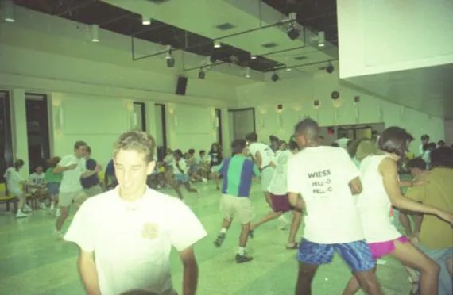
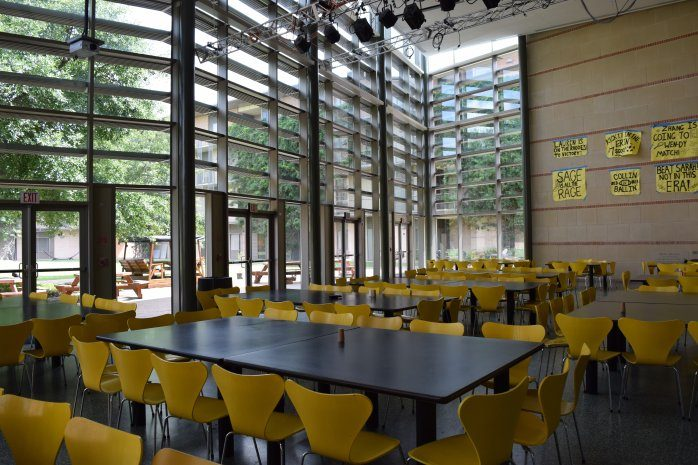
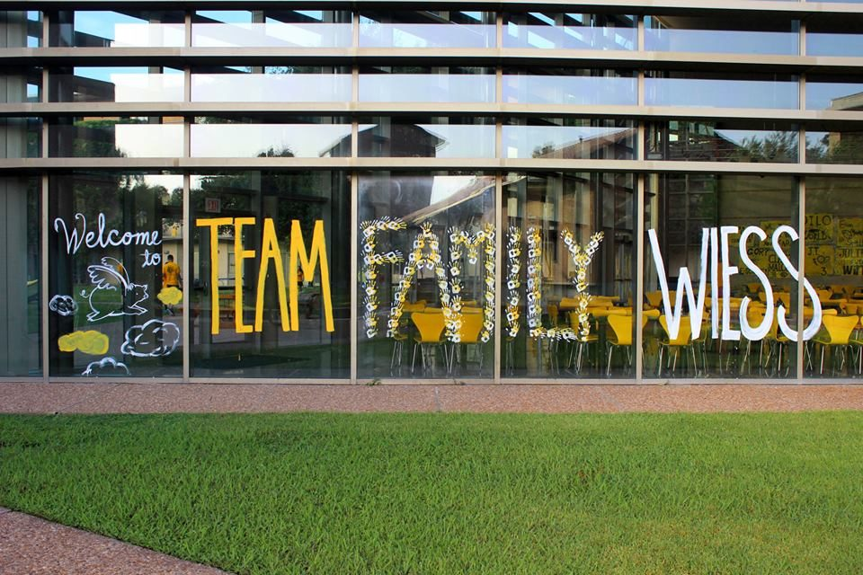
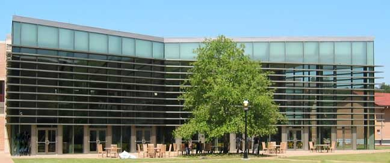

# The Commons and UpCo

The Commons is the college's dining hall and its largest room, and it has always been more than a place to eat: "The place to be. You will eat here, study here, act here, play here, party here, hangout here and well, live here," in every O-Week glossary from 2003 to 2017 [@oweek-2003 p.3] [@oweek-2017 p.14]. Old Wiess got its Commons when the dormitory became a college in 1957 [@delany-about-wiess-2002]; it was enlarged in the mid-1970s with a mezzanine and a wall of windows [@rhc 2016-03-07 barbara-jordan-1977 comment by Krammit, 7 Mar 2016], and by 1994 it was "Reputed as the best room for a BIG party on campus", the scene of NOD and of Tabletop, with the Private Dining Room (PDR) beside it [@handbook-1994]. The New Wiess Commons, designed by Machado and Silvetti, faces the Acabowl. It shares South Servery with Hanszen's dining hall, and the servery's roof is a terrace [@machado-silvetti-wiess] [@rice-facilities-first-100-years]. Since 2003 its second floor, the **Upper Commons**, has been where Cabinet meets [@wb 20040416083807 http://www.teamwiess.com/oweek/35-44%20wiess.pdf p.4]. "UpCo" is that room: the 2021 O-Week book glosses it "UpCo (Wiess upper commons)" [@oweek-2021 p.63], and the college's 2023 list of representatives has an UpCo representative [@wiess-rice-edu-representatives-2023]. The TEAM / FAMILY / WIESS banners hang in the Commons (see [Team Wiess](../traditions/team-wiess.md#the-banners)), and since 2021 the glossary's Acaterrace has been "The terrace connecting the second floor and the Upper Commons" [@oweek-2021 p.18]; the building's other shared rooms are on [Rooms and spaces of New Wiess](rooms-and-spaces.md). The PDR has held "pictures of all our former Masters" since at least 2014 [@oweek-2014 p.46].

## Timeline

| When | What | Evidence |
|---|---|---|
| 1949 | The dormitory opened with "a small lobby that was later known as the Outer Commons" [@wb 20040416083807 http://www.teamwiess.com/oweek/35-44%20wiess.pdf p.2] | [R] |
| c.1957 | "The new commons area and master's house, built as part of the conversion from dorm to college, broke from the motel motif" [@delany-about-wiess-2002]; "Wiess received its Commons as well as a huge addition" [@wb 20040416083807 http://www.teamwiess.com/oweek/35-44%20wiess.pdf p.2] | [R] |
| 1967-01 | Muhammad Ali photographed in the Wiess Commons wearing a Wiess tie, with the Thresher's report of the visit [@rhc 2013-03-11 muhammad-ali-in-the-wiess-commons] | [P] |
| c.1974 | Commons remodelled one summer: "greatly enlarged to include a mezzanine recreation area. One side was pushed out and enclosed in large windows"; said to be a class project by two Wiess architecture students; furniture chosen by the Master [@rhc 2016-03-07 barbara-jordan-1977 comment by Krammit, 7 Mar 2016] | [T] |
| 1977 (spring) | Barbara Jordan speaks in "the old Wiess Commons" [@rhc 2016-03-07 barbara-jordan-1977]; "I was there… It was Wiess Commons" [@rhc 2016-03-07 barbara-jordan-1977 comment by Kathleen Boyd, 7 Mar 2016] | [P] |
| 1970s | "It really was decorated in purple and lime green" [@rhc 2016-03-07 barbara-jordan-1977 comment by Walter Underwood, 7 Mar 2016]; "purple and green… some yellow in there, too" [@rhc 2016-03-07 barbara-jordan-1977 comment by Marty Merritt, 8 Mar 2016] | [T] |
| 1994 | Glossary: Commons, PDR ("Smaller room to the east of the Commons"), Black and Gold ("the main reason for the color scheme in the Commons"); KBG kitchen and foosball in the outer commons [@handbook-1994] | [P] |
| 1998-01 | The webmaster wants a picture of Harry Wiess "besides the portrait in the Commons" [@wb 19980131012133 http://riceinfo.rice.edu/projects/colleges/wiess/college/index.html] | [P] |
| 1999 | Cabinet meets "alternating Wednesdays in the outer commons"; a bulletin board in the Outer Commons [@wb 19990219085339 http://riceinfo.rice.edu/projects/colleges/wiess/people/cabinet.html] | [P] |
| 1999-10-05 | Groundbreaking "at the site of the new Wiess Commons", on a former intramural field south of Old Wiess and west of Hanszen [@rice-news-1999-10-14-groundbreaking] | [P] |
| 2000-05 | A 3-D model of the new building on display in the PDR; the new commons is to be finished first and "borrowed" by Hanszen in 2000–01 [@riceinfo-news-2000-lundin] | [P] |
| 2002 | The South Servery complex: the Wiess Commons, the Hanszen Commons, and "South servery surmounted by a large public terrace overlooking the nearby playing fields" [@rice-facilities-first-100-years]; "A new dining hall defines one edge of the courtyard" [@machado-silvetti-wiess] | [R] |
| 2003 | Glossary: Commons "The place to be"; PDR "A smaller room attached to the Commons. Used for studying and as a dressing room during Tabletop productions" [@oweek-2003 p.3] [@oweek-2003 p.4]; Cabinet "every other Wednesday night in the Upper Commons" [@wb 20040416083807 http://www.teamwiess.com/oweek/35-44%20wiess.pdf p.4] | [P] |
| 2006 | Map: the Commons with "1: Sue's Office / 2: Upper Commons" and the PDR beside it [@oweek-2006 p.15]; the same layout on the 2010 and 2014 maps [@oweek-2010 p.14] [@oweek-2014 p.14] | [P] |
| 2009-08 | teamwiess.com: "a joke that the architect who designed this had some basic geometry issues… it doesn't stop us from loving our glass living space"; Tabletop takes over the Commons for its final weeks; "a massive projection screen" [@wb 20090827020025 http://teamwiess.com/areas.php]; the PDR "this bastion of historical Wiess relics" [@wb 20090827015957 http://teamwiess.com/rooms.php] | [P] |
| 2009-08-26 | Cabinet discusses refitting a storage room, including "fixing the pool table and moving it to the upper commons" [@wb 20090903015953 http://teamwiess.com/cabinetminutes.php] | [P] |
| 2014 | "Wiess is home to the largest commons on campus"; a piano; "Most big events at Wiess, such as NOD, Salsa Night, and even our Superbowl watching party, are held in the Commons"; the PDR has "pictures of all our former Masters, and a lot of old Campanile's" [@oweek-2014 p.46] | [P] |
| 2014 | Glossary: "Upper Commons. 2nd floor of the commons. Has a pool table, ping pong table, TV, and lots of couches"; the PDR entry loses its Tabletop clause [@oweek-2014 p.103] | [P] |
| 2015 | Upper Commons adds a foosball table [@oweek-2015 p.119]; the Commons has "shockingly effective sound muffling" [@oweek-2015 p.21]; same text 2016–17 [@oweek-2017 p.15] [@oweek-2017 p.30] | [P] |
| 2017-11 | 60th-anniversary events "in the Wiess Commons and Wiess Acabowl… The Commons is building 52 on the current Rice campus map" [@wiess-60th-faq-2017 p.4] | [P] |
| 2019 | "Wiess is home to the largest commons on campus… Most big events at Wiess, such as NOD, Jazz Night, and even our Super Bowl watch party, are held right here"; the PDR is "frequented by the A-Team and the Rice Philharmonics… pictures of all our former Magisters… Try to find pictures of Drs. Schaefers as students!"; the Cozy Corner, "extremely comfortable couches, a large goldenrod rug, a small table, and several napping OC students"; Cabinet meets "in the Upper Commons or Large Classroom"; map "2: Upper Commons" over "1: Ewart's Office" [@oweek-2019 p.30] [@oweek-2019 p.14] [@oweek-2019 p.25] [@oweek-2019 p.28] | [P] |
| 2021 | **"UpCo" in print**: a Fellow is found "chilling in UpCo (Wiess upper commons)"—the earliest written use found [@oweek-2021 p.63]; the PDR "frequented by the A-Team and Rice's various acapella groups" [@oweek-2021 p.35]; Upper Commons in the glossary for the last time [@oweek-2021 p.19] | [P] |
| 2023-09 | "UpCo" as a written word: an UpCo representative on the college's list of representatives [@wiess-rice-edu-representatives-2023] | [P] |
| 2024–2025 | The glossary's "Commons" becomes "**Commons Culture**. The place to be. You will eat here, study here, act here, play here, party here, hang out here, and well, live here"; the Commons now hosts "Most large events at Wiess" (NOD gone from the sentence); UpCo in Fellows' profiles ("playing pool or Tetris", "grinding out CS projects") and, in 2025, the home of the neon "Team Family Wiess" sign, a Proxy Cab prize [@oweek-2024 p.25] [@oweek-2024 p.11] [@oweek-2024 p.46] [@oweek-2024 p.47] [@oweek-2025 p.38] | [P] |
| 2025 | The RAs "eat dinner in the Commons most days around 5:30"; Tabletop plays "take place in our very own Commons!!" [@oweek-2025 p.32] [@oweek-2025 p.38] | [P] |

## As the college described it

!!! quote "1994 Freshman Handbook"
    "**Commons.** Main eating room at Wiess (and most other colleges). Has been known for its unusual color schemes throughout history (the current decor is apparently much better than what it used to be...). Reputed as the best room for a BIG party on campus. Scene of the infamous 'Night of Decadence', as well as Tabletop productions and most other college functions. Also used as a group study area most weeknights."—"**PDR.** Private Dining Room. Smaller room to the east of the Commons, recently a few years ago [*sic*]. Used for luncheon meetings, quiet study at night, and as the dressing-room for Tabletop productions." [@handbook-1994]

!!! quote "1972 Freshman Handbook"
    "Centralized functions such as the commons and Lounge reinforce the sense of community vital to a residential college." [@handbook-1972]

!!! quote "O-Week Book 2003"
    "**Commons.** 1. The place to be. You will eat here, study here, act here, play here, party here, hangout here and well, live here." [@oweek-2003 p.3]

!!! quote "teamwiess.com, 'Areas', 2009"
    "The Commons are a general hangout for Wiessmen—whether digging into a cinammon roll or doing homework in the wee hours of the morning, there is always at least one friendly face sitting at one of these tables." [@wb 20090827020025 http://teamwiess.com/areas.php]

!!! quote "O-Week Book 2015"
    "Wiess is home to the largest commons on campus, which means lots of space and shockingly effective sound muffling. Bask in the sunlight streaming from our huge windows while eating lunch with fellow Wiessmen, or find a quiet table to study late at night." And the PDR: "There's a lot of Wiess history in here, including pictures of all our former Masters, and a lot of old Campanile books as well. Try to find pictures of Dr. Byrd as a student!" [@oweek-2015 p.21]

!!! quote "O-Week Book 2015"
    "**Upper Commons.** Second floor of the Commons, featuring a pool table, ping pong table, foosball table, TV, and lots of couches." [@oweek-2015 p.119]

The glossary entries year by year: [Commons](../traditions/glossary-series.md#commons), [PDR](../traditions/glossary-series.md#pdr), [Upper Commons](../traditions/glossary-series.md#upper-commons).

!!! quote "O-Week Book 2021"
    "…you can find her chilling in UpCo (Wiess upper commons)…" [@oweek-2021 p.63]—the first "UpCo" in the record, glossed for the reader.

## Customs

Small habits of the Commons and the servery that no calendar records, as far as the written record shows them.

### Square tables

A 2017 photograph on the college website shows square tables set in pairs with chairs on all four sides [@wb 20170714224839 http://teamwiess.com/newstudents/rooms/commons.jpg] [P]. The custom that goes with them is **cornering**, pulling up an extra chair at a table's corner, defined in every glossary from 2003 to 2025 [@oweek-2003 conclusions p.3] [@oweek-2025 p.26] [P]. Both are told on [Formal Dinner, waiting and long tables](../traditions/retired/formal-dinner.md#square-tables).

### Friday music

Friday music at Wiess has been a job since at least 2016, when an O-Week Fellow's profile gave him "the high-pressure job of being Wiess' resident Friday music player, taking your requests and waking you up at 4 am on Beer Bike" [@oweek-2016 p.58] [P]. TFFW, the Friday-afternoon gathering in the Acabowl, has opened its description since 2016 with "It's Friday! There's music on the stacks" [@oweek-2016 p.31] ("There is music playing the stacks", 2025 [@oweek-2025 p.39]) [P] (see [TFFW](../traditions/tffw.md)). The college's representatives list of 2023 has three Music representatives, without a description of their job [@wb 20230114021659 http://teamwiess.com/government/representatives] [P]. The custom is not Wiess's alone in kind: in 2006 the O-Week book's guide to the other colleges said Brown's "speakers blast Happy Friday music all over the north side" on Friday afternoons [@oweek-2006 p.53] [P].

## Photographs

<!-- GALLERY:commons -->

<figure markdown="span">
  { loading=lazy data-title="Jello Night in the Old Wiess Commons, c.1996 (date and event from the file name)." data-description="TFWKB photo collection; source not recorded · c.1996" data-gallery="commons" }
  <figcaption>Jello Night in the Old Wiess Commons, c.1996 (date and event from the file name). <small>TFWKB photo collection; source not recorded</small></figcaption>
</figure>

<figure markdown="span">
  { loading=lazy data-title="The New Wiess Commons: long tables, yellow chairs, the glass wall onto the Acabowl." data-description="teamwiess.com, &#x27;New students: rooms&#x27;, 2017 · by 2017" data-gallery="commons" }
  <figcaption>The New Wiess Commons: long tables, yellow chairs, the glass wall onto the Acabowl. <small>teamwiess.com, &#x27;New students: rooms&#x27;, 2017 [@wb 20170714224839 http://teamwiess.com/newstudents/rooms/commons.jpg]</small></figcaption>
</figure>

<figure markdown="span">
  { loading=lazy data-title="TEAM FAMILY WIESS painted across the Commons windows, with &#x27;Welcome&#x27; beside it." data-description="teamwiess.com, &#x27;acapics&#x27;, by 2019 · by 2019" data-gallery="commons" }
  <figcaption>TEAM FAMILY WIESS painted across the Commons windows, with 'Welcome' beside it. <small>teamwiess.com, &#x27;acapics&#x27;, by 2019 [@wb 20190928044413 http://teamwiess.com/acapics/family.jpg]</small></figcaption>
</figure>

<figure markdown="span">
  { loading=lazy data-title="The New Wiess Commons from the Acabowl lawn: two storeys of glass behind a sunscreen, a tree in front." data-description="TFWKB photo collection; source not recorded · undated (after 2002)" data-gallery="commons" }
  <figcaption>The New Wiess Commons from the Acabowl lawn: two storeys of glass behind a sunscreen, a tree in front. <small>TFWKB photo collection; source not recorded</small></figcaption>
</figure>

<!-- /GALLERY:commons -->

## Variants & disputes

- **Is UpCo the Upper Commons?** Yes. The corpus has "Upper Commons" from 2003 [@wb 20040416083807 http://www.teamwiess.com/oweek/35-44%20wiess.pdf p.4] to 2017 [@oweek-2017 p.15]; the short form appears as an "UpCo" representative in 2023 [@wiess-rice-edu-representatives-2023], and the 2021 O-Week book glosses it "UpCo (Wiess upper commons)" [@oweek-2021 p.63]. It is not a separate room, so it has no page of its own.
- **Two commons in Old Wiess, or one?** 1994 has a "Commons" and an "outer commons" (KBG, foosball) [@handbook-1994]; the 1999 Cabinet met in "the outer commons" [@wb 19990219085339 http://riceinfo.rice.edu/projects/colleges/wiess/people/cabinet.html]. The 2003 history makes the Outer Commons the original 1949 lobby and the Commons a 1957 addition [@wb 20040416083807 http://www.teamwiess.com/oweek/35-44%20wiess.pdf p.2]; from 2006 the books say "a small Commons" in 1949 and "a second Commons area" added later [@oweek-2006 p.36]. These fit if the 1949 lobby became the outer commons and the 1957 dining room the Commons.
- **When was the mezzanine built?** "Probably 1974", by memory [@rhc 2016-03-07 barbara-jordan-1977 comment by Krammit, 7 Mar 2016]. A plaque dated 1975 appears among Delany's 2002 photographs of the building; see [Old Wiess](old-wiess.md#open-questions).
- **colors.** Purple and lime green in the 1970s (two independent memories) [@rhc 2016-03-07 barbara-jordan-1977 comment by Walter Underwood, 7 Mar 2016]; black and gold by 1994, "the main reason for the color scheme in the Commons" [@handbook-1994].
- **Magister portraits: Commons or PDR?** Every source that places the Masters' pictures puts them in the PDR, 2014–17 [@oweek-2014 p.46] [@oweek-2017 p.30]. The only portrait the corpus places in the Commons itself is the one of Harry Wiess, in Old Wiess, 1998 [@wb 19980131012133 http://riceinfo.rice.edu/projects/colleges/wiess/college/index.html]. If the portraits now hang in the Commons, that is a change since 2017 that no source records.
- **"Largest commons on campus."** A claim the books make from 2014 [@oweek-2014 p.46]. Kirksey gives Hanszen's new dining hall as 13,000 sq ft and gives no figure for Wiess's [@kirksey-wiess].

## Open questions

- When "UpCo" came into use: between 2017, when the books still write "Upper Commons" in full [@oweek-2017 p.15], and summer 2021, when the O-Week book uses and glosses it [@oweek-2021 p.63]; an UpCo representative is listed in September 2023 [@wiess-rice-edu-representatives-2023].
- Where the PDR's portraits of the Masters came from, and whether they include the Magisters since 2017.
- Where the Old Wiess portrait of Harry Wiess went in 2002. The groundbreaking report promised that "medallions, plaques and original cornerstone" would move to the new building, but it does not mention portraits [@rice-news-1999-10-14-groundbreaking].
- Did Hanszen use the new Wiess Commons in 2000–01, as planned [@riceinfo-news-2000-lundin]?
- Who plays the Friday servery music now (the Music representatives? the servery staff?), and when it moved from the Acabowl stacks into the servery, if it did.
- The 2009 "geometry issues" joke points to "Dr. Dodds… for some great stories about the design of New Wiess" [@wb 20090827020025 http://teamwiess.com/areas.php]. Those stories are not recorded.

Last reviewed 2026-10-05 by unreviewed · [Edit this page](#)

