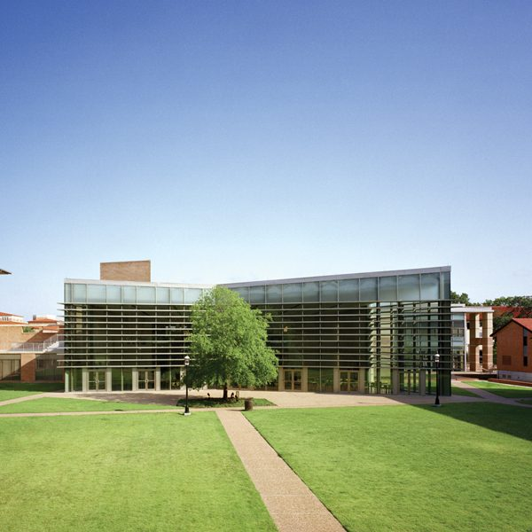
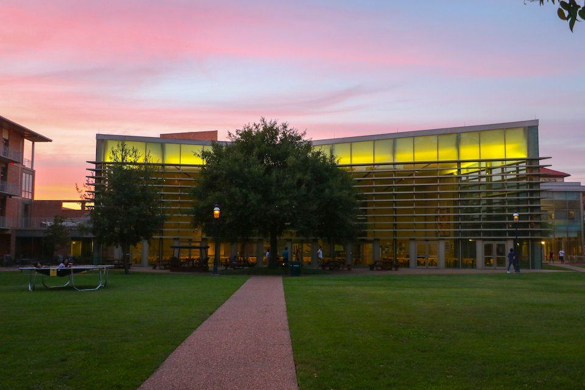
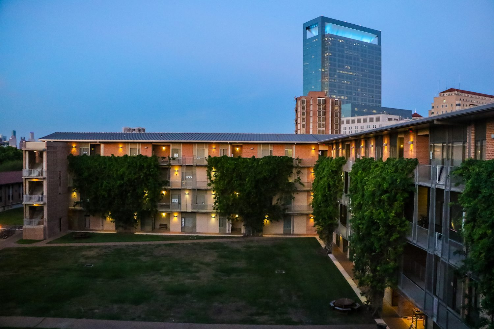
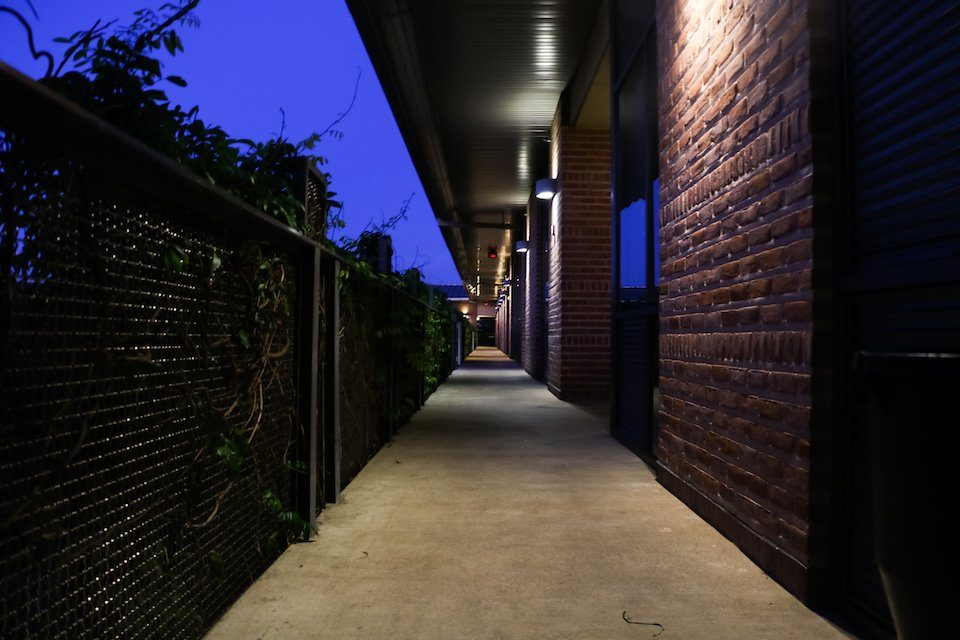
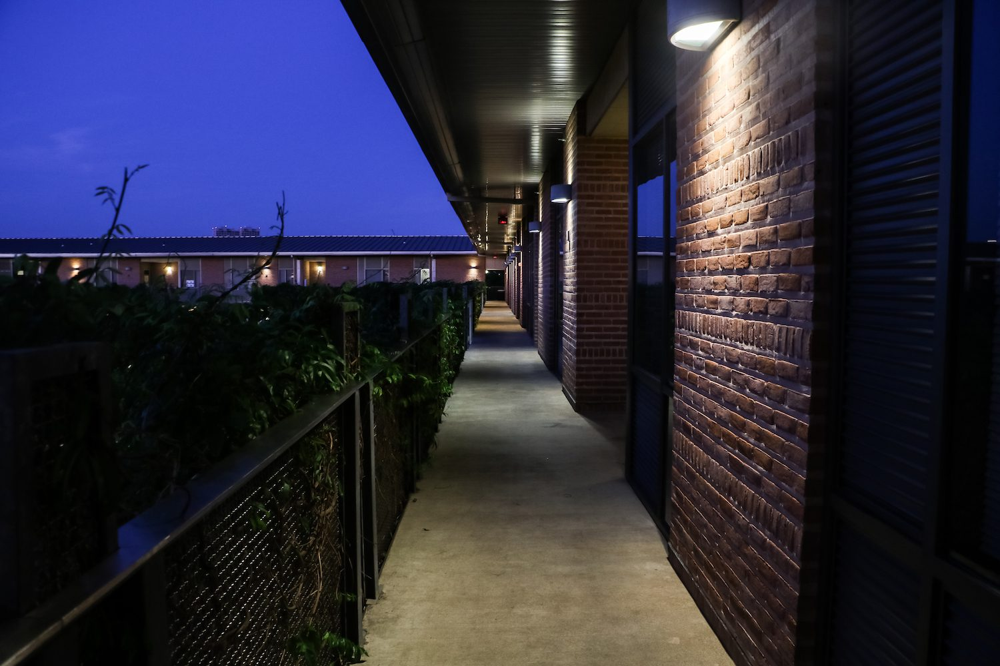
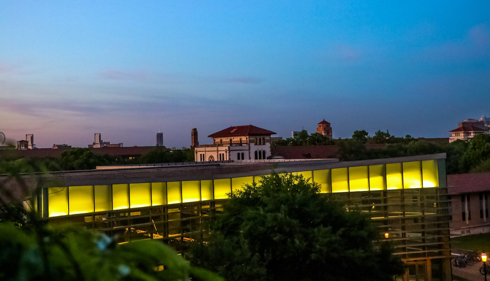
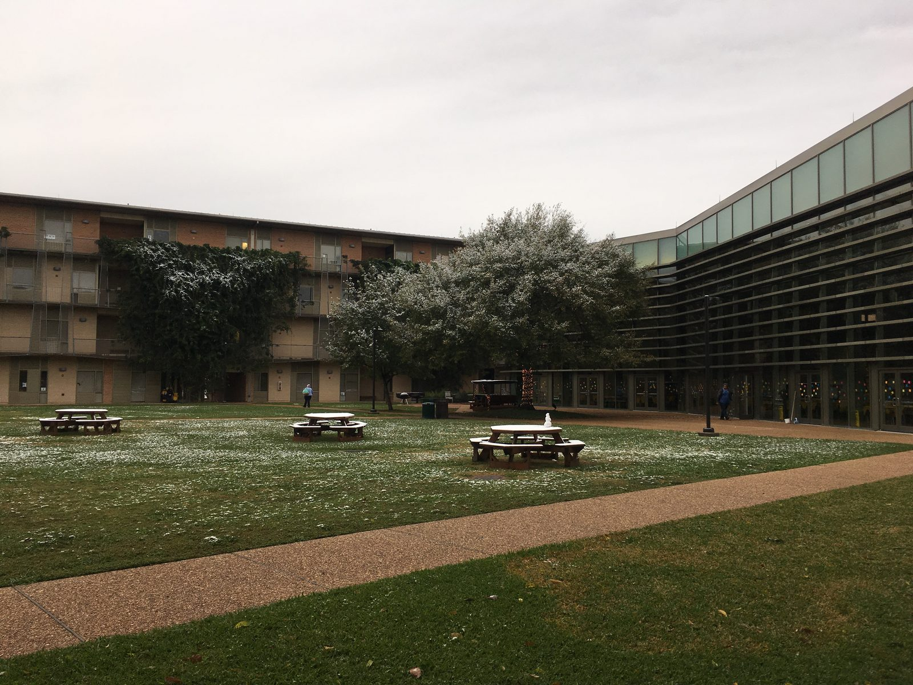

# New Wiess (2002–)

New Wiess sits "immediately south of 'Old Wiess', in what used to be the Wiess/Hanszen parking lot" [@wiess-60th-faq-2017 p.4]. Students fought to keep what they loved about the old place, and they won.

!!! abstract "TL;DR"
    - Ground broke on 5 October 1999. The building opened in fall 2002 [@riceinfo-news-2000-lundin] [@wb 20040416083807 http://www.teamwiess.com/oweek/35-44%20wiess.pdf p.3].
    - Wiessmen pushed for five years to keep the outdoor hallways, balconies and one big courtyard, and got them [@riceinfo-news-2000-lundin].
    - Designed by Machado and Silvetti (Boston), with Kirksey (Houston). It won a design award in 2004 [@machado-silvetti-wiess] [@kirksey-wiess].
    - About 228–230 beds around a courtyard still called [the Acabowl](acabowl.md) [@machado-silvetti-wiess] [@kirksey-wiess] [@oweek-2006 p.37].

## Keeping the good parts

For about five years, Wiessmen lobbied Rice. Single-loaded hallways, outside balconies and a big public courtyard were "crucial elements to any future home for the Wiess community" [@riceinfo-news-2000-lundin]. The new design kept all three.

The O-Week books put it simply: "We made sure to bring all the cool parts of Old Wiess (our old building) over" [@oweek-2006 p.35]. "And we kept the exterior hallways that were (and are) the pulse of the college" [@oweek-2010 p.39].

## Building it

Ground broke on 5 October 1999 [@riceinfo-news-2000-lundin]. Fences and utility tunnels followed in 2000. The plan said move-in by January 2002 [@riceinfo-news-2000-lundin]. The O-Week books say it "opened in the fall of 2002" [@wb 20040416083807 http://www.teamwiess.com/oweek/35-44%20wiess.pdf p.3].

The 2001 dedication planners had big ideas: "Have both war pigs flying first thing in the morning!" [@wb 20011212095214 http://teamwiess.com:80/wiess_dedication.html]. One fan wanted a torch relay ending with someone who "lights an arrow on fire and then launches it to set a 40 foot torch on fire, or something like that?" [@wb 20011212095214 http://teamwiess.com:80/wiess_dedication.html].

## What it looks like

The dorm wraps three sides of the courtyard. Open-air hallways are "shaded by ivy-covered metal screens" [@machado-silvetti-wiess]. The fourth side is the new [Commons](commons.md), which shares a servery with Hanszen, topped by a public terrace [@machado-silvetti-wiess].

Kirksey called it "the first new dormitory in 25 years," at 163,500 square feet [@kirksey-wiess]. The bed count differs by two: the designers say 228, the project architect says 230 [@machado-silvetti-wiess] [@kirksey-wiess]. The Boston Society of Architects gave it a Design Excellence in Housing award in 2004 [@machado-silvetti-wiess]. Photos from 2017 show the vines in full growth [@wb 20170714224834 http://teamwiess.com/newstudents/rooms/acabowl.jpg]. We haven't found what happened to them since.

Inside: [Rooms and spaces of New Wiess](rooms-and-spaces.md). Up top, including the balcony called Toke: [The terraces](terraces.md). Next door: the Magisters' [Wilson House](wilson-house.md).

## Photographs

<!-- GALLERY:newwiess -->

<figure markdown="span">
  { loading=lazy data-title="The Commons across the Acabowl lawn and path." data-description="teamwiess.com, 2016 · by 2016" data-gallery="newwiess" }
  <figcaption>The Commons across the Acabowl lawn and path. <small>teamwiess.com, 2016 [@wb 20160506224855 http://teamwiess.com/res/rescolleges.jpg]</small></figcaption>
</figure>

<figure markdown="span">
  { loading=lazy data-title="The Commons lit up at dusk, seen from the Acabowl." data-description="teamwiess.com, &#x27;acapics&#x27;, 2017 · by 2017" data-gallery="newwiess" }
  <figcaption>The Commons lit up at dusk, seen from the Acabowl. <small>teamwiess.com, &#x27;acapics&#x27;, 2017 [@wb 20170602224647 http://teamwiess.com/acapics/pink.jpg]</small></figcaption>
</figure>

<figure markdown="span">
  { loading=lazy data-title="A residential wing over the Acabowl at dusk, ivy on its screens, a tower beyond." data-description="TFWKB photo collection; source not recorded · undated" data-gallery="newwiess" }
  <figcaption>A residential wing over the Acabowl at dusk, ivy on its screens, a tower beyond. <small>TFWKB photo collection; source not recorded</small></figcaption>
</figure>

<figure markdown="span">
  { loading=lazy data-title="An open-air corridor behind the ivy-covered metal screens, at dusk." data-description="teamwiess.com, &#x27;acapics&#x27;, 2017 · by 2017" data-gallery="newwiess" }
  <figcaption>An open-air corridor behind the ivy-covered metal screens, at dusk. <small>teamwiess.com, &#x27;acapics&#x27;, 2017 [@wb 20170602224650 http://teamwiess.com/acapics/darkhall.jpg]</small></figcaption>
</figure>

<figure markdown="span">
  { loading=lazy data-title="Another corridor at dusk: brick on one side, screen and ivy on the other." data-description="teamwiess.com, &#x27;acapics&#x27;, 2017 · by 2017" data-gallery="newwiess" }
  <figcaption>Another corridor at dusk: brick on one side, screen and ivy on the other. <small>teamwiess.com, &#x27;acapics&#x27;, 2017 [@wb 20170602225337 http://teamwiess.com/acapics/dark-aisle.jpg]</small></figcaption>
</figure>

<figure markdown="span">
  { loading=lazy data-title="The glazed upper storey of the Commons at dusk, seen from an upper floor." data-description="TFWKB photo collection; source not recorded · undated" data-gallery="newwiess" }
  <figcaption>The glazed upper storey of the Commons at dusk, seen from an upper floor. <small>TFWKB photo collection; source not recorded</small></figcaption>
</figure>

<figure markdown="span">
  { loading=lazy data-title="Snow on the Acabowl lawn and picnic tables." data-description="teamwiess.com, &#x27;acapics&#x27;, by February 2018 · by 2018-02" data-gallery="newwiess" }
  <figcaption>Snow on the Acabowl lawn and picnic tables. <small>teamwiess.com, &#x27;acapics&#x27;, by February 2018 [@wb 20180223224559 http://teamwiess.com/acapics/snow.jpg]</small></figcaption>
</figure>

<!-- /GALLERY:newwiess -->

??? info "The receipts: timeline"

    | When | What | Evidence |
    |---|---|---|
    | c.1995–2000 | "Many Wiessmen have worked hard over the past five years to persuade the Rice administration" that single-loaded corridors, external balconies and a large public courtyard were "crucial elements to any future home for the Wiess community" [@riceinfo-news-2000-lundin] | [P] |
    | 1999-10-05 | "The official groundbreaking of the future Wiess College site" [@riceinfo-news-2000-lundin]; photograph of Dr. Bill Wilson with Magisters John and Paula Hutchinson at the groundbreaking [@rhc 2017-11-17 friday-follies-cheers] | [P] |
    | 1999-11-16 | Construction fence round the field and parking lot [@riceinfo-news-2000-lundin] | [P] |
    | 2000-01 | Fences from the Backabowl to Hanszen; utility tunnels in "Phase 1", working from the Backabowl toward the Acabowl [@riceinfo-news-2000-lundin] | [P] |
    | 2000-05 | A 3-D model on display in the PDR; the new commons to be finished first and "borrowed" by Hanszen in 2000–01; completion scheduled December 2001, move-in January 2002 [@riceinfo-news-2000-lundin] | [P] |
    | 2001-12 | Dedication planning page on teamwiess.com, dated "Sept. 7 2002 \| New Wiess": "Have both war pigs flying first thing in the morning!"; a slip-and-slide in the Acabowl; the Hutchinsons, Dan and Katharine, Bill Barnett and President Gillis to cut the ribbon; a time capsule [@wb 20011212095214 http://teamwiess.com:80/wiess_dedication.html] | [P] |
    | 2002 | Design architects' project date; Kirksey: "the first new dormitory in 25 years", 163,500 sf, 230 beds [@machado-silvetti-wiess] [@kirksey-wiess] | [P] |
    | 2002-08 | Old Wiess "still standing, but abandoned" [@delany-about-wiess-2002] | [P] |
    | 2002 (fall) | "This new building opened in the fall of 2002… Instead of two courtyards to split the college, Wiess now has an enormous Acabowl" [@wb 20040416083807 http://www.teamwiess.com/oweek/35-44%20wiess.pdf p.3] | [R] |
    | 2002 | Dedication of the new building: photograph of PJ Abrams '92, Dr. Bill Wilson and Dr. Stan Dodds there [@rhc 2014-11-19 wiess-college-luminaries] | [R] |
    | 2003 | Glossary: "Backaterrace. The terrace behind the Commons that we unfortunately have to share with Hanszen" [@oweek-2003 p.3] | [P] |
    | 2004 | Design Excellence in Housing award, Boston Society of Architects [@machado-silvetti-wiess] | [P] |
    | 2008 | Rooms page: suites of doubles (20'×10'), singles (10'×10'), 3-mans, 5-mans and quads round a common room and bathroom; two Gigabit ports per student [@wb 20080625214656 http://teamwiess.com/index.php?r=rooms] | [P] |
    | 2008 | "In 2008 the Acagrill and Acaglider found their home at Wiess thanks to donations from generous Wiess alumni and our hardworking Capital Improvements Rep and president" [@oweek-2010 p.39] | [R] |
    | 2010 | Sparky's reopens as "the newly renovated fourth floor hangout space" [@oweek-2010 p.91] | [P] |
    | 2011 | Wilson House dedicated as the Magisters' house (see [Wiess House / Wilson House](wilson-house.md)) [@wiess-60th-faq-2017 p.4] | [R] |
    | 2014 | Glossary: the Acaterrace is now one "that we share with Hanszen"; "Bacaterrace: The Fourth Floor balcony. Great spot to hang out or watch the sunset" [@oweek-2014 p.102] | [P] |
    | 2017-11 | 60th anniversary: "All 60th Anniversary events are in the Wiess Commons and Wiess Acabowl… The Commons is building 52 on the current Rice campus map" [@wiess-60th-faq-2017 p.4] | [P] |

??? info "The receipts: the vines"

    | When | What | Evidence |
    |---|---|---|
    | 2002 | Design: "open-air corridors shaded by ivy-covered metal screens along three courtyard walls" (Machado and Silvetti; Design Excellence in Housing award, 2004) [@machado-silvetti-wiess] | [P] |
    | by 2017 | Photographs on teamwiess.com show the vines in full growth: the "ivy-hung wing" over the Acabowl lawn, and the corridors at dusk, "screen and ivy on the other" side [@wb 20170714224834 http://teamwiess.com/newstudents/rooms/acabowl.jpg] [@wb 20170602224650 http://teamwiess.com/acapics/darkhall.jpg] [@wb 20170602225337 http://teamwiess.com/acapics/dark-aisle.jpg]; see the photographs below | [P] |

??? quote "In the college's own words"

    "Instead of two courtyards to split the college, Wiess now has an enormous Acabowl. A gorgeous Commons, plenty of space to hang out around the building and spacious buildings make the new Wiess digs the best on campus." — O-Week Book 2003 [@wb 20040416083807 http://www.teamwiess.com/oweek/35-44%20wiess.pdf p.3]

    "The architectural language, while contemporary, also takes cues from the historic character of the campus." — Machado and Silvetti [@machado-silvetti-wiess]

Last reviewed 2026-10-05 by unreviewed · [Edit this page](#)

