# Old Wiess (1949–2002)

Old Wiess was the college's home from 1949 to 2002: a W-shaped dorm of five wings, with outdoor balconies around two courtyards, the Acabowl and the Backabowl [@riceinfo-history] [@wb 19990501150106 http://riceinfo.rice.edu/projects/colleges/wiess/college/photos/index.html] [@oweek-2006 p.36]. It stood just north of [New Wiess](new-wiess.md) and was torn down after the move [@wiess-60th-faq-2017 p.4] [@edesigns-old-wiess-2002].

Nobody ever called Old Wiess pretty. Its own 1972 handbook said it was built "in the best motel tradition" [@handbook-1972]. But its balconies and courtyards made Wiess what it is, and students made sure the new building kept them [@riceinfo-news-2000-lundin].

!!! abstract "TL;DR"
    - Opened in 1949 as Rice's fourth dorm, named Wiess Hall in 1950 for trustee Harry Carothers Wiess [@riceinfo-history].
    - Became Wiess College in 1957, when Rice started the college system [@riceinfo-history].
    - Every room opened onto an outdoor balcony [@riceinfo-history].
    - Students moved to [New Wiess](new-wiess.md) in 2002. The old building was empty that August, then torn down [@edesigns-old-wiess-2002].

## A dorm shaped like a W

Old Wiess was "the first new dormitory in thirty-two years" at Rice. It had about 200 spaces, "outside balconies connecting all rooms," and "cross-ventilation (no rooms were then air-conditioned)" [@riceinfo-history]. Rooms were about 10 by 20 feet, in two-room suites sharing a bath [@riceinfo-rooms]. Every room had its own outside entrance, and no more than four men shared a bath. The walls were thin enough that "the term wall-mate was peculiar to Wiess" [@portal metapth245394 p.6].

"Wiess is shaped like a giant W," with five wings [@wb 19990501150106 http://riceinfo.rice.edu/projects/colleges/wiess/college/photos/index.html]. Wings added over the years split the college in two: "the Acabowl where the action was, and the Backabowl, where a quieter atmosphere prevailed" [@oweek-2006 p.36].

The [Commons](commons.md) and the Master's house came with the 1957 switch to a college [@delany-about-wiess-2002] [@portal metapth245394 p.6]. The basement held the laundry and the game room, [Sparky's](basement-and-sparkys.md) [@handbook-1994]. The Magisters (the professors who live next door and look after the college) lived in [Wiess House](wilson-house.md), "a small house attached to the college" [@riceinfo-masters].

In 1963–64 the center wing was enlarged with three storeys of suites, a music room, quarters for a resident faculty associate, and a basement with a library and game room [@portal metapth245396 p.14]. A patio with a terrace and barbecue followed in 1964–65, designed by the college president, architecture student Bill McGregor [@portal metapth245396 p.14]. Around the mid-1960s air-conditioning came in, and Room 228, a freshman room known as the Black Hole, was renamed the Handball Court [@portal metapth245396 p.14].

## "The best motel tradition"

The college never pretended. "Two generations of heavy use have done little to mute its intrinsic ugliness," said the 1972 handbook [@handbook-1972]. Still, it allowed "a degree of privacy and freedom which makes it possible for the members of Wiess to genuinely enjoy life at Rice" [@handbook-1972].

Rice's archivist agreed: "It looks to me, honestly, like a motel" [@rhc 2012-12-04 wiess-hall-construction-1949]. The O-Week books call it "the unique 'Motel 6' design" [@oweek-2006 p.36]. More on the nickname: [Building lore](lore.md).

## Why it came down

Was it temporary housing for the GI Bill crowd? "Like most Rice myths, this one sounds good enough to believe, but contains no actual truth. Old Wiess was built to last, and it did, though 2002" [@oweek-2006 p.37]. Delany saw it differently: "Thrown together quickly, Wiess was a maintenance nightmare" [@edesigns-old-wiess-2002]. A 1979 Thresher serial called it the newest of the pre-1957 dormitories, "hastily erected at the end of World War II" for the post-war influx [@portal metapth245394 p.6]. Both can be true: permanent, but cheap and fast.

But it had problems: "plumbing, electricity, or the foundation itself" [@riceinfo-news-2000-lundin]. By the '90s, "Old Wiess was literally sinking into the ground" [@oweek-2015 p.10]. Alum Colin Delany '91 said it was "too poorly constructed to be worth saving… It will be a good Wiess, but it won't be OUR Wiess" [@edesigns-old-wiess-2002].

## Wing by wing (1999) { #old-wiess-wing-by-wing-1999 }

The first Wiess website gave freshmen a photo tour, one wing at a time [@wb 19990501150106 http://riceinfo.rice.edu/projects/colleges/wiess/college/photos/index.html]. The Tennis Court Wing was "luxurious"; the Acabowl Ledge was the social one; the Bacabowl Ledge "a little bit quieter"; the Singles Wing "filled mostly with seniors" [@wb 20011112112601 http://riceinfo.rice.edu/projects/colleges/wiess/college/photos/tennis.html] [@wb 20020615221715 http://riceinfo.rice.edu/projects/colleges/wiess/college/photos/backabowl.html] [@wb 19991011005025 http://riceinfo.rice.edu/projects/colleges/wiess/college/photos/singles.html].

The three-storey Central Wing, "the tower," already had five-man suites and a presidential suite, just like New Wiess does now [@wb 19991011025731 http://riceinfo.rice.edu/projects/colleges/wiess/college/photos/tower.html] (see [Rooms and spaces](rooms-and-spaces.md)).

<!-- GALLERY:oldwiess1999 -->

<figure markdown="span">
  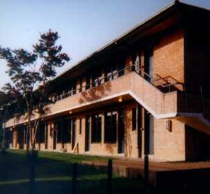{ loading=lazy data-title="The Tennis Court Wing, rooms 101–110 and 201–210; rooms 209–210 were the apartment of the Resident Associate, Dr. Stan Dodds." data-description="First Wiess website, &#x27;Pictures of Wiess Rooms&#x27; (set up by Head Fellow Chris Ruehl, 1998; text Ray Wagner, 1999) · 1998–1999" data-gallery="oldwiess1999" }
  <figcaption>The Tennis Court Wing, rooms 101–110 and 201–210; rooms 209–210 were the apartment of the Resident Associate, Dr. Stan Dodds. <small>First Wiess website, &#x27;Pictures of Wiess Rooms&#x27; (set up by Head Fellow Chris Ruehl, 1998; text Ray Wagner, 1999) [@wb 20011112112601 http://riceinfo.rice.edu/projects/colleges/wiess/college/photos/tennis.html]</small></figcaption>
</figure>

<figure markdown="span">
  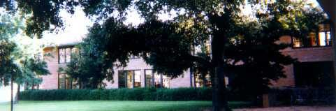{ loading=lazy data-title="The Tennis Court Wing from the Acabowl, with the bike rack on the right." data-description="First Wiess website, &#x27;Pictures of Wiess Rooms&#x27; (set up by Head Fellow Chris Ruehl, 1998; text Ray Wagner, 1999) · 1998–1999" data-gallery="oldwiess1999" }
  <figcaption>The Tennis Court Wing from the Acabowl, with the bike rack on the right. <small>First Wiess website, &#x27;Pictures of Wiess Rooms&#x27; (set up by Head Fellow Chris Ruehl, 1998; text Ray Wagner, 1999) [@wb 20011112112601 http://riceinfo.rice.edu/projects/colleges/wiess/college/photos/tennis.html]</small></figcaption>
</figure>

<figure markdown="span">
  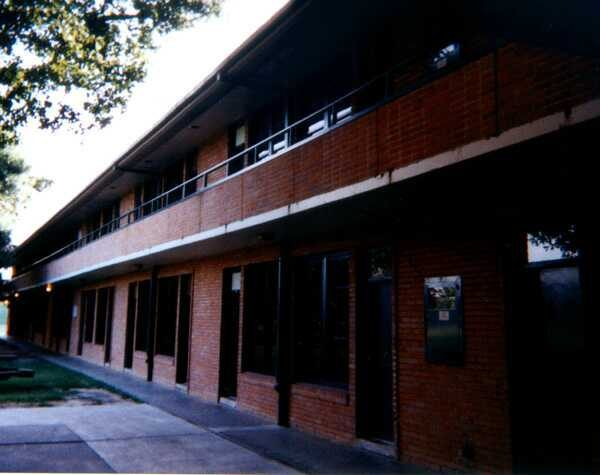{ loading=lazy data-title="The Acabowl Ledge, rooms 111–124: &quot;especially if it&#x27;s sunny, this ledge is one of the more active areas at Wiess.&quot;" data-description="First Wiess website, &#x27;Pictures of Wiess Rooms&#x27; (set up by Head Fellow Chris Ruehl, 1998; text Ray Wagner, 1999) · 1998–1999" data-gallery="oldwiess1999" }
  <figcaption>The Acabowl Ledge, rooms 111–124: "especially if it's sunny, this ledge is one of the more active areas at Wiess." <small>First Wiess website, &#x27;Pictures of Wiess Rooms&#x27; (set up by Head Fellow Chris Ruehl, 1998; text Ray Wagner, 1999) [@wb 20020116233355 http://riceinfo.rice.edu/projects/colleges/wiess/college/photos/acabowl.html]</small></figcaption>
</figure>

<figure markdown="span">
  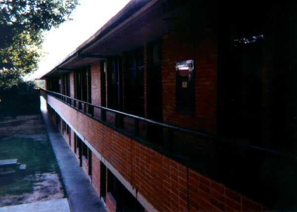{ loading=lazy data-title="The second-floor Acabowl hallway, rooms 211–224 (&quot;even the fire hose is in the same place&quot;)." data-description="First Wiess website, &#x27;Pictures of Wiess Rooms&#x27; (set up by Head Fellow Chris Ruehl, 1998; text Ray Wagner, 1999) · 1998–1999" data-gallery="oldwiess1999" }
  <figcaption>The second-floor Acabowl hallway, rooms 211–224 ("even the fire hose is in the same place"). <small>First Wiess website, &#x27;Pictures of Wiess Rooms&#x27; (set up by Head Fellow Chris Ruehl, 1998; text Ray Wagner, 1999) [@wb 20020116233355 http://riceinfo.rice.edu/projects/colleges/wiess/college/photos/acabowl.html]</small></figcaption>
</figure>

<figure markdown="span">
  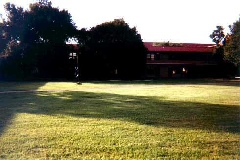{ loading=lazy data-title="The Acabowl ledges from the intramural fields; the Acabowl was &quot;home to a volleyball court, a few barbeque pits, some benches&quot;." data-description="First Wiess website, &#x27;Pictures of Wiess Rooms&#x27; (set up by Head Fellow Chris Ruehl, 1998; text Ray Wagner, 1999) · 1998–1999" data-gallery="oldwiess1999" }
  <figcaption>The Acabowl ledges from the intramural fields; the Acabowl was "home to a volleyball court, a few barbeque pits, some benches". <small>First Wiess website, &#x27;Pictures of Wiess Rooms&#x27; (set up by Head Fellow Chris Ruehl, 1998; text Ray Wagner, 1999) [@wb 20020116233355 http://riceinfo.rice.edu/projects/colleges/wiess/college/photos/acabowl.html]</small></figcaption>
</figure>

<figure markdown="span">
  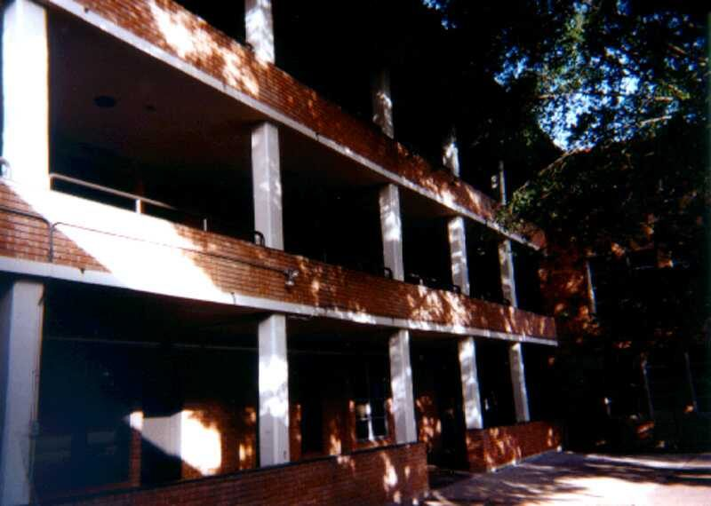{ loading=lazy data-title="The Middle Section, the only part of Old Wiess with a third floor: &quot;the tower&quot; (rooms 135–136, 235–236, 335 the computer room and 336 the presidential suite), with the five-man suites beside it." data-description="First Wiess website, &#x27;Pictures of Wiess Rooms&#x27; (set up by Head Fellow Chris Ruehl, 1998; text Ray Wagner, 1999) · 1998–1999" data-gallery="oldwiess1999" }
  <figcaption>The Middle Section, the only part of Old Wiess with a third floor: "the tower" (rooms 135–136, 235–236, 335 the computer room and 336 the presidential suite), with the five-man suites beside it. <small>First Wiess website, &#x27;Pictures of Wiess Rooms&#x27; (set up by Head Fellow Chris Ruehl, 1998; text Ray Wagner, 1999) [@wb 19991011025731 http://riceinfo.rice.edu/projects/colleges/wiess/college/photos/tower.html]</small></figcaption>
</figure>

<figure markdown="span">
  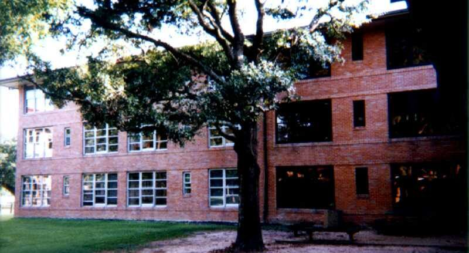{ loading=lazy data-title="The Middle Section from the Bacabowl side, rooms 134 (left) to 129 (right)." data-description="First Wiess website, &#x27;Pictures of Wiess Rooms&#x27; (set up by Head Fellow Chris Ruehl, 1998; text Ray Wagner, 1999) · 1998–1999" data-gallery="oldwiess1999" }
  <figcaption>The Middle Section from the Bacabowl side, rooms 134 (left) to 129 (right). <small>First Wiess website, &#x27;Pictures of Wiess Rooms&#x27; (set up by Head Fellow Chris Ruehl, 1998; text Ray Wagner, 1999) [@wb 19991011025731 http://riceinfo.rice.edu/projects/colleges/wiess/college/photos/tower.html]</small></figcaption>
</figure>

<figure markdown="span">
  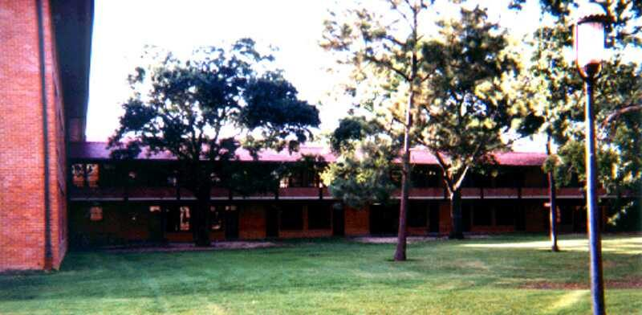{ loading=lazy data-title="The Bacabowl Ledge, rooms 137/237–148/248, &quot;generally a little bit quieter than the acabowl&quot;. Room 137 was a restroom, the &quot;O/C Bathroom&quot;." data-description="First Wiess website, &#x27;Pictures of Wiess Rooms&#x27; (set up by Head Fellow Chris Ruehl, 1998; text Ray Wagner, 1999) · 1998–1999" data-gallery="oldwiess1999" }
  <figcaption>The Bacabowl Ledge, rooms 137/237–148/248, "generally a little bit quieter than the acabowl". Room 137 was a restroom, the "O/C Bathroom". <small>First Wiess website, &#x27;Pictures of Wiess Rooms&#x27; (set up by Head Fellow Chris Ruehl, 1998; text Ray Wagner, 1999) [@wb 20020615221715 http://riceinfo.rice.edu/projects/colleges/wiess/college/photos/backabowl.html]</small></figcaption>
</figure>

<figure markdown="span">
  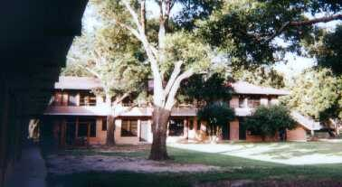{ loading=lazy data-title="The Singles Wing from the Bacabowl: &quot;filled mostly with seniors&quot;; Dr. Bill lived on the second floor, last room on the right." data-description="First Wiess website, &#x27;Pictures of Wiess Rooms&#x27; (set up by Head Fellow Chris Ruehl, 1998; text Ray Wagner, 1999) · 1998–1999" data-gallery="oldwiess1999" }
  <figcaption>The Singles Wing from the Bacabowl: "filled mostly with seniors"; Dr. Bill lived on the second floor, last room on the right. <small>First Wiess website, &#x27;Pictures of Wiess Rooms&#x27; (set up by Head Fellow Chris Ruehl, 1998; text Ray Wagner, 1999) [@wb 19991011005025 http://riceinfo.rice.edu/projects/colleges/wiess/college/photos/singles.html]</small></figcaption>
</figure>

<figure markdown="span">
  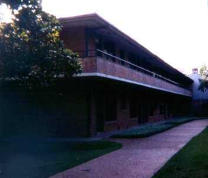{ loading=lazy data-title="The other side of the Singles Wing, facing Baker." data-description="First Wiess website, &#x27;Pictures of Wiess Rooms&#x27; (set up by Head Fellow Chris Ruehl, 1998; text Ray Wagner, 1999) · 1998–1999" data-gallery="oldwiess1999" }
  <figcaption>The other side of the Singles Wing, facing Baker. <small>First Wiess website, &#x27;Pictures of Wiess Rooms&#x27; (set up by Head Fellow Chris Ruehl, 1998; text Ray Wagner, 1999) [@wb 19991011005025 http://riceinfo.rice.edu/projects/colleges/wiess/college/photos/singles.html]</small></figcaption>
</figure>

<figure markdown="span">
  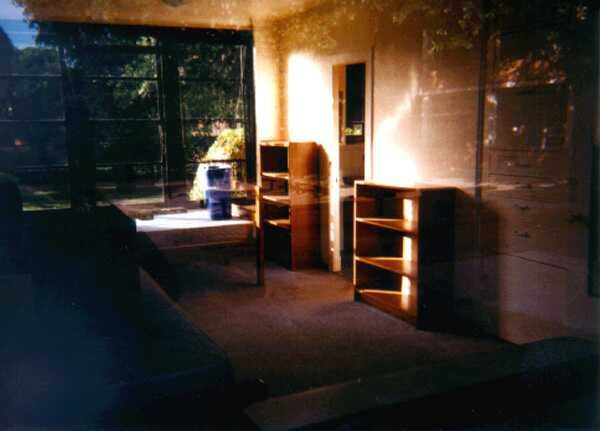{ loading=lazy data-title="&quot;A typical Wiess freshman room&quot;, shot through a window with the last exposure on the roll; about 20 by 15 feet." data-description="First Wiess website, &#x27;Pictures of Wiess Rooms&#x27; (set up by Head Fellow Chris Ruehl, 1998; text Ray Wagner, 1999) · 1998–1999" data-gallery="oldwiess1999" }
  <figcaption>"A typical Wiess freshman room", shot through a window with the last exposure on the roll; about 20 by 15 feet. <small>First Wiess website, &#x27;Pictures of Wiess Rooms&#x27; (set up by Head Fellow Chris Ruehl, 1998; text Ray Wagner, 1999) [@wb 19991011000933 http://riceinfo.rice.edu/projects/colleges/wiess/college/photos/frosh.html]</small></figcaption>
</figure>

<!-- /GALLERY:oldwiess1999 -->

??? info "The receipts: the five wings, as the 1999 site listed them"

    | Wing | Rooms | What the 1999 site says |
    |---|---|---|
    | Tennis Court Wing | 101–110, 201–210 | "Wiess's luxurious Tennis Court Wing separates the Acabowl from a group of tennis courts"; 209–210 were the RA apartment [@wb 20011112112601 http://riceinfo.rice.edu/projects/colleges/wiess/college/photos/tennis.html] |
    | Acabowl Ledge | 111–124, 211–224 | the most social ledge; room 224 had "the best buildup at Wiess" [@wb 20020116233355 http://riceinfo.rice.edu/projects/colleges/wiess/college/photos/acabowl.html] |
    | Central Wing ("the tower") | 129–136, 225–236, 325–336 | the only three-storey section; 335 the computer room, 336 the **presidential suite**; 225/226 and 325/326 the **"five-man" suites**; rooms 125–128 do not exist [@wb 19991011025731 http://riceinfo.rice.edu/projects/colleges/wiess/college/photos/tower.html] |
    | Bacabowl Ledge | 137–148, 237–248 | "a little bit quieter than the acabowl"; 137 is the "O/C Bathroom" [@wb 20020615221715 http://riceinfo.rice.edu/projects/colleges/wiess/college/photos/backabowl.html] |
    | Singles Wing | 149–160, 249–260 | "filled mostly with seniors"; Dr. Bill lived on the second floor, last room on the right [@wb 19991011005025 http://riceinfo.rice.edu/projects/colleges/wiess/college/photos/singles.html] |

## Photographs

<!-- GALLERY:oldwiess -->

<figure markdown="span">
  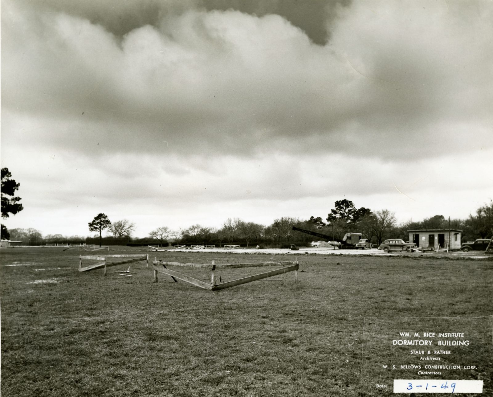{ loading=lazy data-title="1 March 1949: the site staked out with batter boards on open grass, a crane and site hut beyond. The label reads &#x27;Wm. M. Rice Institute Dormitory Building, Staub &amp; Rather, Architects, W. S. Bellows Construction Corp., Contractors&#x27;." data-description="Rice University, Woodson Research Center, via Rice History Corner · 1949-03-01" data-gallery="oldwiess" }
  <figcaption>1 March 1949: the site staked out with batter boards on open grass, a crane and site hut beyond. The label reads 'Wm. M. Rice Institute Dormitory Building, Staub & Rather, Architects, W. S. Bellows Construction Corp., Contractors'. <small>Rice University, Woodson Research Center, via Rice History Corner [@rhc 2012-12-04 wiess-hall-construction-1949]</small></figcaption>
</figure>

<figure markdown="span">
  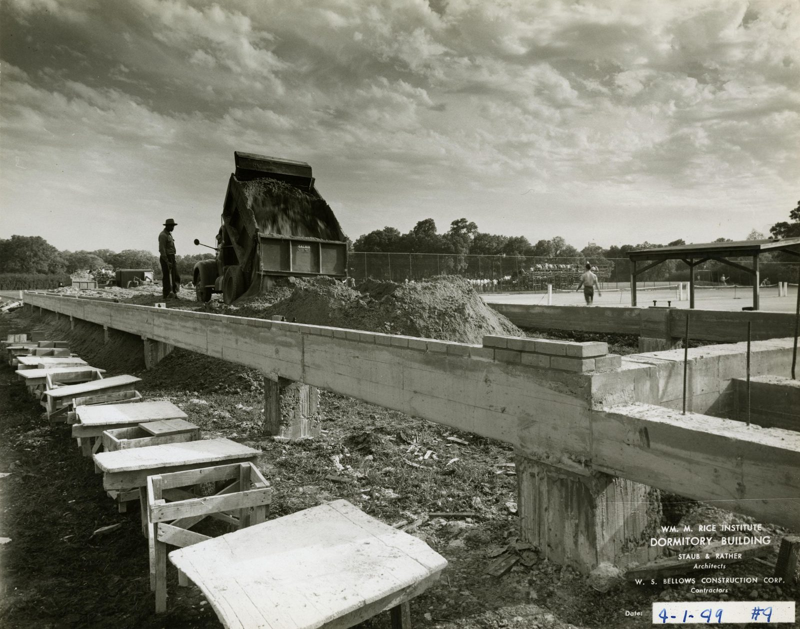{ loading=lazy data-title="1 April 1949: footings and forms, with a baseball game against A&amp;M in the background." data-description="Rice University, Woodson Research Center, via Rice History Corner · 1949-04-01" data-gallery="oldwiess" }
  <figcaption>1 April 1949: footings and forms, with a baseball game against A&M in the background. <small>Rice University, Woodson Research Center, via Rice History Corner [@rhc 2012-12-04 wiess-hall-construction-1949] [@rhc 2012-12-04 wiess-hall-construction-1949 comment by almadenmike, 5 Dec 2012]</small></figcaption>
</figure>

<figure markdown="span">
  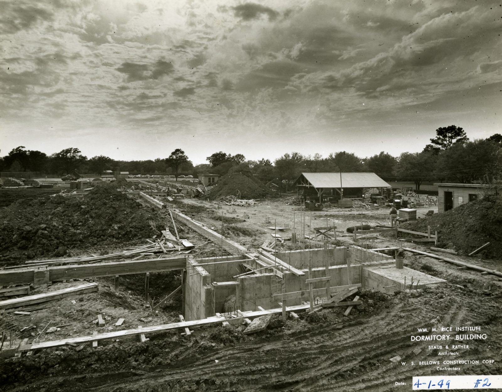{ loading=lazy data-title="1 April 1949 (no. 2): the foundation forms across the site." data-description="Rice University, Woodson Research Center, via Rice History Corner · 1949-04-01" data-gallery="oldwiess" }
  <figcaption>1 April 1949 (no. 2): the foundation forms across the site. <small>Rice University, Woodson Research Center, via Rice History Corner [@rhc 2012-12-04 wiess-hall-construction-1949]</small></figcaption>
</figure>

<figure markdown="span">
  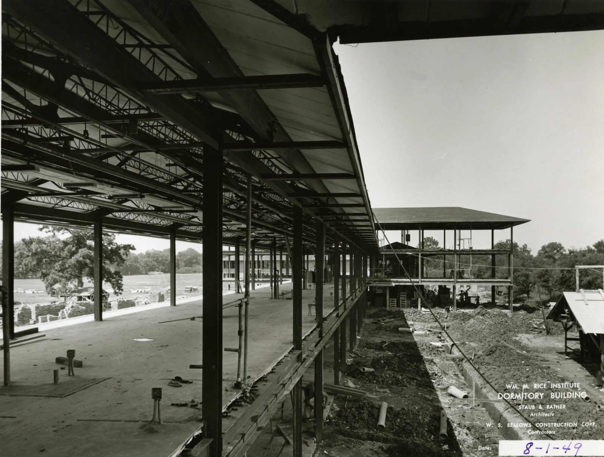{ loading=lazy data-title="1 August 1949: the steel frame of the walkway roofs." data-description="Rice University, Woodson Research Center, via Rice History Corner · 1949-08-01" data-gallery="oldwiess" }
  <figcaption>1 August 1949: the steel frame of the walkway roofs. <small>Rice University, Woodson Research Center, via Rice History Corner [@rhc 2012-12-04 wiess-hall-construction-1949]</small></figcaption>
</figure>

<figure markdown="span">
  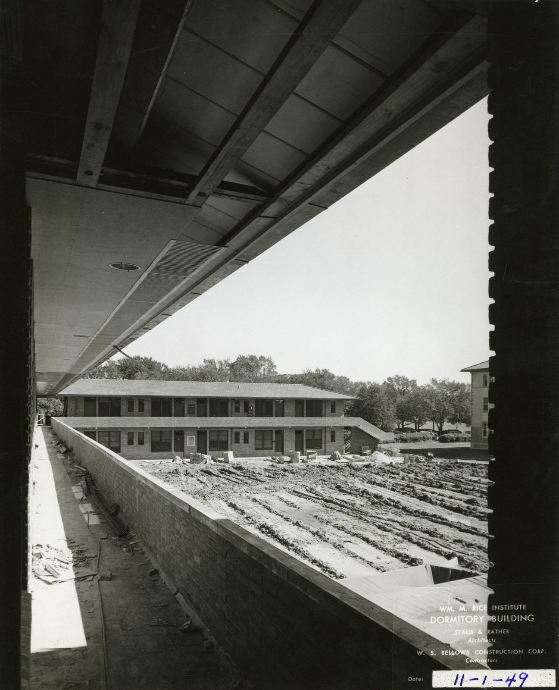{ loading=lazy data-title="1 November 1949: along a finished walkway." data-description="Rice University, Woodson Research Center, via Rice History Corner · 1949-11-01" data-gallery="oldwiess" }
  <figcaption>1 November 1949: along a finished walkway. <small>Rice University, Woodson Research Center, via Rice History Corner [@rhc 2012-12-04 wiess-hall-construction-1949]</small></figcaption>
</figure>

<figure markdown="span">
  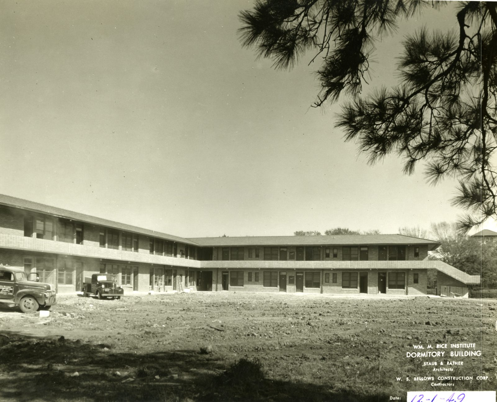{ loading=lazy data-title="1 December 1949: a two-storey wing complete, its balconies open to the yard; the ground still bare." data-description="Rice University, Woodson Research Center, via Rice History Corner · 1949-12-01" data-gallery="oldwiess" }
  <figcaption>1 December 1949: a two-storey wing complete, its balconies open to the yard; the ground still bare. <small>Rice University, Woodson Research Center, via Rice History Corner [@rhc 2012-12-04 wiess-hall-construction-1949]</small></figcaption>
</figure>

<figure markdown="span">
  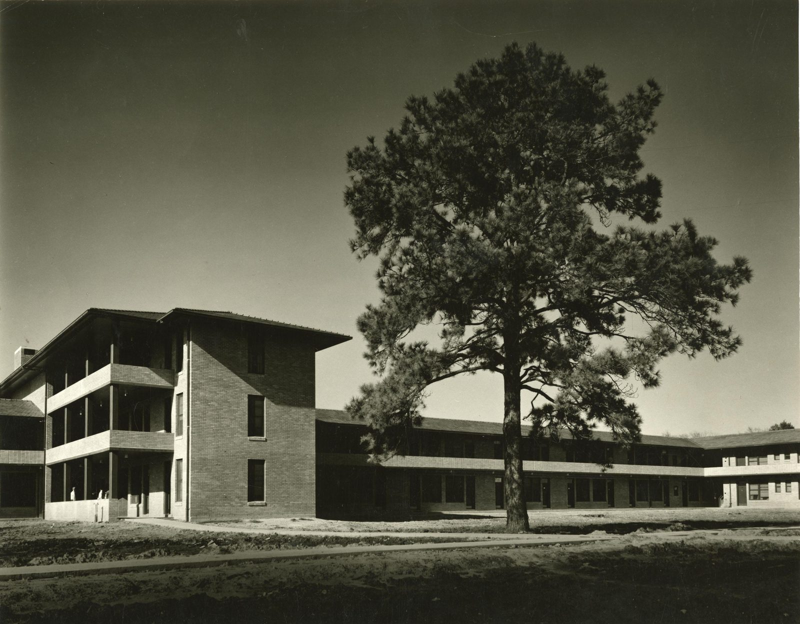{ loading=lazy data-title="&#x27;Wiess Hall completion&#x27;, 10 March 1950 (date from the file&#x27;s title): the finished building behind a lone pine." data-description="Rice University, Woodson Research Center, via Rice History Corner · 1950-03-10" data-gallery="oldwiess" }
  <figcaption>'Wiess Hall completion', 10 March 1950 (date from the file's title): the finished building behind a lone pine. <small>Rice University, Woodson Research Center, via Rice History Corner [@rhc 2012-12-04 wiess-hall-construction-1949]</small></figcaption>
</figure>

<figure markdown="span">
  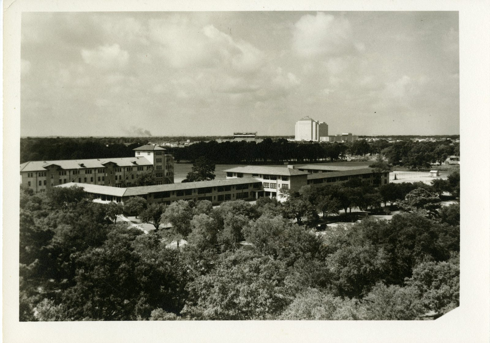{ loading=lazy data-title="Wiess and West Halls from above, 2 November 1950 (date and &#x27;gift of Pender Turnbull&#x27; from the file name)." data-description="TFWKB photo collection; source not recorded · 1950-11-02" data-gallery="oldwiess" }
  <figcaption>Wiess and West Halls from above, 2 November 1950 (date and 'gift of Pender Turnbull' from the file name). <small>TFWKB photo collection; source not recorded</small></figcaption>
</figure>

<figure markdown="span">
  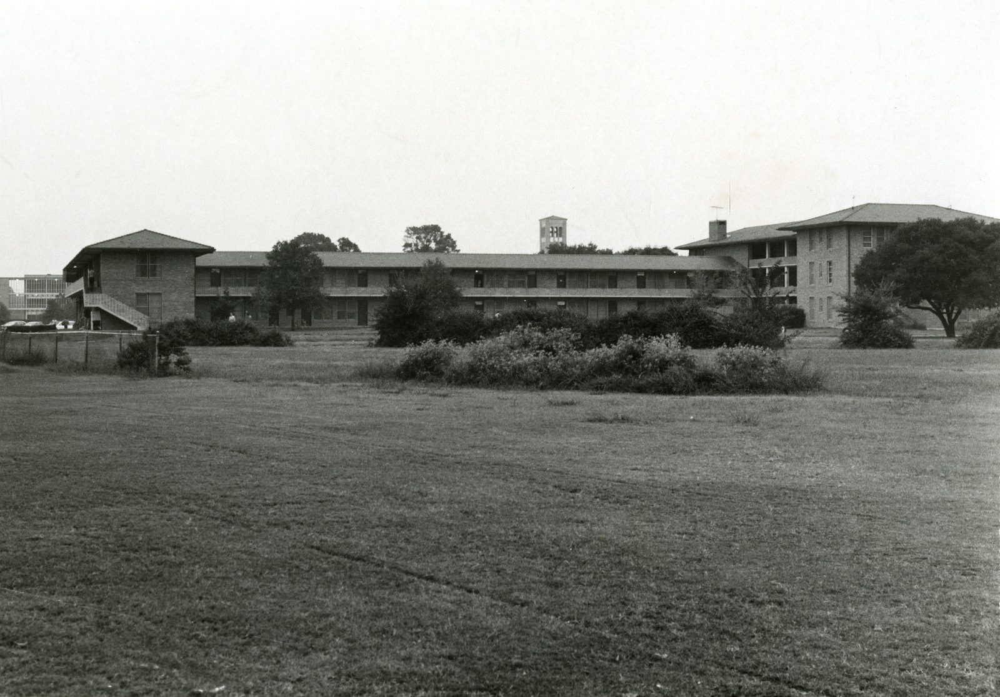{ loading=lazy data-title="Old Wiess College across an open field, September 1969 (date from the file name)." data-description="TFWKB photo collection; source not recorded · 1969-09" data-gallery="oldwiess" }
  <figcaption>Old Wiess College across an open field, September 1969 (date from the file name). <small>TFWKB photo collection; source not recorded</small></figcaption>
</figure>

<figure markdown="span">
  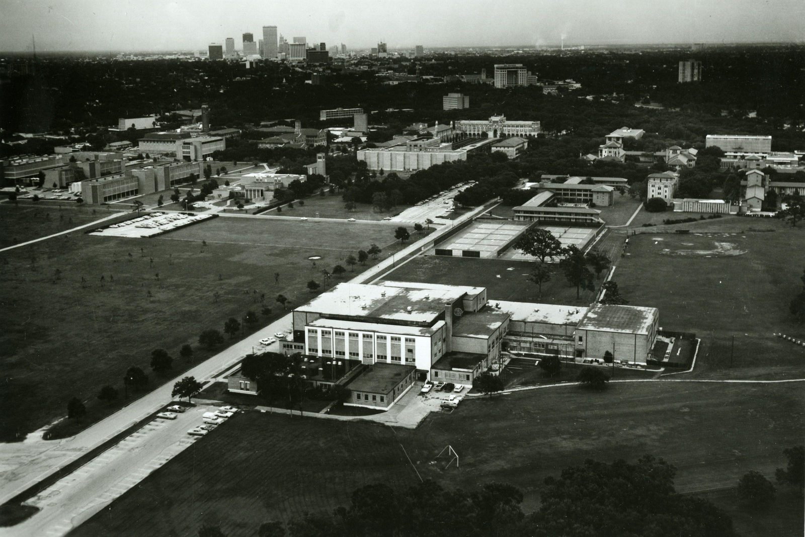{ loading=lazy data-title="Aerial view of the campus around the gymnasium, 1969 (date and subject from the file name); Old Wiess&#x27;s west wing stood next to the gym." data-description="TFWKB photo collection; source not recorded · 1969" data-gallery="oldwiess" }
  <figcaption>Aerial view of the campus around the gymnasium, 1969 (date and subject from the file name); Old Wiess's west wing stood next to the gym. <small>TFWKB photo collection; source not recorded [@riceinfo-history]</small></figcaption>
</figure>

<figure markdown="span">
  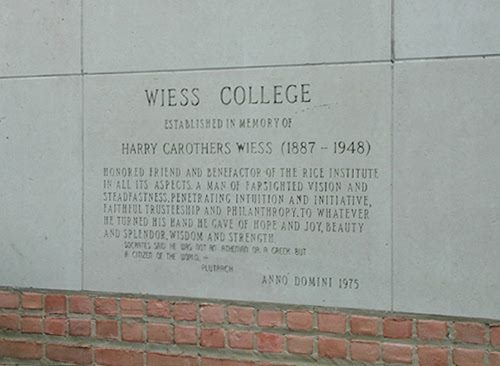{ loading=lazy data-title="The 1975 plaque: &#x27;Wiess College, established in memory of Harry Carothers Wiess (1887–1948)&#x27;, with the Plutarch line on Socrates. Transcribed on the Old Wiess page." data-description="Colin Delany &#x27;91, &#x27;wiess college | abandoned&#x27;, August 2002 · 2002-08" data-gallery="oldwiess" }
  <figcaption>The 1975 plaque: 'Wiess College, established in memory of Harry Carothers Wiess (1887–1948)', with the Plutarch line on Socrates. Transcribed on the Old Wiess page. <small>Colin Delany &#x27;91, &#x27;wiess college | abandoned&#x27;, August 2002 [@edesigns-old-wiess-2002]</small></figcaption>
</figure>

<figure markdown="span">
  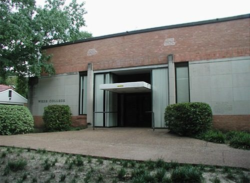{ loading=lazy data-title="The entrance under the WIESS COLLEGE lettering, abandoned, August 2002." data-description="Colin Delany &#x27;91, &#x27;wiess college | abandoned&#x27;, August 2002 · 2002-08" data-gallery="oldwiess" }
  <figcaption>The entrance under the WIESS COLLEGE lettering, abandoned, August 2002. <small>Colin Delany &#x27;91, &#x27;wiess college | abandoned&#x27;, August 2002 [@edesigns-old-wiess-2002]</small></figcaption>
</figure>

<figure markdown="span">
  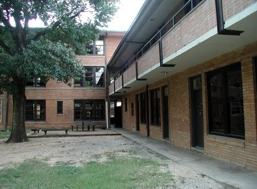{ loading=lazy data-title="Two storeys of rooms opening onto balconies over a courtyard, August 2002." data-description="Colin Delany &#x27;91, &#x27;wiess college | abandoned&#x27;, August 2002 · 2002-08" data-gallery="oldwiess" }
  <figcaption>Two storeys of rooms opening onto balconies over a courtyard, August 2002. <small>Colin Delany &#x27;91, &#x27;wiess college | abandoned&#x27;, August 2002 [@edesigns-old-wiess-2002]</small></figcaption>
</figure>

<figure markdown="span">
  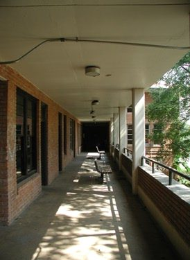{ loading=lazy data-title="An outdoor balcony walkway, August 2002: every Old Wiess room opened onto one." data-description="Colin Delany &#x27;91, &#x27;wiess college | abandoned&#x27;, August 2002 · 2002-08" data-gallery="oldwiess" }
  <figcaption>An outdoor balcony walkway, August 2002: every Old Wiess room opened onto one. <small>Colin Delany &#x27;91, &#x27;wiess college | abandoned&#x27;, August 2002 [@edesigns-old-wiess-2002]</small></figcaption>
</figure>

<figure markdown="span">
  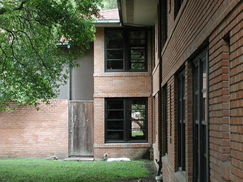{ loading=lazy data-title="&#x27;Between commons and backabowl&#x27; (Delany&#x27;s caption), August 2002." data-description="Colin Delany &#x27;91, &#x27;wiess college | abandoned&#x27;, August 2002 · 2002-08" data-gallery="oldwiess" }
  <figcaption>'Between commons and backabowl' (Delany's caption), August 2002. <small>Colin Delany &#x27;91, &#x27;wiess college | abandoned&#x27;, August 2002 [@edesigns-old-wiess-2002]</small></figcaption>
</figure>

<figure markdown="span">
  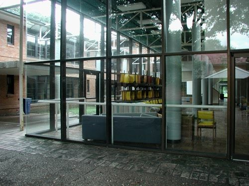{ loading=lazy data-title="A glass-walled common room with yellow chairs, seen from outside, August 2002." data-description="Colin Delany &#x27;91, &#x27;wiess college | abandoned&#x27;, August 2002 · 2002-08" data-gallery="oldwiess" }
  <figcaption>A glass-walled common room with yellow chairs, seen from outside, August 2002. <small>Colin Delany &#x27;91, &#x27;wiess college | abandoned&#x27;, August 2002 [@edesigns-old-wiess-2002]</small></figcaption>
</figure>

<figure markdown="span">
  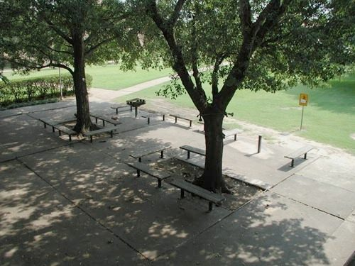{ loading=lazy data-title="A paved patio with benches under the trees, August 2002." data-description="Colin Delany &#x27;91, &#x27;wiess college | abandoned&#x27;, August 2002 · 2002-08" data-gallery="oldwiess" }
  <figcaption>A paved patio with benches under the trees, August 2002. <small>Colin Delany &#x27;91, &#x27;wiess college | abandoned&#x27;, August 2002 [@edesigns-old-wiess-2002]</small></figcaption>
</figure>

<figure markdown="span">
  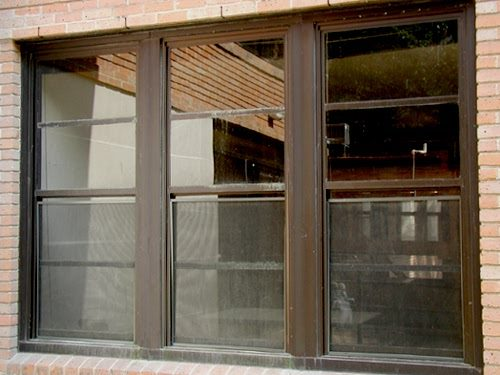{ loading=lazy data-title="Steel-framed windows in the brick, August 2002." data-description="Colin Delany &#x27;91, &#x27;wiess college | abandoned&#x27;, August 2002 · 2002-08" data-gallery="oldwiess" }
  <figcaption>Steel-framed windows in the brick, August 2002. <small>Colin Delany &#x27;91, &#x27;wiess college | abandoned&#x27;, August 2002 [@edesigns-old-wiess-2002]</small></figcaption>
</figure>

<!-- /GALLERY:oldwiess -->

??? info "The receipts: timeline"

    | When | What | Evidence |
    |---|---|---|
    | 1949-03-01 | The first dated construction photograph: the site laid out with batter boards on open grass. Its printed label, like every one in the 1949 series, reads "Wm. M. Rice Institute Dormitory Building. Staub & Rather, Architects. W. S. Bellows Construction Corp., Contractors" [@rhc 2012-12-04 wiess-hall-construction-1949]; gallery below | [P] |
    | 1949-04-01 | Construction photograph in the Woodson collection, dated 1 April 1949; the building was designed as "North Hall" and renamed for Harry Wiess after his death [@rhc 2012-12-04 wiess-hall-construction-1949] | [R] |
    | 1949 (fall) | Students "were moved into North Hall before it was completely finished", per the first Thresher of the term as read by a commenter [@rhc 2012-12-04 wiess-hall-construction-1949 comment by almadenmike, 5 Dec 2012] | [T] |
    | 1949 | "The first new dormitory in thirty-two years… completed the compass formed by the three older dorms"; 200 spaces; "outside balconies connecting all rooms, private showers between every two rooms, built-in closets and drawers, and cross-ventilation (no rooms were then air-conditioned)" [@riceinfo-history] | [R] |
    | 1949-08 to 1949-12 | Dated construction photographs of 1 August (the steel frame of the walkway roofs), 1 November (along a finished walkway) and 1 December 1949 (a two-storey wing complete, the ground still bare) [@rhc 2012-12-04 wiess-hall-construction-1949] | [P] |
    | 1950-03-10 | A photograph titled "Wiess Hall completion", dated 10 March 1950: the finished building behind a lone pine (gallery below; the date is from the file's title) | [P] |
    | 1950 (spring) | Dedicated "late on a Sunday afternoon"; President Houston spoke, then Edgar Odell Lovett, whose remarks the archivist reproduces [@rhc 2012-12-05 wiess-hall-dedication-1950]; "named Wiess Hall in honor of Harry Carothers Wiess in 1950" [@riceinfo-history] | [R] |
    | 1957-03 | The move into the colleges happened over a week at the end of March 1957 [@rhc 2016-08-16 moving-in-the-rain-1957]; "And so, Wiess Hall became Wiess College" [@riceinfo-history]; first Magister Dr. Roy Talmage [@oweek-2006 p.36] | [R] |
    | c.1957 | "The new commons area and master's house, built as part of the conversion from dorm to college, broke from the motel motif" [@delany-about-wiess-2002] | [R] |
    | 1963–64 | The center wing is enlarged: "three stories of extra suites, the music room, quarters for a resident faculty associate, and a long-needed basement with library, game-room, and space for the colored boob-tube", funded through college president Jan Lodal [@portal metapth245396 p.14] | [R] |
    | 1964–65 | "The patio with its shrubbery, terrace, and barbecue facilities", designed and promoted by president Bill McGregor, "the first architecture student to hold that office at Wiess" [@portal metapth245396 p.14] | [R] |
    | mid-1960s | Air-conditioning installed; "Notorious Room 228 at Wiess, known at [as] the Black Hole, became at least habitable and was renamed the Handball Court", kept as a freshman room [@portal metapth245396 p.14] | [R] |
    | 1972 | Handbook: "In every respect of design it is utilitarian, and two generations of heavy use have done little to mute its intrinsic ugliness" [@handbook-1972] | [P] |
    | c.1974 | Commons remodelled one summer: enlarged, a mezzanine recreation area, one wall pushed out into large windows; design said to be a class project by two Wiess architecture students [@rhc 2016-03-07 barbara-jordan-1977 comment by Krammit, 7 Mar 2016] | [T] |
    | 1975 | A plaque on the building, "Wiess College, established in memory of Harry Carothers Wiess (1887–1948)… Anno Domini 1975", carrying the Plutarch/Socrates line also used on the 1994 "Man" page; photographed by Delany in 2002 and transcribed below [@edesigns-old-wiess-2002] | [P] |
    | 1979-02-01 | Thresher serial, part I: the newest of the pre-1957 dormitories, "hastily erected at the end of World War II"; "every room having its outside entrance and no more than four men sharing a bath"; "the term wall-mate was peculiar to Wiess"; in 1957 "nothing but a breathtakingly functional Commons was added", besides the master's house [@portal metapth245394 p.6] | [R] |
    | 1995 | Rooms "approximately 10' by 20'"; two-room suites sharing a bath; two 80"×39" beds per room; "You must contact Southwestern Bell yourself to arrange for telephone service" [@riceinfo-rooms] | [P] |
    | 1997 | The college's own site calls the building "Motel Wiess" [@riceinfo-associates] | [P] |
    | early 1990s | Metal handrails added on top of the brick balcony rails, ending the habit of sitting on them [@rhc 2016-05-24 hanging-out-at-wiess comment by George Webb, 24 May 2016] | [T] |
    | 1999-10-05 | Groundbreaking for the new building [@riceinfo-news-2000-lundin]; a photograph of Dr. Bill Wilson and the Hutchinsons at it [@rhc 2017-11-17 friday-follies-cheers] | [P] |
    | 2000-05-19 | Lundin: the building "has suffered from its own structural inadequacies. Whether problems with plumbing, electricity, or the foundation itself" [@riceinfo-news-2000-lundin] | [P] |
    | 2001-12 | Dedication plan for New Wiess still routes a torch "down the old acabowl" [@wb 20011212095214 http://teamwiess.com:80/wiess_dedication.html] | [P] |
    | 2002-08 | Delany: "the old Wiess was still standing, but abandoned"; 42 photographs in 25 minutes [@delany-about-wiess-2002] | [P] |
    | 2002-10-13 | teamwiess.com links "Old Wiess: A Photo Journal by Wiess Alum '91, Colin Delany" [@wb 20021013202345 http://www.teamwiess.com:80/index_main.html] | [P] |
    | 2006 | O-Week book history: "Old Wiess was built to last, and it did, though 2002" [@oweek-2006 p.37] | [R] |
    | 2012-12-06 | Jeff Ross, on the construction photographs: interior walls and floors "supported by the uncompacted fill… No wonder the interior walls and floors moved independently and led to the need to demolish the building" [@rhc 2012-12-04 wiess-hall-construction-1949 comment by Jeff Ross, 6 Dec 2012] | [T] |
    | 2016-05-25 | J. Miner (Sid Rich '88), a builder: "One of my greatest achievements in my professional career as a builder was the complete and utter destruction of Weiss itself" [@rhc 2016-05-24 hanging-out-at-wiess comment by JD Miner, 25 May 2016] | [T] |

??? info "The receipts: the 1975 plaque"

    Transcribed from Delany's August 2002 photograph (details, photo 6) [@edesigns-old-wiess-2002]: "WIESS COLLEGE / ESTABLISHED IN MEMORY OF / HARRY CAROTHERS WIESS (1887 – 1948) / HONORED FRIEND AND BENEFACTOR OF THE RICE INSTITUTE IN ALL ITS ASPECTS. A MAN OF FARSIGHTED VISION AND STEADFASTNESS, PENETRATING INTUITION AND INITIATIVE, FAITHFUL TRUSTEESHIP AND PHILANTHROPY. TO WHATEVER HE TURNED HIS HAND HE GAVE OF HOPE AND JOY, BEAUTY AND SPLENDOR, WISDOM AND STRENGTH. / SOCRATES SAID HE WAS NOT AN ATHENIAN OR A GREEK BUT A CITIZEN OF THE WORLD.—PLUTARCH / ANNO DOMINI 1975".

    The small lines are hard to read; the Socrates line follows the 1994 "Man" page [@riceinfo-theman]. Where the plaque went after 2002: see [Building lore](lore.md#the-cornerstone-medallions-and-plaques).

??? quote "In the college's own words"

    "Dining facilities, lounge, and office are all centrally located in the best motel tradition. In fact, the only missing elements are the usual gaudy neon signs and acres of parking lots." — 1972 Freshman Handbook [@handbook-1972]

    "The proximity of the west wing to the gymnasium led to one of Wiess' oldest, though now defunct, traditions, 'Jock Row' (Wiess was never formally an athlete's dormitory)." — 1994 Freshman Handbook [@riceinfo-history]

    "I doubt anybody ever called Wiess pretty and meant it." — Colin Delany '91, August 2002 [@edesigns-old-wiess-2002]

Last reviewed 2026-10-04 by unreviewed · [Edit this page](#)

