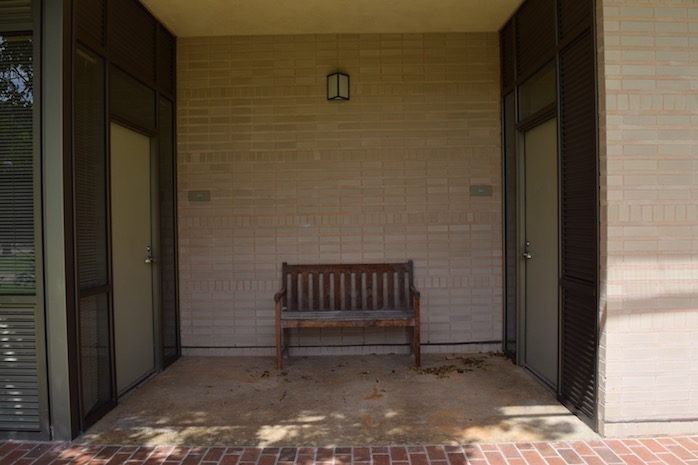
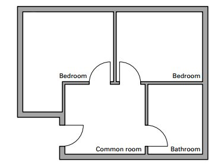
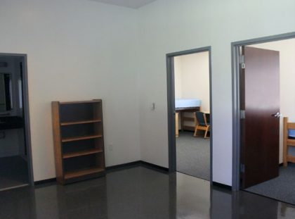
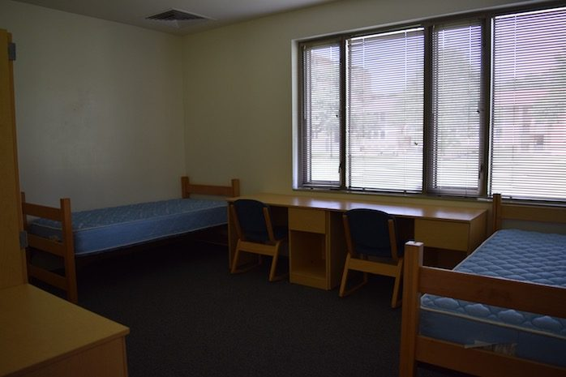
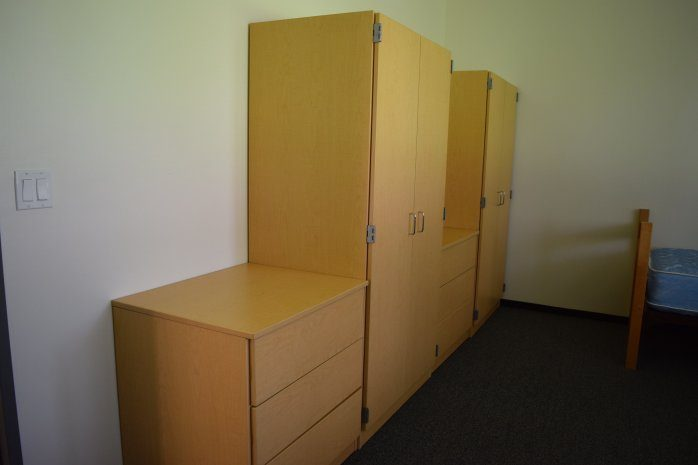
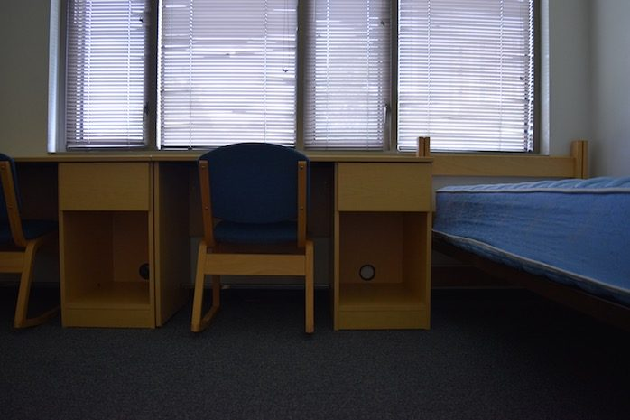
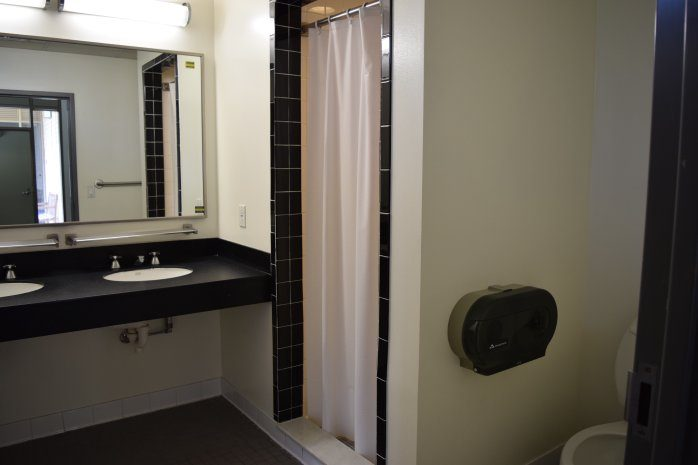
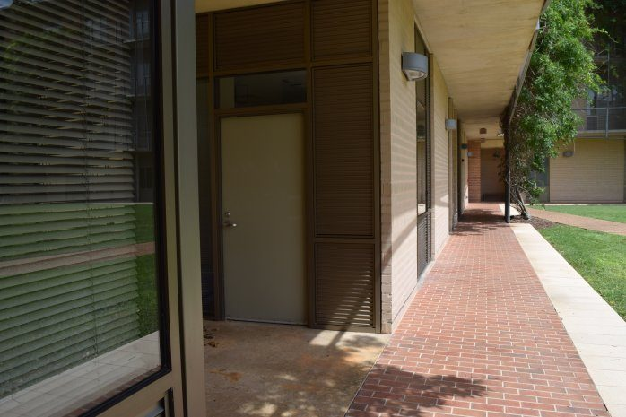

# Rooms and spaces of New Wiess

New Wiess is packed with shared rooms: two kitchens, a movie theater, a dance room, a music room and more. Other colleges "sometimes say we're spoiled—usually when they're having so much fun using our stuff" [@wb 20080709214915 http://teamwiess.com/index.php?r=otherrooms].

!!! abstract "TL;DR"
    - The shared rooms sit in four vertical "stacks" between the wings, which is why the maps list them by floor ("1: Laundry, 2: Music Room, 3: Kitchen, 4: Patio") [@oweek-2014 p.14].
    - Most people live in four-person suites: **doubles** (usually freshmen and sophomores) or **singles** (upperclassmen) [@wb 20090827015957 http://teamwiess.com/rooms.php].
    - The famous **5-man** suites sit in a corner over the Large Classroom [@oweek-2010 p.14] [@oweek-2014 p.102].
    - Your room key opens the public rooms [@oweek-2015 p.21].

## The rooms, quick version

- **2FK** (second-floor kitchen): "Contrary to popular belief, not much cooking goes on here" [@oweek-2014 p.103]. Newly renovated by 2019 [@oweek-2019 p.30].
- **3FK** (third-floor kitchen): the "more properly a kitchen" one [@wb 20090827015957 http://teamwiess.com/rooms.php]. "Note, Third (not Second) Floor Kitchen" [@oweek-2014 p.46].
- **Movie Room**: "the stuff of legend and the desire of every other college on campus," with "a 4K projector, and blackout windows" [@oweek-2019 p.30]. More on [The basement and Sparky's](basement-and-sparkys.md).
- **Sparky's**: the fourth-floor hangout since 2010 [@oweek-2010 p.91]. See [The basement and Sparky's](basement-and-sparkys.md).
- **Music Room**: "a recording booth and soundproofing that sort of works" [@oweek-2015 p.21] [@oweek-2025 p.11].
- **Dance Room**: "nice wood floors and full-length mirrors," "below the RA suites." Great for learning the O-Week dance [@oweek-2019 p.30] [@oweek-2024 p.11].
- **OC Lounge**: first floor, for off-campus students [@oweek-2017 p.15]. Its Old Wiess ancestor in name was the "O/C Bathroom" ([Building lore](lore.md#the-oc-bathroom)).
- **Computer Room**: third floor [@oweek-2015 p.19].
- **Large and Small Classrooms**: Cabinet sometimes meets in the Large one [@oweek-2019 p.25]. The maps of 2006–2014 also mark an RUPD (campus police) office there [@oweek-2006 p.15] [@oweek-2014 p.14].
- **College office**: the Coordinator's office, "adjacent to the mailroom." Your packages go here [@oweek-2025 p.33] [@oweek-2024 p.5].
- **UpCo**: the Upper Commons. See [The Commons and UpCo](commons.md).

The outdoor spots (patios, balconies, Toke) are on [The terraces](terraces.md).

## The suites

**Doubles** have two rooms "of about 20 ft x 10 ft" [@wb 20090827015957 http://teamwiess.com/rooms.php]; the books say "each approximately 16' x 12'" [@oweek-2015 p.20]. **Singles** are four rooms "approximately 10ft x 10ft… coveted by the upperclassmen" [@wb 20090827015957 http://teamwiess.com/rooms.php]. There are also **3-mans** and **5-mans**.

The 5-man was a "Popular suite at Wiess, which typically ends up being a hangout location for thirsty Wiessmen" (2003) [@oweek-2003 p.4]. Later books just say "Rooms in the corner of Wiess that each hold five people" [@oweek-2014 p.102]. Old Wiess had five-man suites and a "presidential suite" too [@wb 19991011025731 http://riceinfo.rice.edu/projects/colleges/wiess/college/photos/tower.html].

Many suites open off the outdoor hallways through a little alcove with a bench [@wb 20170714224838 http://teamwiess.com/newstudents/rooms/alcove.jpg].

## Photographs

<!-- GALLERY:rooms -->

<figure markdown="span">
  { loading=lazy data-title="A suite alcove off the corridor, with a bench." data-description="teamwiess.com, &#x27;New students: rooms&#x27;, 2017 · by 2017" data-gallery="rooms" }
  <figcaption>A suite alcove off the corridor, with a bench. <small>teamwiess.com, &#x27;New students: rooms&#x27;, 2017 [@wb 20170714224838 http://teamwiess.com/newstudents/rooms/alcove.jpg]</small></figcaption>
</figure>

<figure markdown="span">
  { loading=lazy data-title="Plan of a double: two bedrooms, a common room and a bathroom." data-description="teamwiess.com, 2016 · by 2016" data-gallery="rooms" }
  <figcaption>Plan of a double: two bedrooms, a common room and a bathroom. <small>teamwiess.com, 2016 [@wb 20160506224916 http://teamwiess.com/res/freshmanroomnew.png]</small></figcaption>
</figure>

<figure markdown="span">
  { loading=lazy data-title="An empty suite common room, doors to the two bedrooms." data-description="teamwiess.com, 2016 · by 2016" data-gallery="rooms" }
  <figcaption>An empty suite common room, doors to the two bedrooms. <small>teamwiess.com, 2016 [@wb 20160506224917 http://teamwiess.com/res/commonroom.png]</small></figcaption>
</figure>

<figure markdown="span">
  { loading=lazy data-title="A double bedroom, two beds and two desks." data-description="teamwiess.com, &#x27;New students: rooms&#x27;, 2017 · by 2017" data-gallery="rooms" }
  <figcaption>A double bedroom, two beds and two desks. <small>teamwiess.com, &#x27;New students: rooms&#x27;, 2017 [@wb 20170714224845 http://teamwiess.com/newstudents/rooms/beds.jpg]</small></figcaption>
</figure>

<figure markdown="span">
  { loading=lazy data-title="Wardrobes and dresser in a bedroom." data-description="teamwiess.com, &#x27;New students: rooms&#x27;, 2017 · by 2017" data-gallery="rooms" }
  <figcaption>Wardrobes and dresser in a bedroom. <small>teamwiess.com, &#x27;New students: rooms&#x27;, 2017 [@wb 20170714224844 http://teamwiess.com/newstudents/rooms/desks.jpg]</small></figcaption>
</figure>

<figure markdown="span">
  { loading=lazy data-title="Desks under the window." data-description="teamwiess.com, &#x27;New students: rooms&#x27;, 2017 · by 2017" data-gallery="rooms" }
  <figcaption>Desks under the window. <small>teamwiess.com, &#x27;New students: rooms&#x27;, 2017 [@wb 20170714224846 http://teamwiess.com/newstudents/rooms/onedesk.jpg]</small></figcaption>
</figure>

<figure markdown="span">
  { loading=lazy data-title="A suite bathroom: two sinks, a large mirror, the shower." data-description="teamwiess.com, &#x27;New students: rooms&#x27;, 2017 · by 2017" data-gallery="rooms" }
  <figcaption>A suite bathroom: two sinks, a large mirror, the shower. <small>teamwiess.com, &#x27;New students: rooms&#x27;, 2017 [@wb 20170714224848 http://teamwiess.com/newstudents/rooms/bathroom.jpg]</small></figcaption>
</figure>

<figure markdown="span">
  { loading=lazy data-title="The corridor outside the suites: doors and windows on one side, the Acabowl on the other." data-description="teamwiess.com, &#x27;New students: rooms&#x27;, 2017 · by 2017" data-gallery="rooms" }
  <figcaption>The corridor outside the suites: doors and windows on one side, the Acabowl on the other. <small>teamwiess.com, &#x27;New students: rooms&#x27;, 2017 [@wb 20170714224842 http://teamwiess.com/newstudents/rooms/hall.jpg]</small></figcaption>
</figure>

<!-- /GALLERY:rooms -->

??? info "The receipts: the shared rooms"

    | Name | What and where | First in the record | Evidence |
    |---|---|---|---|
    | **2FK** (second-floor kitchen) | The kitchen on the second floor of the elevator stack: "2: Kitchen" on the 2006 map, "2: 2nd floor Kitchen" in 2010 [@oweek-2006 p.15] [@oweek-2010 p.14]. "Can be found most active on Thursday nights" (2009); "Contrary to popular belief, not much cooking goes on here. Fun place to hang out on Thursday evenings" (2014) [@wb 20090827015957 http://teamwiess.com/rooms.php] [@oweek-2014 p.103] | 2006 (map); the abbreviation 2FK in print from 2019 [@oweek-2019 p.14] | [P] |
    | **3FK** (third-floor kitchen) | The kitchen on the third floor of the laundry–music stack, by the PDR: "3: Kitchen" on every map from 2006 [@oweek-2006 p.15] [@oweek-2015 p.19]. "More properly a kitchen" (2009); "completely redesigned… new counters, new tile and new stoves!" (2014); "Note, Third (not Second) Floor Kitchen" [@wb 20090827015957 http://teamwiess.com/rooms.php] [@oweek-2014 p.46]. Kitchen Representatives keep the baking supplies [@oweek-2015 p.21] [@wiess-rice-edu-representatives-2023] | 2006 (map); 3FK in print from 2019 [@oweek-2019 p.14] | [P] |
    | **Computer room** | Third floor of the elevator stack, "under the Movie Room" (2009) [@wb 20090827015957 http://teamwiess.com/rooms.php]. "3: Computer Lab" on the maps 2006–2014, "3: Computer Room" from 2015 [@oweek-2006 p.15] [@oweek-2014 p.14] [@oweek-2015 p.19]; Computer Room Representatives in 2023 [@wiess-rice-edu-representatives-2023] | 2006 | [P] |
    | **Small classroom** | On the Acabowl side by the elevator, on the 2015–2017 maps [@oweek-2015 p.19] [@oweek-2017 p.28] | 2015 | [P] |
    | **Large classroom** | First floor of the stack beside the Commons, under the 5-man suites: "1: Classroom & RUPD" with "2–4: 5-Man" above (2010) [@oweek-2010 p.14]; "Large Classroom" from 2015 [@oweek-2015 p.19]. | 2006 ("Classroom") | [P] |
    | **RUPD office** | Next to the Large classroom. The maps of 2006, 2007, 2010 and 2014 label that first floor "Classroom & RUPD" [@oweek-2006 p.15] [@oweek-2007 p.15] [@oweek-2014 p.14]; from 2015 only the classroom is named [@oweek-2015 p.19]. | 2006 | [P] |
    | **OC lounge** | The **O**ff-**C**ampus Lounge: "Hang out room for all the off-campus people" (2006–2014); "Room on first floor where people who live off-campus hang out" (2016–17) [@oweek-2006 p.84] [@oweek-2017 p.15]. First floor of the RA stack, under the Dance Room [@oweek-2006 p.15] [@oweek-2015 p.19]. Its Old Wiess ancestor in name is the "O/C Bathroom" of 1999, a restroom "used so often by off-campus students" [@wb 20020615221715 http://riceinfo.rice.edu:80/projects/colleges/wiess/college/photos/backabowl.html]; see [Building lore](lore.md#the-oc-bathroom) | 2006 | [P] |
    | **Dance room** | Second floor of the RA stack, "below the RA suites" [@oweek-2015 p.21]: "a proper floor and full wall mirror, as well as a sound system… Wiess Tabletop, Bhangra, etc." (2008) [@wb 20080709214915 http://teamwiess.com/index.php?r=otherrooms]; the "Dance Theater" on the 2015 website [@wb 20150116224809 http://teamwiess.com/amenities.html]; "Also unique to Wiess" [@oweek-2015 p.21] | 2006 (map) | [P] |
    | **Movie room** | Fourth floor by the elevator; the "TV room" of 2003–2011, the "Movie Room" from 2008 on the website and 2014 in the books. Told on [The basement and Sparky's](basement-and-sparkys.md) [@oweek-2003 p.4] [@oweek-2014 p.103] | 2003 | [P] |
    | **Music room** | Second floor of the laundry stack, "right above the laundry room" [@oweek-2014 p.46]; the "Recording Studio" of the 2008 website, "an acoustically sound room" used by bands and the Rice Philharmonics [@wb 20080709214915 http://teamwiess.com/index.php?r=otherrooms]; "newly renovated" with a drum kit (2014), "a recording booth and soundproofing that sort of works" (2015) [@oweek-2014 p.46] [@oweek-2015 p.21] | 2006 (map) | [P] |
    | **Sparky's** | Fourth-floor party room since 2010; the name of the Old Wiess basement game room. See [The basement and Sparky's](basement-and-sparkys.md) [@oweek-2010 p.91] | 1994 (basement); 2010 (fourth floor) | [P] |
    | **UpCo** | The Upper Commons, the second floor of the Commons. See [The Commons and UpCo](commons.md). The earliest written "UpCo" found is in the 2021 O-Week book, "chilling in UpCo (Wiess upper commons)" [@oweek-2021 p.63]; the college's list of representatives has an "UpCo" representative in September 2023 [@wiess-rice-edu-representatives-2023] | 2003 (as "Upper Commons"); 2021 (as "UpCo") | [P] |

    The maps also show a first-floor **Laundry** under the Music Room, a **Patio** or bike rack at the foot of the elevator stack, and a fourth-floor **Patio** at the top of the laundry stack [@oweek-2014 p.14] [@oweek-2015 p.19].

??? info "The receipts: the stacks, as the maps draw them"

    The O-Week maps list each stack from the ground up. 2014 and 2015 together:

    | Stack | 1st floor | 2nd floor | 3rd floor | 4th floor | Source |
    |---|---|---|---|---|---|
    | By the PDR and South Servery | Laundry | Music Room | Kitchen (3FK) | Patio | [@oweek-2014 p.14] [@oweek-2015 p.19] |
    | By the Commons | Classroom & RUPD (2014); Large Classroom (2015) | 5-Man | 5-Man | 5-Man | [@oweek-2010 p.14] [@oweek-2014 p.14] [@oweek-2015 p.19] |
    | By the elevator | Patio / Bike Rack | Kitchen (2FK) | Computer Lab / Room | TV/Game Room (2014); Sparky's and Movie Room (2015) | [@oweek-2014 p.14] [@oweek-2015 p.19] |
    | The RA stack | Off-Campus Lounge | Dance Room | RA apartment | RA apartment | [@oweek-2014 p.14] [@oweek-2015 p.19] |

    The two RA floors carry the RAs' names on every map—"Doward & Christie's" and "Brent's" (2006), "Christa's Appartment" and "BC's Appartment" (2010), "Renata's and Lenin's" and "Emilie's" (2014–15), "Carissa and Nick's" and "Esther's" (2019, 2021) [@oweek-2006 p.15] [@oweek-2010 p.14] [@oweek-2015 p.19] [@oweek-2019 p.28] [@oweek-2021 p.33]; see [The Core Team](../people/core-team.md).

??? info "The receipts: the rooms in the books of 2019–2025"

    The 2019 and 2021 maps are text and are transcribed here; the 2024 and 2025 maps are images without a text layer.

    | Room | What the books say | Evidence |
    |---|---|---|
    | **2FK / 3FK** | The abbreviations in print for the first time: "**2FK/3FK** The Second Floor Kitchen (newly renovated) and Third Floor Kitchen, respectively. Both are stocked with communal cookware" (2019); "We recently redesigned the Second Floor Kitchen, with new counters, tiles, and stoves!" (2019); "the Second Floor Kitchen (commonly referred to as 2FK)" (2021–25), which is now the only kitchen the amenities page describes; maps "2: Kitchen (2FK)", "3: Kitchen (3FK)" | [@oweek-2019 p.14] [@oweek-2019 p.30] [@oweek-2021 p.35] [@oweek-2025 p.11] [@oweek-2019 p.28] |
    | **College office** | The coordinator's office, the "1: Ewart's Office" of the 2019 and 2021 maps, under "2: Upper Commons" by South Servery; "his man cave (the Wiess College office)"; in 2025 "the Wiess College Coordinator's office (adjacent to the mailroom)", where packages now go ("There's no need to include your room number as packages will go to the Wiess college office!") | [@oweek-2019 p.28] [@oweek-2019 p.22] [@oweek-2025 p.33] [@oweek-2024 p.5] |
    | **Large and Small classrooms** | On the 2019 and 2021 maps, with no RUPD or H&D label; Cabinet "holds open meetings every Wednesday in the Upper Commons or Large Classroom" | [@oweek-2019 p.28] [@oweek-2019 p.25] [@oweek-2021 p.28] |
    | **Computer room** | "3: Computer Room" on the 2019 and 2021 maps | [@oweek-2019 p.28] [@oweek-2021 p.33] |
    | **OC lounge** | "**OC Lounge** Off-campus Lounge. Room on first floor" (2019); "a room on the first floor for Off-Campus students" (2021); map "1: Off-Campus Lounge"; gone from the 2024 glossary, though the Cozy Corner's "several napping OC students" remain | [@oweek-2019 p.15] [@oweek-2021 p.19] [@oweek-2019 p.28] [@oweek-2024 p.25] |
    | **Dance room** | "complete with speakers, nice wood floors and full-length mirrors… located on the second floor below the RA suites"; for "your dance for the O-Week skits" (2019), "the O-Week Talent Show" (2021), "practicing the O-Week dance" (2024–25) | [@oweek-2019 p.30] [@oweek-2021 p.35] [@oweek-2024 p.11] |
    | **Movie room** | "the stuff of legend and the desire of every other college on campus… extremely comfortable couches, stadium seating, a 4K projector, and blackout windows"; "**Movie Room** Wiess' very own movie theater on the fourth floor" (2021) | [@oweek-2019 p.30] [@oweek-2021 p.19] [@oweek-2025 p.11] |
    | **Music room** | "located on the second floor right above the laundry room. It features a recording booth and soundproofing that sort of works", unchanged 2019–2025 | [@oweek-2019 p.30] [@oweek-2025 p.11] |
    | **UpCo** | "chilling in UpCo (Wiess upper commons)" (2021), the earliest written use found; see [The Commons and UpCo](commons.md) | [@oweek-2021 p.63] |
    | **RA apartments** | Maps: "3: Carissa and Nick's", "4: Esther's" (2019, 2021); the Mullens' fourth-floor apartment (2024–25) | [@oweek-2019 p.28] [@oweek-2021 p.33] [@oweek-2024 p.30] [@oweek-2025 p.31] |

    None of the four books mentions the 5-man suites or the RUPD office; the double is still "a suite with four people in two rooms and a shared common room… each approximately 16' x 12'" [@oweek-2019 p.29] [@oweek-2025 p.9].

??? quote "In the college's own words"

    "The 5-man has 3-singles and 1 double—that being said, at new Wiess the 5-man has already gained some grand traditions." — teamwiess.com, 2009 [@wb 20090827015957 http://teamwiess.com/rooms.php]

    "We're not spoiled—we put it to use and share!… although we don't mind inspiring a little inter-college jealousy." — teamwiess.com, 2008 [@wb 20080709214915 http://teamwiess.com/index.php?r=otherrooms]

    "If you have any ideas about how to improve our rooms, talk to our Capital Improvements Rep." — O-Week Book 2015 [@oweek-2015 p.21]

Last reviewed 2026-10-05 by unreviewed · [Edit this page](#)

