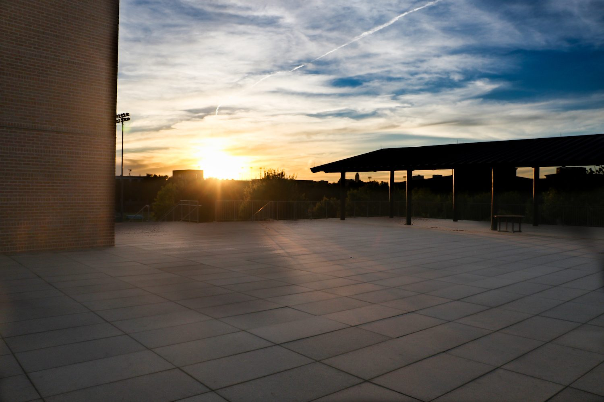
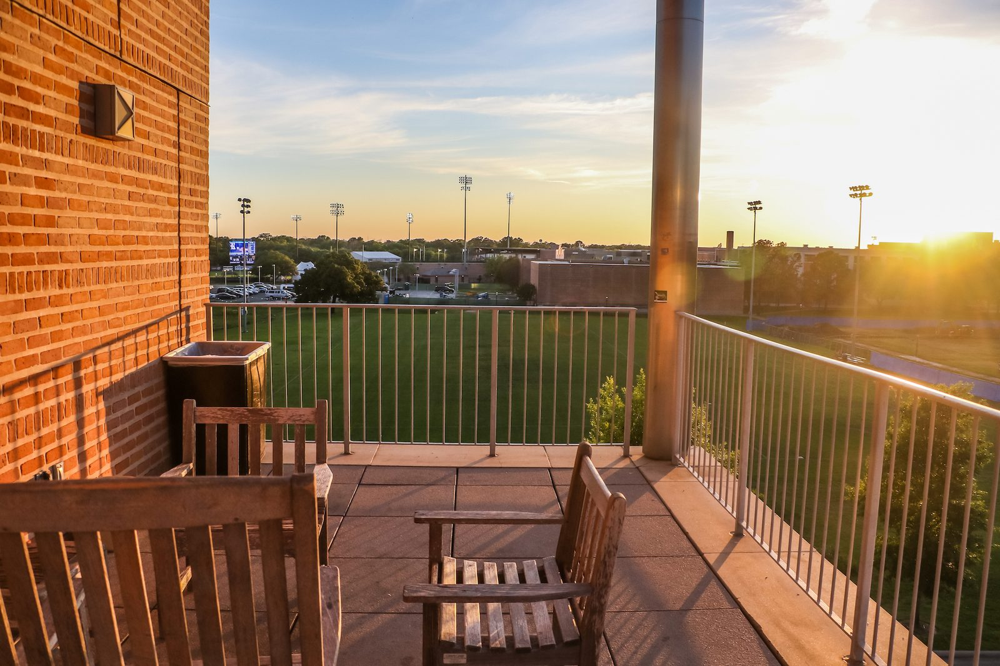
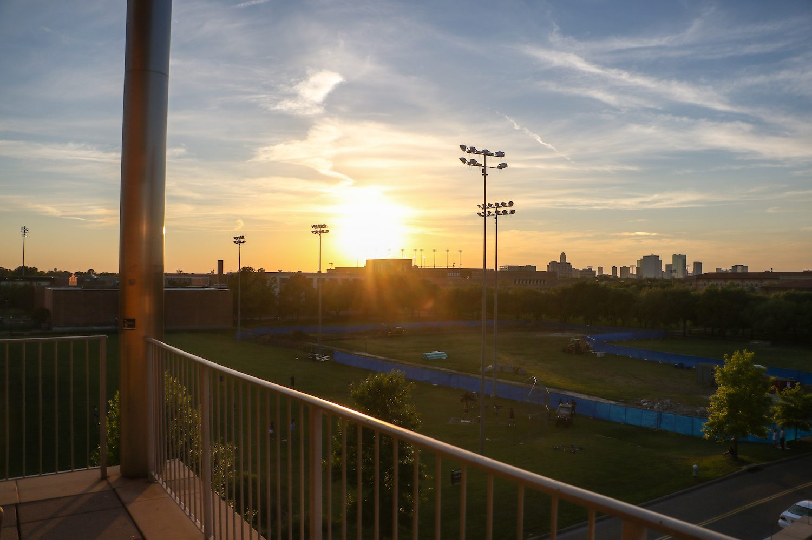
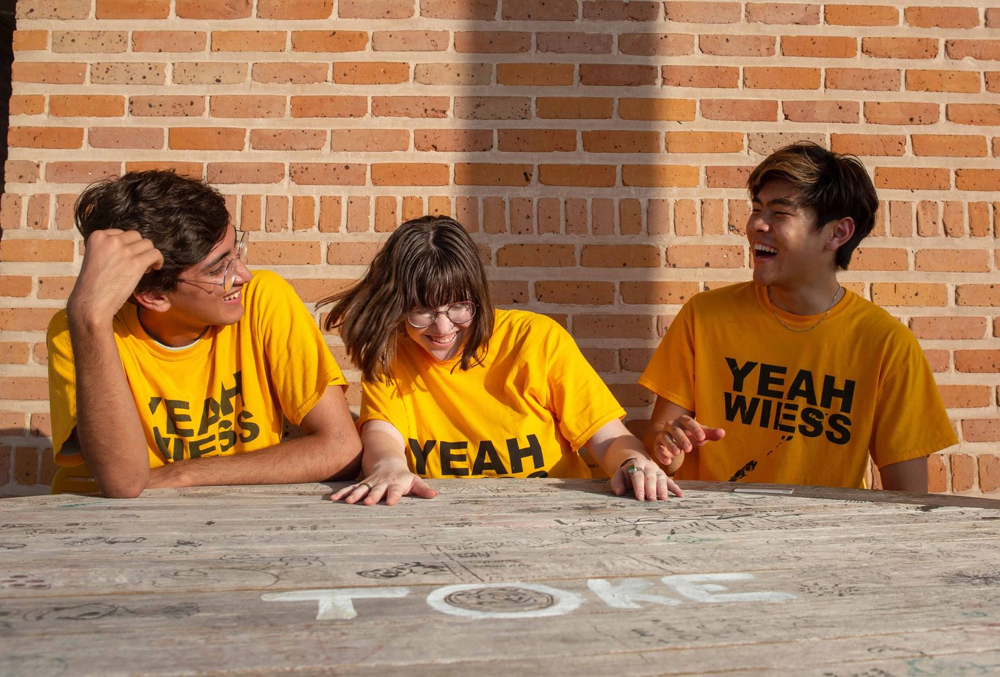

# The terraces and the Bacabowl

Wiess's "Aca-" names for its outdoor spaces keep moving around. Even the O-Week books don't agree. Here's the cheat sheet.

!!! abstract "TL;DR"
    - **Backabowl / Bacabowl** was Old Wiess's quiet back courtyard, "Where most of the amateur and shy sun-bathers can be found" [@handbook-1994].
    - New Wiess has three terraces: the big one on the servery roof (shared with Hanszen), a fourth-floor balcony, and a small one by UpCo [@oweek-2021 p.18].
    - Their names swapped at least twice between 2003 and 2021 [@oweek-2003 p.3] [@oweek-2014 p.102] [@oweek-2019 p.14] [@oweek-2021 p.18].
    - **Toke** is in print from 2025, but no written source says which spot it is [@oweek-2025 p.48].

## The Backabowl

Old Wiess had two courtyards. The Backabowl sat behind the three-storey central wing [@handbook-1994]. It was "generally a little bit quieter than the acabowl, and traditionally is not used as much for social functions" [@wb 20020615221715 http://riceinfo.rice.edu:80/projects/colleges/wiess/college/photos/backabowl.html]. Think "sunbathing or studying" [@oweek-2006 p.36].

New Wiess has just one courtyard, [the Acabowl](acabowl.md). So the "back" names moved up to the terraces.

## The great terrace name shuffle

The big terrace sits on top of South Servery, "overlooking the playing fields," shared by Wiess and Hanszen [@machado-silvetti-wiess] [@rice-facilities-first-100-years]. In 2003 it was the **Backaterrace**, "the terrace behind the Commons that we unfortunately have to share with Hanszen" [@oweek-2003 p.3].

There is also an Acaterrace "The terrace connecting the second floor and the Upper Commons" [@oweek-2021 p.18]. Confused? Everyone is. The full table is in the receipts below.

## Life on the terrace

In 2009 the website said the servery-roof terrace was "shared by our lackluster rivals, the Hanszenites" and "Rarely is this area being used" [@wb 20090827020025 http://teamwiess.com/areas.php]. A Cabinet member wanted to turn it "into a giant chessboard" [@wb 20090903015953 http://teamwiess.com/cabinetminutes.php]. Jazz Night was held "on the terrace" in the 2000s [@wb 20040416083807 http://www.teamwiess.com/oweek/35-44%20wiess.pdf p.9] [@oweek-2006 p.44].

## Toke

A 2025 Fellow is found "hanging out at Toke for the views (sort of)" [@oweek-2025 p.48]. That hints at somewhere high up, it is indeed on the 4th floor, sometimes called the 4th floor balcony.
In a July 2022 photo there is "TOKE" painted on a graffiti-covered table in an O-Week photo [@wb 20220709040142 http://teamwiess.com/images/oweek2022/wiessicles.jpg].

## Photographs

<!-- GALLERY:terraces -->

<figure markdown="span">
  { loading=lazy data-title="The large paved terrace on the South Servery roof, with its shade structure, at sunset. The file is named &#x27;bacaterrace&#x27;." data-description="TFWKB photo collection; source not recorded · undated" data-gallery="terraces" }
  <figcaption>The large paved terrace on the South Servery roof, with its shade structure, at sunset. The file is named 'bacaterrace'. <small>TFWKB photo collection; source not recorded</small></figcaption>
</figure>

<figure markdown="span">
  { loading=lazy data-title="The fourth-floor balcony (the Bacaterrace of the 2014–17 books): benches and rail, the playing fields beyond." data-description="TFWKB photo collection; source not recorded · undated" data-gallery="terraces" }
  <figcaption>The fourth-floor balcony (the Bacaterrace of the 2014–17 books): benches and rail, the playing fields beyond. <small>TFWKB photo collection; source not recorded</small></figcaption>
</figure>

<figure markdown="span">
  { loading=lazy data-title="Sunset over the playing fields from an upper-floor balcony rail, probably the same fourth-floor balcony." data-description="TFWKB photo collection; source not recorded · undated" data-gallery="terraces" }
  <figcaption>Sunset over the playing fields from an upper-floor balcony rail, probably the same fourth-floor balcony. <small>TFWKB photo collection; source not recorded</small></figcaption>
</figure>

<figure markdown="span">
  { loading=lazy data-title="TOKE painted on a graffiti-covered table: an O-Week photograph of 2022, the earliest written trace of the name." data-description="teamwiess.com, O-Week 2022 · 2022" data-gallery="terraces" }
  <figcaption>TOKE painted on a graffiti-covered table: an O-Week photograph of 2022, the earliest written trace of the name. <small>teamwiess.com, O-Week 2022 [@wb 20220709040142 http://teamwiess.com/images/oweek2022/wiessicles.jpg]</small></figcaption>
</figure>

<!-- /GALLERY:terraces -->

??? info "The receipts: which name meant which space"

    | Year | Old Wiess back courtyard | Servery-roof terrace (shared with Hanszen) | Fourth-floor balcony / patio | Small terrace connecting the second floor and UpCo | Source |
    |---|---|---|---|---|---|
    | 1972 | one of the "large grassy acabowls" (plural) | — | — | — | [@handbook-1972] |
    | 1994 | **Backabowl**: "The playing field opposite the Acabowl between the singles wing and the three story wing" | — | — | — | [@handbook-1994] |
    | 1999 | **Bacabowl**: "The Bacabowl Ledge… generally a little bit quieter than the acabowl" | — | — | — | [@wb 20020615221715 http://riceinfo.rice.edu:80/projects/colleges/wiess/college/photos/backabowl.html] |
    | 2002 | (building abandoned, then demolished) | "large public terrace" over South Servery | — | — | [@rice-facilities-first-100-years] |
    | 2003 | — | **Backaterrace**: "The terrace behind the Commons that we unfortunately have to share with Hanszen" | not named | — | [@oweek-2003 p.3] |
    | 2006–2011 | **Backabowl**, in the history page only | **Acaterrace**, same definition word for word | map: "4: Patio" above the third-floor kitchen | — | [@oweek-2006 p.83] [@oweek-2006 p.15] [@oweek-2011 p.92] |
    | 2009 | — | **Acaterrace**: "shared by our lackluster rivals… the breeze that is often present up-top" | — | — | [@wb 20090827020025 http://teamwiess.com/areas.php] |
    | 2014–2017 | **Backabowl**, in the history page only | **Acaterrace**: "The terrace behind the Upper Commons that we share with Hanszen" | **Bacaterrace**: "The Fourth Floor balcony. Great spot to hang out or watch the sunset"; map still "4: Patio" | — | [@oweek-2014 p.102] [@oweek-2014 p.14] [@oweek-2017 p.14] |
    | 2019 | **Backabowl**, in the history page only | **Bacaterrace**: "The terrace behind the Upper Commons that we share with Hanszen"; an RA's child asks students to go "to the dance room or Backaterrace!" | **Acaterrace**: "Fourth floor balcony. Great spot to hang out or watch the sunset"; map "4: Patio" | — | [@oweek-2019 p.12] [@oweek-2019 p.14] [@oweek-2019 p.21] [@oweek-2019 p.28] |
    | 2021 | **Backabowl**, in the history page only | **Bacaterrace**: the 2019 definition | **Fourth Floor Balcony**: "A great place to hang out and watch sunsets"; map "4: Patio" | **Acaterrace**: "The terrace connecting the second floor and the Upper Commons" | [@oweek-2021 p.16] [@oweek-2021 p.18] [@oweek-2021 p.33] |
    | 2024–2025 | **Backabowl**, in the history page only | — (no terrace entries in the glossary) | — (a Fellow found "hanging out at Toke for the views (sort of)" (2025); the book does not say where Toke is) | — | [@oweek-2024 p.23] [@oweek-2024 p.25] [@oweek-2025 p.48] [@oweek-2025 p.44] |

    In print, "Backabowl" and "Bacabowl" refer only to Old Wiess.

??? info "The receipts: timeline"

    | When | What | Evidence |
    |---|---|---|
    | 1949–57 | Old Wiess "laid out as an E-shaped building, with three north-south wings, joined on the north ends by a long east-west spine, forming two open quadrangles" [@rice-facilities-first-100-years] | [R] |
    | 1994 | Glossary: Backabowl [@handbook-1994] | [P] |
    | 1999-07 | Photo page "The Bacabowl Ledge": "the bacabowl itself is generally a little bit quieter than the acabowl, and traditionally is not used as much for social functions"; the Singles Wing "from the Bacabowl"; the central wing "divides the acabowl from the bacabowl" [@wb 20020615221715 http://riceinfo.rice.edu:80/projects/colleges/wiess/college/photos/backabowl.html] [@wb 19991011025731 http://riceinfo.rice.edu/projects/colleges/wiess/college/photos/tower.html] | [P] |
    | 2000-05 | Construction fences "from the fringe of the Wiess Backabowl to the edge of Hanszen College" while steam and utility tunnels are dug [@riceinfo-news-2000-lundin] | [P] |
    | 2002-08 | Delany photographs the space "between commons and backabowl" in the abandoned building (spaces, photo 1) [@delany-about-wiess-2002] | [P] |
    | 2002 | South Servery "surmounted by a large public terrace overlooking the nearby playing fields" [@rice-facilities-first-100-years]; "a servery crowned by a large public terrace" [@machado-silvetti-wiess] | [R] |
    | 2003 | Backaterrace enters the glossary [@oweek-2003 p.3]; Jazz Night: "Wiess invities professional and undergraduate jazz musicians to come play on the terrace" [@wb 20040416083807 http://www.teamwiess.com/oweek/35-44%20wiess.pdf p.9] | [P] |
    | 2006 | The entry is renamed Acaterrace with the definition unchanged [@oweek-2006 p.83]; Jazz Night still "on the terrace" [@oweek-2006 p.44]; history: "the Acabowl where the action was, and the Backabowl, where a quieter atmosphere prevailed for sunbathing or studying" [@oweek-2006 p.36] | [P] |
    | 2006 | Map shows "4: Patio" at the top of the stair tower with the laundry, music room and kitchen [@oweek-2006 p.15]; the same label on every map to 2017 [@oweek-2010 p.14] [@oweek-2015 p.19] [@oweek-2017 p.28] | [P] |
    | 2008 | "Acaterrace" is a section of the redesigned teamwiess.com navigation [@wb 20080709215005 http://teamwiess.com/index.php?r=whattobring] | [P] |
    | 2009-08 | "Even though it is shared by our lackluster rivals, the Hanszenites, the Acaterrace offers a fairly nice place to gather some peace and quiet. Rarely is this area being used" [@wb 20090827020025 http://teamwiess.com/areas.php] | [P] |
    | 2009-08 | Cabinet minutes: a member "says that no one ever really uses the Acaterrace" and proposes making it "into a giant chessboard" [@wb 20090903015953 http://teamwiess.com/cabinetminutes.php]; a later set of minutes has the Social VP walking "onto the Acaterrace" to harass "various Hanzenites" [@wb 20090917020007 http://teamwiess.com/cabinetminutes.php] | [P] |
    | 2014 | Acaterrace "behind the Upper Commons that we share with Hanszen" ("unfortunately" dropped); Bacaterrace enters as "The Fourth Floor balcony" [@oweek-2014 p.102] | [P] |
    | 2015–2017 | Both entries unchanged [@oweek-2015 p.118] [@oweek-2016 p.13] [@oweek-2017 p.14] | [P] |
    | 2019 | The glossary swaps the two names: "**Acaterrace** Fourth floor balcony. Great spot to hang out or watch the sunset"; "**Bacaterrace** The terrace behind the Upper Commons that we share with Hanszen" [@oweek-2019 p.14] | [P] |
    | 2021 | Three entries: "**Acaterrace** The terrace connecting the second floor and the Upper Commons"; "**Bacaterrace** The terrace behind the Upper Commons that we share with Hanszen"; "**Fourth Floor Balcony** A great place to hang out and watch sunsets" [@oweek-2021 p.18] | [P] |
    | 2022-07 | An O-Week photograph on teamwiess.com shows the word **TOKE** painted on a graffiti-covered wooden table against a brick wall—the earliest written trace of the name found [@wb 20220709040142 http://teamwiess.com/images/oweek2022/wiessicles.jpg] | [P] |
    | 2024–2025 | No terrace in the glossary; the 2025 book prints "Toke" for the first time in an O-Week book, in a Fellow's profile ("hanging out at Toke for the views (sort of)"), and has two Head Fellows serving as "firepit reps" [@oweek-2024 p.25] [@oweek-2025 p.48] [@oweek-2025 p.44] | [P] |
    | 2025 | A firepit: an image captioned "Firepit Cab 2025" among the banner photographs of the college website [@wb 20251013212528 https://wiess.rice.edu/] | [P] |

??? quote "In the college's own words"

    "**Backabowl.** The playing field opposite the Acabowl between the singles wing and the three story wing. Where most of the amateur and shy sun-bathers can be found." — 1994 Freshman Handbook [@handbook-1994]

    "Rarely is this area being used, making its offering of tables and chairs useful for those who might want to get some studying done outside, or enjoy the breeze that is often present up-top." — teamwiess.com, 2009 [@wb 20090827020025 http://teamwiess.com/areas.php]

    The glossary entries by year: [Backaterrace / Acaterrace](../traditions/glossary-series.md#backaterrace), [Bacaterrace](../traditions/glossary-series.md#bacaterrace).

Last reviewed 2026-10-05 by unreviewed · [Edit this page](#)

