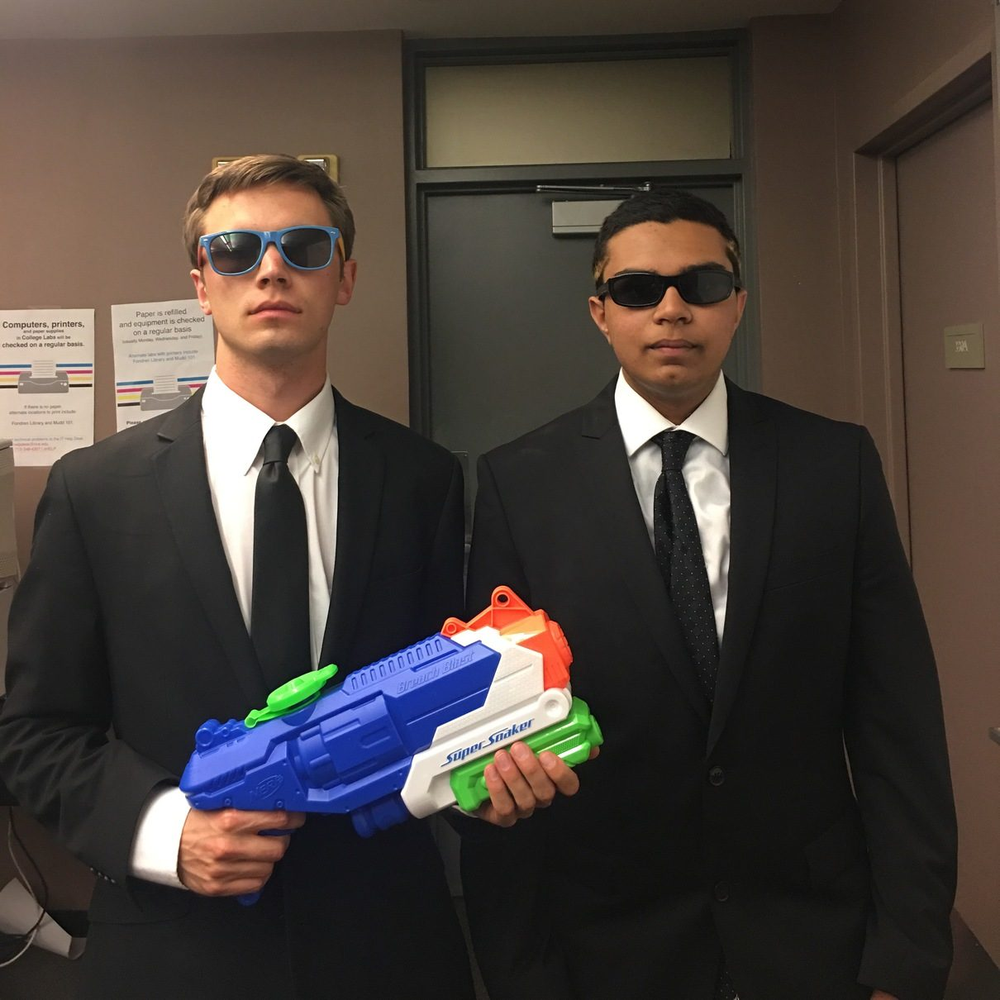

# Baker 13 Defense Force

Baker 13 is Baker College's run: on the 13th and 31st of the month, students in shaving cream and nothing else run through the colleges and leave body prints on the glass. Wiess's tradition was to meet them with water. The 1997 website listed "The utter and complete obliteration of 13" among the traditions it would "Sure Like To See Continue"—adding "(Though, to be fair, you oughta run sometime, too...)" [@riceinfo-traditions-1997]—and every O-Week glossary from 2003 to 2014 defined the runners, under the name "Club 13" to 2008 and "Baker 13" from 2010, with the same second meaning: "A favorite target of Wiessmen with buckets of water" [@oweek-2003 p.5] [@oweek-2014 p.104]. The 2008 website gave the defence a name and a menu entry, "Baker 13 Defense Force", on a page that was never written [@wb 20080625214645 http://teamwiess.com/index.php?r=b13df]. In 2015 the water clause disappeared; the glossary now calls Baker 13 "A proud Baker institution for over thirty years; all undergrads are invited to participate" [@oweek-2015 p.120]. Whether Wiess still throws water is not recorded.

## Timeline

| When | What | Evidence |
|---|---|---|
| 1997-08-11 | "The utter and complete obliteration of 13. (Though, to be fair, you oughta run sometime, too...)"—tier: We'd Sure Like To See Continue [@riceinfo-traditions-1997]; unchanged 1999 [@riceinfo-traditions-1999] | [P] |
| 2003 | Glossary, "Club 13": "1. An organization whose sole function is to undress, smear shaving cream on their bodies and run around campus leaving a slimy trail of body prints. 2. A favorite target of Wiessmen with buckets of water" [@oweek-2003 p.5]; same 2006–2008 [@oweek-2006 p.85] [@oweek-2008 part 7 p.5] | [P] |
| 2006 | Baker described: "Baker 13 graces every 13th and 31st night with students clad only in shaving cream" [@oweek-2006 p.53] | [P] |
| 2008-06 | teamwiess.com Activities menu: "Baker 13 Defense Force"; the page is a PHP include error ("Unable to access ./content/b13df.txt") [@wb 20080625214645 http://teamwiess.com/index.php?r=b13df]; still empty in July [@wb 20080702214704 http://teamwiess.com/index.php?r=b13df] | [P] |
| 2010 | Glossary term becomes "Baker 13", definition unchanged [@oweek-2010 p.92]; Baker's "most well-known" tradition is "an opportunity to strip down twice a month (the 13th and 31st), strategically apply shaving cream and streak around" [@oweek-2010 p.54] | [P] |
| 2014 | Last glossary with the water: "A favorite target of Wiessmen with buckets of water" [@oweek-2014 p.104] | [P] |
| 2015 | Rewritten: "An event where participants undress… A proud Baker institution for over thirty years; all undergrads are invited to participate" [@oweek-2015 p.120]; same 2016, 2017 [@oweek-2016 p.15] [@oweek-2017 p.16]; Owlmanac: "a proud Baker tradition for over thirty years but all undergrads are invited" [@owlmanac-2016 p.55] | [P] |
| 2019–2024 | Rice-speak glossary, the 2015 text with "tradition" for "institution": "An event where participants undress, smear shaving cream on their bodies, and run around campus, leaving a trail of body prints. A proud Baker tradition for over thirty years; all undergrads are invited to participate" [@oweek-2019 p.16] [@oweek-2021 p.20] [@oweek-2024 p.27] | [P] |
| 2024–2025 | "The Lesser Colleges (and Wiess!)": Baker, "The first college, known for their unique uses of shaving cream"; the 2025 glossary drops Baker 13, and the President lists it among "the quirky things that make Rice, Rice!" [@oweek-2024 p.4] [@oweek-2025 p.4] [@oweek-2025 p.37] | [P] |

## As the college described it

!!! quote "riceinfo site, 1997"
    "The utter and complete obliteration of 13. (Though, to be fair, you oughta run sometime, too...)" [@riceinfo-traditions-1997]

!!! quote "O-Week Book 2003"
    "**Club 13**—1. An organization whose sole function is to undress, smear shaving cream on their bodies and run around campus leaving a slimy trail of body prints. 2. A favorite target of Wiessmen with buckets of water." [@oweek-2003 p.5]

!!! quote "O-Week Book 2014"
    "**Baker 13**—An organization whose sole function is to undress, smear shaving cream on their bodies, and run around campus leaving a slimy trail of body prints. A favorite target of Wiessmen with buckets of water." [@oweek-2014 p.104]

!!! quote "O-Week Book 2015"
    "**Baker 13**—An event where participants undress, smear shaving cream on their bodies, and run around campus, leaving a trail of body prints. A proud Baker institution for over thirty years; all undergrads are invited to participate." [@oweek-2015 p.120]

## Photographs

<!-- GALLERY:b13 -->

<figure markdown="span">
  { loading=lazy data-title="The Baker 13 Defense Force representatives&#x27; photograph: suits, sunglasses and a water gun." data-description="teamwiess.com, representatives, 2017 · 2017" data-gallery="b13" }
  <figcaption>The Baker 13 Defense Force representatives' photograph: suits, sunglasses and a water gun. <small>teamwiess.com, representatives, 2017 [@wb 20170421224913 http://teamwiess.com/profiles/reps/baker13defense.jpg]</small></figcaption>
</figure>

<!-- /GALLERY:b13 -->

## Variants & disputes

- **Club 13 or Baker 13.** The Wiess glossary said "Club 13" from 2003 to 2008 and "Baker 13" from 2010 [@oweek-2008 part 7 p.5] [@oweek-2010 p.92]; the Rice-wide description inside the same 2006 book already said "Baker 13" [@oweek-2006 p.53], and the 2008 website used "Baker 13 Defense Force" [@wb 20080625214645 http://teamwiess.com/index.php?r=b13df]. "Club 13" is the older campus name; the glossary caught up two years after the website.
- **Obliteration or defence.** 1997 wanted "utter and complete obliteration" [@riceinfo-traditions-1997]; 2008 called the same thing a "Defense Force" [@wb 20080625214645 http://teamwiess.com/index.php?r=b13df]; the glossaries only ever said "buckets of water" [@oweek-2003 p.5]. All describe one practice from different moods.
- **Water or welcome.** The 2015 rewrite dropped the water and added "all undergrads are invited to participate" [@oweek-2015 p.120]. That is a change in what the coordinators chose to tell freshmen; it is not evidence that the water stopped, though nothing after 2014 says it continued.
- **"Slimy".** The 2003–2014 definition's "slimy trail of body prints" became "a trail of body prints" in 2015 [@oweek-2015 p.120].

- **The books are silent on the defence.** None of the four books of 2019–2025 mentions water or buckets; they describe Baker 13 only from the runners' side [@oweek-2019 p.16] [@oweek-2024 p.27].

## Open questions

- Whether the water defence ever lapsed after 2015, when the books drop it.

- When Wiessmen first met Baker 13 with water. 1997 is the earliest word and already treats it as established [@riceinfo-traditions-1997].
- What the "Baker 13 Defense Force" page of 2008 was meant to say, and whether the name was in use at Wiess before the webmaster used it. The 2007–08 Cabinet minutes (index.php?r=lastnotes) and the Thresher are the places to look.
- Whether water is still thrown. The Thresher's periodic Baker 13 coverage, c.2009 onward [@thresher-web], would show whether Wiess is still named as a hazard.
- Baker's own account of the run—its site and the 2016 Owlmanac's "over thirty years" claim [@owlmanac-2016 p.55] would date Baker 13 to the early 1980s; not checked here.

Last reviewed 2026-10-04 by unreviewed · [Edit this page](#)

