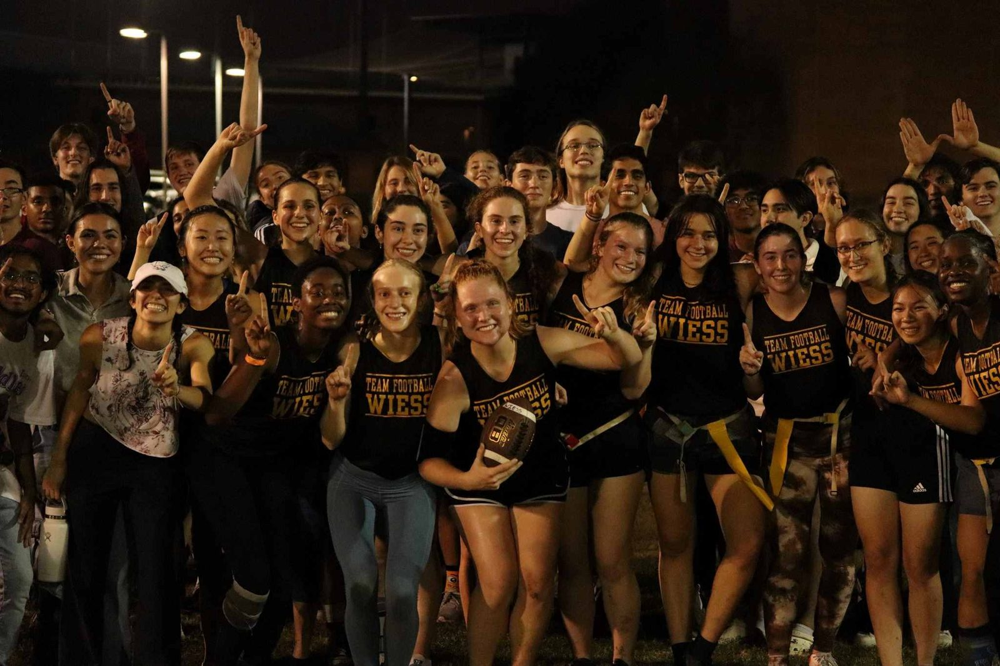
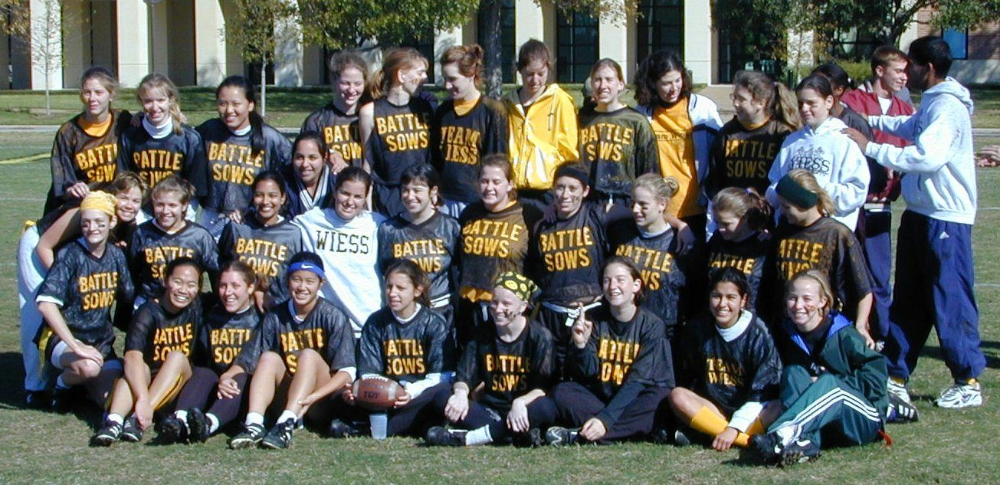
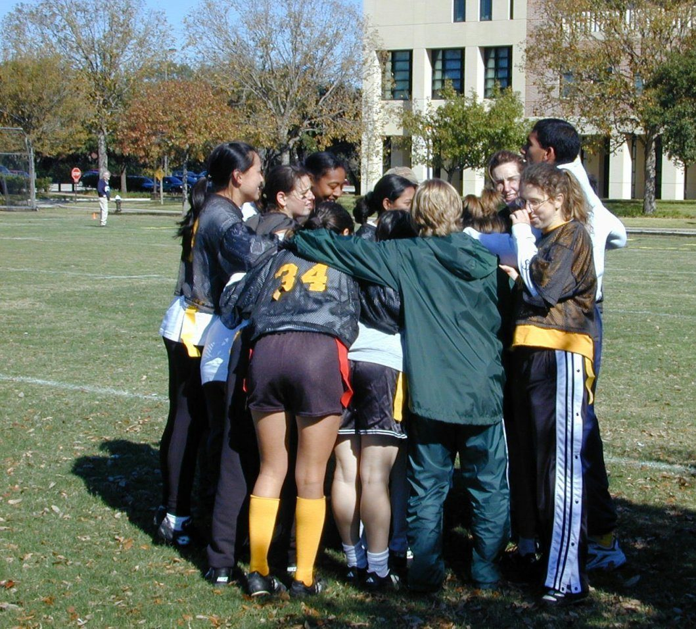
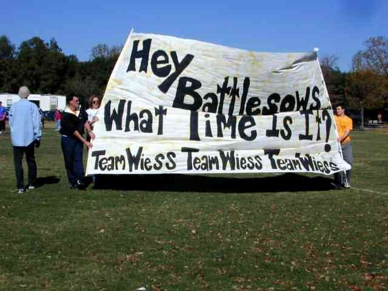

# Battle Sows & Powderpuff

If the guys are War Pigs, the women are Battle Sows. And they play football.

!!! abstract "TL;DR"
    - The Battle Sows are Wiess's team in Powderpuff, Rice's women's flag football league, played in the fall [@oweek-2015 p.122] [@handbook-1994].
    - The name dates to fall 1983, Wiess's first coed semester, and was in the Thresher by 30 September 1983 [@maxham-pig-document] [@portal metapth245539 p.15].
    - Wiess counts titles in 1995, 1998, 1999, 2001 and 2002 [@campanile-1999 p.239] [@riceinfo-battlesows] [@oweek-2003 35-44 wiess.pdf p.7].
    - The college says it has "won the championship more than any other college" [@oweek-2014 p.41] [@oweek-2016 p.30].

## Where the name came from

Wiess went coed in 1983 [@oweek-2003 35-44 wiess.pdf p.3]. The women's teams needed a name, and the student behind "War Pig" proposed "Battle Sows" [@maxham-pig-document]. It hit the Thresher's intramural standings that September [@portal metapth245539 p.15].

That makes it the first pig name in print, a semester before "Warpig" [@campanile-1984 p.371]. The first War Pig balloon was even built for a Powderpuff game [@maxham-pig-document]. See [The War Pig](warpig.md).

## Game day

The 2003 book says the games "turn into an event for the entire college, complete with raucus cheering, wild halftime shows and the semi-regular BBQ" [@oweek-2003 35-44 wiess.pdf p.7]. No experience necessary.

Alumni show up too, "women telling of their great touchdown of '95" [@oweek-2006 p.41]. Next door, Hanszen roasts a whole pig on its sideline when it plays Wiess [@hanszen-traditions]. See [The Hanszen rivalry](hanszen-rivalry.md).

## Winning

The championship years Wiess can point to: 1995, 1998, 1999, 2001 and 2002 [@campanile-1999 p.239] [@riceinfo-battlesows] [@oweek-2003 35-44 wiess.pdf p.7]. The college's own counts disagree: the 2006 book says four titles in six years, the 2007 and 2008 books say eight in 15 [@oweek-2006 p.41] [@oweek-2007 p.41] [@oweek-2008 part 3 p.6]. After 2010 the books admit "Wiess hasn't made it to the finals lately" [@oweek-2010 p.42]. Since 2024 Powderpuff is part of a bigger "Intramural (IM) Sports" tradition [@oweek-2024 p.37].

## Photographs

<!-- GALLERY:powderpuff -->

<figure markdown="span">
  { loading=lazy data-title="The Wiess powderpuff team at night, in black jerseys." data-description="teamwiess.com, by January 2023 · by 2023" data-gallery="powderpuff" }
  <figcaption>The Wiess powderpuff team at night, in black jerseys. <small>teamwiess.com, by January 2023 [@wb 20230114010452 http://teamwiess.com/images/powderpuff-low.jpg]</small></figcaption>
</figure>

<figure markdown="span">
  { loading=lazy data-title="The Battle Sows, 1999 Powder Puff champions." data-description="First Wiess website, Battle Sows page, 1999 · 1999" data-gallery="powderpuff" }
  <figcaption>The Battle Sows, 1999 Powder Puff champions. <small>First Wiess website, Battle Sows page, 1999 [@riceinfo-battlesows]</small></figcaption>
</figure>

<figure markdown="span">
  { loading=lazy data-title="The Sows&#x27; huddle, 1999." data-description="First Wiess website, Battle Sows page, 1999 · 1999" data-gallery="powderpuff" }
  <figcaption>The Sows' huddle, 1999. <small>First Wiess website, Battle Sows page, 1999 [@riceinfo-battlesows]</small></figcaption>
</figure>

<figure markdown="span">
  { loading=lazy data-title="Battle Sows, 1999: &quot;What time is it?&quot;" data-description="First Wiess website, Battle Sows page, 1999 · 1999" data-gallery="powderpuff" }
  <figcaption>Battle Sows, 1999: "What time is it?" <small>First Wiess website, Battle Sows page, 1999 [@riceinfo-battlesows]</small></figcaption>
</figure>

<!-- /GALLERY:powderpuff -->

??? quote "In the college's own words"
    "**Battle Sows**—Affectionate name for Wiess' dauntless Powder-Puff football team, and most other women's college sports teams." [@handbook-1994]

    "Each of the colleges has a team, but as with everything on campus, Wiess is far above the rest." [@oweek-2003 35-44 wiess.pdf p.7]

    "While little girls may not daydream about one day growing up to be Battlesows, playing on the Wiess women's intramural flag football team is certainly the stuff of dreams…" [@oweek-2006 p.41]

    "'Champions,' 'Legendary,' 'Undefeatable,' 'Way sexier than all the other colleges'" [@oweek-2024 p.37]

??? info "The receipts: timeline"
    | When | What | Evidence |
    |---|---|---|
    | 1972 (fall) | Powder Puff already played at Rice: a Paul Pfeiffer '38 slide of a game "from the fall of 1972", posted by the university archivist [@rhc 2016-09-28 powder-puff-1972] | [P] |
    | 1983 (spring) | Wiess goes coed; "The introduction of females to Wiess in 1983 only strengthened the Wiess spirit" [@oweek-2003 35-44 wiess.pdf p.3] | [R] |
    | 1983 (fall) | Jeff Zweig '84: "83-84 was also the year the college turned co-ed. We needed a name for the women's sports teams, and I had the pleasure of proposing the name 'Battle Sows'" [@maxham-pig-document] | [R] |
    | 1983-09-30 | "Battle Sows" in the Thresher's women's intramural standings, p.15—earliest print trace [@portal metapth245539 p.15] | [P] |
    | 1983-10-07 | "Battle Sows" again, Thresher p.20 [@thresher-portal 1983-10-07 p.20] | [P] |
    | 1984 (spring) | Gretchen "Grape" Martinez '84, Campanile senior page: "I've loved being a Battle Sow, Wiess Wench, and one of the first women at the Best College!" [@campanile-1984 p.371] | [P] |
    | 1986-04-05 | The first War Pig balloon, built by Jorge Martin de Nicolas '85 for a Powderpuff game and brought to Beer Bike [@maxham-pig-document]—see [The War Pig](warpig.md) | [R] |
    | 1987-04-04 | Campanile caption: "Pre-flight for the Battle Sow"—the pig balloon itself called a Battle Sow [@campanile-1987 p.320] | [P] |
    | 1994 | Freshman Handbook glossary: "Affectionate name for Wiess' dauntless Powder-Puff football team, and most other women's college sports teams" [@handbook-1994] | [P] |
    | c.1995 | Photograph of a Battle Sows game on IM Field 1 with the black "TEAM WIESS" pig on the field; the date is the core team's ("mid-1990s") [@warpig-core-deck slide 29] | [T] |
    | 1995, 1998 | Championships: Campanile senior wills "to the Battle Sows: '95 and '98 Powderpuff Champions" [@campanile-1999 p.239] | [P] |
    | 1997-08-11 | "The Battle Sows!" listed under "Traditions We'd Sure Like To See Continue" [@riceinfo-traditions-1997] | [P] |
    | 1999 | Champions again; Ray Wagner adds a page, "The Wiess Battle Sows: 1999 Powder Puff Champions", with four photographs ("The Battle Sows", "The Sows huddle", "Kathy hauls", "Loyal Sows fans") [@riceinfo-battlesows] | [P] |
    | 2001-12 | Plan for the New Wiess dedication, 7 Sep 2002: "Powderpuff scrimmage around 3:00" [@wb 20011212095214 http://teamwiess.com/wiess_dedication.html] | [P] |
    | 2002-04-05 | Thresher Beer Bike photograph: "Team Wiess's battle sow flying high in the sky"—the balloon, over [Fort Wiess](fort-wiess.md) [@thresher-2002-04-05 p.6] | [P] |
    | 2001, 2002 | "The back-to-back defending champions—known as the Battlesows" [@oweek-2003 35-44 wiess.pdf p.7]; glossary: "back-to-back defending champion Wiess powderpuff football team" [@oweek-2003 p.3] | [P] |
    | 2004 (fall) | Season schedule on teamwiess.com: eight games 12 Sep – 7 Nov ("Wiess v. Hanszen" 18 Sep), semifinals 14 Nov, final 20 Nov [@wb 20041207030444 http://www.teamwiess.com/view.php?Page=ppuff.php] | [P] |
    | 2006 | "In the past six years, the Wiess powderpuff team (aka the Battlesows) has earned the league champion title four times. Four times!" [@oweek-2006 p.41] | [R] |
    | 2007 | "In the past 15 years, the Wiess powderpuff team (aka the Battlesows) has earned the league champion title eight times. Eight times!" [@oweek-2007 p.41]; repeated 2008 [@oweek-2008 part 3 p.6] | [R] |
    | 2008-08-28 | Cabinet approves $832.69 "out of non-budget" for new powderpuff jerseys [@wb 20080903215453 http://teamwiess.com/index.php?r=lastnotes] | [P] |
    | 2010 | "Past champions, Wiess hasn't made it to the finals lately; however, they did beat their biggest on field foe, Sid Richardson College!" [@oweek-2010 p.42] | [P] |
    | 2014 | "Wiess has won the championship more than any other college, and while we haven't made the playoffs recently, we're a few steps away from winning another!" [@oweek-2014 p.41] | [R] |
    | 2015 | "Powderpuff" enters the Rice-speak glossary: "Women's college flag football… Played during the fall semester" [@oweek-2015 p.122] | [P] |
    | 2019 | "While you may not have dreamed of growing up to be a Battlesow, you may find that playing on the Wiess women's flag football team is the lifelong dream you never knew you had… sport your goldenrod t-shirts (or even better, your Battlesows jersey)"; glossary "Affectionate name for the Wiess powderpuff (football) team" [@oweek-2019 p.31] [@oweek-2019 p.14] | [P] |
    | 2021 | "Wiess has won the championship more than any other college and we have the potential to add to that total this year" (the 2014 "haven't made the playoffs recently" gone) [@oweek-2021 p.36] | [R] |
    | 2023-12 | `powderpuff2023.jpeg` published on the current site's home page [@wb 20231202004310 https://wiess.rice.edu/images/home/powderpuff2023.jpeg] [@wiess-rice-edu asset-manifest.json] | [P] |
    | current | Hanszen's traditions page: "since Wiess's mascot is the pig, each year when we play Wiess at Powderpuff, we devour a full roasted pig and bacon on the sidelines" [@hanszen-traditions] (read live 2026-10-04; no saved copy yet) | [R] |
    | 2024–2025 | Powderpuff folded into a new "Intramural (IM) Sports" tradition—"'Champions,' 'Legendary,' 'Undefeatable,' 'Way sexier than all the other colleges'"—with the 2021 championship sentence; Sparky's is a place to "watch some powderpuff"; a 2025 Head Fellow is a "Powderpuff Blocker" [@oweek-2024 p.37] [@oweek-2025 p.38] [@oweek-2024 p.11] [@oweek-2025 p.44] | [P] |

??? info "Arguments & loose ends"
    **Where sources disagree.**

    - **How many titles?** Five between 1995 and 2002 by the record above. The 2006 book says "four times" in six years [@oweek-2006 p.41]; 2007 and 2008 say "eight times" in 15 years [@oweek-2007 p.41] [@oweek-2008 part 3 p.6]. From 2014, just "more than any other college" [@oweek-2014 p.41]. These are the college's own counts, not a league record.
    - **One word or two?** "Battle Sows" in 1983, 1984, 1994, 1999 and 2009 [@portal metapth245539 p.15] [@campanile-1984 p.371] [@handbook-1994] [@riceinfo-battlesows] [@oweek-2009 part 2 p.19]. "Battlesows" in the glossaries from 2003 and every book 2019–2025 [@oweek-2003 p.3] [@oweek-2007 p.19] [@oweek-2019 p.14] [@oweek-2025 p.26]. Both are the college's.
    - **Whose name is it?** In 1994, the Powder-Puff team "and most other women's college sports teams" [@handbook-1994], which matches its origin [@maxham-pig-document]. From 2003, the powderpuff team only.
    - **The sow that flies.** The pig balloon was sometimes called "the Battle Sow" (1987, 2002) [@campanile-1987 p.320] [@thresher-2002-04-05 p.6], though the glossary called it the War Pig [@handbook-1994].
    - **"Back-to-back."** The glossary kept "back-to-back defending champion" from 2003 to 2010, eight years after those titles [@oweek-2003 p.3] [@oweek-2010 p.90], then dropped it [@oweek-2011 p.92] [@oweek-2017 p.14].
    - **The schedule page's year** is 2004, not 2005 [@wb 20041207030444 http://www.teamwiess.com/view.php?Page=ppuff.php].
    - **Before 1983.** Powderpuff was played at Rice by 1972 [@rhc 2016-09-28 powder-puff-1972]. A search of the Thresher found no Wiess team before 1983.

    **Still don't know.**

    - The exact wording of the 30 Sep and 7 Oct 1983 Thresher standings.
    - A season-by-season championship list.
    - Is the 1986 Powderpuff game with the first pig in the Thresher [@maxham-pig-document]?
    - Someone should archive Hanszen's traditions page and date its roast-pig line.
    - Is "Battle Sows" still the team's name in 2026 [@wiess-rice-edu asset-manifest.json]?

## Sources

The Thresher pages for 1983 are cited from the War Pig research notes; the Portal to Texas History could not be reached from the build environment, so the OCR text has not been re-read for this page. Hanszen's page is a live site read on the review date, not an archived capture.

Last reviewed 2026-10-04 by unreviewed · [Edit this page](#)

