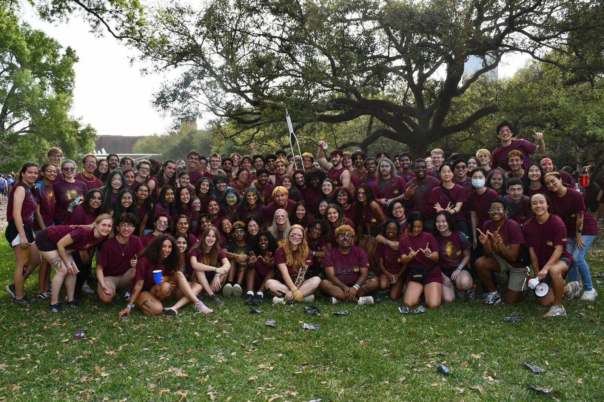

# Beer Bike

Beer Bike is Rice's spring relay race between the colleges, held since 1957: each college has ten bikers and ten chuggers, taking turns, and the chuggers drink water [@oweek-2006 p.51] [@oweek-2003 p.5] [@oweek-2024 p.39]. This page is about how Wiess does it.

!!! abstract "TL;DR"
    - Wiess's day: a pre-dawn wake-up, a parade, water balloons, and the [War Pig](warpig.md) [@riceinfo-beerbike] [@oweek-2024 p.39].
    - Wiess won the beer-drinking contest in 1958 and the men's race in 1975. That 1975 win is where the [Team Wiess](team-wiess.md) chant first shows up [@thresher-1958-05-09-beer-drinking] [@thresher-1975-04-07-beer-bike].
    - The week before used to be Willy Week. Since 2021 Wiess calls it Piggy Week [@oweek-2019 p.19] [@oweek-2021 p.19].

## The Wiess day

It starts at 4 a.m. with loud music and ends soaking wet. Some "cruel upperclassman" wakes the whole college with loud music. In 1997 the favorites were "Ride of the Valkyries," AC/DC and Black Sabbath's "War Pigs" [@riceinfo-beerbike]. In 2024 it was "All I Do Is Win," at 4 a.m. [@oweek-2024 p.39].

Then everyone gathers in the Acabowl, and the parade heads down the Inner Loop to the track [@riceinfo-beerbike]. Expect water balloons, a firehose, and in 2024 a color war with powder [@oweek-2024 p.39]. The chuggers drink water in the 2006, 2016 and 2024 books; the 1997 website guessed "beer with the alcohol boiled out of it" [@oweek-2006 p.51] [@owlmanac-2016 p.43] [@oweek-2024 p.39] [@riceinfo-beerbike]. The 2015 glossary says it's "Often compared to Christmas" [@oweek-2015 p.120].

The week before is for jacks (pranks on other colleges) and filling water balloons [@oweek-2006 p.51]. The best-known Wiess one: around 2001, Wiess hung all of Jones's bikes "about 15 feet off the ground in front of Fondren" with a banner reading "Who wins now, Jones?" [@oweek-2006 p.52].

## The War Pig at Beer Bike

The pig has its own page: [The War Pig](warpig.md). Short version: the first balloon floated off in 1986, one flew on helium in 1991, and a store-bought one floated away in 2004 [@maxham-pig-document] [@campanile-1991] [@thresher-2004-03-26 p.9]. Since 2012 the pig is wooden and "the pig will roll" [@oweek-2014 p.37]. Wiess's parade build in 2001–02 was [Fort Wiess](retired/fort-wiess.md).

## Beer Bike hair

The O-Week books we have don't explain it, but they assume it. Fellows are known for "bright goldenrod hair" (2014) [@oweek-2014 p.10], and one "used to have purple hair (and not just for Beer Bike…)" (2017) [@oweek-2017 p.41]. In 2024: "ask him about Beer Bike and his hair – you're in for a surprise" [@oweek-2024 p.54].

Goldenrod is the college color (see [Crest, colors and symbols](symbols.md)). There was even a Haircutting representative in 2020–21, later just "Hair" [@wb 20201009232352 http://teamwiess.com/government/representatives.html] [@wiess-rice-edu-representatives-2023].

??? info "The receipts: Beer Bike hair"
    The O-Week books we have don't describe a Beer Bike hair custom, but their Fellow profiles assume one. 2009: a Co-Fellow recognisable by "a 'sidewalk' shaved through his head", a style he "once sported" [@oweek-2009 part 2 p.6]. 2014 and 2016: Fellows known by their "bright goldenrod hair" and the "sunshine from his goldenrod hair" [@oweek-2014 p.10] [@oweek-2016 p.54]. 2017: a Fellow who "used to have purple hair (and not just for Beer Bike – it was a much more serious relationship than that)", which takes colored Beer Bike hair for granted [@oweek-2017 p.41]. 2024: "for the newcomers to Rice, ask him about Beer Bike and his hair – you're in for a surprise" [@oweek-2024 p.54]. The college has had a Haircutting representative (2020–21), renamed Hair (2023) [@wb 20201009232352 http://teamwiess.com/government/representatives.html] [@wiess-rice-edu-representatives-2023] [P]; the list does not say what the job involves. Goldenrod is the college color (see [Crest, colors and symbols](symbols.md)). The sources we've found so far say little about the custom itself.

    An inverse from the 1950s: "Circa 1956, Freshmen were required to let their hair grow until Thanksgiving" as part of Freshman Guidance [@rhc 2020-04-20 not-hamman-hall-at-night-circa-1970 comment by Galloway Hudson. Wiess '60, 20 Apr 2020] [T].

## Screen printing: YEAH WIESS

Wiess has printed its own T-shirts since at least the 1980s [@rhc 2018-02-02 friday-follies-bananas comment by Ann Peterson '86, 5 Feb 2018]. From 2010 to at least 2017 there was a representative for it, named after the slogan "YEAH WIESS" [@wb 20100826015923 http://teamwiess.com/reps.php] [@wb 20170421224822 http://teamwiess.com/reps.html]. The screens lived in the basement under the Commons [@oweek-2014 p.102].

More on the place: [The basement and Sparky's](../places/basement-and-sparkys.md#the-darkroom-and-the-screens).

??? info "The receipts: screen printing"
    Wiess has printed its own T-shirts since at least the 1980s.

    | When | What | Evidence |
    |---|---|---|
    | c.1983–84 | The "Team Wiess" Beer Bike shirts were "silkscreened … in-house" [@rhc 2018-02-02 friday-follies-bananas comment by Ann Peterson '86, 5 Feb 2018] | [T] |
    | c.1997–2000 | The RA Dr. Bill Wilson "is involved in almost every aspect of the college, from theater to t-shirt screening to taking pictures of almost every Wiess event" [@riceinfo-associates] | [P] |
    | 1999–2011 | The Bylaws list "dark room equipment" among the college equipment held by committee chairs [@wb 19990220014631 http://riceinfo.rice.edu:80/projects/colleges/wiess/rules/bylaws.html] [@bylaws-2010 Art. III §2] | [P] |
    | 2010–2012 | A representative called "YEAH WIESS" [@wb 20100826015923 http://teamwiess.com/reps.php] [@wb 20120817225627 http://teamwiess.com/people.php?who=reps] | [P] |
    | 2014 | "Yeah Wiess Representative (T-Shirt Screening Representative)" [@wb 20140627224604 http://teamwiess.com/representatives.html]; glossary: "**Basement:** The area under the Commons used for storage and shirt screen making"; "**Dr. Bill:** … Ex-Wiess RA who started… shirt screening"; an RA is "a shirt-screening expert!" [@oweek-2014 p.102] [@oweek-2014 p.103] | [P] |
    | 2015–2019 | "**Basement:** The area under the Commons used for storage and shirt screening" [@oweek-2015 p.118] [@oweek-2017 p.14] [@oweek-2019 p.14]; Yeah Wiess Reps 2015 [@wb 20150612230047 http://teamwiess.com/reps.html] | [P] |
    | 2017-04 | The Yeah Wiess Reps plan "T-shirt design contest (one each semester)", to "Make screen-printing T-shirts more accessible for Wiessmen in Wiess-related activities" and a "More efficient system for drying T-shirts"; their first act is "Learning the process of screen printing T-shirts" [@wb 20170421224822 http://teamwiess.com/reps.html] | [P] |
    | 2020-02-12 | The Bylaws' equipment list now reads "shirt-screening equipment" where "dark room equipment" stood [@bylaws-2020 Art. III §2] | [P] |
    | 2021 | The O-Week coordinators photographed in YEAH WIESS shirts [@wb 20210619003837 http://teamwiess.com/images/oweek2021/coords.jpg] (see [O-Week](o-week.md#photographs)) | [P] |
    | 2021– | No Yeah Wiess or screening representative on the lists of 2020–2023; no "shirt screening" in the 2021–2025 glossaries [@wb 20201009232352 http://teamwiess.com/government/representatives.html] [@wiess-rice-edu-representatives-2023] [@oweek-2021 p.18] | [P] |

    **What the sources confirm:** In-house screen printing at Wiess from the early 1980s (testimony) and in writing from c.1997; a dedicated representative from 2010 to at least 2017, whose title was the slogan "YEAH WIESS"; the basement as the place for it (2014–2019); and the Bylaws' swap of "dark room equipment" for "shirt-screening equipment" between 2011 and 2020. "YEAH WIESS" is documented (the rep's title, 2010–2017; the shirts, 2021). The place is on [The basement and Sparky's](../places/basement-and-sparkys.md#the-darkroom-and-the-screens); the rep's study-break plans are on [Study breaks](study-breaks.md).

## Winning (sometimes)

Wiess's first win was in 1958, in the beer-drinking contest; the bike race was rained out [@thresher-1958-05-09-beer-drinking]. In 1968 the team used a slingshot to launch its riders faster [@thresher-1985-04-12-beer-bike-history].

In 1975 Wiess won the men's title and broke out the "Wiess Team!" chant [@thresher-1975-04-07-beer-bike]. A 1985 table of winners lists Wiess for 1958, 1975 and 1982 [@thresher-1985-04-12-beer-bike-history]. By 1997 the website admitted "we've lost the last few years (the bikes were rigged! I swear, it's true!)" [@riceinfo-beerbike].

## Photographs

<!-- GALLERY:beerbike -->

<figure markdown="span">
  { loading=lazy data-title="Wiess at Beer Bike in that year&#x27;s maroon team shirts, faces painted, under the live oaks." data-description="teamwiess.com, by January 2023 · by 2023" data-gallery="beerbike" }
  <figcaption>Wiess at Beer Bike in that year's maroon team shirts, faces painted, under the live oaks. <small>teamwiess.com, by January 2023 [@wb 20230114010426 http://teamwiess.com/images/beer-bike-low.jpg]</small></figcaption>
</figure>

<!-- /GALLERY:beerbike -->

??? quote "In the college's own words"
    "The chug team's job is to drink huge amounts of beer with the alcohol boiled out of it (I have no idea how it tastes, but I'm guessing it's pretty bad)." [@wb 19990117000719 http://riceinfo.rice.edu/projects/colleges/wiess/traditions/beerbike.html]

    "Freshmen, be warned: other colleges have a nasty habit of trying to attack the cars as they cruise down the street, so keep a water-balloon handy and ubangee any idiot who gets near." [@riceinfo-beerbike]

    "In one hour, thousands of water balloons soak the sober and the not-so-sober alike." [@oweek-2006 p.51]

    "The true spirit of Beer Bike is about representing your college by being the loudest, the proudest, and wearing the coolest merch." [@oweek-2024 p.39]

??? info "The receipts: timeline"
    | When | What | Evidence |
    |---|---|---|
    | 1957 | "Rice had its first annual Beer-Bike competition"—as the O-Week books tell it [@oweek-2006 p.51]; Owlmanac: "originally called the 'Inter-College Bicycle Race'" [@owlmanac-2016 p.43] | [R] |
    | 1958-05-09 | Wiess wins "the Beer-drinking contest which Wiess College won"; the bike race is rained out [@thresher-1958-05-09-beer-drinking] | [P] |
    | 1968 | "1968 saw the Wiess team use a slingshot in order to propel their riders to faster starts"—as told in 1985 [@thresher-1985-04-12-beer-bike-history] | [R] |
    | 1974 or 1975 | The "Team Wiess" chant debuts at Beer Bike, as the Beer Bike team's name—see [Team Wiess](team-wiess.md) for the dispute [@wb 20040416083807 http://www.teamwiess.com/oweek/35-44%20wiess.pdf p.3 (printed 37)] [@oweek-2010 p.39] [@lancaster-wiess-memorabilia] | [R] |
    | 1975-04-07 | Wiess wins the men's race, "shook off a two-year jinx", with "a chorus of 'Wiess Team. Wiess Team!'" [@thresher-1975-04-07-beer-bike]. The 1985 winners table lists Wiess for 1958, 1975 and 1982 [@thresher-1985-04-12-beer-bike-history] | [P] [R] |
    | 1976-04-05 | "Team Wiess, defending men's champion and consensus favorite, was swamped" [@thresher-1976-04-05-beer-bike] | [P] |
    | c.1983–84 | Wiess's "Team Wiess" Beer Bike shirts "silkscreened … in-house" [@rhc 2018-02-02 friday-follies-bananas comment by Ann Peterson '86, 5 Feb 2018] | [T] |
    | 1986-04-05 | The first Beer Bike pig, a trash-bag hot-air balloon, floats off; "'86 was the first year the War Pig appeared on the college's Beer Bike T-shirts (although it looked more like a War Wolf than a Pig!)" [@maxham-pig-document]—see [The War Pig](warpig.md) | [R] |
    | 1987–1996 | Pig #2 and Pig #3 at Beer Bike, "TEAM WIESS" in block letters; first helium flight 6 Apr 1991 [@campanile-1987] [@campanile-1991] [@campanile-1996] | [P] |
    | 1988, 1993 | Other colleges attack the pig at Beer Bike [@campanile-1988]; letters to the Thresher after the 1993 race [@thresher-portal 1993-03-26 p.4] | [P] |
    | 1997-08-11 | David Cunningham's Beer Bike page: the wake-up canon, the firehose "mud-wrestling match", "those freaks who tried to tear the Pig's legs off a few years back", and "we could probably use a new Pig" [@wb 19990117000719 http://riceinfo.rice.edu/projects/colleges/wiess/traditions/beerbike.html]; re-dated 25 Jun 1999 by Ray Wagner with the text unchanged [@riceinfo-beerbike] | [P] |
    | 1998–99 | Campanile "Wiess Style": "twenty-five students to wake up at 4:30 a.m. to inflate a giant pig made of garbage bags in the futile hope that it will fly above the Beer Bike track"; senior will: "Beer Bike – Wake Up WIESSSSS!!!" [@campanile-1999 p.238] [@campanile-1999 p.239] | [P] |
    | 2000-04 | Mylar pig-head balloons released; "The pig will fly!" chant noted [@thresher-portal 2000-04-07 p.12] | [P] |
    | 2001-04 | "Wiess's War Pig finally took to the skies in the form of a giant Macy's parade-style balloon" [@thresher-portal 2001-04-06 p.29] | [P] |
    | c.2001 | The Jones bike jack: a Wiessman in a Jones Beer Bike shirt is let into the Jones bike closet; that night Wiess hangs "all of Jones's bikes … about 15 feet off the ground in front of Fondren with an enormous banner that read 'Who wins now, Jones?'"—"about five years ago" in 2006 [@oweek-2006 p.52] | [R] |
    | 2002-04 | "Team Wiess's battle sow flying high in the sky" over the Wiess fort [@thresher-portal 2002-04-05 p.6]—see [Fort Wiess](retired/fort-wiess.md) | [P] |
    | 2003 | Glossary: "A competitive inter-college race held in the spring in which ten bikers and ten chuggres from each collge compete … 2. A day full of events, including the race, a parade and a water balloon fight." [@oweek-2003 p.5] | [P] |
    | 2004-03-20 | The commercial pig balloon's cord is cut at Beer Bike; it floats away [@thresher-2004-03-26 p.9] | [P] |
    | 2006 | O-Week book: Willy Week, "the Beer Debates", jacks, "ten bikers and ten chuggers that alternate between the chuggers chugging water and the bikers doing laps" [@oweek-2006 p.51] | [P] |
    | 2012-04 | The wooden War Pig's debut, "Trojan Warpig / Beerseige our enemies!" [@campanile-2012]; "replacing 'the pig will fly' with our now beloved chant: the pig will roll" [@oweek-2014 p.37] | [P] |
    | 2014 | Glossary adds Willy Week ("filled with college activities, alumni, and jacks") and Ironman/Ironwoman ("Someone who both bikes and chugs") [@oweek-2014 p.106] [@oweek-2014 p.105] | [P] |
    | 2015 | Glossary: "Often compared to Christmas, and also includes a water balloon fight and much rejoicing." [@oweek-2015 p.120]; the Ubangee is "at [its] most prominent during the Beer Bike water balloon fight, as hordes of Wiessmen chase down anybody" [@oweek-2015 p.22] | [P] |
    | 2016 | Owlmanac: "they chug water now, not beer … 24 ounces for the men, 12 for the women and alumni … 1 mile for the men, 2/3rds miles for the women and alumni" [@owlmanac-2016 p.43]; a Wiess Fellow is "Wiess' resident Friday music player, taking your requests and waking you up at 4 am on Beer Bike" [@oweek-2016 p.58] | [P] |
    | 2016 | Rice Magazine: freshmen "drag the wheeled War Pig to the stadium"; rivals chant "Wiess can't drive!" [@rice-magazine-2016-wiess-traditions] | [R] |
    | 2019 | Glossary unchanged from 2015, and "Willy Week" for the last time; the Ubangee still "at [its] most prominent during the Beer Bike water balloon fight" [@oweek-2019 p.16] [@oweek-2019 p.19] [@oweek-2019 p.31] | [P] |
    | 2021 | The week before Beer Bike is now "**Piggy Week**. The week preceding Beer Bike, filled with college activities, alumni, and jacks"—Willy Week renamed, in the Wiess Speak half of the glossary [@oweek-2021 p.19] | [P] |
    | 2023–2024 | The college site publishes `beerbike-low.jpg`, `BeerBike2024.jpg` and `WarPig2024.jpg` [@wb 20240719230359 https://wiess.rice.edu/images/home/BeerBike2024.jpg]; the Thresher: "a Wiess tradition that got resurrected this year after dying out in years past" [@thresher-2024-04-10] | [P] |
    | 2024 | The book gives Beer Bike its own page, "What is Beer Bike?": the 4 am wake-up to "All I Do Is Win," by DJ Khaled", bikers, "chuggers (chugging water, of course)" and pit crew, "a full day of water balloon fights, a color war (throwing colored powder on all of your friends)", "four hundred students in matching t-shirts"; a Beer Bike committee does decorations, merch and "painting our mascot, the Warpig" [@oweek-2024 p.39] [@oweek-2024 p.34] | [P] |
    | 2025 | The 2024 page unchanged; the RAs promise "our over-the-top goldenrod spirit during Piggy Week" [@oweek-2025 p.40] [@oweek-2025 p.32] | [P] |

Last reviewed 2026-10-05 by unreviewed · [Edit this page](#)

