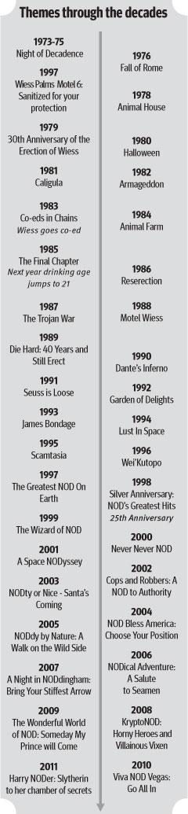
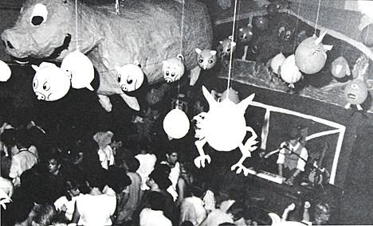
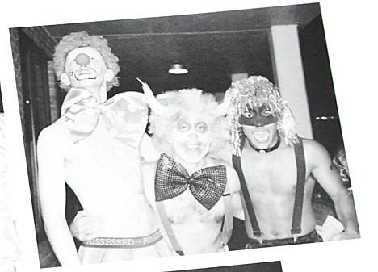

# Night of Decadence

For about fifty years, the biggest party at Rice was a Wiess Halloween costume party. Then it ended.

!!! abstract "TL;DR"
    - NOD was Wiess's Halloween costume party, in the [Commons](../places/commons.md) and the Acabowl, on a weekend at the end of October [@handbook-1994] [@oweek-2015 p.24].
    - It started in 1972: the Thresher called the 1975 party the "fourth annual" [@thresher-1975-11-03-nod-fourth-annual] [@rice-magazine-2016-wiess-traditions].
    - From 1999 it was a running argument about safety, and the university added rules [@thresher-1999-04-23-presidents].
    - After the 2023 party was shut down early, NOD was cancelled for good on 5 June 2024. Wiess's public is now "Masquerade After Dark" [@thresher-2024-06-05-nod-canceled] [@thresher-2024-10-mad-announced].

## How it started

A future Wiess Magister (the professor who lives next door and looks out for the college; see [Magisters](../people/masters-and-magisters.md)) remembered going to the first NOD in 1972, with about 30 other guys [@rice-magazine-2016-wiess-traditions]. The Thresher backs him up: in 1975 it announced Wiess's "fourth annual Night of Decadence," the first in "the new Wiess Commons" [@thresher-1975-11-03-nod-fourth-annual].

The name first shows up in print on a 1973 campus calendar: "Night of Decadence? This must needs be checked" [@thresher-1973-10-11-nod-calendar]. That year even had sequels, "Beyond the Night of Decadence" and "Son of the Night of Decadence" [@thresher-1973-11-08-beyond-nod] [@thresher-1973-11-15-son-of-nod].

By the mid-1980s it was a huge themed party open to Houston. The college has said for decades that it made Playboy's list of top ten college parties [@ricenod-site-2005]. Nobody has ever found the issue.

## What it was like

Every year had a theme, from "Fall of Rome" in 1976 to "NODie Dreamhouse" in 2023 [@thresher-2023-10-50-years] [@thresher-2023-10-sex-doll]. The War Pig's first big effigy hung at the "Animal Farm" NOD in 1984 [@portal metapth245573 p.27]. See [The War Pig](warpig.md).

It got big. Almost a thousand people came in 2003; "upwards of 1400" in 2014; "around 1200" by 2019 [@wb 20041204030907 http://www.teamwiess.com/nod/] [@oweek-2014 p.44] [@oweek-2019 p.33]. Wiess students ran their own security force: at least 50 in 1998, around 200 later [@thresher-1998-10-30-nod-security] [@oweek-2019 p.33].

## Controversy and response, 1998–2025

Until 1998, Wiess students made NOD's safety rules themselves. In 1997 they closed it to anyone not with a Rice student, and in 1998 they added student security in red T-shirts [@thresher-1998-10-30-nod-security].

In January 1999, ten of the sixteen college Magisters signed a letter asking Wiess to rethink NOD [@thresher-1999-02-05-masters-letter]. Wiess students and the Thresher called it an attack on student self-government [@thresher-1999-02-05-wiess-cabinet] [@thresher-1999-02-05-editorial]. A committee of college presidents answered with new rules: security at every college, talks before the party, and no sexual decorations [@thresher-1999-04-23-presidents].

After that came years of op-eds, about alcohol, ambulance transports and the party's culture. There were eleven transports in 2012 [@thresher-2012-11-nod-transports]. In 2023, the fiftieth-anniversary party was shut down nearly two hours early, with seven students transported [@thresher-2023-11-01-shutdown]. NOD went on probation [@fox26-2023-11-03].

??? info "The receipts: controversy, 1998–2025"
    NOD was argued about for as long as it was reported on, but the public record of the institution acting on it begins in the winter of 1998–99. Until then the record shows Wiess's own socials making the safety rules: in 1997 they closed the party to anyone not with a Rice student, and in 1998 they put "at least 50 student security officials (in red T-shirts)" on the floor [@thresher-1998-10-30-nod-security]. The Thresher's own editorial on the morning of NOD 1998 told readers that "the person you grope at NOD may be sitting next to you in class on Monday" [@thresher-1998-10-30-editorial].

    | When | What | Evidence |
    |---|---|---|
    | 1998-11 | Will Rice Magister Dale Sawyer brings a draft letter on NOD to a meeting of all the Magisters; "they reached no consensus", and the Sid Richardson and Brown Magisters object that it is not their place ("changing NOD was not my prerogative as the master of Brown") [@portal metapth246638 p.7] | [P] |
    | 1999-01-26 | The letter, from Dale and Elise Sawyer and co-signed by the Magisters of Lovett, Hanszen, Baker and Jones—ten of the sixteen—goes to Wiess President Ethan Schultz: NOD's "combination of near nudity, abusive consumption of alcohol, and the cultural tolerance for and real risk of sexual assault" makes it "an inappropriate basis for a party sanctioned by Rice University"; "Each of our two years at WRC, we have heard reasonable female students complain to peers about being groped and grabbed, even after having said 'No,' at NOD" [@thresher-1999-02-05-masters-letter] | [P] |
    | 1999-02-02 | The Wiess Magisters, John and Paula Hutchinson, treat the letter as notice under the sexual-harassment policy and forward it to Vice President for Student Affairs Zenaido Camacho [@portal metapth246638 p.7] | [P] |
    | 1999-02-03 | About 80 Wiess members at Cabinet; the letter called "an attack on their college's autonomy" by some and endorsed by others; a Wiess task force formed [@thresher-1999-02-05-wiess-cabinet] | [P] |
    | 1999-02-05 | Thresher editorial: the letter "is an attack on student self-governance within the college system, a system the masters have a duty to protect" [@thresher-1999-02-05-editorial] | [P] |
    | 1999-02 | Camacho forms an ad hoc advisory committee to report by 5 March [@thresher-1999-02-12-reactions] | [P] |
    | 1999-02-12 | Two pages of letters, columns and statements from every signing Magister and from the Wiess Magisters [@thresher-1999-02-12-letters] [@thresher-1999-02-12-masters-replies] [@thresher-1999-02-12-bonig] | [P] |
    | 1999-03-16 | The ad hoc committee reports "serious problems associated with Night of Decadence, problems that are not peculiar to this event but that are most conspicuously associated with it", finds no hard data for the letter's claims, and hands the issue to the Magisters and college presidents [@thresher-1999-03-19-ad-hoc-report] | [P] |
    | 1999-04-20 | The committee of the eight college presidents and the SA President reports: O-Week education and forums at each college, a security coordinator and team at every college, lit paths, no door sales to non-Rice guests, "Eliminate decorations of a sexual nature from public display" [@thresher-1999-04-23-presidents] | [P] |
    | 1999-04-20 | The alcohol policy, "in substantially the same form since 1986", is revised alongside it: kegs at private parties registered with the college Chief Justice; the student monitors who reported infractions abolished [@thresher-1999-04-23-alcohol-policy] | [P] |
    | 1999-05 | The Board of Trustees approves "the direction of the NOD recommendations and the alcohol policy revisions" [@thresher-1999-05-25-board] | [P] |
    | 1999-09 | Wiess submits its NOD plan to Camacho, who "can ask for changes to the plan"; he decides that Wiess "must eliminate all sexually explicit decorations in advertising and decorating" [@thresher-1999-09-17-nod-plans] [@thresher-1999-09-24-decorations] | [P] |
    | 1999-10-29 | "The Wizard of NOD", the "27th annual": no sexual decorations, security forums at every college, seven Campus Police; 720 Rice students and about 95 guests; three ambulance transports, the Will Rice cases from private parties; "more subdued" [@thresher-1999-10-29-nod-tonight] [@thresher-1999-11-05-nod-report] | [P] |
    | 2009-10 | The Women's Resource Center's "Consent Is Sexy Week" runs in the weeks before NOD [@thresher-2009-10-09-consent-week] | [P] |
    | 2009-11-13 | Op-ed: NOD is "an event so blatantly opposed to progressive female ideals" [@thresher-2009-11-13-ohm] | [P] |
    | 2011-02-24 | Dean of Undergraduates John Hutchinson puts the colleges on alcohol probation over hard alcohol, "anything other than beer, wine or ale"—not a NOD measure; student leaders say the colleges wrote the plan [@thresher-2011-02-25-probation] [@thresher-2011-09-02-letter] | [P] |
    | 2012-10 | Eleven transports on NOD night; argument over whether REMS over-transports; the Dean: "The problem that we are concerned about is a lack of healthy behavior" [@thresher-2012-11-nod-transports]. Op-ed: "It is in irresponsible behavior with regard to alcohol that the problem lies, not in our response to that behavior" [@thresher-2012-11-08-baran]. In 2024 the Thresher wrote that 2012 prompted "the then-dean of undergraduates to also convene an APAC and harden the alcohol policy" [@thresher-2024-06-05-nod-canceled] | [P] / [R] |
    | 2014-10 | Opinion before NOD: "No one is 'owed' sex" [@thresher-2014-10-confer-status] | [P] |
    | 2022-10-04 | Editorial endorsing the consent and alcohol talks colleges give before NOD—"These concerns don't start—or end—with NOD, and neither should the talks to address them" [@thresher-2022-10-04-consent-talks] | [P] |
    | 2023-10 | Guest opinion against the theme "NODie Dreamhouse": it "contributes to male gaze, misogyny and heteronormativity" [@thresher-2023-10-sex-doll]; reply, "No feminism without sex positivity" [@thresher-2023-11-01-phelan] | [P] |
    | 2023-10-29 | NOD shut down nearly two hours early; more than two dozen treated on site, seven transported, three students handcuffed by RUPD; Wiess Chief Justice Renzo Espinoza: "all of Rice and Houston medical resources at NOD were becoming completely overwhelmed" [@thresher-2023-11-01-shutdown] | [P] |
    | 2023-11-03 | Dean of Undergraduates Bridget Gorman cancels campus-wide public parties through spring break, limits Pub nights to over-21s, reconvenes the Alcohol Policy Advisory Committee, and places NOD "on probation, with reduced capacity and enhanced safety protocols at future parties" [@fox26-2023-11-03] [@texas-monthly-2023-12-04] | [P] |
    | 2023-11 | Editorials and op-eds: "an alarming shift in alcohol and party culture at Rice" [@thresher-2023-11-01-editorial]; treat it as public health, "There is no use in shaming the alcohol issues out of our students" [@thresher-2023-11-07-public-health] | [P] |
    | 2024-01-30 | Guest opinion: NOD 2023 was "the loss of student autonomy in maintaining traditions"—"if RUPD decides who can get in, when the party shuts down … then who has the real power?" [@thresher-2024-01-30-horton] | [P] |
    | 2024-06-05 | NOD permanently cancelled (below) [@thresher-2024-06-05-nod-canceled] | [P] |
    | 2025-08 | After Dis-O, Dean Gorman tells the college presidents a campus alcohol ban was "seriously considered"; editorial: "another night like Dis-O, and Rice could become a dry campus" [@thresher-2025-09-03-texas-party] [@thresher-2025-08-27-culture-of-care] | [P] |

    **The argument of 1999.** The letters split two ways, and the Thresher printed both. One side took the letter as an attack on self-government: "NOD's fate, and the fate of all Rice activities, should be in the hands of the students" (a Wiess sophomore), and "Everyone on campus knows what NOD is, and if you go, you realize that you are putting yourself in a compromising position" (a Hanszen sophomore) [@thresher-1999-02-12-letters]. The other took the Magisters' complaints as true: "I've known too many freshman women who were pressured into wearing things that felt extremely uncomfortable to them" (a Brown sophomore) [@thresher-1999-02-12-letters]; and a Lovett senior answered the autonomy argument directly—"The masters are members of this community, and they have the right to question its practices as much as anyone" [@thresher-1999-02-12-bonig]. The Magisters themselves did not agree. The Wiess Magisters rejected "outright" the claim of a "cultural tolerance for and real risk of sexual assault"; the Jones Magisters said "It was not our intention that it become a campus-wide issue"; the Sawyers wrote that they wanted NOD "further modified", not halted [@thresher-1999-02-12-masters-replies]. A member of Camacho's committee summed up its evidence: "There were no hard numbers, just anecdotes" [@thresher-1999-03-19-ad-hoc-report]. What came out of the year was a set of rules the record shows lasting: no sexual decorations, security at every college and not just at Wiess, and talks before the party.

    **After 1999.** The record between 2000 and 2022 is mostly opinion. The pieces that recur are alcohol and transports—eleven in 2012, and the argument, renewed in 2023, over whether REMS and later RUPD were the problem [@thresher-2012-11-nod-transports] [@thresher-2024-01-30-horton]—and the party's sexual culture, raised in 2009, 2014 and 2023 and answered in 2023 [@thresher-2009-11-13-ohm] [@thresher-2014-10-confer-status] [@thresher-2023-10-sex-doll] [@thresher-2023-11-01-phelan]. A Wiess Magister's talk after NOD 2023 drew these together as the problems of a fraternity party—"Objectification of women. Toxic male behaviors. Binge drinking (especially hard alcohol)"—and asked "Can I (or Admin) Truly Cancel NOD?" [@nod-talk-magister].

## End of NOD

On 5 June 2024, the Dean of Undergraduates and the Wiess Magister cancelled NOD permanently. They pointed to "large numbers of hospital transports due to excessive hard alcohol consumption" [@thresher-2024-06-05-nod-canceled]. The Dean said the idea came from the Wiess Magisters [@thresher-2024-06-05-nod-canceled].

Wiess could still throw a "radically different" public, just not with NOD's name, theme or dress code [@thresher-2024-06-05-nod-canceled]. Students voted on a new theme. "Masquerade After Dark," outdoors and semi-formal, ran on 25 January 2025 [@thresher-2024-10-mad-announced] [@thresher-2025-01-mad-reviews]. The decision record is [NOD 2026](../decisions/nod-2026.md).

## Themes, year by year

An old graphic, "Themes through the decades," lists a theme for every year from 1973–75 to 2011. Nobody knows who made it. Every theme that can be checked against other sources matches, so it's probably right. It does misprint 1977 as "1997": the Thresher dates "Wiess Palms, the Six Dollar Motel" to 21 October 1977 [@thresher-1977-10-13-wiess-palms].

??? info "The receipts: every theme"
    A graphic headed "Themes through the decades", kept with the TFWKB NOD images, lists a theme for every year from 1973–75 to 2011. Its origin is unknown. It names no source, and its newspaper-style layout (two columns along a timeline arrow) suggests a press graphic of about 2011–12. It is cited here as an image of unknown origin, with the theme names transcribed as printed. Every theme that can be checked against the Thresher, the Campanile or the college's own party pages agrees with it, which is good evidence for the rest.

    | Year | Theme, as printed on the graphic | Other sources |
    |---|---|---|
    | 1973–75 | Night of Decadence | Robinson signed himself organiser of the 1973 and 1974 parties [@thresher-1999-02-19-robinson] |
    | 1976 | Fall of Rome | Thresher: "Fall of Rome" in 1976, when "themes were added" [@thresher-2023-10-50-years] |
    | 1977 (printed "1997") | Wiess Palms Motel 6: Sanitized for your protection | Printed between 1976 and 1978; "1997" is evidently a misprint, since 1997 has its own entry. George Webb gives the tagline "Sanitized for your protection!" to the late-1980s "Motel Wiess" NOD instead [@rhc 2012-12-04 wiess-hall-construction-1949 comment by George Webb, 5 Dec 2012] |
    | 1978 | Animal House | — |
    | 1979 | 30th Anniversary of the Erection of Wiess | Thresher, undated [@portal metapth246631 p.4]; 1949 + 30 = 1979 |
    | 1980 | Halloween | — |
    | 1981 | Caligula | — |
    | 1982 | Armageddon | Thresher [@thresher-2023-10-50-years] |
    | 1983 | Co-eds in Chains (note: "Wiess goes co-ed") | Thresher, undated [@portal metapth246631 p.4] |
    | 1984 | Animal Farm | Thresher and Campanile [@portal metapth245573 p.27] [@campanile-1985] |
    | 1985 | The Final Chapter (note: "Next year drinking age jumps to 21") | — |
    | 1986 | Reserection [*sic*] | — |
    | 1987 | The Trojan War | — |
    | 1988 | Motel Wiess | "Motel Wiess", remembered for the same year as a Hanszen banner in the late 1980s [@rhc 2012-12-04 wiess-hall-construction-1949 comment by George Webb, 5 Dec 2012] |
    | 1989 | Die Hard: 40 Years and Still Erect | — |
    | 1990 | Dante's Inferno | Thresher, undated [@portal metapth246631 p.4] |
    | 1991 | Seuss is Loose | — |
    | 1992 | Garden of Delights | — |
    | 1993 | James Bondage | — |
    | 1994 | Lust In Space | Thresher [@portal metapth246631 p.4] |
    | 1995 | Scamtasia | — |
    | 1996 | Wei'Kutopo | — |
    | 1997 | The Greatest NOD On Earth | — |
    | 1998 | Silver Anniversary: NOD's Greatest Hits (note: "25th Anniversary") | Thresher [@thresher-1998-10-30-nod-security] |
    | 1999 | The Wizard of NOD | Thresher [@thresher-1999-10-29-nod-tonight] |
    | 2000 | Never Never NOD | — |
    | 2001 | A Space NODyssey | — |
    | 2002 | Cops and Robbers: A NOD to Authority | — |
    | 2003 | NODty or Nice - Santa's Coming | The 2004 party page's browser title, "NODdy Or Nice: Santa's Coming", is the previous year's theme left in the template [@wb 20041204030907 http://www.teamwiess.com/nod/] |
    | 2004 | NOD Bless America: Choose Your Position | The 2004 party page [@wb 20041204030907 http://www.teamwiess.com/nod/] |
    | 2005 | NODdy by Nature: A Walk on the Wild Side | The 2005 party site [@ricenod-site-2005] |
    | 2006 | NODical Adventure: A Salute to Seamen | — |
    | 2007 | A Night in NODdingham: Bring Your Stiffest Arrow | — |
    | 2008 | KryptoNOD: Horny Heroes and Villainous Vixen | — |
    | 2009 | The Wonderful World of NOD: Someday My Prince will Come | — |
    | 2010 | Viva NOD Vegas: Go All In | Thresher [@thresher-2023-10-50-years] |
    | 2011 | Harry NODer: Slytherin to her chamber of secrets | — |

    The graphic is reproduced in the gallery below. Themes after 2011 that the record has: "NODie Dreamhouse", the last NOD, in 2023 [@thresher-2023-10-sex-doll].

## Photographs

<!-- GALLERY:nod -->

<figure markdown="span">
  { loading=lazy data-title="&#x27;Themes through the decades&#x27;, 1973–75 to 2011: a graphic of unknown origin, transcribed in the table above." data-description="Image of unknown origin, in the TFWKB NOD images · c.2011–12" data-gallery="nod" }
  <figcaption>'Themes through the decades', 1973–75 to 2011: a graphic of unknown origin, transcribed in the table above. <small>Image of unknown origin, in the TFWKB NOD images</small></figcaption>
</figure>

<figure markdown="span">
  { loading=lazy data-title="NOD &#x27;Animal Farm&#x27;, 26 October 1984: paper pigs and animals hung over the crowd, the 12-foot pig at top left." data-description="The Campanile 1985, p.283 · 1984-10-26" data-gallery="nod" }
  <figcaption>NOD 'Animal Farm', 26 October 1984: paper pigs and animals hung over the crowd, the 12-foot pig at top left. <small>The Campanile 1985, p.283 [@campanile-1985]</small></figcaption>
</figure>

<figure markdown="span">
  { loading=lazy data-title="Dancing at NOD, c.1983 (date from the file name)." data-description="TFWKB photo collection; source not recorded · c.1983" data-gallery="nod" }
  <figcaption>Dancing at NOD, c.1983 (date from the file name). <small>TFWKB photo collection; source not recorded</small></figcaption>
</figure>

<figure markdown="span">
  { loading=lazy data-title="Three costumes at NOD 1998, &#x27;Silver Anniversary: NOD&#x27;s Greatest Hits&#x27; (date from the file name)." data-description="TFWKB photo collection; source not recorded · 1998" data-gallery="nod" }
  <figcaption>Three costumes at NOD 1998, 'Silver Anniversary: NOD's Greatest Hits' (date from the file name). <small>TFWKB photo collection; source not recorded</small></figcaption>
</figure>

<!-- /GALLERY:nod -->

??? quote "In the college's own words"
    "Held at Wiess traditionally at the end of October, NOD was the first and still is the major all-school party featuring a live band and the infamous NOD punch" [@handbook-1994]

    "Every year, Wiess throws Night of Decadence (NOD), the biggest, rowdiest and safest party at Rice." [@wb 20040416083807 http://www.teamwiess.com/oweek/35-44%20wiess.pdf p.8 (printed 42)]

    "The only college-sponsored party (see 'public party') you have to pay money to go to." [@owlmanac-2016 p.56]

    "NOD is no longer quite as rambunctious, but you should still be excited for your first experience this October." [@oweek-2017 p.33]

??? info "The receipts: timeline"
    | When | What | Evidence |
    |---|---|---|
    | 1972 | "George Pharr '75, who became master of Wiess in the early 1990s, attended the first NOD in 1972. There were only about 30 male revelers in attendance." [@rice-magazine-2016-wiess-traditions] The 2005 party site, "Now in its 34th yea[r]", agrees on the arithmetic [@ricenod-site-2005] | [R] |
    | 1970s, undated | "It originally began as a bring-your-own-mattress party called 'Rites of Spring.'" [@ricenod-site-2005]; an alumnus's box of "commemorative shirts from the annual Night of Decadence party" and NOD flyers from the 1970s survives [@lancaster-wiess-memorabilia] | [R] |
    | 1973-10-11 | Earliest printed name, on the Thresher's campus calendar: "8pm Wiess Commons. Night of Decadence? This must needs be checked" [@thresher-1973-10-11-nod-calendar] | [P] |
    | 1973-11 | Two sequels in the Wiess Commons: "Beyond the Night of Decadence" (8 Nov) and "Son of the Night of Decadence" (15 Nov) [@thresher-1973-11-08-beyond-nod] [@thresher-1973-11-15-son-of-nod] | [P] |
    | 1974-10-31 | Calendar: "Wiess Night of Decadence. Wiess Ballroom. $1.50" [@thresher-1974-10-31-nod-calendar] | [P] |
    | 1975-11-03 | "Wiess College will inflict the campus with its fourth annual Night of Decadence this Friday, November 7", the first in "the new Wiess Commons"; fourth in 1975 puts the first in 1972 [@thresher-1975-11-03-nod-fourth-annual] | [P] |
    | 1977-10-21 | Theme in print: "Wiess Palms, the Six Dollar Motel. Oct. 21, 8:30" (the graphic's "1997" Wiess Palms Motel 6) [@thresher-1977-10-13-wiess-palms] | [P] |
    | c.1980 | Sparky, "an eight foot long paper mache dildo built (and well built) for NOD in ~1980", photographed in the Houston Post bobbing in the student section at a Rice football game—per George Hall, College Idiot 1979–82 [@handbook-1994] | [R] |
    | 1984-10-26 | "Animal Farm": a chicken-wire-and-newspaper pig hung in the Commons and torn apart by Sid men; "the pig was the symbol of the night, the decadent farm animal, the war-pig" [@portal metapth245573 p.27]. The Campanile: "Attractions range from the heavy petting zoo to a 12-foot pig with more than lifelike features" [@campanile-1985]—see [The War Pig](warpig.md) | [P] |
    | mid-1980s | "By the mid-eighties, NOD had evolved into a huge themed costume party open to the Houston public. It was at that time that it made Playboy Magazine's list of top ten college parties in the nation." [@ricenod-site-2005]; "Wiess gained national recognition through their appearance on Playboy's top ten college parties list with the annual Halloween NOD celebration" [@wb 20050526073749 http://www.teamwiess.com/view.php?Page=history.php] | [R] |
    | 1990-11-09 | A review of "Strength of Identity", a student history of Wiess, repeats the story of a NOD punch "which took the varnish off the oar used to stir it" [@thresher-1990-11-09-strength-of-identity] | [R] |
    | 1994 | Glossary: "Held at Wiess traditionally at the end of October, NOD was the first and still is the major all-school party featuring a live band and the infamous NOD punch (originally strong enough to remove the sea varnish from an oar!)." The Commons is "Scene of the infamous 'Night of Decadence'" [@handbook-1994] | [P] |
    | 1998-07-19 | Cabinet page (Joe Abraham): "Wiess parties are free and well-attended by members of all colleges. The flagship of the social schedule is the annual Night of Decadence, held around Halloween." [@wb 19990219085339 http://riceinfo.rice.edu/projects/colleges/wiess/people/cabinet.html] | [P] |
    | 2002-10 | First NOD in New Wiess: "with all the new ideas and opportunities the new building offered, NOD attendance was record-setting … a security force of more than 100 students" [@wb 20040416083807 http://www.teamwiess.com/oweek/35-44%20wiess.pdf p.8 (printed 42)] | [P] |
    | 2003-10 | "Last year, almost a thousand people came through the gates, despite the rain and the cold." [@wb 20041204030907 http://www.teamwiess.com/nod/] | [P] |
    | 2003–2008 | Glossary: "Held at Wiess on the last Friday of October, it features a live band, interesting decorations and creative costumes." [@oweek-2003 p.4] [@oweek-2008 part 7 p.4] | [P] |
    | 2004-10 | "NOD Bless America: Choose your Position"—the 2004 home page asks for 100 security volunteers "in conjunction with the Rice University Campus Police (RUPD) and Rice EMS" [@wb 20041204030907 http://www.teamwiess.com/nod/] | [P] |
    | 2005-10-29 | "NODDY BY NATURE—A Walk on the Wild Side", Saturday 10PM–2AM; tickets $8 in advance, $10 at the door, non-Rice guests by advance ticket only; security force of 85–115; a new site, www.RiceNOD.com, launched 28 Sep 2005 [@ricenod-site-2005] | [P] |
    | 2007–2008 | "What is NOD?" on teamwiess.com: "Nakedness, drinking, an amusing, if not incredible, time for both onlookers and partiers alike - pretty much every part of a protective parent's worse nightmare." [@wb 20070801185002 http://teamwiess.com/nod.html] [@wb 20080625214654 http://teamwiess.com/index.php?r=nod] | [P] |
    | 2010 | Glossary moves the party to "the last Saturday of October" and keeps "a live band" for one more year [@oweek-2010 p.91]; 2011 drops the band [@oweek-2011 p.93] | [P] |
    | 2010 | O-Week book: "the biggest, rowdiest and safest party at Rice … a security force of more than 100 students … this is the Golden Age of Rice's best party" [@oweek-2010 p.44] | [P] |
    | 2014 | "attendance at NOD is record setting (upwards of 1400 students) … a security force of more than 200 students … We're not quite up to that standard these days" [@oweek-2014 p.44] | [P] |
    | 2015 | "NOD is a party held on the weekend closest to Halloween each year … NOD is no longer quite as rambunctious" [@oweek-2015 p.24] | [P] |
    | 2016 | Owlmanac: "A big party near Halloween which features 'decadent costumes.' The only college-sponsored party (see 'public party') you have to pay money to go to." [@owlmanac-2016 p.56]; Rice Magazine: themes "have morphed from 'classically apocalyptic' (Fall of Rome, Armageddon) to movie puns" [@rice-magazine-2016-wiess-traditions] | [P] / [R] |
    | 2017 | Glossary: "Held at Wiess in October"—the fixed weekday is gone [@oweek-2017 p.15]; attendance "in the ballpark of 1200 Rice students" [@oweek-2017 p.33] | [P] |
    | 1997 | The socials restrict NOD to "Rice people and their guests" because "the party wasn't safe enough"—a student decision, kept in 1998 [@thresher-1998-10-30-nod-security] | [P] |
    | 1998-10-30 | "Silver Anniversary—NOD's Greatest Hits", NOD's "25th year"; $6 tickets; at least 50 student security in red T-shirts and five Campus Police [@thresher-1998-10-30-nod-security] | [P] |
    | 1999 | The Magisters' letter, the presidents' committee, the decoration ban, the first undecorated NOD ("The Wizard of NOD", 29 Oct 1999)—see [Controversy and response](#controversy-and-response-19982025) [@thresher-1999-02-05-masters-letter] [@thresher-1999-11-05-nod-report] | [P] |
    | 2010 | Theme "Viva NOD Vegas: Go All In" [@thresher-2023-10-50-years] | [R] |
    | 2012-10 | Eleven ambulance transports on NOD night [@thresher-2012-11-nod-transports] | [P] |
    | 2019 | O-Week book: "Rice public parties strive to be two things: safe and awesome. NOD is a party held on the weekend closest to Halloween each year"; attendance "around 1200 Rice students", security "around 200 students"; the glossary's "last Saturday of October"; the Social VPs "already gearing up for NOD by the time you read this" [@oweek-2019 p.33] [@oweek-2019 p.15] [@oweek-2019 p.25] | [P] |
    | 2021 | O-Week book: "NOD is Wiess' public party held on the weekend closest to Halloween each year", the same figures; the Commons hosts "NOD, Jazz Night, and even our Super Bowl watch party" [@oweek-2021 p.38] [@oweek-2021 p.35] | [P] |
    | 2023-10-29 | The fiftieth-anniversary NOD ("NODie Dreamhouse") shut down nearly two hours early by Rice crisis management; seven transported [@thresher-2023-11-01-shutdown] | [P] |
    | 2023-11-03 | Public parties cancelled through spring break; NOD "placed on probation" [@fox26-2023-11-03] | [P] |
    | 2024-06-05 | NOD permanently cancelled—see [End of NOD](#end-of-nod) [@thresher-2024-06-05-nod-canceled] | [P] |
    | 2024-08 | The 2024 O-Week book, for the class arriving two months after the cancellation, has no NOD: not in the glossary, the traditions or the Commons, which now hosts only "Most large events at Wiess"; the Socials committee is "responsible for planning our bi-weekly quad events called TFFWs… and for setting up Wiess' public" [@oweek-2024 p.25] [@oweek-2024 p.37] [@oweek-2024 p.11] [@oweek-2024 p.34] | [P] |
    | 2025-01-23 | The college site has a `/nod/` page (the capture is the site's JavaScript shell; its text is not in the corpus) [@wb 20250123193910 https://wiess.rice.edu/nod/] | [P] |
    | 2025-01-25 | Wiess's new public, "Masquerade After Dark" (MAD), outdoors and semi-formal [@thresher-2024-10-mad-announced] [@thresher-2025-01-mad-reviews] | [P] |
    | 2025-08 | The 2025 book repeats the 2024 text: "Wiess' public", unnamed—neither NOD nor MAD appears [@oweek-2025 p.35] [@oweek-2025 p.11] | [P] |
    | 2026-02-23 | The February 2026 Constitution does not name NOD; the Social Vice Presidents "plan and direct the social activities of the College including the public parties" [@constitution-2026] | [P] |

??? info "Arguments & loose ends"
    **Where sources disagree.**

    - **Which night?** "Last Friday of October" (2003–2008), "last Saturday" (2010–2016, 2019, 2021), "in October" (2017) [@oweek-2003 p.4] [@oweek-2008 part 7 p.4] [@oweek-2010 p.91] [@oweek-2016 p.14] [@oweek-2017 p.15] [@oweek-2019 p.15] [@oweek-2021 p.19]. But the 2005 party was a Saturday [@ricenod-site-2005]. The glossary was copied forward without checking. "The weekend closest to Halloween" is the honest version [@oweek-2019 p.33] [@oweek-2021 p.38].
    - **When did it begin?** 1972, says the 2005 site's count and a 1972 witness [@ricenod-site-2005] [@rice-magazine-2016-wiess-traditions], and the Thresher's "fourth annual" in 1975 agrees [@thresher-1975-11-03-nod-fourth-annual]. The Thresher of 1998–99 counted from 1974 or 1973 [@thresher-1998-10-30-nod-security] [@thresher-1998-10-30-editorial] [@thresher-1999-10-29-nod-tonight], and a Wiess '75 alumnus signed himself organiser of the 1973 and 1974 parties [@thresher-1999-02-19-robinson]. The 2023 Thresher says 1972 [@thresher-2023-10-50-years]. The 1972 party isn't named in any 1972 Thresher; the name first appears in October 1973 [@thresher-1973-10-11-nod-calendar].
    - **"Rites of Spring."** The 2005 site says NOD began as a spring party by that name [@ricenod-site-2005]. A spring party can't simply be a Halloween party. Not yet searched in the Thresher.
    - **Playboy.** Repeated from 2003 to 2021, never with a year or issue [@oweek-2003 p.4] [@ricenod-site-2005] [@oweek-2017 p.33] [@oweek-2019 p.33] [@oweek-2021 p.38].
    - **Free or ticketed?** "Wiess parties are free" in 1998 [@wb 19990219085339 http://riceinfo.rice.edu/projects/colleges/wiess/people/cabinet.html], but NOD itself cost $6 in 1998 and 1999 [@thresher-1998-10-30-nod-security] [@thresher-1999-10-29-nod-tonight], $8–10 in 2005 [@ricenod-site-2005], and was "the only college-sponsored party … you have to pay money to go to" in 2016 [@owlmanac-2016 p.56].
    - **The band.** In every definition through 2010, gone from 2011 [@handbook-1994] [@oweek-2010 p.91] [@oweek-2011 p.93].
    - **Attendance.** All organisers' round numbers: "almost a thousand" (2003), "upwards of 1400" (2014), "1400" (2015), "1200" (2017–2021) [@wb 20041204030907 http://www.teamwiess.com/nod/] [@oweek-2014 p.44] [@oweek-2015 p.24] [@oweek-2017 p.33] [@oweek-2019 p.33] [@oweek-2021 p.38].
    - **Themes.** The graphic matches every dated theme [@thresher-2023-10-50-years] [@portal metapth245573 p.27] [@portal metapth246631 p.4] [@thresher-1998-10-30-nod-security] [@thresher-1999-10-29-nod-tonight] [@wb 20041204030907 http://www.teamwiess.com/nod/] [@ricenod-site-2005]. Its "1997" motel party is 1977 [@thresher-1977-10-13-wiess-palms]. An alumnus remembers "Motel Wiess" as a late-1980s theme with the tagline "Sanitized for your protection!", which the graphic gives to 1977; one of them merged two motel parties [@rhc 2012-12-04 wiess-hall-construction-1949 comment by George Webb, 5 Dec 2012]. Rice Magazine: themes went "from 'classically apocalyptic' … to movie puns" [@rice-magazine-2016-wiess-traditions]. 1970s flyers would test the early years [@lancaster-wiess-memorabilia].
    - **Did students run it alone until 1998?** A Magister's talk says so [@nod-talk-magister] [@thresher-2024-01-30-horton]. The Thresher mostly agrees: every rule through 1998 was the students' own [@thresher-1998-10-30-nod-security] [@thresher-1999-09-24-decorations]. The first university sign-off on a NOD plan was September 1999 [@thresher-1999-09-17-nod-plans]. The 1999 alcohol policy changed who did the policing [@thresher-1999-04-23-alcohol-policy].
    - **The talk vs. the Thresher.** The talk gets "10 (out of 16) Magisters" right [@nod-talk-magister] [@thresher-1999-02-05-masters-letter], but some dates and attributions are off: the "attack on student self-governance" line is the Thresher's editorial [@thresher-1999-02-05-editorial]; the "student issue" line was the Jones Magister's, who signed after all [@portal metapth246638 p.7]; the non-signers were Wiess, Sid and Brown [@thresher-1999-02-12-reactions]. Student security predates 1999; the 1999 plan spread it to every college [@thresher-1999-04-23-presidents]. Pre-NOD forums began that October [@thresher-1999-10-29-nod-tonight]. Consent Is Sexy Week is first found in 2009, not "around 2008" [@thresher-2009-10-09-consent-week].
    - **What the 1999 Magisters said.** Not one voice. The Wiess Magisters rejected the letter's main claim; others said they wanted NOD changed, not ended [@thresher-1999-02-12-masters-replies]. Students argued both ways [@thresher-1999-02-12-letters] [@thresher-1999-02-12-bonig]. The committee found "no hard numbers, just anecdotes" [@thresher-1999-03-19-ad-hoc-report]. A Magister's talk after NOD 2023 asked "Can I (or Admin) Truly Cancel NOD?" [@nod-talk-magister]. Later op-eds: [@thresher-2012-11-08-baran] [@thresher-2009-11-13-ohm] [@thresher-2014-10-confer-status] [@thresher-2023-11-01-phelan].
    - **Hard alcohol: 2011 or 2012?** The talk says 2012, and the 2024 Thresher ties a tougher policy to 2012 [@nod-talk-magister] [@thresher-2024-06-05-nod-canceled]. The hard-alcohol probation itself was February 2011 and not about NOD [@thresher-2011-02-25-probation]. Both may be true.
    - **Who cancelled it?** The Dean and the Wiess Magister, on the Magisters' recommendation [@thresher-2024-06-05-nod-canceled]. The Social VPs said MAD's format was "entirely [administration] and our magister's decision" [@thresher-2025-01-mad-reviews]. No source mentions a Cabinet vote.
    - **MAD's name.** "Masquerade After Dark" when announced; "Masks After Dark" in the January 2025 report [@thresher-2024-10-mad-announced] [@thresher-2025-01-mad-reviews].

    **Still don't know.**

    - The Thresher from 1976 to 1997 hasn't been read for NOD in full: band line-ups and the Rites of Spring link.
    - NOD 2012–2022 coverage on ricethresher.org is unread, including the 2024 Alcohol Policy Advisory Committee report.
    - The full 5 June 2024 message, and whether Cabinet voted on anything.
    - Was the 1999 confidential survey ever run? It was "put on hold" [@thresher-1999-05-25-board].
    - The Houston Press article "NOD So Naughty" (October 1999) [@portal metapth246659 p.7].
    - The Playboy list: year, issue, page.
    - Where the themes graphic came from, and the themes of 2012–2022.
    - What wiess.rice.edu/nod/ (January 2025) said.
    - Sparky's game room was in the old basement in 1994 [@handbook-1994]; by 2010 "Sparky's" was a fourth-floor room in New Wiess [@oweek-2010 p.91]. When did the name move?

Last reviewed 2026-10-04 by unreviewed · [Edit this page](#)

