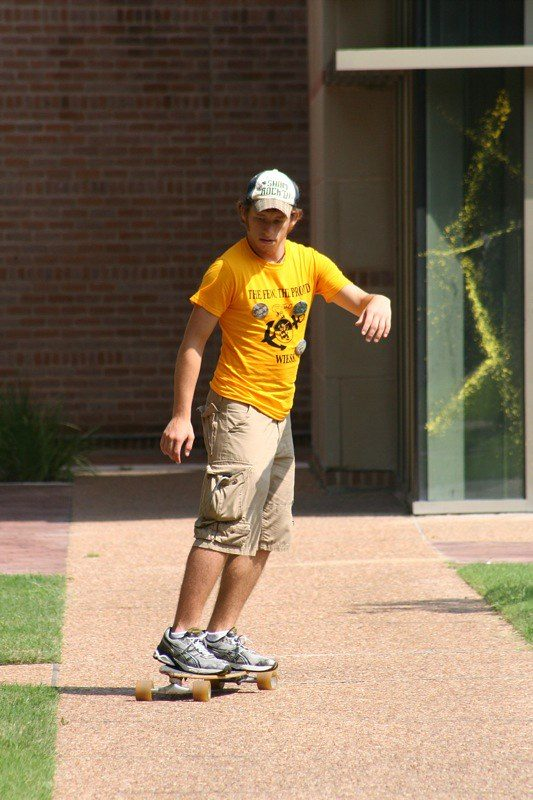
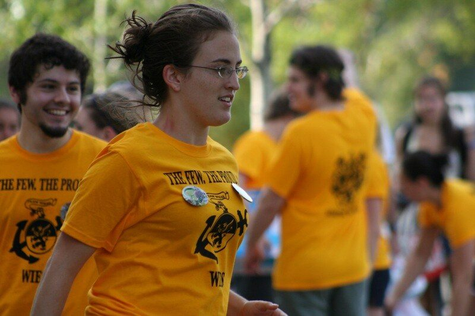
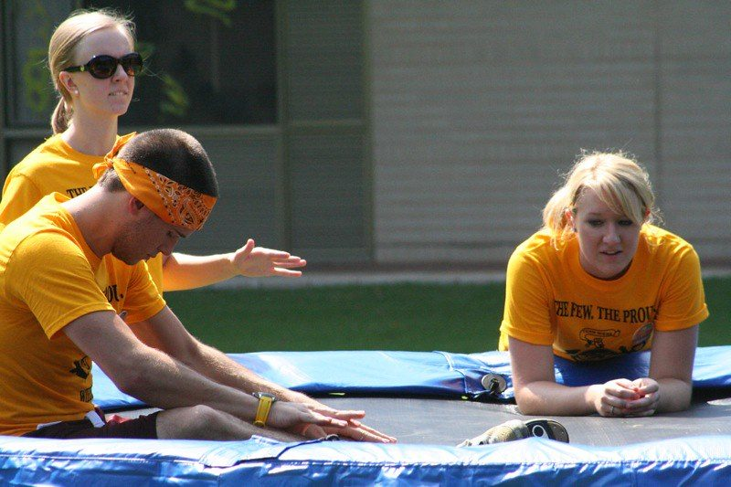
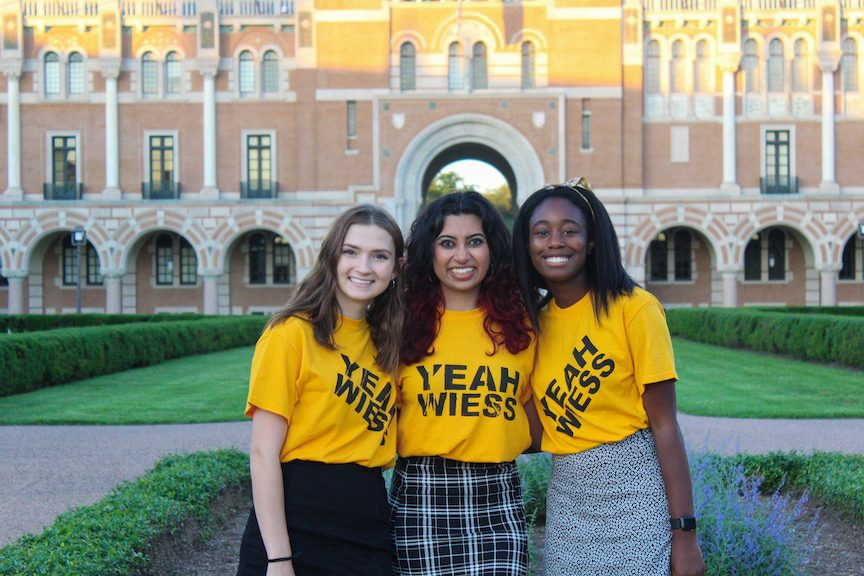

# O-Week

O-Week—Orientation Week, "Freshman Week" until the late 1970s—is the week before classes when each Rice college receives its new students. At Wiess it is run by the **Head Fellows** (two a year in the books of 2006–2015, three from 2016, three by constitutional rule in 2026), who lead the **Fellows**, upperclass Wiessmen each paired with a **Co-Fellow** from another college to look after an O-Week group of seven or eight new students, helped by sophomore **Gophers** (the 1994 handbook's "Gofers") and, from 2015, by specialist **Affiliates**. Every year since 2003 the Head Fellows have also written the O-Week book, which is the backbone of this site's record. Where other colleges choose a new theme each year, Wiess's theme has been Wiess itself: "Team Wiess" on the book covers of 2006–2017, "Team Family Wiess" in the Thresher's annual theme round-ups of 2023–2025, and, since at least 1998, a running joke about a college of "O-Week rebels without a theme" [@thresher-2024-02-oweek-themes]. What changes each year is the pun—"Wiess and Easy" in 2025 [@rice-news-2025-08-18-oweek-shirt], "Take it Wiess and easy", "All you need is Wiess", "Wiess is good" in the maintainer's recollection [@testimony-mullen-2026-10-05 O-Week] [T]—and the O-Week group names ("Wiess Wiess Baby", "HEB: Here Everything's Goldenrod"). Four books from the maintainer's collection (2019, 2021, 2024, 2025) carry the record past 2017: three Head Fellows every year, twelve O-Week groups, pun group names in the books from 2021, and from 2024 a Wiess "motto" rather than a theme—"Team Family Wiess is our motto" [@oweek-2019 p.36] [@oweek-2021 p.40] [@oweek-2024 p.2] [@oweek-2025 p.2]. The colors never change: goldenrod and black. New students get goldenrod shirts, Fellows and Co-Fellows black, and the Head Fellows several bright colors [@testimony-mullen-2026-10-05 O-Week] [T].

## Timeline

| When | What | Evidence |
|---|---|---|
| 1962–1977 | "Freshman Week" at Rice, as alumni recall it; Baker's Cabinet replaced the term with "Orientation Week" in March 1977 [@rhc 2018-01-31 when-did-it-become-o-week comments by Bob Toone '67 and Clark Herring Baker 1978] | [T] |
| 1989-08-25 | "O-week" in the Thresher by this issue (vol. 77 no. 2), per a reader's search [@rhc 2018-01-31 when-did-it-become-o-week comment by effegee, 31 Jan 2018] | [T] |
| 1993-08-05 | Constitution, Art. V: "the Fellows shall be responsible for the freshman orientation"; "Co-Fellows (members of another college) who shall work with the Fellows during freshman orientation" [@constitution-1993] | [P] |
| 1994 | Glossary: Fellows "Freshman advisors of Wiess College. Make sure they keep in touch with you once Freshman week is over"; Gofer "The 'Fellows'' flunkies. You'll see them running around a lot during O-Week" [@handbook-1994] | [P] |
| 1998 | The Campanile calls Wiess "O-Week rebels without a theme"—as quoted by the Thresher in 2024; the yearbook itself is not in our corpus [@thresher-2024-02-oweek-themes] | [R] |
| 1999-02-20 | Bylaws, Art. VIII: an elected faculty advisor orients "the Fellows preceding Freshman Week"; "An Orientation Week Coordinator shall be selected by a method determined by the current Fellows"; "Head Fellows" are last in the line of succession for the Court [@wb 19990220014631 http://riceinfo.rice.edu:80/projects/colleges/wiess/rules/bylaws.html] | [P] |
| 2003 | The first O-Week book in the corpus, compiled by Wiess's O-Week coordinator, who thanks "the other coordinators" [@oweek-2003 intro p.2]; "O-Week—1. The best week ever." [@oweek-2003 p.6]; arriving students are "greeted by a sea of goldenrod T-shirts" [@oweek-2003 conclusions p.9] | [P] |
| 2006 | Book signed "Your Head Fellows, Kaylan and Austin", who thank "Rachel, for providing the model and template for future Head Fellows" [@oweek-2006 p.2] [@oweek-2006 p.3]; twelve Fellows, each paired with someone from another college, groups of "about seven"; two Head Fellows with no group of their own [@oweek-2006 p.18]; Gophers "assistants to the head fellows and fellows" [@oweek-2006 p.32] | [P] |
| 2007–2011 | Head Fellows Sarah and Eddie (2007) [@oweek-2007 p.2], Alex and Bova (2008) [@oweek-2008 part 1 p.1], Brett and Tracy (2009) [@oweek-2009 part 2 p.4] [@oweek-2010 p.2], Natalie and Stuart (2010) [@oweek-2010 p.1], Alysa and Tyler (2011) [@oweek-2011 p.92] | [P] |
| 2010 | Glossary gains "Head Fellows—Organizers of O-Week and friends to all the new Wiessmen" [@oweek-2010 p.90] | [P] |
| 2014 | Twelve Fellows, each with a Co-Fellow; "we still love them and have adopted them into Team Family Wiess"; groups of "about eight"; Head Fellows Ryan and Victoria [@oweek-2014 p.17]; Fellows: "Some colleges may confuse you by calling them 'advisors'" [@oweek-2014 p.102]; Gophers "Three people you should definitely get to know!" [@oweek-2014 p.103] | [P] |
| 2015 | "What's a Head Fellow?": planning since January; "at other colleges, Head Fellows are called O-Week Coordinators and there are three of them instead of just two"; groups of 7–8 with a Fellow, a Co-Fellow, an Affiliate and Associates [@oweek-2015 p.26]; Gophers "are Wiess sophomores", "washing your O-Week shirts each night" [@oweek-2015 p.43]; Co-Fellows thanked "for proudly wearing goldenrod" [@oweek-2015 p.114] | [P] |
| 2016-01-26 | Constitution: "The Fellows shall be led by one or more Head Fellows, who shall be sophomores or juniors at the time of selection" [@constitution-2016 p.8] | [P] |
| 2016 | Three Head Fellows, Meagan, Liv and Yash [@oweek-2016 p.3]; Rice's university-wide book becomes the *Owlmanac* ("it adds in a fun owl pun!") [@owlmanac-2016 p.3] | [P] |
| 2017 | Head Fellows Abbey, Eugene and Richard [@oweek-2017 p.4]; Affiliates: "Peer Academic Advisors, Diversity Facilitators, Rice Health Advisors, Gophers, Photographer, and Videographer" [@oweek-2017 p.14]; the book and twelve group videos move to a "New Students" web page [@wb 20170714224814 http://teamwiess.com/newstudents/] | [P] |
| 2018 | Head Fellows Emma, Simi and Jacob, thanked "for all of their hard work and guidance as last year's Head Fellows" in the 2019 book [@oweek-2019 p.68] | [P] |
| 2019 | Head Fellows Riley, Erica and Olasina; move-in Sunday 18 August, then "a reception at the Magister's House" and check-in with the coordinator in the Commons [@oweek-2019 p.4] [@oweek-2019 p.9]; twelve groups of "7–8 new students", each "matched with three Fellows, and some Associates", one Fellow from another college; Affiliate Fellows "serve specific roles for the whole college"; "at other colleges, Head Fellows are called O-Week Coordinators" [@oweek-2019 p.36]; Affiliates: four PAAs, two Diversity Facilitators, an RHA, three Gophers ("Wiess sophomores who act as general assistants"), a photographer, a videographer and an Athlete Affiliate [@oweek-2019 p.65] [@oweek-2019 p.69]; the book's groups are listed by their Fellows' names, not by pun names [@oweek-2019 p.41] | [P] |
| 2020 | O-Week in the pandemic year. No 2020 book is held, but the 2021 book thanks "Anika, Varun, and Amy, for all of their hard work and guidance as last year's Head Fellows", a 2021 Fellow is praised by Fellows who "advised with her last year", and the 2021 contents page still carries the running head "O-WEEK 2020" [@oweek-2021 p.73] [@oweek-2021 p.57] [@oweek-2021 p.3]. The 2021 book's only open references to the pandemic are "an eventual post-pandemic trip" in an RA's biography, a Fellow's grin that "shines through her mask", and thanks for "optimism in ever-changing circumstances" [@oweek-2021 p.25] [@oweek-2021 p.63] [@oweek-2021 p.73] | [P] |
| 2021 | Three Head Fellows; twelve O-Week groups with pun names [@wb 20210724003059 http://teamwiess.com/new-students] | [P] |
| 2021 | The book: Head Fellows Serena, Aditi and Chichi ("SAC"); twelve groups, each named in the book; for the first time, "affinity letters" from Fellows to first-generation/low-income, Black, LGBTQ+, Latinx, international, transfer and student-athlete new students; Affiliates add an International Student Liaison and Photographers; four Gophers; an O-Week Instagram, @wiessoweek2021; "the O-Week mango-eating contest" listed as an annual tradition [@oweek-2021 p.4] [@oweek-2021 p.8] [@oweek-2021 p.18] [@oweek-2021 p.70] [@oweek-2021 p.17]; the dance room is for "your dance for the O-Week Talent Show" [@oweek-2021 p.35] | [P] |
| 2023 | Head Fellows Ryan, Addison and Wang, thanked as "last year's Head Fellows" in the 2024 book [@oweek-2024 p.58] | [P] |
| 2024 | Head Fellows Peter, Hannah and Barakat; "Here at Rice, we like to say that O-Week is forever"; twelve named groups of "7–9 new students" with "three or four Fellows"; Affiliate Fellows: Diversity Facilitators, three Gophers ("general assistants to the head fellows"), an RHA, photographers and a videographer, PAAs, an SMR, an Athlete Affiliate and an International Affiliate; the dance room is for "practicing the O-Week dance" [@oweek-2024 p.2] [@oweek-2024 p.41] [@oweek-2024 p.42] [@oweek-2024 p.11] | [P] |
| 2025 | Head Fellows Aislinn, Caden and Aria ("ACA"), the President's "O Week Coords"; twelve named groups; Diversity Facilitators renamed **Community Facilitators**; the cover is the 2024 template's, "2024 Wiess College O-Week" [@oweek-2025 p.2] [@oweek-2025 p.37] [@oweek-2025 p.43] [@oweek-2025 p.1] | [P] |
| 2025-08-18 | The university-wide O-Week shirt gives Wiess a panel with "a nod to its 'Wiess and Easy' spirit" [@rice-news-2025-08-18-oweek-shirt] | [P] |
| 2026-02-23 | Constitution, Art. IX: "Three Head Fellows shall be selected to coordinate O-Week by the previous O-Week's Head Fellow team"; Co-Fellows "currently enrolled members of another residential college"; Head Fellows plan [Big Bang](big-bang.md) with the Internal VP [@constitution-2026 p.13] [@constitution-2026 p.14] | [P] |
| 2026-10-05 | The maintainer: the theme is "Wiess" every year, with puns; always goldenrod and black—goldenrod for new students, black for Fellows and Co-Fellows, bright colors for the Head Fellows [@testimony-mullen-2026-10-05 O-Week] | [T] |

## The theme, year by year

Wiess's "theme" is the college. The table gathers what each year's sources call O-Week: the book's cover or opening line, the Thresher's theme round-up, and from 2021 the O-Week group names on the college's New Students page. Years missing from the table are years for which we hold nothing.

| Year | What the sources call it | Source | Evidence |
|---|---|---|---|
| 1998 | "O-Week rebels without a theme" (the Campanile, as quoted in 2024) | [@thresher-2024-02-oweek-themes] | [R] |
| 2003 | "Wiess O-Week 2003"; the welcome is signed "TEAM WIESS!" | [@oweek-2003 intro p.1] | [P] |
| 2006 | Cover: "Team Wi[ess] / O-Week 2006" | [@oweek-2006 p.1] | [P] |
| 2007 | Cover: "Team Wiess / O-Week 2007" | [@oweek-2007 p.1] | [P] |
| 2008 | Cover: "Team Wiess / O-Week 2008" | [@oweek-2008 cover p.1] | [P] |
| 2009 | "Wiess O-Week 2009" (running head; the cover was not captured) | [@oweek-2009 part 2 p.1] | [P] |
| 2010 | "Welcome to Team Wiess!" | [@oweek-2010 p.1] | [P] |
| 2011 | Cover: "Team Wiess / O-Week 2011"; "Welcome to Team Wiess!" | [@oweek-2011 p.1] [@oweek-2011 p.2] | [P] |
| 2014 | "WELCOME TO TEAM WIESS!" … "Welcome to Team Family Wiess!" | [@oweek-2014 p.2] | [P] |
| 2015 | "WELCOME TO WIESS" … "Welcome to Team Family Wiess!" | [@oweek-2015 p.2] | [P] |
| 2016 | Cover: "TEAM WIESS / O-WEEK 2016" | [@oweek-2016 p.1] | [P] |
| 2017 | Cover: "TEAM WIESS / O-WEEK 2017" | [@oweek-2017 p.1] | [P] |
| 2019 | Cover: "WIESS / O-WEEK / 2019", with the template's "O-WEEK 2016" still on it; history: "Welcome to Team Family Wiess!"; groups not named (listed by Fellows) | [@oweek-2019 p.1] [@oweek-2019 p.12] [@oweek-2019 p.41] | [P] |
| 2021 | Groups: Wiessparagus · Wiess in My Veins · Wiessed Coffee · Bachelors in Parawiess · Wiessadactyls · Warpigs in a Blanket · Peppa (War)Pig · Wiess Krispies · Warpigs of Waverly Place · HEB: Here Everything's Goldenrod · Wiess Wiess Baby · The Dark Warpig Rises: Wiess So Serious | [@wb 20210724003059 http://teamwiess.com/new-students] | [P] |
| 2021 (book) | Letter signed "Team Family Wiess, Your Head Fellows"; the book's group names differ from the web page's in three places: wiessparagus · wiess in my veins · wiessed coffee · bachelors in parawiess · wiessadactyls · warpigs in a blanket · peppa (war)pigs · wiess krispies · **wiessmen** of waverly place · heb: here everything's goldenrod · wiess, wiess baby · the dark warpig rises: wiess so serious? | [@oweek-2021 p.2] [@oweek-2021 p.45] [@oweek-2021 p.57] [@oweek-2021 p.61] [@oweek-2021 p.67] | [P] |
| 2022 | Groups: Wiessing on the Cake · Pigcasso · Wiess School Musical · The BACAyardigans · Pig Time Rush · Wiessicles · Pennywiess · Drivers Wiessence · Wiess's Olympig Warriors · Team Pigbull: Mr. World Wiess · Pigémon HeartGoldenrod · Wiess So Serious | [@wb 20220827005633 http://teamwiess.com/new-students] | [P] |
| 2023 | "Team Family Wiess"; "by not having a theme"; groups include "Wiess Spice" and "Piggy Azalea" (the college page adds Birds of Parawiess and Shrimp Fried Wiess) | [@thresher-2023-08-29-every-theme] [@wb 20230630234531 http://teamwiess.com/new-students] | [P] |
| 2024 | "Team Family Wiess"; "Expect Wiess-centric puns relating to things like war pigs and the color goldenrod" | [@thresher-2024-02-oweek-themes] | [P] |
| 2024 (book) | Cover: "2024 Wiess College O-Week"; "Team Family Wiess is our motto"; groups: Despigable Me · Fast and Furiwiess · The Fresh Pig of Bel-Air · James Bond: Goldenrod · Pig Hero 6 · Pigkini Bottom · Piglets of the Carribean · Snow Wiess and the Seven Warpigs · Star Wiess: Revenge of the Pigs · Studio Pigli: Spirited Awiess · The Wiess That Smiles Back: Gold Pig · Wiessburg Lettuce | [@oweek-2024 p.1] [@oweek-2024 p.2] [@oweek-2024 p.44] [@oweek-2024 p.55] | [P] |
| 2025 | "Team Family Wiess" (ranked ninth of the colleges' themes); on the university shirt, "Wiess and Easy" | [@thresher-2025-02-05-oweek-ranking] [@rice-news-2025-08-18-oweek-shirt] | [P] |
| 2025 (book) | Cover: "2024 Wiess College O-Week" (the 2024 template, unchanged); "Team Family Wiess is our motto that we live by"; groups: Bacon Bad · Alvin and the Pigmunks · The Wiess Is Right · The Pigtrix · PigXthaPlug · WhataWarpig · Sugar Spice And Everything Wiess · Papa's Wiesseria · Put The Wiess In The Bag · Pigcaso: Abstract Boar-Traits · Goldenrod State Warpigs · Mission Wiesspossible | [@oweek-2025 p.1] [@oweek-2025 p.2] [@oweek-2025 p.45] [@oweek-2025 p.56] | [P] |
| undated | "Take it Wiess and easy", "All you need is Wiess", "Wiess is good" | [@testimony-mullen-2026-10-05 O-Week] | [T] |

## colors

Goldenrod is the college color, and has been the O-Week color for as long as the books exist: in 2003 new students were "greeted by a sea of goldenrod T-shirts" [@oweek-2003 conclusions p.9] and told they would soon be "totally comfortable wearing a bright goldenrod shirt" [@oweek-2003 intro p.10]; in 2010 Wiessmen "proudly display our obnoxiously bright Goldenrod shirts (they will soon overrun your wardrobe)" [@oweek-2010 p.10]. The books of 2019–2025 say nothing about the Fellows' shirts except in their thanks, which every year repeat the 2015 line: "our Co-Fellows, for proudly wearing goldenrod and joining our family" [@oweek-2019 p.68] [@oweek-2021 p.73] [@oweek-2024 p.58] [@oweek-2025 p.59]; a 2021 Chief Justice "bleeds black and goldenrod" [@oweek-2021 p.31]. Today the scheme is goldenrod and black: goldenrod shirts for the new students, black for the Fellows and Co-Fellows, and several bright colors for the Head Fellows so that they can be found [@testimony-mullen-2026-10-05 O-Week] [T].

## As the college described it

!!! quote "1994 Freshman Handbook"
    "Fellows—Freshman advisors of Wiess College. Make sure they keep in touch with you once Freshman week is over - and don't let them run to Mexico with freshman group money." "Gofer—The 'Fellows'' flunkies. You'll see them running around a lot during O-Week, trying to make up for all the things the Fellows started and forgot to finish." [@handbook-1994]

!!! quote "O-Week Book 2003"
    "And what is this O-Week thing? Well, it can best be described by my co-fellow's fellow, when she contacted him in 2000: O-Week is one of the few times in your life that you can return to summer camp, except without a lot of the acne and peer-pressure." [@oweek-2003 intro p.1]

!!! quote "O-Week Book 2006"
    "Those are the Wiess fellows — upperclassmen handpicked to guide you through O-Week and to help you throughout the year. … But they aren't just O-Week fellows, they are your fellows forever." [@oweek-2006 p.18]

!!! quote "O-Week Book 2015"
    "One quick note—like Head Fellows, the term Fellows is used only at Wiess. At other colleges, Fellows are called advisors and there are two of them per O-Week group." [@oweek-2015 p.26]

!!! quote "O-Week Book 2016—glossary"
    "Fellows—Advisors for new Wiessmen. … These other colleges may confuse you by calling them 'advisors'—which technically, that is what they are, we just don't call them that." [@oweek-2016 p.13]

## O-Week events

!!! note "To be filled from the coordinators' events list"
    The Head Fellows' list of O-Week events (a spreadsheet promised by the maintainer) will go here: each event, the years it is known to have run, and its source. Until then, the books' own schedules are the record; the 2015 book's "What Is O-Week?" (p.6) and the 2016 and 2017 schedules are the places to start.

### Screen printing

Screen printing T-shirts was once an O-Week activity, before it became a study break [@testimony-mullen-2026-10-05c screen printing] [T]. No O-Week schedule or book in the corpus lists it, so its years as an O-Week event are testimony only. The equipment and the know-how are documented: a T-shirt screening representative titled "YEAH WIESS" from 2010 to at least 2017, the basement "used for storage and shirt screening" in the glossaries of 2014–2019, and "shirt-screening equipment" in the Bylaws of 2020 [@wb 20100826015923 http://teamwiess.com/reps.php] [@wb 20170421224822 http://teamwiess.com/reps.html] [@oweek-2014 p.102] [@oweek-2019 p.14] [@bylaws-2020 Art. III §2]. The 2021 O-Week coordinators were photographed in YEAH WIESS shirts (below) [@wb 20210619003837 http://teamwiess.com/images/oweek2021/coords.jpg]. The full record is on [Beer Bike](beer-bike.md#screen-printing-yeah-wiess-yeah-beer-yeah-water); the darkroom where the screens are kept is on [The basement and Sparky's](../places/basement-and-sparkys.md#the-darkroom-and-the-screens).

## Photographs

<!-- GALLERY:oweek -->

<figure markdown="span">
  { loading=lazy data-title="O-Week, late 2000s: skateboarding in a goldenrod shirt." data-description="Flickr; photographer not recorded · c.2008" data-gallery="oweek" }
  <figcaption>O-Week, late 2000s: skateboarding in a goldenrod shirt. <small>Flickr; photographer not recorded</small></figcaption>
</figure>

<figure markdown="span">
  { loading=lazy data-title="O-Week, late 2000s: goldenrod shirts at a run." data-description="Flickr; photographer not recorded · c.2008" data-gallery="oweek" }
  <figcaption>O-Week, late 2000s: goldenrod shirts at a run. <small>Flickr; photographer not recorded</small></figcaption>
</figure>

<figure markdown="span">
  { loading=lazy data-title="O-Week, late 2000s: on the slip-and-slide." data-description="Flickr; photographer not recorded · c.2008" data-gallery="oweek" }
  <figcaption>O-Week, late 2000s: on the slip-and-slide. <small>Flickr; photographer not recorded</small></figcaption>
</figure>

<figure markdown="span">
  { loading=lazy data-title="The 2021 O-Week coordinators (&#x27;coords&#x27; in the file name) in front of Lovett Hall, in YEAH WIESS shirts." data-description="teamwiess.com, O-Week 2021 · 2021" data-gallery="oweek" }
  <figcaption>The 2021 O-Week coordinators ('coords' in the file name) in front of Lovett Hall, in YEAH WIESS shirts. <small>teamwiess.com, O-Week 2021 [@wb 20210619003837 http://teamwiess.com/images/oweek2021/coords.jpg]</small></figcaption>
</figure>

<!-- /GALLERY:oweek -->

## Variants & disputes

- **A theme, or no theme?** The Thresher reports Wiess's theme as "Team Family Wiess" every year [@thresher-2023-08-29-every-theme] [@thresher-2024-02-oweek-themes] [@thresher-2025-02-05-oweek-ranking]; Rice News says Wiess "traditionally doesn't adopt a specific O-Week theme" [@rice-news-2025-08-18-oweek-shirt]; the maintainer says the theme is "Wiess" every year, played on with a new pun [@testimony-mullen-2026-10-05 O-Week] [T]. These are three descriptions of one practice: the college is the theme, "Team (Family) Wiess" is its standing name, and the puns ("Wiess and Easy") do the work other colleges' themes do. The books' covers say "Team Wiess" from 2006 to 2017 and "Team Family Wiess" appears in the welcome letters from 2014 [@oweek-2014 p.2]; see [Team Wiess](team-wiess.md) for TFW.
- **How old is the no-theme tradition?** The 1998 Campanile is the earliest witness, at second hand [@thresher-2024-02-oweek-themes]. Alumni recall shirt puns at other colleges ("Jell-o Week") arriving after the early 1980s [@rhc 2018-01-31 when-did-it-become-o-week comment by Marty Merritt (Hanszen '84/85), 1 Feb 2018] [T]; whether Wiess ever had a themed year is not recorded.
- **Who wears goldenrod?** In 2003 the greeters—upperclassmen and Fellows—wore goldenrod [@oweek-2003 conclusions p.9], and in 2015 the Co-Fellows were thanked "for proudly wearing goldenrod" [@oweek-2015 p.114]. Today Fellows and Co-Fellows wear black [@testimony-mullen-2026-10-05 O-Week] [T]. The change came after 2015; when is unrecorded. The books do not settle it: the thanks to Co-Fellows "for proudly wearing goldenrod" recur word for word in 2019, 2021, 2024 and 2025 [@oweek-2019 p.68] [@oweek-2025 p.59], which may mean they still wore it or only that the sentence was never rewritten.
- **How the color became goldenrod.** The 2006 book: Wiess "made the switch from brown and green college colors to our infamous goldenrod" (in a passage on the 1980s) [@oweek-2006 p.38]. The 2010 book: the college "voted on in the early days" for gold, "which became the goldenrod we know today probably through a joke of a Wiessman of the '80s" [@oweek-2010 p.38]; the early freshmen wore "goldenrod and navy beanies" [@oweek-2010 p.38]. The books agree on the 1980s and disagree on what came before.
- **One coordinator, two Head Fellows, three.** The 1999 Bylaws have a single "Orientation Week Coordinator" (and, separately, "Head Fellows") [@wb 19990220014631 http://riceinfo.rice.edu:80/projects/colleges/wiess/rules/bylaws.html]; the 2003 book was compiled by a coordinator [@oweek-2003 intro p.2]; two Head Fellows sign every book 2006–2015 [@oweek-2006 p.2] [@oweek-2015 p.2]; three from 2016 [@oweek-2016 p.3]; and the 2026 Constitution fixes the number at three [@constitution-2026 p.13]. In 2015 the book explained that other colleges call the same office "O-Week Coordinators" and have three [@oweek-2015 p.26].
- **Gofer, Gopher, Affiliate.** "Gofer" in 1994 [@handbook-1994]; "Gopher" from 2003, assisting the fellows and from 2008 the Head Fellows [@oweek-2003 p.4] [@oweek-2008 part 7 p.4]; the glossary drops the entry in 2015 but the book still has a Gophers page [@oweek-2015 p.43], and by 2017 Gophers are one kind of Affiliate [@oweek-2017 p.14].
- **Head Fellow or Coord; Fellow or Advisor.** The books of 2019 and 2021 still explain that "at other colleges, Head Fellows are called O-Week Coordinators" [@oweek-2019 p.36] [@oweek-2021 p.40]; the 2024 book drops the note. Inside Wiess the other word is in use anyway: a 2021 Head Fellow is "O-Week Coord", the 2024 Head Fellows complain of "coord classes", and the 2025 President thanks "Your O Week Coords (shoutout ACA)" [@oweek-2021 p.43] [@oweek-2024 p.43] [@oweek-2025 p.37]. The glossary entry "Fellows" became "Fellows/Advisors" in 2024, while keeping "These other colleges may confuse you by calling them 'Advisors,' but we don't call them that" [@oweek-2024 p.25]. Gophers keep their name through 2025, three or four a year [@oweek-2021 p.70] [@oweek-2025 p.43].
- **The 2021 group names, book and web.** The college's New Students page has "Warpigs of Waverly Place", "Peppa (War)Pig" and "Wiess Wiess Baby" [@wb 20210724003059 http://teamwiess.com/new-students]; the book has "wiessmen of waverly place", "peppa (war)pigs" and "wiess, wiess baby" [@oweek-2021 p.61] [@oweek-2021 p.57] [@oweek-2021 p.65]. Both are the college's own; the book is the later and more careful text.

## Open questions

- The theme pun for each year: the covers of 2019–2025 carry no pun (2019's still says "O-WEEK 2016", 2025's "2024"), and the shirts for 2018–2026 are not in the corpus. The coordinators' files, the Thresher's annual theme articles (the 4 Feb 2026 round-up, "Animatronics, gladiators and dinosaurs", could not be fetched) and photographs would fill the table.
- O-Week books not held: 1995–2002, 2004–05, 2012–13, 2018, 2020, 2022–23 and 2026, and the 2009 cover; 2019, 2021, 2024 and 2025 are now held from the maintainer's collection. See [Wanted](../sources/wanted.md).
- The O-Week of 2020: the 2021 book shows it happened, with Head Fellows Anika, Varun and Amy [@oweek-2021 p.73], but not how—in person, online or mixed. The 2020 book, the Thresher of August 2020, or the 2020 Head Fellows would say.
- Which years screen printing was an O-Week activity; the coordinators' events list would show it.
- When the black Fellows' shirt replaced goldenrod, and when the Head Fellows' bright colors began.
- The 1998 Campanile page itself.
- When the faculty advisor of the 1990s Bylaws disappeared, and when the Orientation Week Coordinator became the Head Fellows.

Last reviewed 2026-10-05 by unreviewed · [Edit this page](#)

