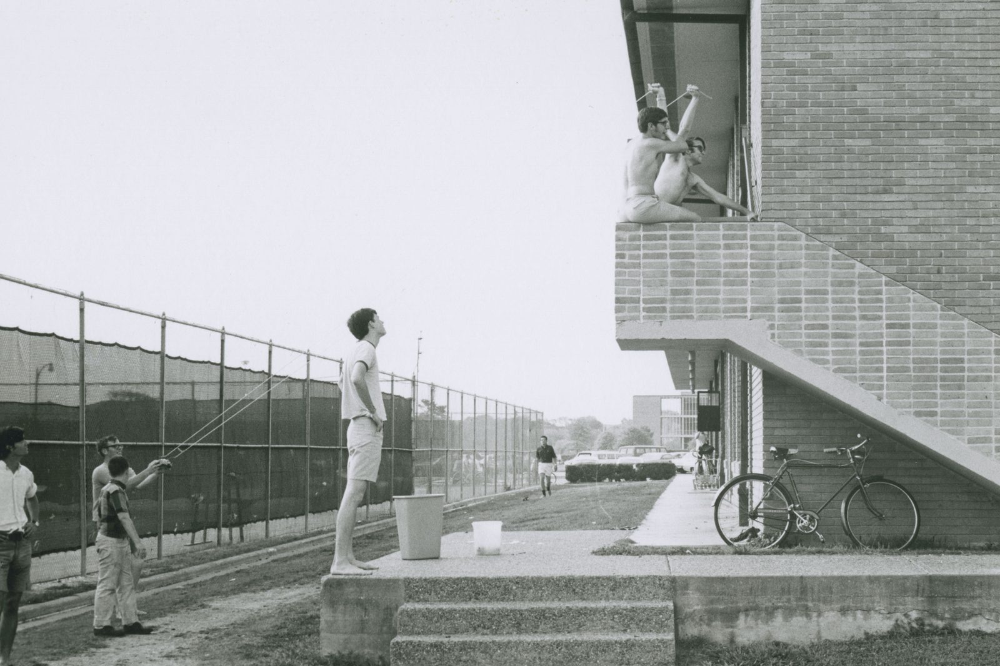
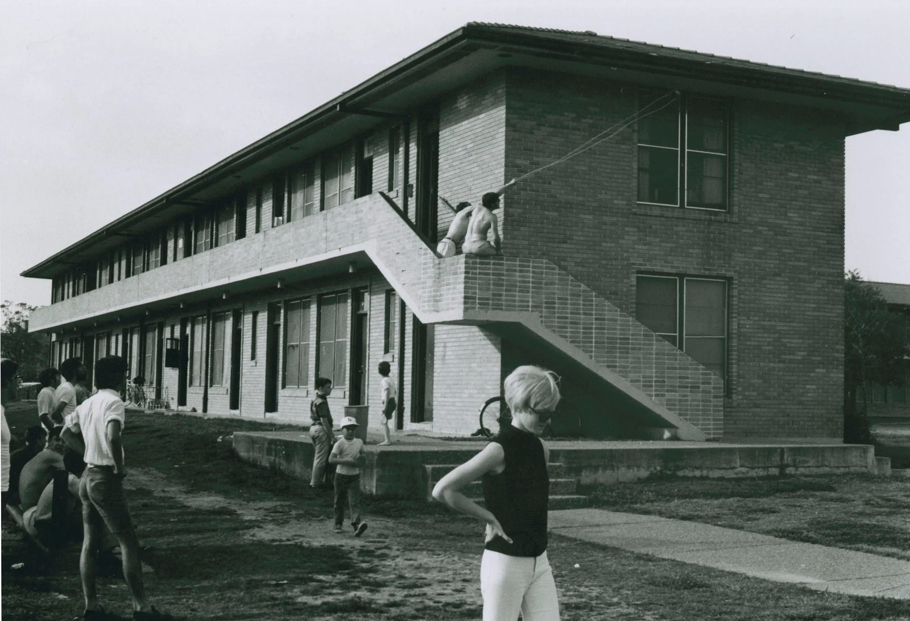

# Gazilchers

Giant slingshots. Water balloons. Hanszen in range. What could go wrong?

!!! abstract "TL;DR"
    - A gazilcher is a giant slingshot made of surgical tubing, run by a crew of about five, that could throw things "well over 100 meters" [@physicsforums-gazilcher-2010].
    - Water wars between Wiess and Hanszen were on by spring 1961, with "Giant slingshots made of wire, cloth and surgical tubing" [@thresher-1961-04-07-water-wars].
    - The administration shut them down after property damage, by about 1991 [@rhc 2011-04-15 friday-afternoon-follies-3 comment by Joseph Lockett ('91), 15 Apr 2011].
    - By the early 2000s owning one was "a rusticatable offense" (one that could get you sent away from campus) [@rhc 2011-04-15 friday-afternoon-follies-3 comment by CW McCullagh, 1 May 2011].

## What it was

Surgical tubing, a pouch (classically a cafeteria silverware basket), and five people pulling: "a large slingshot (operated by five people at once, and capable of launching objects well over 100 meters in distance)" [@physicsforums-gazilcher-2010].

In 1961 the ammo was water balloons [@thresher-1961-04-07-water-wars]. Later came "mystery meat," hockey pucks [@rhc 2011-04-15 friday-afternoon-follies-3 comment by C Kelly, 15 Apr 2011], and cartons of Dannon yogurt [@rhc 2011-04-15 friday-afternoon-follies-3 comment by Gloria Meckel Tarpley '81, 16 Apr 2011].

## The water wars

In March 1961 the battle moved to "the Hanszen-Wiess courtyard." It left "a carpet of broken balloons between Wiess and Hanszen, a dozen broken windows," and an ad: "For Sale: Surgical-Tubing water balloon sling" [@thresher-1961-04-07-water-wars].

Hanszen fired too. One alum remembers shelling Wiess with "the Hanszen College Artillery" in the mid-1960s [@rhc 2016-05-24 hanging-out-at-wiess comment by Barney L. McCoy (Hanszen '67), 26 May 2016]. Gazilchers were "still prevalent" at Wiess in 1983–87 [@rhc 2011-04-15 friday-afternoon-follies-3 comment by Lisa Childs (Wiess '87), 15 Apr 2011].

## Why it stopped

Stuff broke. One alum recalls 1970s damage to Wiess's clay roof tiles of "around $1,000 – $2,000 which was serious money in those days" [@rhc 2011-04-15 friday-afternoon-follies-3 comment by Richard Miller, 18 Apr 2011]. The slingshots "eventually were suppressed by the administration after they began causing property damage" [@rhc 2011-04-15 friday-afternoon-follies-3 comment by Joseph Lockett ('91), 15 Apr 2011].

## Photographs

<!-- GALLERY:gazilchers -->

<figure markdown="span">
  { loading=lazy data-title="Water balloons launched from the west wing of Old Wiess. The file is dated 1970; an alumnus who was there dates it c.1961–62." data-description="Rice History Corner, 6 May 2011 · c.1961–70" data-gallery="gazilchers" }
  <figcaption>Water balloons launched from the west wing of Old Wiess. The file is dated 1970; an alumnus who was there dates it c.1961–62. <small>Rice History Corner, 6 May 2011 [@rhc 2011-05-06 friday-afternoon-follies-plus-a-campus-quiz] [@rhc 2011-05-06 friday-afternoon-follies-plus-a-campus-quiz comment by Dagobert Brito (Wiess '63), 7 May 2011]</small></figcaption>
</figure>

<figure markdown="span">
  { loading=lazy data-title="The same battery from the side: a stretched launcher on the Old Wiess stair landing." data-description="Rice History Corner, 6 May 2011 · c.1961–70" data-gallery="gazilchers" }
  <figcaption>The same battery from the side: a stretched launcher on the Old Wiess stair landing. <small>Rice History Corner, 6 May 2011 [@rhc 2011-05-06 friday-afternoon-follies-plus-a-campus-quiz]</small></figcaption>
</figure>

<!-- /GALLERY:gazilchers -->

??? info "The receipts: timeline"

    | When | What | Evidence |
    |---|---|---|
    | 1960 | Rice History Corner photographs of a water-balloon battle between colleges, captioned by the archivist "Total mayhem" [@rhc 2011-04-15 friday-afternoon-follies-3] | [P] |
    | 1961-03 to 04 | Thresher: "Giant slingshots made of wire, cloth and surgical tubing" appear on 20 March; the water war "shifted to the Hanszen-Wiess courtyard", leaving "a carpet of broken balloons between Wiess and Hanszen, a dozen broken windows"; "For Sale: Surgical-Tubing water balloon sling" [@thresher-1961-04-07-water-wars] | [P] |
    | mid-1960s | Hanszen fires on Wiess: "Jerry Hafter and I would shell Wiess with the Hanszen College Artillery — i.e. doubled-up surgical tubing water balloon slingshot" [@rhc 2016-05-24 hanging-out-at-wiess comment by Barney L. McCoy (Hanszen '67), 26 May 2016] | [T] |
    | 1960s–70s | Slingshots built on 2-by-4 frames for accuracy; ammunition widened to "mystery meat" and hockey pucks, aimed at Will Rice [@rhc 2011-04-15 friday-afternoon-follies-3 comment by C Kelly, 15 Apr 2011] | [T] |
    | late 1970s | "The gazilcher wars": individual cartons of Dannon yogurt launched between colleges [@rhc 2011-04-15 friday-afternoon-follies-3 comment by Gloria Meckel Tarpley '81, 16 Apr 2011] | [T] |
    | 1970s | Damage to the clay roof tiles on Wiess "to the tune of around $1,000 – $2,000 which was serious money in those days" [@rhc 2011-04-15 friday-afternoon-follies-3 comment by Richard Miller, 18 Apr 2011] | [T] |
    | 1983–87 | "Gazilchers were still prevalent when I was there" [@rhc 2011-04-15 friday-afternoon-follies-3 comment by Lisa Childs (Wiess '87), 15 Apr 2011] | [T] |
    | by c.1991 | The devices "eventually were suppressed by the administration after they began causing property damage" [@rhc 2011-04-15 friday-afternoon-follies-3 comment by Joseph Lockett ('91), 15 Apr 2011] | [T] |
    | early 2000s | "Possession of one in the early 2000s was a rusticatable offense" [@rhc 2011-04-15 friday-afternoon-follies-3 comment by CW McCullagh, 1 May 2011] | [T] |
    | 2010-02-01 | A physics-forum question describes the Rice gazilcher — surgical tubing, a silverware basket, five operators, "well over 100 meters" — and asks how far it could throw a water balloon through a dormitory window [@physicsforums-gazilcher-2010] | [T] |

??? info "Arguments & loose ends"

    **Where sources disagree.**

    - **When the ban came.** The sources give a direction, not a date: still around in 1987 (Childs), "suppressed" by about 1991 (Lockett), a serious offense by the early 2000s (McCullagh). A rule may be in [the 1991 Rules](../../governance/rules.md) or the Thresher.
    - **The word.** "Gazilcher" is the only spelling found. Where it came from is unknown. The 1956–1994 Thresher never uses it; it says "slingshot" and "water balloon" instead [@thresher-1961-04-07-water-wars].

    **Still don't know.**

    - The rule or announcement that banned them, and its date (Thresher 1985–95; Rice's student handbook).
    - Whether Wiess had a named crew or weapon, like Hanszen's "Artillery."
    - Photos of a gazilcher in action. The 1960 Rice History Corner images might show one; the 2011 commenters thought so.

Last reviewed 2026-10-05 · unreviewed draft

