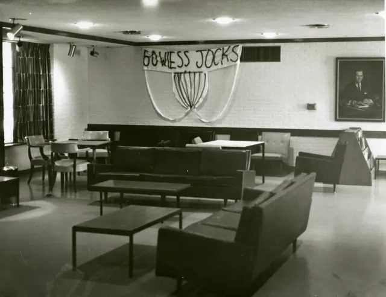

# Jock Row

Jock Row is the oldest tradition in this section and was already dead when the oldest source we have described it. The 1994 Freshman Handbook's history of the college, as transcribed on the 1997–2000 website, explains the building's appeal in 1949—balconies, private showers, cross-ventilation—and adds: "In addition, the proximity of the west wing to the gymnasium led to one of Wiess' oldest, though now defunct, traditions, 'Jock Row' (Wiess was never formally an athlete's dormitory)" [@riceinfo-history]. That sentence is the whole record. Jock Row was a row—a wing, a floor or a corridor—of Old Wiess's west wing where athletes lived because the gym was next door; it was a tradition, not a policy; and by 1994 it was gone. No later history, book or website repeats even the name. An undated photo shows a "banner" made out of bedsheets to creatively represent a jock strap and the words "we support our jocks" written on the wall.

## Timeline

| When | What | Evidence |
|---|---|---|
| 1949 | Wiess Hall opens; "the proximity of the west wing to the gymnasium" [@riceinfo-history] | [R] |
| before 1994 | Jock Row flourishes and ends—"one of Wiess' oldest, though now defunct, traditions" [@riceinfo-history] | [R] |
| 1994 | The handbook history records it as defunct [@riceinfo-history] | [P] |
| 2003–2017 | Absent from every O-Week history, which skip from the 1957 college system to the Talmage years without it [@oweek-2003 35-44 wiess.pdf p.3] [@oweek-2017 p.12] | [P] |

## As the college described it

!!! quote "1994 Freshman Handbook (riceinfo site, 'The History of Wiess College')"
    "Wiess possessed functional advantages which more than made up for its rather plain exterior appearance. Among these were (and are) outside balconies connecting all rooms, private showers between every two rooms, built-in closets and drawers, and cross-ventilation (no rooms were then air-conditioned). In addition, the proximity of the west wing to the gymnasium led to one of Wiess' oldest, though now defunct, traditions, 'Jock Row' (Wiess was never formally an athlete's dormitory)." [@riceinfo-history]

## Photographs

<!-- GALLERY:jockrow -->

<figure markdown="span">
  { loading=lazy data-title="A banner in the Old Wiess Commons supporting the Wiess jocks. Undated; commenters guess the 1960s or early 1970s." data-description="Rice History Corner, 20 May 2016 · undated (1960s–70s?)" data-gallery="jockrow" }
  <figcaption>A banner in the Old Wiess Commons supporting the Wiess jocks. Undated; commenters guess the 1960s or early 1970s. <small>Rice History Corner, 20 May 2016 [@rhc 2016-05-20 friday-follies-go-wiess-jocks]</small></figcaption>
</figure>

<!-- /GALLERY:jockrow -->

## Variants & disputes

- **A reputation, not a rule.** The handbook's parenthesis—"Wiess was never formally an athlete's dormitory"—is a correction of something, presumably a campus belief that Wiess *was* the athletes' dorm. The 2003 book's claim that in the dormitory years "nobody had real loyalty to the building they lived in" sits oddly beside a wing that athletes chose on purpose [@oweek-2003 35-44 wiess.pdf p.3]; both can be true of different decades.
- **Which wing.** "The west wing" in the handbook [@riceinfo-history]. The 1994 glossary places the Backabowl "between the singles wing and the three story wing" [@handbook-1994]; which of Old Wiess's wings was "west" and nearest the gymnasium is a question for the [Old Wiess](../../places/old-wiess.md) page and the architecture page [@riceinfo-architecture].

## Open questions

- When Jock Row existed and when it ended. Nothing in the corpus dates either end; the Thresher of the 1950s–70s and the Campanile are the places to look [@thresher-portal].
- Whether Rice's athletic department ever housed athletes at Wiess by arrangement, formal or not; the handbook denies the formal version only [@riceinfo-history].
- Whether the printed 1994 handbook says more than the website transcription [@handbook-1994].

Last reviewed 2026-10-04 by unreviewed · [Edit this page](#)

