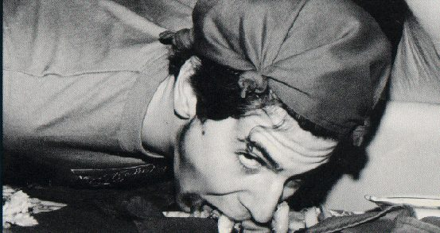

# Norse Night

A whole Commons eating like Vikings. No forks. Napkins on heads. You can guess how it ended.

!!! abstract "TL;DR"
    - Norse Night filled the [Commons](../../places/commons.md) (the dining hall) with "Viking tables": eat with your hands, make a mess [@riceinfo-norse] [@handbook-1994].
    - The only dated one is "Norse Night '91," which took an hour and a half to clean up [@riceinfo-norse].
    - Hoped-for in 1997, "Sadly Seem To Be Dying Out" by the end of 1999. Nothing after [@riceinfo-traditions-1997] [@riceinfo-traditions-1999].

## What it was

Start with the Viking Table: "A chance to eat with your hands and generally make a mess. Viking people must clean up after they are through" (1994) [@handbook-1994]. Norse Night was a Commons full of them [@riceinfo-norse].

Food went straight onto the tablecloth. Tables went into a U so "somebody can just run along the inside of the 'U' dropping food as they go." Napkins went on heads so "the gravy doesn't get in your eyes" [@riceinfo-norse].

## The one we know about

In 1991 people threw food. The writer remembers "the hour and a half it took to clean up, even with several dozen people helping." Also: "we were told afterwards that we weren't supposed to" [@riceinfo-norse].

## Why it stopped

Nobody says. The 1997 website wanted it to continue; the December 1999 version moved it to "Sadly Seem To Be Dying Out" [@riceinfo-traditions-1997] [@riceinfo-traditions-1999]. No O-Week book from 2003 on mentions Norse Night or the Viking Table [@oweek-2003 p.3].

## Photographs

<!-- GALLERY:norse -->

<figure markdown="span">
  { loading=lazy data-title="The Campanile photograph on the 1999 Norse Night page: a Viking-table diner, napkin on head." data-description="riceinfo Wiess site, 1999 (a Campanile photograph) · before 1999" data-gallery="norse" }
  <figcaption>The Campanile photograph on the 1999 Norse Night page: a Viking-table diner, napkin on head. <small>riceinfo Wiess site, 1999 (a Campanile photograph) [@riceinfo-norse]</small></figcaption>
</figure>

<!-- /GALLERY:norse -->

??? info "The receipts: timeline"

    | When | What | Evidence |
    |---|---|---|
    | 1991 | "Norse Night '91": food thrown, ninety minutes' clean-up, "we were told afterwards that we weren't supposed to" [@riceinfo-norse] | [R] |
    | 1994 | Glossary: "Viking Table—A chance to eat with your hands and generally make a mess. Viking people must clean up after they are through" [@handbook-1994] | [P] |
    | 1997-08-11 | "Norse Night" among "Traditions We'd Sure Like To See Continue" [@riceinfo-traditions-1997] | [P] |
    | 1999-06-23 | Its page, "I wanna be a Viking, a Viking Viking Viking...", with a Campanile photograph of "Bloomie gorging himself" [@riceinfo-norse] | [P] |
    | 1999-12-30 | Moved to "Traditions That Sadly Seem To Be Dying Out" [@riceinfo-traditions-1999] | [P] |
    | 2003–2017 | Neither Norse Night nor Viking Table in any O-Week glossary; the 2003 book's Family Style entry describes the weekly sit-down dinner instead [@oweek-2003 p.3] | [P] |

??? quote "In the college's own words"

    "The best days to do it are on Fridays, 'cause there's no family-style and folks who don't wanna Vike (is that a verb?) will probably go out to eat anyway… You shouldn't [throw food], since the Court may still fine you, and besides that, you'll get to clean it all up." [@riceinfo-norse]

??? info "Arguments & loose ends"

    **Where sources disagree.**

    - **Who started it.** Even the 1999 writer hedges: "somebody came up with the idea… (although it may not have been the first; I can't say for sure)" [@riceinfo-norse]. He writes like he was there in 1991 ("we were told afterwards"), so the page is partly a memory.
    - **Continue, or dying?** "We'd Sure Like To See Continue" in 1997; "Sadly Seem To Be Dying Out" in 1999 [@riceinfo-traditions-1997] [@riceinfo-traditions-1999]. The June 1999 page already talks about it in the past tense.
    - **Why Fridays.** "There's no family-style" on Fridays [@riceinfo-norse]. That fits the Old Wiess years, when family-style dinner ran on weeknights; it ended around 2004 [@oweek-2006 p.42]. See [Formal Dinner](formal-dinner.md).

    **Still don't know.**

    - Whether any Norse Night happened after 1991 [@riceinfo-norse].
    - Which Campanile volume has the "Bloomie" photo; the image file `norse1small` is in the riceinfo mirror [@riceinfo-site].
    - Whether other colleges still do Viking tables; the page says the custom "isn't just at Wiess" [@riceinfo-norse].

Last reviewed 2026-10-04 by unreviewed · [Edit this page](#)

