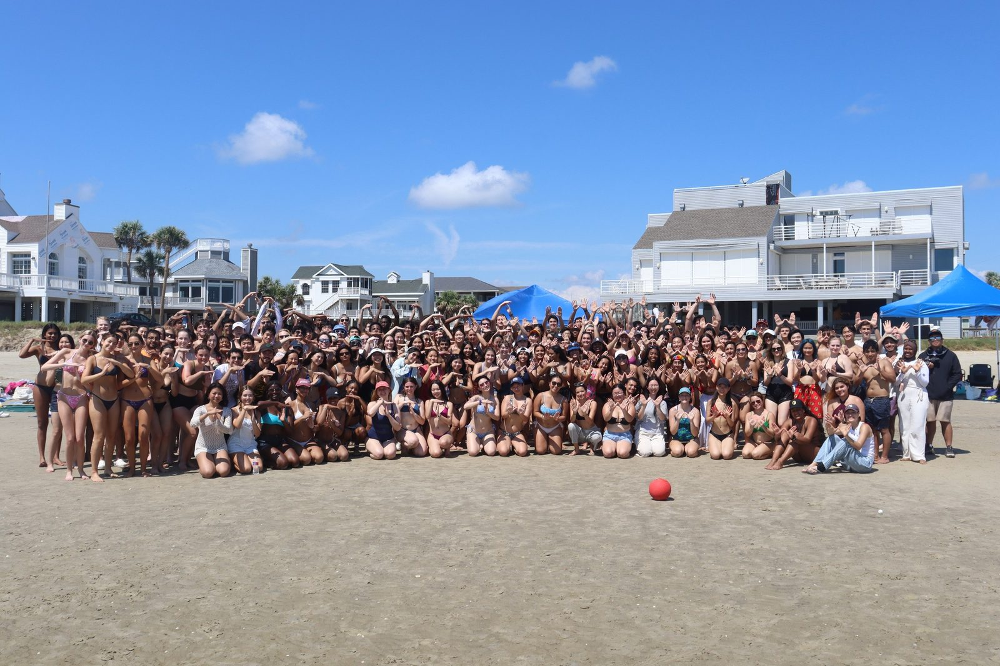

# Summit

Every fall, Wiess leaves campus to talk about the college, make plans, and get sunburned together.

!!! abstract "TL;DR"
    - Summit is Wiess's early-fall retreat: a day (or weekend) away to discuss the college, plan the year, and bond [@oweek-2003 35-44 wiess.pdf p.8] [@oweek-2015 p.23].
    - It first shows up in February 1999, as a job of the Internal Vice President [@riceinfo-cabinet]. The 2026 Constitution still gives it to that officer [@constitution-2026 p.6].
    - It moved from "the beach or in the hill country" to a boat (by 2007) to Galveston (2021) [@oweek-2003 35-44 wiess.pdf p.8] [@wb 20080903215453 http://teamwiess.com/index.php?r=lastnotes] [@oweek-2021 p.19].
    - We haven't found the first Summit yet.

## What it's for

"Some of the best ideas of activities for the year and ways to improve the college come from Summit," said the 2003 book [@oweek-2003 35-44 wiess.pdf p.8]. It's also "an awesome chance to soak up the sun and play in the sand" with upperclassmen [@oweek-2015 p.23].

The Internal Vice President, a [Cabinet](../governance/cabinet.md) officer, plans it, along with Pumpkin Caroling and Big Bang [@oweek-2019 p.25] [@constitution-2026 p.6].

## Beach, hills, boat

Through 2010 the books said "beach or in the hill country" [@oweek-2010 p.44]. But in August 2008, Cabinet was already choosing between "the boat club like last year for $300 and a normal beach for $50" [@wb 20080903215453 http://teamwiess.com/index.php?r=lastnotes] [@teamwiess-lastnotes-2008]. The beach was called "mad dirty."

The books caught up in 2011: "lately we've enjoyed holding Summit on a boat (and there might even be a water slide if you're lucky!)" [@oweek-2011 p.45]. In 2014: "there is really no downside to this" [@oweek-2014 p.43]. Since 2021 the glossary says Galveston [@oweek-2021 p.19] [@oweek-2025 p.26].

## Photographs

<!-- GALLERY:summit -->

<figure markdown="span">
  { loading=lazy data-title="Summit 2024: the college on the beach (date from the file name)." data-description="TFWKB photo collection; source not recorded · 2024" data-gallery="summit" }
  <figcaption>Summit 2024: the college on the beach (date from the file name). <small>TFWKB photo collection; source not recorded</small></figcaption>
</figure>

<!-- /GALLERY:summit -->

??? quote "In the college's own words"
    "Usually held at the beach or in the hill country, it's also a chance to get away from Houston while bonding with fellow Wiessmen." [@oweek-2003 35-44 wiess.pdf p.8] (barely changed in 2006–2010 [@oweek-2006 p.43] [@oweek-2010 p.44])

    "[The organiser] says summit will be fun like a party even though it is not a party … As a Floridian, I am naturally averse to Texas 'beaches'." [@wb 20080903215453 http://teamwiess.com/index.php?r=lastnotes]

    "a day-long retreat at the beach (or on a boat depending on what era of Wiess history we're in)" [@oweek-2015 p.23] (unchanged in 2016 and 2017 [@oweek-2016 p.31] [@oweek-2017 p.32])

    The glossary: "Weekend retreat to discuss Wiess issues and bond far away from campus" (2003–2011) [@oweek-2003 p.4] [@oweek-2011 p.93]; "…and bond on a boat" (2014) [@oweek-2014 p.103]; "…with other Wiessmen" (2015–2017) [@oweek-2015 p.119] [@oweek-2017 p.15]; "The weekend retreat to Galveston during the fall semester to bond with other Wiessmen" (2021–2025) [@oweek-2021 p.19] [@oweek-2025 p.26].

??? info "The receipts: timeline"
    | When | What | Evidence |
    |---|---|---|
    | 1994 | Not this Summit: the Freshman Handbook's "Summit" is the Houston arena where "as many as 100 Wiessmen were known to show up… to cheer" Pace Mannion of the Utah Jazz [@handbook-1994] | [P] |
    | 1999-02-19 | Earliest attestation: the Internal Vice President "is the executive vice president, responsible for Summit, Pumpkin Caroling, and taking over when [the President]'s out of town" [@wb 19990219085339 http://riceinfo.rice.edu/projects/colleges/wiess/people/cabinet.html] | [P] |
    | 2001-02 | Same sentence, new officer, on the last riceinfo Cabinet page [@wb 20010219002416 http://riceinfo.rice.edu/projects/colleges/wiess/people/cabinet.html] | [P] |
    | 2003 | "Early in the fall, Wiess takes a weekend to discuss issues at the college and plans for the coming year. Usually held at the beach or in the hill country" [@oweek-2003 35-44 wiess.pdf p.8]; glossary: "Weekend retreat to discuss Wiess issues and bond far away from campus" [@oweek-2003 p.4] | [P] |
    | 2007 (fall) | Summit held at "the boat club" (inferred from "like last year" in the 2008 minutes) [@wb 20080903215453 http://teamwiess.com/index.php?r=lastnotes] | [P] |
    | 2008-08-28 | Cabinet: Summit "will be fun like a party even though it is not a party"; venues "the boat club like last year for $300 and a normal beach for $50"; the beach "is mad dirty"; date "Saturday, the weekend of September 20th, the weekend after 80s party… and before parent's weekend" [@wb 20080903215453 http://teamwiess.com/index.php?r=lastnotes] | [P] |
    | 2010 | Book still says "Usually held at the beach or in the Hill Country" [@oweek-2010 p.44] | [P] |
    | 2011 | First book to mention the boat: "In years past, Summit has been held at the beach or in the Hill Country, but lately we've enjoyed holding Summit on a boat (and there might even be a water slide if you're lucky!)" [@oweek-2011 p.45] | [P] |
    | 2014 | "lately we've taken to holding Summit on a boat (there is really no downside to this)" [@oweek-2014 p.43]; glossary: "Weekend retreat to discuss Wiess issues and bond on a boat" [@oweek-2014 p.103] | [P] |
    | 2014–2015 | teamwiess.com traditions page: "Historically, Summit has been held at the beach or in the Hill Country, but lately we've taken to holding Summit on a boat" [@wb 20150313224552 http://teamwiess.com/traditions.html] | [P] |
    | 2015 | "a day-long retreat at the beach (or on a boat depending on what era of Wiess history we're in)" [@oweek-2015 p.23]; the same book's glossary says "Weekend retreat during the fall semester" [@oweek-2015 p.119] | [P] |
    | c.2015–2017 | Wiess Associates site, "Wiess Traditions": "Summit: In early fall, every Wiessman is invited to Summit, a day-long retreat at the beach (or on a boat depending on what era of Wiess history we're in) to discuss issues at the college and devise plans for the year." [@wb 20170101000000 https://wiessassociates.rice.edu/wiess-101-for-associates/wiesstraditions/] | [P] |
    | 2017 | Internal VP "coordinating Summit, Wiess Shark Tank, Pumpkin Caroling, and Big Bang, whatever that is" [@oweek-2017 p.25] | [P] |
    | 2019 | Glossary: "Weekend retreat to a body of water (pool/beach/lake/etc.) during the fall semester to discuss Wiess issues and bond with other Wiessmen"; traditions keep the 2015 "day-long retreat at the beach (or on a boat…)"; the Internal VP is "coordinating Summit and Pumpkin Caroling" [@oweek-2019 p.15] [@oweek-2019 p.32] [@oweek-2019 p.25] | [P] |
    | 2021 | Glossary: "The weekend retreat to Galveston during the fall semester to bond with other Wiessmen"—the first book to name the place, and the first glossary without "discuss Wiess issues"; Internal VP "coordinating the traditions of Summit and Pumpkin Caroling" [@oweek-2021 p.19] [@oweek-2021 p.28] | [P] |
    | 2023-12 | `summit2023.jpeg` on the current site's home page [@wb 20231202011316 https://wiess.rice.edu/images/home/summit2023.jpeg] [@wiess-rice-edu asset-manifest.json] | [P] |
    | 2024–2025 | Glossary unchanged ("to Galveston"); traditions text unchanged since 2015, "a day-long retreat at the beach (or on a boat depending on what era of Wiess history we are in)" [@oweek-2024 p.25] [@oweek-2024 p.38] [@oweek-2025 p.26] [@oweek-2025 p.39] | [P] |
    | 2026-02-23 | Constitution: the Internal Vice President shall "Plan Wiess College Summit and Big Bang" [@constitution-2026 p.6] | [P] |

??? info "Arguments & loose ends"
    **Where sources disagree.**

    - **A weekend or a day?** Every glossary says "Weekend"; every traditions page since 2015 says "day-long," sometimes in the same book [@oweek-2015 p.23] [@oweek-2015 p.119] [@oweek-2019 p.15] [@oweek-2019 p.32] [@oweek-2025 p.26] [@oweek-2025 p.39]. The 2008 minutes say a Saturday [@wb 20080903215453 http://teamwiess.com/index.php?r=lastnotes]. The glossary line was copied from 2003; the 2015 rewrite is the better guide.
    - **When did the boat start?** The books say 2011 [@oweek-2011 p.45], but the 2008 minutes say "like last year," so fall 2007 [@wb 20080903215453 http://teamwiess.com/index.php?r=lastnotes]. The 2008 and 2010 books were still copying 2003 [@oweek-2008 part 3 p.8] [@oweek-2010 p.44].
    - **First mention.** The traditions index here says 2003; the 1999 Cabinet page is four years earlier [@riceinfo-cabinet]. The 1994 handbook's "Summit" is the Houston arena, not this [@handbook-1994]. A search of the Thresher to 1994 found only the arena.

    **Still don't know.**

    - When Summit began. Try the 1999 Cabinet minutes and the Woodson Cabinet records [@woodson-ua0079].
    - Which boat club, and which beach? The 2008 minutes also float "Treasure Island" [@wb 20080903215453 http://teamwiess.com/index.php?r=lastnotes].
    - Is it still a boat in 2026? The `summit2023` photo hasn't been looked at [@wiess-rice-edu asset-manifest.json].
    - The Wiess Associates traditions page is quoted from the archive index; check it against the archived page [@wiessassociates-site].

Last reviewed 2026-10-04 by unreviewed · [Edit this page](#)

