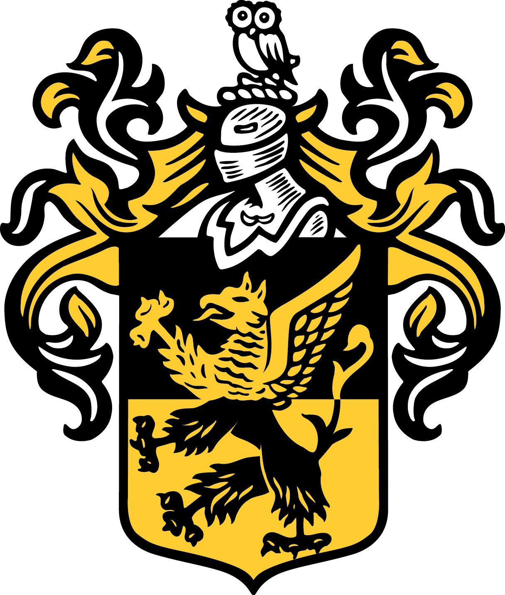
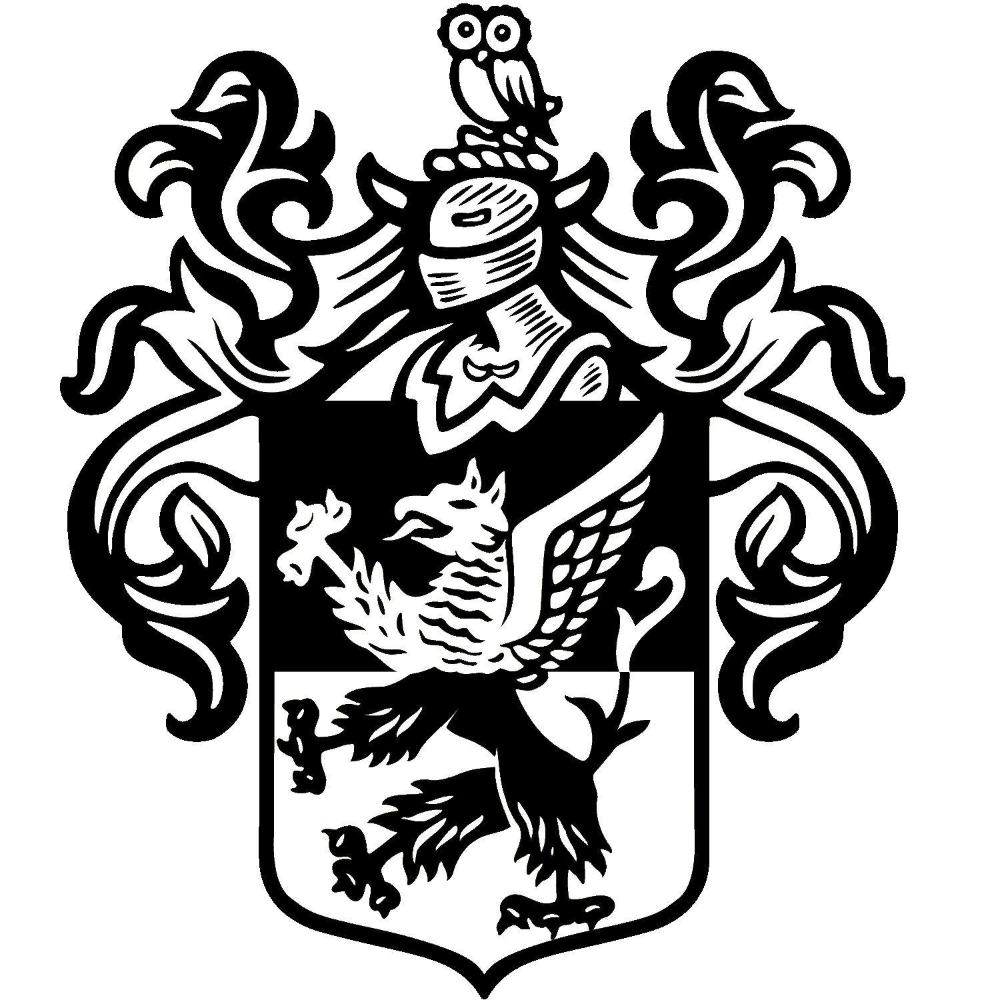
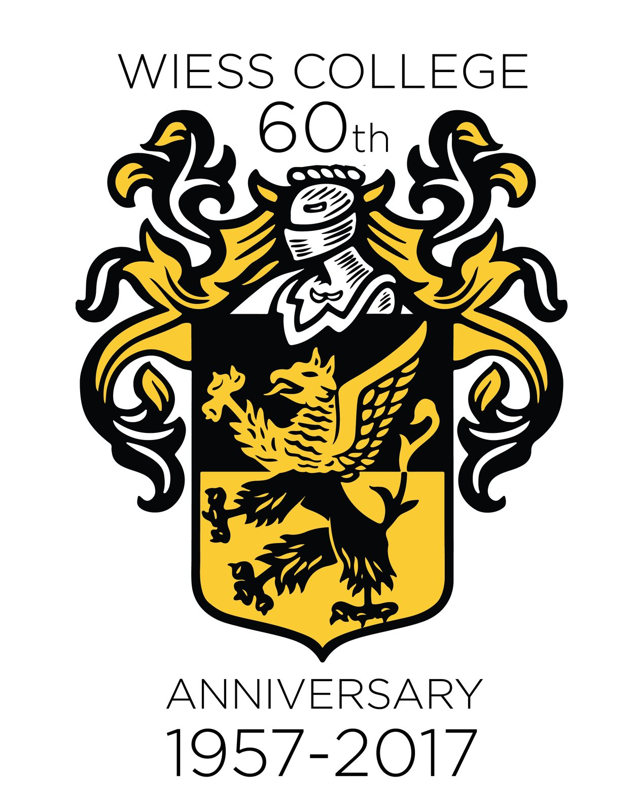
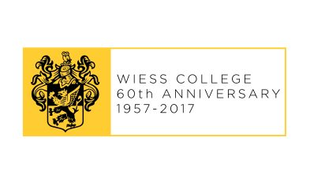

# Crest, colors and symbols

Wiess's symbols are its crest, a griffin on a shield split black over gold with an owl on top, and its official color, **goldenrod** [@wb 20140627224637 http://teamwiess.com/images/wiessshield1wtrans-u213-fr.png] [@oweek-2003 p.4]. You'll see both all over the college.

!!! abstract "TL;DR"
    - The crest is the Wiess family's coat of arms, with two changes: black and gold colors, and a Rice owl where the family's goose used to be [@wb 19980131012032 http://riceinfo.rice.edu:80/projects/colleges/wiess/college/crest.html].
    - It's not yellow. Since 2014 the O-Week glossary adds "Remember it's not yellow!" [@oweek-2014 p.103].
    - The mascot, the War Pig, has [its own page](warpig.md). TFW is on [Team Wiess](team-wiess.md).

## What's on it

A shield split black over gold. On it, a griffin: gold on the black half, black on the gold half. On top, a knight's helmet, with an owl standing on it [@wb 20140627224637 http://teamwiess.com/images/wiessshield1wtrans-u213-fr.png] [@wb 20150612230209 http://teamwiess.com/assets/crestbw.gif].

The crest was stitched on the blazers the first Magister (the professor who lives next door and looks out for the college) required at Sunday dinner [@oweek-2006 p.37]. Today it hangs in Sparky's, the basement room [@oweek-2014 p.46]. More on the people at [Magisters](../people/masters-and-magisters.md).

## Where the crest came from

When the colleges started in 1957, each of the first four took a coat of arms. The idea was to tell apart "four relatively identical dormitories" [@wb 19980131012032 http://riceinfo.rice.edu:80/projects/colleges/wiess/college/crest.html].

Wiess took "the crest of the Wiess family for which the college is named." It changed the colors "from blue and white (???) to black and gold," and swapped the goose on the helmet for a Rice Owl [@wb 19980131012032 http://riceinfo.rice.edu:80/projects/colleges/wiess/college/crest.html]. Yes, the "(???)" is in the original. The webmaster wasn't sure.

## The color story

It's messy. Depending on the source, Wiess started with brown and green [@oweek-2006 p.38], or with "gold" [@oweek-2010 p.38]. The 1994 handbook says "Black and Gold. Official Wiess colors" [@handbook-1994].

Both O-Week histories say it became goldenrod in the 1980s [@oweek-2006 p.38]. The 2010 book says it happened "probably through a joke of a Wiessman of the '80s" [@oweek-2010 p.38]. Since 2003 goldenrod "will soon dominate your wardrobe" [@oweek-2003 p.4].

## Photos { #photographs }

<!-- GALLERY:symbols -->

<figure markdown="span">
  { loading=lazy data-title="The Wiess arms in color: a griffin counterchanged on a shield divided black over gold, a helmet with mantling, an owl on top." data-description="teamwiess.com, 2014 · by 2014" data-gallery="symbols" }
  <figcaption>The Wiess arms in color: a griffin counterchanged on a shield divided black over gold, a helmet with mantling, an owl on top. <small>teamwiess.com, 2014 [@wb 20140627224637 http://teamwiess.com/images/wiessshield1wtrans-u213-fr.png]</small></figcaption>
</figure>

<figure markdown="span">
  { loading=lazy data-title="The crest in black and white." data-description="teamwiess.com, 2015 · by 2015" data-gallery="symbols" }
  <figcaption>The crest in black and white. <small>teamwiess.com, 2015 [@wb 20150612230209 http://teamwiess.com/assets/crestbw.gif]</small></figcaption>
</figure>

<figure markdown="span">
  { loading=lazy data-title="The 60th-anniversary crest, &#x27;Wiess College 60th Anniversary 1957–2017&#x27;." data-description="teamwiess.com/60, 2017 · 2017" data-gallery="symbols" }
  <figcaption>The 60th-anniversary crest, 'Wiess College 60th Anniversary 1957–2017'. <small>teamwiess.com/60, 2017 [@wb 20170602224644 http://teamwiess.com/60/Wiess60-crest-with-date-small.png]</small></figcaption>
</figure>

<figure markdown="span">
  { loading=lazy data-title="The 60th-anniversary banner." data-description="teamwiess.com/60, 2017 · 2017" data-gallery="symbols" }
  <figcaption>The 60th-anniversary banner. <small>teamwiess.com/60, 2017 [@wb 20170602224639 http://teamwiess.com/60/Wiess60-banner.png]</small></figcaption>
</figure>

<!-- /GALLERY:symbols -->

??? info "The receipts: timeline"
    | When | What | Evidence |
    |---|---|---|
    | 1957 | The four original colleges adopt coats of arms "to try and find ways to differentiate what had been four relatively identical dormitories"; Wiess takes the Wiess family's, in black and gold with an owl for the goose [@wb 19980131012032 http://riceinfo.rice.edu:80/projects/colleges/wiess/college/crest.html] | [R] |
    | 1957– | Each college "had its own blazer with the college crest stitched on the breast, and it was mandatory dress for formal Sunday dinners" [@wb 20040416083807 http://www.teamwiess.com/oweek/35-44%20wiess.pdf p.2]; Talmage's "mandatory Wiess blazers (complete with crests)" [@oweek-2006 p.37] | [R] |
    | early days | "The color the college voted on in the early days to represent us: gold (which became the goldenrod we know today probably through a joke of a Wiessman of the '80s)" [@oweek-2010 p.38] | [R] |
    | 1980s | "Wiess also made the switch from brown and green college colors to our infamous goldenrod, which more accurately reflects the boldness and energy of Wiess", in the 2006 history's paragraph on the 1980s [@oweek-2006 p.38] | [R] |
    | 1970s | The Commons "really was decorated in purple and lime green" (memories of two alumni; see [The Commons](../places/commons.md)) [@rhc 2016-03-07 barbara-jordan-1977 comment by Walter Underwood, 7 Mar 2016] | [T] |
    | 1994 | "**Black and Gold.** Official Wiess colors (also the main reason for the color scheme in the Commons)"; the basement game room "Recently repainted and rededcorated in black and gold"; the Acatramp "purple and black" [@handbook-1994] | [P] |
    | 1997-08-11 | The crest page on the first website (David Cunningham), with the "(???)" over the family's original colors [@wb 19980131012032 http://riceinfo.rice.edu:80/projects/colleges/wiess/college/crest.html]; unchanged under Ray Wagner to 2000 [@wb 20001207044500 http://riceinfo.rice.edu:80/projects/colleges/wiess/college/crest.html] | [P] |
    | 1999-10-05 | About two hundred students "in gold T-shirts" at the New Wiess groundbreaking [@rice-news-1999-10-14-groundbreaking] | [P] |
    | 2003 | "**Goldenrod.** The official Wiess color. It will soon dominate your wardrobe" [@oweek-2003 p.4]; freshmen greeted by "a sea of goldenrod T-shirts" [@oweek-2003 conclusions p.9] | [P] |
    | 2014 | "Remember it's not yellow!" added to the glossary [@oweek-2014 p.103]; Sparky's has "goldenrod paint… and of course, the Wiess crest" [@oweek-2014 p.46]; the shield in color on the college website [@wb 20140627224637 http://teamwiess.com/images/wiessshield1wtrans-u213-fr.png] | [P] |
    | 2015-06 | A black-and-white crest on the website [@wb 20150612230209 http://teamwiess.com/assets/crestbw.gif] | [P] |
    | 2017 | The 60th-anniversary crest and banner: "Wiess College 60th Anniversary 1957–2017" [@wb 20170602224644 http://teamwiess.com/60/Wiess60-crest-with-date-small.png] [@wb 20170602224639 http://teamwiess.com/60/Wiess60-banner.png] | [P] |
    | 2019–2025 | Glossary, every book: "**Goldenrod** The official Wiess color. It will soon dominate your wardrobe. Remember, it's not yellow!"; history: "gold (which became the goldenrod we know and love today in the '80s)"; Sparky's "emblazoned with a massive Wiess crest" (2019, 2021 glossaries) [@oweek-2019 p.14] [@oweek-2019 p.12] [@oweek-2019 p.15] [@oweek-2025 p.26] | [P] |
    | 2021 | A Chief Justice who "bleeds black and goldenrod"; new students as "fellow Warpigs (and Rice Owls)" [@oweek-2021 p.31] [@oweek-2021 p.8] | [P] |
    | 2024–2025 | "Team Family Wiess is our motto"; the coordinator's "comfy goldenrod chairs"; the RAs' "over-the-top goldenrod spirit during Piggy Week"; Warpig "our mascot" [@oweek-2024 p.2] [@oweek-2024 p.32] [@oweek-2025 p.32] [@oweek-2024 p.34] | [P] |

??? quote "In the college's own words"
    > **riceinfo, 'The Crest', 1997:** "The members of Wiess College decided to adopt, with a few alterations, the crest of the Wiess family for which the college is named. These alterations consist of changing the coloring from blue and white (???) to black and gold, and replacing a goose on top of the knight's helmet with a Rice Owl." [@wb 19980131012032 http://riceinfo.rice.edu:80/projects/colleges/wiess/college/crest.html]

    > **O-Week Book 2014:** "The color yellow will never be the same, for it is not yellow, it is Goldenrod, Wiess' cherished college color." [@oweek-2014 p.10]

Last reviewed 2026-10-05 by unreviewed · [Edit this page](#)

