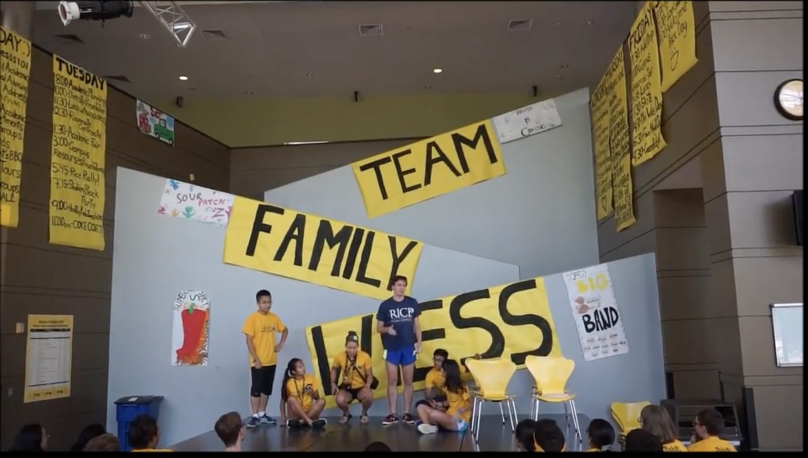
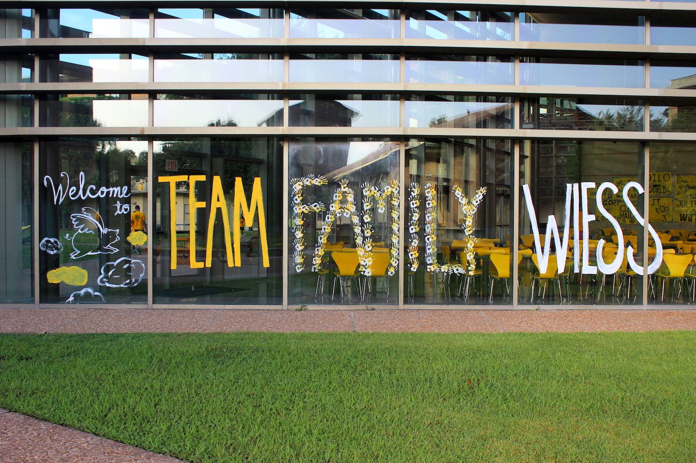
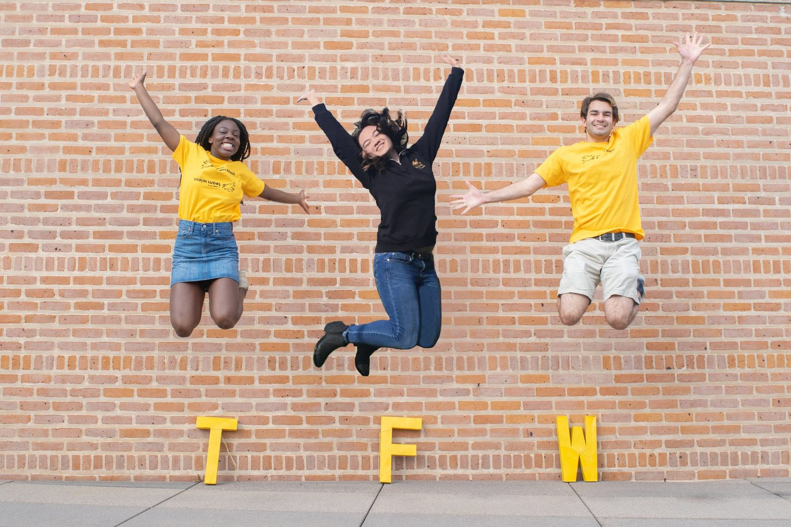

# Team Wiess (the chant)

"TEAM WIESS" is Wiess's "one and only cheer": two words, roared slowly, over and over, at Beer Bike, Powderpuff, matriculation, the end of every [Ubangee](ubangee.md) and "any damn time" [@oweek-2024 p.25] [@riceinfo-teamwiess].

!!! abstract "TL;DR"
    - With "Family" in the middle, it's also the college motto: "Team Family Wiess is our motto" [@oweek-2024 p.2].
    - The Thresher heard it at Beer Bike in April 1975, as "Wiess Team. Wiess Team!" [@thresher-1975-04-07-beer-bike]. Wiess's own histories said 1974 or 1975; a 2002 Thresher said 1984 [@oweek-2010 p.39] [@thresher-2002-02-01 p.11].
    - It became the web address (teamwiess.com) in 2000 [@wb 20000818090739 http://riceinfo.rice.edu/projects/colleges/wiess/].

## How to yell it

Don't scream it. A 1999 guide was clear: "don't *scream* Team Wiess! – *roar* instead" [@riceinfo-teamwiess]. A bellow lasts longer than a shriek, so you can drown out the other college's "sucks."

The O-Week books call it "The most powerful cheer on campus" (2003) and "Our one and only cheer" (2024) [@oweek-2003 p.4] [@oweek-2024 p.25].

## The banners { #the-banners }

Paper banners reading TEAM, FAMILY and WIESS hang in the [Commons](../places/commons.md) (the dining hall). They show up in 2017 O-Week videos, and by 2019 the same words were painted on the Commons windows [@wb 20170908225508 http://teamwiess.com/newstudents/videos/teammerh.png] [@wb 20190928044413 http://teamwiess.com/acapics/family.jpg].

"Family" is the polite version of the F. The books have winked at it for years: "Includes a little emphasis" (2003), "Family, right?" (2006) [@oweek-2003 p.4] [@oweek-2006 p.84]. In 1999 a writer refused to spell it out, "this being a family publication and all" [@riceinfo-teamwiess]. The F also names Wiess's Friday events, the [TFFWs](tffw.md).

### Photographs

<!-- GALLERY:teamwiess -->

<figure markdown="span">
  { loading=lazy data-title="The TEAM / FAMILY / WIESS paper banners in the Commons, hung in a descending diagonal, behind an O-Week skit (video still, 2017)." data-description="teamwiess.com, O-Week videos, 2017 · 2017" data-gallery="teamwiess" }
  <figcaption>The TEAM / FAMILY / WIESS paper banners in the Commons, hung in a descending diagonal, behind an O-Week skit (video still, 2017). <small>teamwiess.com, O-Week videos, 2017 [@wb 20170908225508 http://teamwiess.com/newstudents/videos/teammerh.png]</small></figcaption>
</figure>

<figure markdown="span">
  { loading=lazy data-title="TEAM FAMILY WIESS on the Commons windows." data-description="teamwiess.com, &#x27;acapics&#x27;, by 2019 · by 2019" data-gallery="teamwiess" }
  <figcaption>TEAM FAMILY WIESS on the Commons windows. <small>teamwiess.com, &#x27;acapics&#x27;, by 2019 [@wb 20190928044413 http://teamwiess.com/acapics/family.jpg]</small></figcaption>
</figure>

<figure markdown="span">
  { loading=lazy data-title="Jumping over the letters T F W, for the new students&#x27; pages." data-description="teamwiess.com, new students, 2019 · by 2019" data-gallery="teamwiess" }
  <figcaption>Jumping over the letters T F W, for the new students' pages. <small>teamwiess.com, new students, 2019 [@wb 20190802225456 http://teamwiess.com/newstudents/thumbnails/daa.jpg]</small></figcaption>
</figure>

<!-- /GALLERY:teamwiess -->

## Where it came from

"Team Wiess" started as the name of the Beer Bike team. An alumnus's 1970s shirts came from "the Beer-Bike Team, which was just then calling itself 'Team Wiess'" [@lancaster-wiess-memorabilia]. The Thresher was using "Team Wiess" as a name by 1976 [@thresher-1976-04-05-beer-bike].

The chant shows up at the 1975 race. Wiess won the men's title and gave "a chorus of 'Wiess Team. Wiess Team!' before the rest of the pack could make it back" [@thresher-1975-04-07-beer-bike]. That matches the 2010 O-Week book's story of a debut at Beer Bike 1975, the team's "second win ever" [@oweek-2010 p.39] [@thresher-1985-04-12-beer-bike-history].

Every history since 2003 says the words came from a "Team Xerox" TV ad and the "Mean Machine" chant in *The Longest Yard* [@oweek-2010 p.39].

??? quote "In the college's own words"
    "TEAM WIESS—Cheer used in support of any Wiess team, especially at Beer-Bike. (Or, really, at any other random time...)" [@handbook-1994]

    "No other college chant or cheer can compare to a hundred frenzied Wiessmen roaring TEAM - WIESS! over and over. I mean, really - 'Jiba'? What the hell is *that* supposed to mean?" [@riceinfo-teamwiess]

    "The 'Team Wiess' cheer made its debut around the time of Beer Bike in 1974. Since then, the deep resonating chant has become Wiess' metaphorical heartbeat and Wiess' trademark on campus." [@wb 20050526073749 http://www.teamwiess.com/view.php?Page=history.php]

    "Team Family Wiess is our motto, and, at Wiess, we support and celebrate each other." [@oweek-2024 p.2]

??? info "The receipts: timeline"
    | When | What | Evidence |
    |---|---|---|
    | 1958-05-09 | Wiess wins the Beer Bike beer-drinking contest ("the Beer-drinking contest which Wiess College won"); the bike race is rained out [@thresher-1958-05-09-beer-drinking]. The 1985 winners table lists Wiess for 1958, 1975 and 1982, making 1975 the "second win ever" [@thresher-1985-04-12-beer-bike-history] | [P] [R] |
    | c.1974 | "The 'Team Wiess' cheer made its debut around the time of Beer-Bike in 1974"—the O-Week book history, which derives it from a Xerox commercial ("Team Xerox") and *The Longest Yard* ("Mean Machine") [@wb 20040416083807 http://www.teamwiess.com/oweek/35-44%20wiess.pdf p.3 (printed 37)]; repeated on teamwiess.com in May 2005 [@wb 20050526073749 http://www.teamwiess.com/view.php?Page=history.php] and in the books of 2006–2008 [@oweek-2006 p.38] [@oweek-2008 part 3 p.3] | [R] |
    | 1975 | "The glorious 'Team Wiess' cheer made its debut at Beer Bike 1975 when the team celebrated its second win ever with a chant of 'Wiess Team, Wiess Team!'"—the rewritten history, which adds "the TeamBank chain of banks" to the derivation [@oweek-2010 p.39]; kept in 2011–2017 [@oweek-2014 p.37] [@oweek-2017 p.13] and on the current college site [@wiess-rice-edu about/history] | [R] |
    | 1975-04-07 | **The chant, at the time.** Thresher Beer Bike report: Wiess "shook off a two-year jinx": "a chorus of 'Wiess Team. Wiess Team!' before the rest of the pack could make it back" [@thresher-1975-04-07-beer-bike] | [P] |
    | 1976-04-05 | "Team Wiess" as the team's name in the Thresher: "Team Wiess, defending men's champion and consensus favorite, was swamped" [@thresher-1976-04-05-beer-bike] | [P] |
    | 1970s | An alumnus's Beer Bike shirts "from the Beer-Bike Team, which was just then calling itself 'Team Wiess'" [@lancaster-wiess-memorabilia]; the collection is described as "'70s era" [@rhc 2013-02-19 mixed-nuts-a-dr-baker-update-a-link-to-wiess-memorabilia-and-a-bobby-soxer-on-the-phone] | [R] |
    | 1983-08 | Jeff Zweig '84: the first public pig-squeal, at the 1983 matriculation ceremony, "involved a short period of intense squealing followed by the traditional TEAM WIESS" [@maxham-pig-document] | [R] |
    | c.1983–84 | A "Team Wiess" Beer Bike shirt in an undated Wiess photograph is "probably 1983 or 1984. They silkscreened them in-house" [@rhc 2018-02-02 friday-follies-bananas comment by Ann Peterson '86, 5 Feb 2018] | [T] |
    | 1984 (spring) | "TEAM WIESS!!" written on the Wiess senior page of the 1984 Campanile, beside Zweig's "WARPIG 1984" sign-off [@campanile-1984] | [P] |
    | 1984 | The Thresher's feature on Wiess traditions dates the chant to 1984 [@thresher-2002-02-01 p.11] | [R] |
    | 1987-04-04 | Pig #2 flies with "TEAM WIESS" in white block letters along its side [@campanile-1987] | [P] |
    | 1994 | Freshman Handbook glossary: "Cheer used in support of any Wiess team, especially at Beer-Bike. (Or, really, at any other random time...)" [@handbook-1994] | [P] |
    | 1997-08-11 | "TEAM WIESS!!!!!" heads the list of Traditions Older Than Time on the first Wiess website [@riceinfo-traditions-1997] | [P] |
    | 1999-06-25 | Ray Wagner's page on how to yell it: "don't *scream* Team Wiess! – *roar* instead" [@riceinfo-teamwiess] | [P] |
    | 2000-05-18 | The website announces it "will also be moved to its new location, www.teamwiess.com"—the chant becomes the domain [@wb 20000818090739 http://riceinfo.rice.edu/projects/colleges/wiess/] | [P] |
    | 2003 | Glossary: "1. The most powerful cheer on campus. 2. The embodiment of everything that makes Wiess College cool." TFW: "An abbreviation of Team Wiess. Includes a little emphasis." [@oweek-2003 p.4] The same book has the Ubangee ending "with three triumphant cries of TEAM WIESS!" [@wb 20040416083807 http://www.teamwiess.com/oweek/35-44%20wiess.pdf p.6 (printed 40)] | [P] |
    | 2006 | TFW gains a tag line: "Includes a little emphasis. Family, right?" [@oweek-2006 p.84] | [P] |
    | 2014 | The history opens with "Team 'Family' Wiess" [@oweek-2014 p.36]; the new college site's homepage is the "Team Wiess" blog with "TFW Facebook" and "TFW Twitter" links and a "Team Family Wiess" header [@wb 20141009085809 http://wiess.rice.edu/] | [P] |
    | 2015 | TFW: "An abbreviation of Team Family (or anything else that starts with F) Wiess." [@oweek-2015 p.119]; the chant itself is now "Our cheer—the embodiment of everything that makes Wiess cool" [@oweek-2015 p.119] | [P] |
    | 2017-09 | The TEAM / FAMILY / WIESS paper banners in the Commons, in stills from the O-Week videos on the college website [@wb 20170908225508 http://teamwiess.com/newstudents/videos/teammerh.png] | [P] |
    | 2017-11-10 | The 60th-anniversary programme plans "a group photo of sixty years of Team Wiess at 5:30 sharp" [@wiess-60th-faq-2017 p.1] | [P] |
    | by 2019-09 | "TEAM FAMILY WIESS" painted across the Commons windows, "Welcome" beside it [@wb 20190928044413 http://teamwiess.com/acapics/family.jpg] | [P] |
    | 2019 | Glossary: "**Team Wiess** Our cheer. It is one of our oldest traditions, and an embodiment of the spirit Wiess has always been known for"; history: the cheer "made its debut at Beer Bike in 1975 when we celebrated our glorious win" (the "second win ever" of 2010 is gone) [@oweek-2019 p.15] [@oweek-2019 p.13] | [P] |
    | 2021 | The 2021 Head Fellows sign "Team Family Wiess, Your Head Fellows"; the thanks call the college "your (Team) Family (Wiess)" [@oweek-2021 p.2] [@oweek-2021 p.73] | [P] |
    | 2024 | Glossary: "Our **one and only** cheer"; the Head Fellows: "Team Family Wiess is our motto, and, at Wiess, we support and celebrate each other"; the President: "Our motto of 'Team Family Wiess' encapsulates our culture of care, inclusion, and respect" [@oweek-2024 p.25] [@oweek-2024 p.2] [@oweek-2024 p.36] | [P] |
    | 2025 | "Team Family Wiess is our motto that we live by"; the President: "our motto is Team Family Wiess (often abbreviated TFW)"; the neon "Team Family Wiess" sign in UpCo, a Proxy Cab prize [@oweek-2025 p.2] [@oweek-2025 p.37] [@oweek-2025 p.38] | [P] |

Last reviewed 2026-10-04 by unreviewed · [Edit this page](#)

