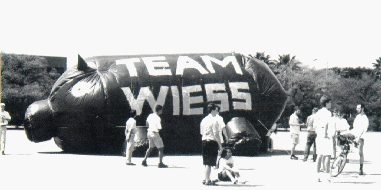
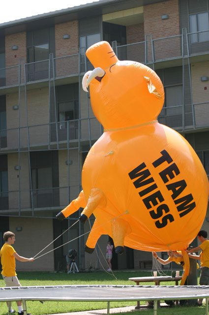

# The War Pig

The War Pig (spelled "Warpig" these days) is Wiess's mascot. Today it's a giant wooden pig on wheels, first built by the Class of 2012, that Wiess paints and hauls out for Beer Bike [@campanile-2012 p.172] [@oweek-2024 p.25] [@oweek-2024 p.34].

!!! abstract "TL;DR"
    - The name "War Pig" dates to 1982, from the Black Sabbath song [@maxham-pig-document].
    - From 1986 Wiess built huge trash-bag and plastic pigs for Beer Bike. One really flew in 1991, on helium balloons [@thresher-portal 5 Apr 1991 p.16] [@campanile-1991 p.281].
    - A store-bought helium pig floated away at Beer Bike 2004 when its cord was cut [@thresher-2004-03-26 p.9].
    - With the wooden pig, the old chant "The pig will fly" became "the pig will roll" [@oweek-2014 p.103].

## The pig will roll

The Class of 2012 built a wooden "Trojan Warpig" on a trailer for Beer Bike 2012 [@campanile-2012 p.172]. The chant changed to "the pig will roll!" [@oweek-2014 p.103]. In 2016 Wiess got fined because too many people rode it [@thresher-web "Beer Bike Violations & Fines", Mar 2016].

The wooden pig has been rebuilt at least once, around 2017–21. A builder left a note inside: "do NOT just copy each piece. They are not equal.. It is a nightmare" [@warpig-note-loryn]. In 2024 an inflatable came back too, and it "flew (fell with style)" [@warpig-core-deck slides 35–46] [@thresher-2024-04-10].

## Where the pig came from

In spring 1982, a Wiess student (Class of '84) started calling Wiessmen "War Pigs," after the Black Sabbath song [@maxham-pig-document]. By fall 1983 freshmen were trained to squeal, and the women became "Battle Sows" [@maxham-pig-document]. See [Battle Sows & Powderpuff](battle-sows-powderpuff.md).

The first real pig was tiny: an 8–10-inch pig-iron statue carried around the college [@maxham-pig-document] [@rice-magazine-2016-wiess-traditions]. The first *big* one was a 12-foot chicken-wire pig at [Night of Decadence](retired/night-of-decadence.md) 1984. Sid Rich guys tore it apart the same night [@portal metapth245573 p.27] [@campanile-1985 p.283].

## The pigs that (mostly) didn't fly

For decades the pig was supposed to fly. Mostly, it didn't. That never stopped anyone.

**1986:** A 15-foot trash-bag hot-air balloon went to Beer Bike, floated off and landed blocks away [@maxham-pig-document]. **1987–89:** A 30-by-60-foot black plastic pig lettered "TEAM WIESS." Other colleges attacked it in 1988, and it never flew [@campanile-1987 p.320] [@campanile-1988 p.268].

**1991:** Pig #3 finally flew, on six helium weather balloons, paid for by a $500 grant from an alumnus professor [@thresher-portal 5 Apr 1991 p.16]. "The War Pig flies!" said the yearbook [@campanile-1991 p.281]. By 1997 the website admitted it had "seen better days" [@riceinfo-beerbike].

By 1999, twenty-five students still woke at 4:30 a.m. to inflate "a giant pig made of garbage bags in the futile hope that it will fly" [@campanile-1999 p.238]. Wiess's wooden parade build in 2001–02 was [Fort Wiess](retired/fort-wiess.md), not a pig [@thresher-2002-04-05 pp.6, 27].

## The pig that got away

By 2002 Wiess had bought a $4,500 commercial helium pig, bright orange [@thresher-2004-03-26 p.9]. At Beer Bike on 20 March 2004, its cord was cut. It floated away and was never found [@thresher-2004-03-26 p.9].

For the next six years, the O-Week books called the pig a "**Former** Wiess mascot" [@oweek-2006 p.84] [@oweek-2011 p.93]. Ouch.

## Photographs

<!-- GALLERY:warpig -->

<figure markdown="span">
  { loading=lazy data-title="A black pig lettered TEAM WIESS: the picture beside &#x27;The mighty War Pig&#x27; on the first website&#x27;s traditions page." data-description="riceinfo Wiess site, 2000 · by 2000" data-gallery="warpig" }
  <figcaption>A black pig lettered TEAM WIESS: the picture beside 'The mighty War Pig' on the first website's traditions page. <small>riceinfo Wiess site, 2000 [@wb 20000526190203 http://riceinfo.rice.edu:80/projects/colleges/wiess/traditions/index.html]</small></figcaption>
</figure>

<figure markdown="span">
  { loading=lazy data-title="The orange commercial pig, TEAM WIESS, tethered in the New Wiess Acabowl over the Acatramp; the ivy screens of New Wiess behind." data-description="TFWKB photo collection; source not recorded · 2002–04" data-gallery="warpig" }
  <figcaption>The orange commercial pig, TEAM WIESS, tethered in the New Wiess Acabowl over the Acatramp; the ivy screens of New Wiess behind. <small>TFWKB photo collection; source not recorded [@warpig-core-deck slide 32]</small></figcaption>
</figure>

<!-- /GALLERY:warpig -->

??? quote "In the college's own words"
    "War Pig—The Wiess mascot, an enormous inflatable pig made from plastic and duct tape, 'flown' at Beer-Bike to the amazement of all." [@handbook-1994]

    "The War Pig itself has seen better days, unfortunately—to anybody who feels they're worthy and wants to take the time, we could probably use a new Pig…" [@riceinfo-beerbike]

    "War pig—**Former** Wiess mascot. Embodied by an enormous, inflatable pig. Has its own cheer: The Pig Will Fly!" [@oweek-2006 p.84]

    "Now that you're officially becoming fellow Warpigs (and Rice Owls)…" [@oweek-2021 p.8]

??? info "The receipts: timeline"
    | When | What | Evidence |
    |---|---|---|
    | late 1981 | Jeff Zweig '84 addresses Wiess as the "Slime Dog"—the pre-pig identity [@maxham-pig-document] [@thresher-2002-02-01 p.11] | [R] |
    | spring 1982 | After a Room Jack night Zweig has the "War Pig" vision and starts calling Wiessmen War Pigs; the name is the Black Sabbath song title [@maxham-pig-document] [@rhc 2021-12-10 im-pissed-no-date comment by Dave McCooey, Dec 2021] | [R] [T] |
    | spring 1983 | Wiess goes coed [@thresher-2002-02-01 p.11] | [P] |
    | fall 1983 | Freshmen trained to squeal; first public squeal at the 1983 matriculation; "Battle Sows" coined for the women [@maxham-pig-document] | [R] |
    | 1983-09-30 | Earliest print trace of the pig identity: "Battle Sows" in the women's IM volleyball standings [@portal metapth245539 p.15]; again 7 Oct 1983 p.20 [@thresher-1983-10-07] | [P] |
    | late 1983 | The first physical War Pig: an 8–10-inch pig-iron statue Zweig carried around the college [@maxham-pig-document] [@rice-magazine-2016-wiess-traditions] | [R] |
    | spring 1984 | Earliest print appearance of the word "Warpig": Zweig's handwritten senior sign-off in the Campanile—"THE DIE IS CAST… I HAVE CROSSED THE HEDGES! JEFF ZWEIG B.S.CH.E., W.H.C.E.S., WARPIG 1984." Same page, Gretchen "Grape" Martinez '84: "I've loved being a Battle Sow, Wiess Wench, and one of the first women at the Best College!" [@campanile-1984 p.371] | [P] |
    | 1984-09-07 | First "war pig" in the Thresher: a Misclass quip signed "—the ghost of pig-iron war-pig" [@portal metapth245566 p.12] | [P] |
    | 1984-10-26 | **First large effigy.** A chicken-wire-and-newspaper "flying pig" hung at Night of Decadence ("Animal Farm" theme) and torn apart by Sid men: "the pig was the symbol of the night, the decadent farm animal, the war-pig" [@portal metapth245573 p.27]. Earliest photograph: the 1985 Campanile's NOD page, "a 12-foot pig with more than lifelike features… someone is makin' bacon" [@campanile-1985 p.283] | [P] |
    | 1985-11 – 1986-01 | "warpigs" as a Wiess IM team name [@thresher-portal metapth245618, 245619, 245620, 245623] | [P] |
    | 1986-04-05 | **Pig #1, the first Beer Bike pig**: a roughly 15-foot trash-bag hot-air balloon by Jorge Martin de Nicolas '85, built for Powderpuff and brought to Beer Bike, where it floated off and landed blocks away. Also the first year the pig was on Wiess Beer Bike shirts [@maxham-pig-document] [@thresher-2004-03-26 p.9]. Not reported by the Thresher at the time (4 and 11 Apr 1986 issues checked; a 2000 Thresher history notes "No one reported the birth of the War Pig"); the 1986 Campanile Beer Bike spread has no pig | [R] |
    | 1986-09 – 1986-11 | IM teams "War Pigs" and "Super Pig Flies Again" [@thresher-portal 19 Sep 1986 p.18; Oct–Nov 1986] | [P] |
    | 1987-04-04 | **Pig #2 debuts** at Beer Bike: 30 × 60 feet of 4-mil black plastic with "TEAM WIESS" in block letters, built by Jorge Martin de Nicolas [@maxham-pig-document]. The Campanile caption: "Pre-flight for the Battle Sow" [@campanile-1987 p.320] | [R] [P] |
    | 1988-04 | Pig #2's second outing; attacked by Jones and Sid men; never flew. "WAR PIG… 'Pig Master' Jorge Martin-de-Nicolas… 'They're coming to the hump!'" [@campanile-1988 p.268]; "At Beer-Bike, in 1988, people attacked the second War Pig" (letter) [@thresher-portal 26 Mar 1993 p.4] | [P] |
    | 1989-04 | Pig #2 repaired for one more Beer Bike—"Inside the Wiess Pig—the rebirth" (students inside the hull), "The caretakers of the pig at the track" [@campanile-1989 p.302]; it tears, and Jorge hands the pig to Mark Maxham '90, who decides to start over [@maxham-pig-document] | [P] [R] |
    | 1989–90 | **Pig #3** designed and built by Maxham: 6-mil black tarp, four "rib points" on top tied to four "tether points" underneath, a hula-hoop anus for the fan. His design sketch survives [@warpig-photos maxham-pig3-design-sketch]. Carried, not flown, at Beer Bike 1990; "a Wiess War Pig" photographed at freshman football [@thresher-portal 14 Sep 1990 p.11] | [R] [P] |
    | 1991-04-06 | **The pig flies**, on six helium weather balloons, with "a $500 grant from alumnus and professor John Bennett" [@thresher-portal 5 Apr 1991 p.16]. "The War Pig flies!"—airborne over the track [@campanile-1991 p.281]; Maxham's photograph "John Bennett flies the War Pig, 1991"; the core team's photograph from the Greenbriar Lot [@warpig-core-deck slide 28] | [P] [R] |
    | 1993-03 | Attacks on the pig at Beer Bike; letters to the Thresher [@thresher-portal 26 Mar 1993 pp.4, 5, 10]. The black TEAM WIESS pig on the field with its generator and fan [@campanile-1993 p.261] | [P] |
    | 1994 | Freshman Handbook glossary: "The Wiess mascot, an enormous inflatable pig made from plastic and duct tape, 'flown' at Beer-Bike to the amazement of all" [@handbook-1994] | [P] |
    | 1996-04 | "Helium + Trash Bags + Duct Tape = Pig"—helium cylinders in a dorm room; "If Only Pigs Could Fly—The War Pig," grounded at Old Wiess. Still trash bags and helium a decade on; it did not fly [@campanile-1996 p.321] | [P] |
    | 1997 | Beer Bike page, first Wiess website (text by David Cunningham, 11 Aug 1997): wake-up music includes "'War Pigs' by Black Sabbath"; "I'm still pissed off at those freaks who tried to tear the Pig's legs off a few years back. The War Pig itself has seen better days, unfortunately… we could probably use a new Pig" [@riceinfo-beerbike] | [P] |
    | 1997–98 | Mylar rebuild (a George Fotinos project); a hydrogen idea vetoed by Dr. Bill Wilson; the pig later flew away [@rhc 2021-12-10 im-pissed-no-date comments, Dec 2021] | [T] |
    | 1998–99 | The Wiess attitude "inspires twenty-five students to wake up at 4:30 a.m. to inflate a giant pig made of garbage bags in the futile hope that it will fly above the Beer Bike track" [@campanile-1999 p.238] | [P] |
    | 2000-04 | Dozens of mylar pig-head balloons released; "The pig will fly!" chant noted [@thresher-portal 7 Apr 2000 p.12] | [P] |
    | 2001-04 | "Wiess's War Pig finally took to the skies in the form of a giant Macy's parade-style balloon" [@thresher-2001-04-06 p.29]. Wiess's wooden parade build of 2001–02 was [Fort Wiess](retired/fort-wiess.md), not a pig | [P] |
    | 2001-12 | Dedication planning for New Wiess: "Have both war pigs flying first thing in the morning!"—two balloons by late 2001 [@wb 20011212095214 http://teamwiess.com:80/wiess_dedication.html] | [P] |
    | 2002-04 | "Team Wiess's battle sow flying high in the sky" over the Wiess fort [@thresher-2002-04-05 pp.6, 27]. Photograph: the **orange** commercial pig, "TEAM WIESS," tethered over the New Wiess Acabowl [@warpig-core-deck slide 32] | [P] |
    | before 2002-08 | A $4,500 commercial pig balloon bought with capital-improvement funds [@thresher-2004-03-26 p.9] | [P] |
    | 2003 | O-Week book glossary: "The Wiess mascot. Embodied by an enormous, inflatable pig. Has its own cheer: The Pig Will Fly!" [@oweek-2003 conclusions p.4] | [P] |
    | 2004-03-20 | **The pig is lost.** Its cord cut at Beer Bike, the commercial pig floats away and is never found [@thresher-2004-03-26 p.9]; recalled again in 2007 [@thresher-portal 30 Mar 2007 p.36] | [P] |
    | 2006–2011 | **No pig.** Every O-Week glossary: "**Former** Wiess mascot. Embodied by an enormous, inflatable pig. Has its own cheer: The Pig Will Fly!" [@oweek-2006 p.84] [@oweek-2007 p.84] [@oweek-2008 part 7 p.4] [@oweek-2010 p.91] [@oweek-2011 p.93] | [P] |
    | 2012-03 | **The wooden War Pig**, built by the Class of 2012 for Beer Bike 2012—"Trojan Warpig / Beerseige our enemies!"; "Wiess' Warpig Taskforce reinvented the Trojan Horse in their construction of this colossus" [@campanile-2012 p.172]. The chant becomes "the pig will roll" [@oweek-2014 p.103] | [P] |
    | c.2012–16 | Three photographs of the wooden pig in trailer form in the New Wiess courtyard: yellow plywood, shark teeth, red eyes, "TEAM" and "WIESS" on its flanks [@warpig-photos wooden-warpig_*] | [P] |
    | 2014–2017 | O-Week glossaries: "Wiess mascot, embodied by the giant wooden pig built by the Class of 2012 for Beer Bike. The pig will roll!" (2014); "will roll" dropped from 2015 [@oweek-2014 p.103] [@oweek-2015 p.119] [@oweek-2016 p.17] [@oweek-2017 p.18] | [P] |
    | 2016-03 | Fined at Beer Bike for too many people "on our float: the Warpig… its wheels don't turn… make the Warpig easily to pull" [@thresher-web "Beer Bike Violations & Fines", Mar 2016] | [P] |
    | 2016-11 | Rice Magazine: the wheeled, "small bus-sized" pig dragged by freshmen; the 1983 pig-iron statuette [@rice-magazine-2016-wiess-traditions] | [R] |
    | c.2017–21 | A note inside the current wooden pig, signed "Loryn H. '21": "If you decide to rebuild this pig, do NOT just copy each piece. They are not equal.. It is a nightmare." The present pig was therefore built or re-cut in that window—Beer Bike 2018, 2019 or 2021 (2020 was cancelled) [@warpig-note-loryn] | [P] |
    | 2019 | O-Week glossary, unchanged: "Wiess mascot, embodied by the giant wooden pig built by the Class of 2012 for Beer Bike"; history: "our distinctive wooden warpig was created in time for Beer Bike 2012"; College Night themes "Peppa the War Pig" and "Infinity War Pig" [@oweek-2019 p.15] [@oweek-2019 p.13] [@oweek-2019 p.33] | [P] |
    | 2021 | The 2021 book describes one of its sophomore Gophers as having "helped build most of the Warpig (Wiess's mascot) with his own two hands"—a first-year in 2020–21, so the present wooden pig was built or rebuilt in that year, for Beer Bike 2021 [@oweek-2021 p.55]. The same book welcomes the Class of 2025 as "fellow Warpigs (and Rice Owls)", and three of its twelve O-Week groups pun on the pig [@oweek-2021 p.8] [@oweek-2021 p.55] [@oweek-2021 p.67] | [P] |
    | 2023–24 | **The 2024 inflatable.** A proxy-cabinet proposal funded to $500; the pig cost almost $900 by delivery, the rest from the RA budget. Helium ruled out real flight. The core team smuggled the deflated pig into the Beer Bike pit, inflated it off-track with a blower and carried it to the student section; gusts nearly cancelled Beer Bike; tethers tore the plastic and gravel punctured the feet, "but she flew (fell with style)." Lettered "oink oink bitches" [@warpig-core-deck slides 35–46] | [T] |
    | 2024-04-10 | "Wiess stationed a giant inflatable pig emblazoned with the words 'oink oink bitches'… a Wiess tradition that got resurrected this year after dying out in years past" [@thresher-2024-04-10] | [P] |
    | 2024–2025 | Glossary spells it "**Warpig**", same definition; a Beer Bike committee does decorations, merch and "painting our mascot, the Warpig" [@oweek-2024 p.25] [@oweek-2024 p.34] [@oweek-2025 p.35]. The books do not mention the 2024 inflatable | [P] |

??? info "The receipts: the pigs, numbered"
    | # | Years | Builder | What it was | Fate |
    |---|---|---|---|---|
    |—| 1983 | Jeff Zweig '84 | pig-iron statuette, 8–10 in. | not yet traced |
    |—| NOD 1984 | Wiess | chicken wire and newspaper, 12 ft, hung from the ceiling | torn apart by Sid men the same night |
    | 1 | Beer Bike 1986 | Jorge Martin de Nicolas '85 | ~15 ft trash-bag hot-air balloon | floated off, landed blocks away |
    | 2 | 1987–89 | Jorge Martin de Nicolas, "Pig Master" | 30 × 60 ft black 4-mil plastic, TEAM WIESS | attacked 1988, repaired 1989, tore |
    | 3 | 1990–c.1997 | Mark Maxham '90 | 6-mil black tarp, rib and tether points; helium 1991 | flew 1991; legs attacked c.1993; "seen better days" by 1997 |
    |—| 1997–98 | George Fotinos and others | mylar rebuild | flew away (testimony) |
    |—| 2000 | Wiess | dozens of mylar pig-head balloons | released |
    |—| 2001–04 | bought, $4,500 | orange commercial helium pig, TEAM WIESS; "both war pigs" by Dec 2001 | cord cut, lost, 20 Mar 2004 |
    |—| 2006–11 |—| **no pig** | "Former Wiess mascot" |
    | W1 | 2012– | Class of 2012 ("Warpig Taskforce") | wooden pig on a trailer; shark teeth | rebuilt or re-cut c.2017–21 (Loryn H. '21's note) |
    |—| 2024 | core team | inflatable, blower-filled, carried | "flew (fell with style)"; damaged |

## Sources

The timeline is built from the Thresher at the Portal to Texas History, Campanile pages held by the college ([@campanile-1984] through [@campanile-2012]), Mark Maxham's 1998 design document [@maxham-pig-document], the O-Week books 1994–2017, the first Wiess website, the Rice History Corner comment thread of December 2021 [@rhc-2021-12-10-im-pissed], and the core team's pitch deck and photographs [@warpig-core-deck]. The research notes behind it, with the OCR queries used, are in the working archive.

Last reviewed 2026-10-04 · unreviewed draft, assembled from the War Pig research of September–October 2026

